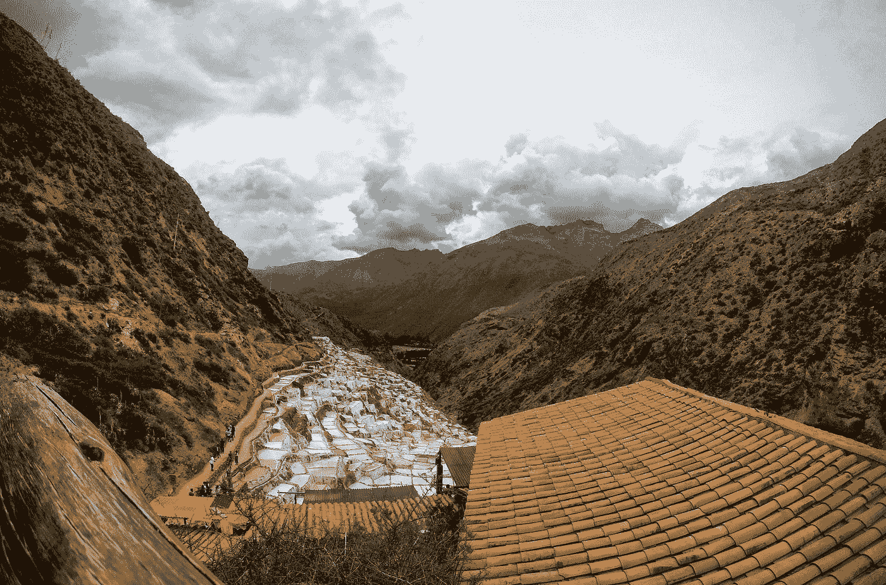

# 范式转变:全球商品超级周期中的土著群体和采矿项目

> 原文：<https://medium.com/coinmonks/paradigm-shifts-indigenous-groups-mining-projects-during-global-commodity-supercycle-44b5d3b34aaf?source=collection_archive---------8----------------------->

在全球大宗商品超级周期**期间，随着越来越多的矿业项目被企业和政府规划以刺激经济活动，土著群体开始站出来反对。**

****

**Photo by [Martín Espinoza](https://unsplash.com/es/@martinporch?utm_source=medium&utm_medium=referral) on [Unsplash](https://unsplash.com?utm_source=medium&utm_medium=referral)**

# **什么是范式转变？**

**当世界正在努力应对全球粮食危机时，世界需要巴西生产更多的粮食，因为巴西和乌克兰已经是世界上最大的粮食生产国之一。**

**任何对全球经济发展或全球大宗商品交易的未来感兴趣的人都应该阅读我整理的这篇关于全球采矿和环境、社会、治理(ESG)中的下一个最大全球现象的广泛文章:生产者经济领域和土著群体问题的各个方面。**

**这些趋势是更大的地缘政治趋势的一部分，这些趋势是由全球新冠肺炎疫情发起的。全球疫情已经导致几个国家分崩离析，社会政治不稳定已经积累了几十年，并导致全球经济受到不确定性的冲击，将世界上最大的公司置于一些最脆弱的地区。**

** [## 为什么世界上最大的金属矿商必和必拓集团正在推动面向未来的商品…

### 全球经济时代的标志。不仅 ESG 是 2019 年底所有行业的驱动话题，而且…

medium.com](/@44jmonroe91/why-is-the-worlds-largest-metal-miner-bhp-group-pushing-for-future-facing-commodities-on-the-1c6dd34ce681) 

铜正成为世界上最有价值的大宗商品之一。阅读更多关于中国崛起和美国制裁的困境。

对于中华人民共和国(PRC)来说，大部分国内铜资源都是从中国大陆上政治上极其敏感的地区——西藏、新疆、内蒙古——开采出来的，因此中国共产党(CCP)的政治成本是巨大的。更不用说从刚果民主共和国(DRC)的危险国家提取的钴和锂了。

未来，我们都会非常仔细地观察中国在金属领域的活动。这是因为在可预见的未来，中国一直并将继续掌控全球金属生产和市场的未来。

财大气粗伴随着高昂的政治成本。中国也不想把这一优势让给美国或任何其他国家。但我们看到的石油和天然气行业对俄罗斯在乌克兰行动的强烈反对，引发了一场关于全球金属矿商和生产商以及中国对全球金属市场影响程度的新讨论。

 [## 中国青山控股公司的镍交易如何扰乱电动汽车(EV)电池供应

### 我已经为中华人民共和国探索了一些关于铜工业的基本事实。现在…

medium.com](/coinmonks/what-happened-with-chinas-tsingshan-holdings-on-the-lme-eff8b6288fe9) 

我认为，关于环境、社会和治理以及全球矿业项目的这些问题，以及土著群体和政府如何应对全球大宗商品超级周期，都是由一种新的范式转变定义的。所有这些趋势，包括我在这里提到的参考资料和故事，应该让我们对新冠肺炎疫情之后的地缘政治和全球经济有一个更广泛的理解。

在全球疫情之后，我们能否克服我们对能源和商品的先入为主的观念将是世界人口面临的一个关键问题。我们需要更加严肃地对待气候变化，但也要考虑世界上最有价值的商品在未来的需求和保障。

全球经济增长的活力仍然依赖于世界上的许多商品，特别是那些生产 [**化肥和**](/@44jmonroe91/brazil-australia-fertilizer-and-metals-are-hot-button-issues-in-2022-180cd2d4d43b) 金属的能源密集型商品。净零 2050 的目标是以更低的能源强度生产这些商品，而不是完全摆脱它们。

手头的另一个问题是网络安全。这不仅仅是问题的症状；这是一个核心问题。打击网络空间中的不良分子的一个方法是各国在海上运输和运输相关问题上通力合作。这就是为什么 [**海域**](/@44jmonroe91/indo-pacific-adversarial-geopolitics-926804546006) 对我们未来的福祉至关重要:粮食出口依赖于航道和港口。

# **阅读更多关于全球商品和 ESG 趋势的信息:**

 [## 面向未来的商品:铜、镍和钾肥

### 在这篇文章中，我想回答三个关于未来商品的最基本的问题:什么是未来…

medium.com](/coinmonks/future-facing-commodities-copper-nickel-potash-1b8db7f6e70c)  [## 为什么俄罗斯不在乎哈萨克斯坦停止向西伯利亚出口铁矿石？

### 我写这个故事是为了分享俄罗斯在乌克兰的战争的一些最新影响，主要是关于正在发生的…

medium.com](/coinmonks/why-russia-doesnt-care-that-kazakhstan-stopped-exporting-iron-ore-to-siberia-st-a40ea346ce1f)  [## 突发新闻:亚马逊雨林正在发生什么？

### 据报道，2022 年 6 月 18 日，两名男子被发现死于亚马逊雨林。其中一个是英国人…

medium.com](/coinmonks/breaking-news-whats-going-on-in-the-amazon-rainforest-e38ffcba8a06)  [## 巴西和秘鲁的土著群体为钾碱和铜矿展开反击

### 土著团体强烈反对巴西博尔萨诺的国家化肥计划

medium.com](/coinmonks/indigenous-groups-fight-back-in-brazil-peru-over-potash-copper-mines-fd38e0a263f0) 

> 加入 Coinmonks [电报频道](https://t.me/coincodecap)和 [Youtube 频道](https://www.youtube.com/c/coinmonks/videos)了解加密交易和投资

# 另外，阅读

*   [比斯勒评论](https://coincodecap.com/bitsler-review)|[WazirX vs coin switch vs coin dcx](https://coincodecap.com/wazirx-vs-coinswitch-vs-coindcx)
*   [7 大副本交易平台](https://coincodecap.com/copy-trading-platforms) | [BuyCoins 点评](https://coincodecap.com/buycoins-review)
*   [XT.COM 评论](https://coincodecap.com/profittradingapp-for-binance)币安评论 |
*   [SmithBot 评论](https://coincodecap.com/smithbot-review) | [4 款最佳免费开源交易机器人](https://coincodecap.com/free-open-source-trading-bots)
*   [杠杆代币](/coinmonks/leveraged-token-3f5257808b22) | [最佳密码交易所](/coinmonks/crypto-exchange-dd2f9d6f3769) | [Paxful 点评](/coinmonks/paxful-review-4daf2354ab70)
*   [加密套利](/coinmonks/crypto-arbitrage-guide-how-to-make-money-as-a-beginner-62bfe5c868f6)指南| [如何做空比特币](/coinmonks/how-to-short-bitcoin-568a2d0b4ae5)**