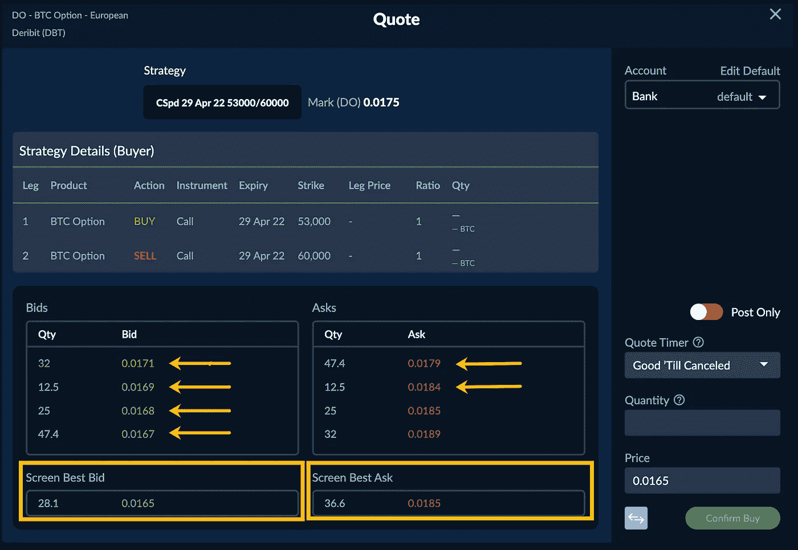

# Paradigm 的做市商生活在买卖差价内

> 原文：<https://medium.com/coinmonks/paradigms-market-makers-live-inside-the-bid-ask-spread-49a9e180d66c?source=collection_archive---------18----------------------->

这是我喜欢看到的—范例如何为您省钱的生动例子。

我们机构流动性池的一个关键是我们的做市商。不是一个，不是两个，而是一群做市商争夺你的生意。更多的做市商创造更好的市场。利差收窄。市场参与者的储蓄。

我们的市场标记存在于买卖差价内，这里有一个很好的例子。请注意，Paradigm 有四个出价比交易所屏幕上的出价更好。仅此一项就已经非常了不起了。现在，看一下要价，你会发现我们有两个比交易所更好的报价。更好的出价和更好的报价。

这就是我们的网络效应对市场接受者有利的地方。做市商通常愿意放弃市场某一方的优势。如果他们在出价上咄咄逼人，他们可能会在出价上手软。也许他们对市场方向有偏见，或者他们的库存决定了他们下一步需要在哪里交易，所以当你和一两个做市商交易时，你可能会在一边得到一个更好的市场。当多个做市商在争夺你的业务时，你会看到不同的偏好和不同的库存。你增加了做市商在市场两边都变得激进的机会。

你觉得怎么样？想了解更多关于 BTC、BCH 和瑞士联邦交易所期权和结构市场的信息吗？加入这里:[https://lnkd.in/gQC2QG5X](https://lnkd.in/gQC2QG5X)

> 加入 Coinmonks [电报频道](https://t.me/coincodecap)和 [Youtube 频道](https://www.youtube.com/c/coinmonks/videos)了解加密交易和投资

# 另外，阅读

*   [加密复制交易平台](/coinmonks/top-10-crypto-copy-trading-platforms-for-beginners-d0c37c7d698c) | [Coinmama 审核](/coinmonks/coinmama-review-ace5641bde6e)
*   [印度的加密交易所](/coinmonks/bitcoin-exchange-in-india-7f1fe79715c9) | [比特币储蓄账户](/coinmonks/bitcoin-savings-account-e65b13f92451)
*   [OKEx vs KuCoin](https://coincodecap.com/okex-kucoin) | [摄氏替代品](https://coincodecap.com/celsius-alternatives) | [如何购买 VeChain](https://coincodecap.com/buy-vechain)
*   [币安期货交易](https://coincodecap.com/binance-futures-trading)|[3 commas vs Mudrex vs eToro](https://coincodecap.com/mudrex-3commas-etoro)
*   [如何购买 Monero](https://coincodecap.com/buy-monero) | [IDEX 评论](https://coincodecap.com/idex-review) | [BitKan 交易机器人](https://coincodecap.com/bitkan-trading-bot)