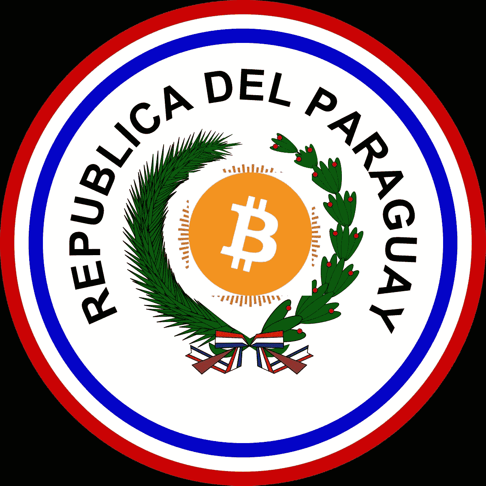

# 巴拉圭即将成为第二个采用比特币的国家

> 原文：<https://medium.com/coinmonks/paraguay-becomes-closer-to-being-the-second-country-to-adopt-bitcoin-f8e2c37908e9?source=collection_archive---------42----------------------->

Paraguay Adopt Bitcoin

**跟随萨尔瓦多的脚步**

去年 9 月 7 日，萨尔瓦多宣布将采用比特币作为货币后不久，巴拉圭紧随其后，在夏天提出了自己的法案，并于 2021 年 12 月 16 日获得批准。该法案称“该法律草案的目的是建立法律确定性、金融和…