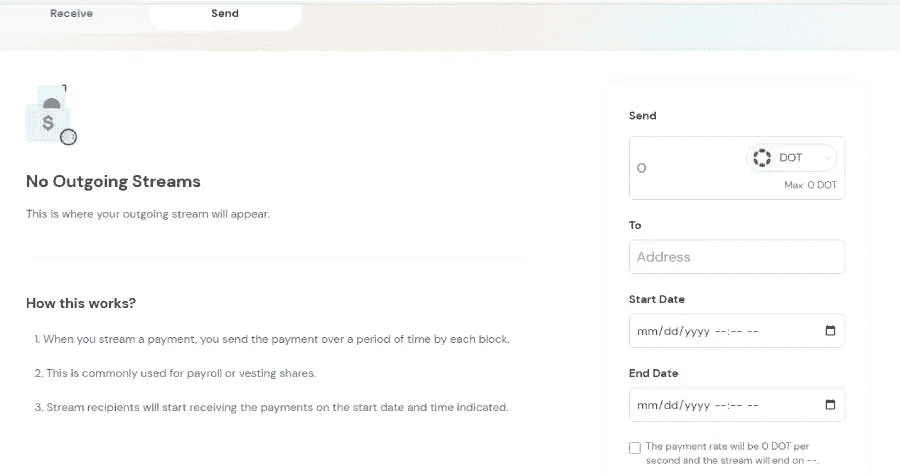

# 平行金融比该领域的大多数 DEFI 平台提供更多的服务

> 原文：<https://medium.com/coinmonks/parallel-finance-offers-more-services-than-majority-of-the-defi-platforms-in-the-space-f76fe94b7121?source=collection_archive---------46----------------------->

Parallel Finance 是一款 DEFI super 应用程序，它是一个一站式的 DEFI 解决方案，提供大量的金融工具。这是因为平行融资提供了比一般 dex 更多的金融服务。一般来说，我们在区块链领域的指数是 AMM 指数或货币市场指数。

AMM dex 是一个用于交换密码的分散平台。在这里，流动性提供者向互换池提供流动性。

货币市场指数是分散的资产借贷平台。

平行金融是这样的，还有更多…

# 平行金融，一个提供多种服务的平台，是一个超级 DEFI app

在我之前的文章中，我谈到过并行金融是 Dotsuma 生态系统的一个[众筹贷款平台](/@kikctikcy/more-rewards-for-lp-providers-with-the-yield-money-market-functions-of-parallel-finance-452834f737a3)，通过这个平台，Dot 持有者可以向 Polkadot 的 parachain 众筹贷款捐款。

[Tweet](https://twitter.com/ParallelFi/status/1529825339244806144?s=20)

后来，Parallel Finance kick 启动了 AMM 的 [DEFI 功能](/@kikctikcy/hurray-now-its-finally-possible-to-utilize-our-dot-on-parallel-finance-to-earn-yields-with-dot-5117ef23900c)和货币市场 Dex。所以现在，平行金融中的点锁定也增加了，因为点持有者将他们的点存入平行金融中的赌注和贷款，以赚取甜蜜的 APY。

# Parallel Finance 的 DAO FI 可以安排定期自动付款

除此之外，5 月 21 日，Parallel Finance kick 启动了其 DAO Fi 功能。

[Tweet](https://twitter.com/ParallelFi/status/1527808610910232578?s=20)

Parallel Finance 的 DAO Fi 模块提供支付流服务，支持定期自动支付。现金流规定为管理任务(如工资、代币和股权分配)安排经常性支付。

[Tweet](https://twitter.com/ParallelFi/status/1527808615389835265?s=20)

正如推文解释的那样，当使用 DAO Fi 模块安排自动支付时，工资支付可以实时发生！！

目前，stream 支持两种资产——DOT 和 Para，但很快，Parallel Finance 也将加入 ETH。

[Parallel Finance’s Dao Fi Module](https://app.parallel.fi/#/stream)

在接下来的日子里，Parallel Finance 将提供更多的服务，当这些服务在平台中被激活时，我会尽力介绍这些服务。

感谢您的阅读。

**关于平行金融**

平行金融是一个 Defi 超级应用程序，旨在成为人们参与 Defi 的一站式 DeFi 商店，它建立在 Polkadot 上。Parallel 的重点是为其平台带来创新功能，这样人们就可以从事资本效率定义。目标是建立一个易于使用的 Defi 平台，提供有益的金融服务，吸引 10 亿人使用并行金融服务。

**了解平行金融-**

网站—[https://parallel.fi/index.html](https://parallel.fi/index.html)

推特—[https://twitter.com/ParallelFi](https://twitter.com/ParallelFi)

这位作者的文章也可以在这些平台上阅读—

https://peakd.com/@mintymile/posts

【https://steemit.com/@mintymile/posts 

[https://www.publish0x.com/@greenchic](https://www.publish0x.com/@greenchic)