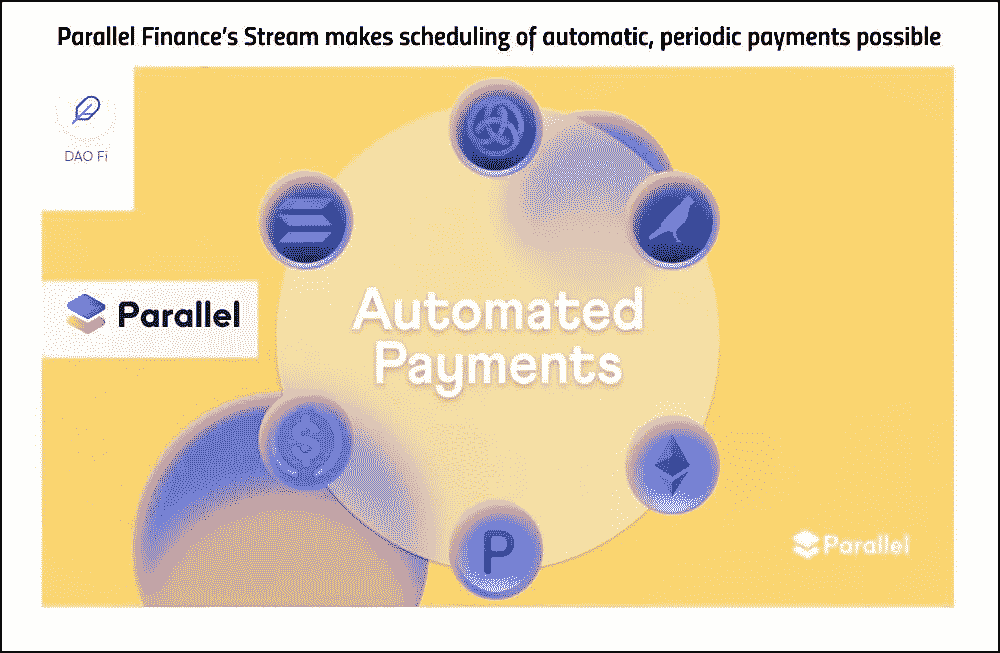
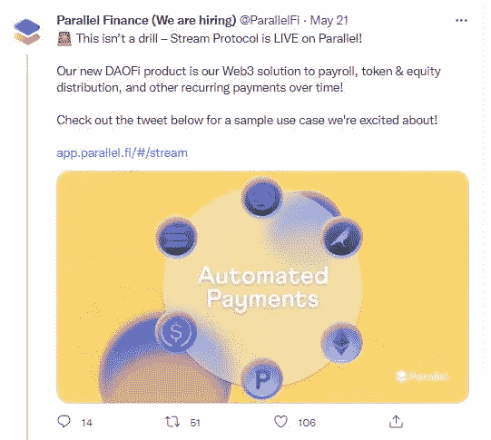
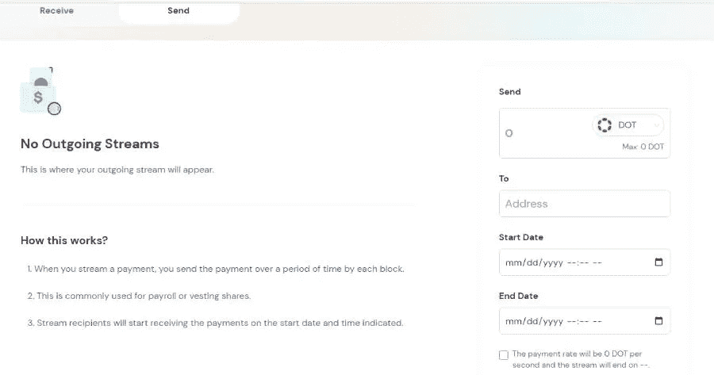
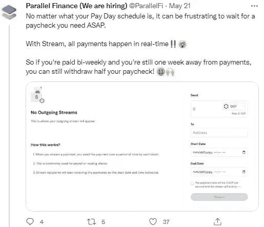
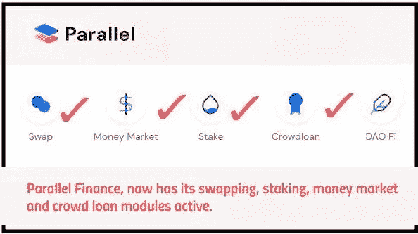
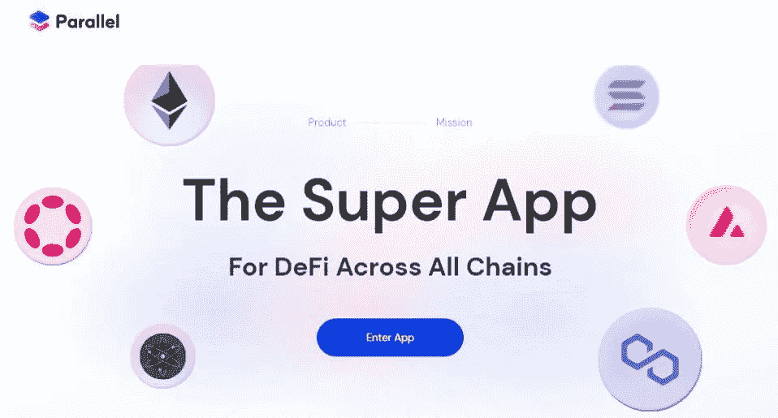

# Parallel Finance 的现金流使自动定期付款计划成为可能

> 原文：<https://medium.com/coinmonks/parallel-finances-stream-makes-scheduling-of-automatic-periodic-payments-possible-372fc802fa6f?source=collection_archive---------39----------------------->

# 平行金融通过平台流模块增加了非常有用的金融服务

Parallel Finance 是一款超级 DEFI 应用，除了我在之前的文章中讨论过的 AMM、赌注和货币市场功能之外，它还提供了更多的服务:

[华友世纪现在终于可以利用我们在并行金融上的 DOT，通过 DOT Liquid Staking 获得收益](/@kikctikcy/hurray-now-its-finally-possible-to-utilize-our-dot-on-parallel-finance-to-earn-yields-with-dot-5117ef23900c)

[通过并行金融的收益率货币市场功能为 LP 提供商提供更多奖励](/@kikctikcy/more-rewards-for-lp-providers-with-the-yield-money-market-functions-of-parallel-finance-452834f737a3)

[平台首创 Defi 功能，平行金融拓展应用](/@kikctikcy/parallel-finance-expands-its-utility-with-defi-functions-having-initiated-in-the-platform-9f4f5ee1yy4897)

作为 DEFI 中心，Parallel Finance 旨在为用户提供各种金融服务的一站式解决方案，最近推出了激活 Dao Fi 功能的流服务。

[Tweet](https://twitter.com/ParallelFi/status/1527808610910232578?s=20). Steam enables periodic automatic payments for tasks like payroll.

Stream module 使定期自动支付计划成为可能，使其成为工资、代币和股权分配的 web3 解决方案。

现在，Stream 模块可以用来发送和接收自动的、定期的点和 Para 令牌支付，但是很快就会添加对 ETH 等其他密码的支持。

[Parallel Finance’s Dao Fi Stream Module](https://app.parallel.fi/#/stream)

stream 很酷的一点是支付是实时发生的。假设您计划每两周收到一次付款，但是您急需资金，而您的计划工资支付日期还有 1 周。您仍然可以从 stream 模块中提取一周的工资，因为付款是实时进行的！！

[Tweet](https://twitter.com/ParallelFi/status/1527808615389835265?s=20)

因此，Stream 使工资单功能无缝运行，员工可以及时、实时地获得报酬！！

# **关于平行金融**

并行金融，现在有其交换，赌注，货币市场和群众贷款模块活跃。

这个建立在 Polkadot 基础上的分散化平台旨在成为一个 DEFI 中心，提供各种 Web3 金融解决方案，旨在让数十亿人在从事资本高效型 DEFI 时能够获得金融服务。

目前，Parallel Finance 是 Polkadot TVL 排名最高的副链，平台锁定的资产价值为 6.0376 亿英镑。

## 随着平行金融走向跨链，其他密码持有者将在平行金融中找到良好的收益机会

[Parallel Finance](https://parallel.fi/)

最近，随着 Polkadot 网络激活 XCM 功能，用于令牌传输的副链和中继链之间的通信成为可能。随着 XCM 的发展，Polkadot Parachains 将有可能在没有桥梁的情况下进行跨区块链通信。Parallel Finance 受益于 Polkadot，因此有一个跨链的未来，用户可以从流行的区块链如 Ethereum、Cosmos、Polygon、Solana 带来他们的加密资产，并将其用于 Parallel Finance。

这意味着，就像 DOT 持有者通过跑马圈地和出借 DOT 在平行金融中找到良好的收益率赚取机会一样，以太坊、Sol、Matic 和 Atom 的持有者也会在平行金融中找到收益率赚取机会。

## 点持有者当前的收益赚取机会

## 点标桩

sDOT 获得 14.5%的 APY，可以在货币市场以 9.5%的 APY 和 0.17%的 sDOT 奖励贷款。

## 网点贷款

DOT lending 在 DOT rewards 中获得 7.22%，在 Para rewards 中获得 16.6%。

**此处进入平行金融 App**——【https://app.parallel.fi/ 

**了解平行金融-**

网站—[https://parallel.fi/index.html](https://parallel.fi/index.html)

推特—[https://twitter.com/ParallelFi](https://twitter.com/ParallelFi)

不一致—[https://discord.gg/DeyEntFT](https://discord.gg/DeyEntFT)

**这位作者的文章也可以在这些平台上阅读—**

[https://peakd.com/@mintymile/posts](https://peakd.com/@mintymile/posts)

[https://steemit.com/@mintymile/posts](https://steemit.com/@mintymile/posts)

[https://www.publish0x.com/@greenchic](https://www.publish0x.com/@greenchic)