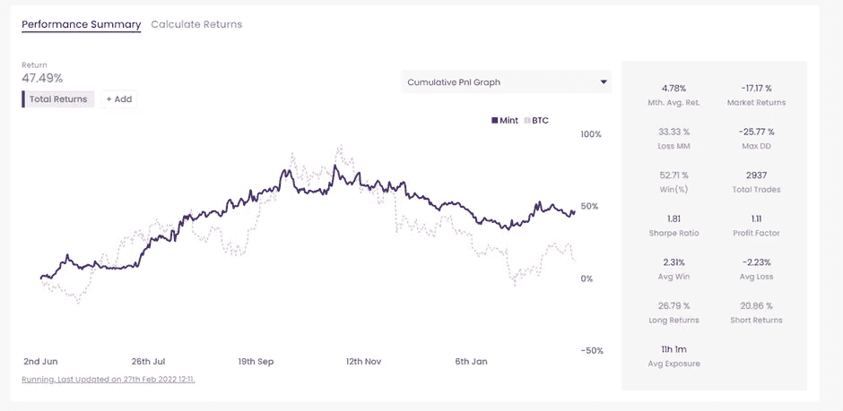

# 第 1 部分:Mudrex 投资

> 原文：<https://medium.com/coinmonks/part-1-mudrex-invest-fa40c3dcfa75?source=collection_archive---------18----------------------->

Shout out to [https://www.instagram.com/maximhopman/](https://www.instagram.com/maximhopman/) for the image!

请记住这不是财务建议，请阅读文章底部的免责声明。

在这篇文章中，我们将覆盖 [Mudrex](https://mudrex.com/signup?referral_code=MARK8081) 的**投资**部分。如果您还没有阅读这篇概述文章，请先阅读这篇文章，这样才有意义！

概述— [此处](https://realisticcrypto.medium.com/is-this-free-automated-trading-and-investment-platform-something-that-all-crypto-traders-and-1cb8440adaef)

第一部分:Mudrex **投资** — [此处](https://realisticcrypto.medium.com/fa40c3dcfa75)

第 2 部分:Mudrex **构建** — [此处](https://realisticcrypto.medium.com/part-2-mudrex-build-ca22a9dcc30a)

第 3 部分:Mudrex **MONITISE** — [此处](https://realisticcrypto.medium.com/part-3-mudrex-monetise-2575e5d91b28)

这是为那些想订阅其他人的策略的人准备的，**投资**在一套硬币中或者**投资**在 [Mudrex](https://mudrex.com/signup?referral_code=MARK8081) 团队建立的策略中，目的是被动赚取。我们在这篇文章中有很多截图。

让我们从成套硬币开始…

硬币套装让你能够**投资**硬币组合。这些每月都会重新平衡。目前的做法是在月底卖出所有硬币，然后再买回，以匹配硬币集中的分配。这意味着你从赢家那里获利，并通过维持分配给每枚硬币的百分比，把它们放回给输家。举个例子…

如果你有一套有 2 枚硬币和 1000 美元的硬币。假设这些硬币是 BTC 公司的。1，000 美元按 50% : 50%的比例分配，因此每枚硬币中有 500 美元。

上个月，BTC 的价格上涨了 10%，而 ETH 却下跌了 5%。这意味着你现在有 550 美元的 BTC 和 475 美元的 ETH，总计 1025 美元。你现在赚了 25 美元。

月底，所有的硬币都被卖掉，然后 1025 美元被分成 50% : 50%放在 BTC，512.5 美元放在瑞士联邦理工学院。

下面是您访问硬币组时将看到的屏幕。

您可以筛选您偏好的兑换可用的硬币组。这在下面用黄色突出显示

选择其中一套硬币后，它会给出一个硬币的描述，显示您所涉及的费用，投资者人数，最低投资额&允许您分配资金。

下面，我选择了元宇宙硬币集。这是目前分为 8 个不同的硬币，可以在稍后的截图中看到。它还显示了你可以投资哪种加密技术(在这种情况下是 BUSD 或 USDT)以及支持哪些交易所。

向下滚动第一个屏幕后，您可以看到硬币组在之前一段时间的表现。在这种情况下，它被设置为 1Y。

当您单击“计算回报”标题时，这将向您显示基于以前业绩的指示性回报。

请记住，以前的表现并不能保证将来的表现！

进一步向下滚动，可以看到资金是如何分配的，分配给了哪些硬币。您还可以查看 24 小时、1 周、1 个月、6 个月和 1 年的表现。

这包括了 [Mudrex](https://mudrex.com/signup?referral_code=MARK8081) 的**投资**区的硬币组部分。

**算法**

现在到阿尔戈斯部分。在这里你可以找到所有由 Mudrex 社区成员发布的策略。你看不到策略是由什么组成的，它可能像 SMA 交叉一样简单，但你可以看到它们在回溯测试中和随着时间的推移表现如何。如果你想订阅的话，需要支付月费，这取决于你的投资额。如果你**投资【1,000 美元，收取 1%的费用，你每月将支付 10 美元的费用。这激励了策略提供者维持策略的性能以获得报酬。**

下面你可以看到当你点击 Algos 时第一个屏幕的截图。这显示了一个过滤器的算法，可以过滤的最高分，流行和最好的上个月。

向下滚动，您可以更详细地查看这些策略，并过滤交易所(Bitmex、[币安](https://accounts.binance.com/en/register?ref=OKF5252M)、[币安期货](https://accounts.binance.com/en/register?ref=OKF5252M)、币安美国、Derebit、 [Bybit](https://www.bybit.com/en-US/invite?ref=7BJYO%230) 、Okex、比特币基地专业公司、Mudrex 现货、Mudrex 期货& FTX)、投资资产(BTC、USDT、BUSD 等)、算法得分(10 为最高)以及算法存在多久。

你还可以看到有多少人投资的回报和每月的费用。

在选择一个算法(我选择了评级最高的一个)后，你可以看到它在哪些交易所上市，在哪些市场交易，它已经运行了多长时间，如果你决定投资，你可以通过分配资金按钮来完成。

向下滚动，您可以找到一段时间内的实际性能以及策略本身的所有统计数据。胜率，提款，利润因素，平均月回报，等等。

回溯测试性能选项卡还允许您使用与上述实时性能部分相同的所有统计数据来查看策略在去年的表现。

当您单击“计算回报”标题时，这将向您显示基于以前业绩的指示性回报。

请记住，以前的表现并不能保证将来的表现！

一旦你滚动到底部，你可以看到所有的交易已经被放置在该策略下。这显示了它们开放的时间(敞口)、最大提款和交换费用后的 PnL。

这包括算法。记住，如果你有一个交易策略，你想把它货币化并提供给其他人，你可以在第三部分读到这些:**货币化**

**薄荷糖**

薄荷糖是由为 Mudrex 工作的特定团队开发的策略。这些分为 3 个不同的风险级别—低、中&高。

当你向下滚动每个风险级别的简要描述时，你可以看到回报，与 BTC 相关的风险评级，以及与 BTC 的表现相关的造币厂的表现。

在这里，我选择了中等风险薄荷。这向你展示了造币厂已经运行了多长时间，它适用于哪些交易所，哪些资产用于投资以及造币厂交易什么。它还显示了最低分配和每月费用，这是你会去分配资金到这个薄荷策略。

向下滚动，您可以找到一段时间内与 BTC 相比的真实表现，以及该策略本身的所有统计数据。胜率，提款，利润因素，平均月回报，等等。

当您单击“计算回报”标题时，这将向您显示基于以前业绩的指示性回报。

请记住，以前的表现并不能保证将来的表现！

一旦你滚动到底部，你可以看到所有的交易已经被放置在该策略下。这显示了他们已经开放了多长时间(暴露)，最大提款和收费后的 PnL。

这涵盖了本系列的**投资**部分。如果你还没有注册，你可以在这里免费注册[。](https://mudrex.com/signup?referral_code=MARK8081)

我还在下面添加了链接，以返回到概述文章、**构建**文章和**货币化**文章。

概述— [此处](https://realisticcrypto.medium.com/is-this-free-automated-trading-and-investment-platform-something-that-all-crypto-traders-and-1cb8440adaef)

第一部分:穆德雷克斯**投资**——[此处](https://realisticcrypto.medium.com/fa40c3dcfa75)

第 2 部分:Mudrex **构建** — [这里是](https://realisticcrypto.medium.com/part-2-mudrex-build-ca22a9dcc30a)

第 3 部分:Mudrex **MONITISE** — [此处](https://realisticcrypto.medium.com/part-3-mudrex-monetise-2575e5d91b28)

**附属链接**

更多优惠还可以在这里找到:[https://linktr.ee/RealisticCrypto](https://linktr.ee/RealisticCrypto)

还有，如果你想请我喝杯咖啡或者啤酒:) :

BTC—BC 1 qaxaq 2 q 9 js 89 gyzhr 0202 sxt 6 hgchprqjga 5 px

基于 ETH、BNB、AVAX、SOL 和 FTM 的令牌—0 x3b 7b 843d 8125 Fe 7 EBA 541 e 1d 751 a4 a 73 f 0 cfad 4c

**免责声明**

这不是财务建议，我不是财务顾问或会计或税务专家。这是我对帮助过我的软件工具的体验，以及我使用它们的经历。

我在本指南中使用了推荐链接。使用这些工具有助于以后的文章，所以如果你觉得这篇文章有用，并且想看看我介绍的工具，请使用它们。我还会叫出你在哪里打折——双赢对吧？

> 加入 Coinmonks [电报频道](https://t.me/coincodecap)和 [Youtube 频道](https://www.youtube.com/c/coinmonks/videos)了解加密交易和投资

# 另外，阅读

 [## mudrex Invest——一个投资密码的简单方法

### 在这篇文章中，我们将审查 Mudrex 投资，这使得投资于加密交易机器人一样简单，投资于…

coincodecap.com](https://coincodecap.com/mudrex-invest-review-the-best-way-to-invest-in-crypto) 

*   [AscendEx 保证金交易](https://coincodecap.com/ascendex-margin-trading) | [Bitfinex 赌注](https://coincodecap.com/bitfinex-staking) | [bitFlyer 审核](https://coincodecap.com/bitflyer-review)
*   [麻雀交换评论](https://coincodecap.com/sparrow-exchange-review) | [纳什交换评论](https://coincodecap.com/nash-exchange-review)
*   [维护卡审核](https://coincodecap.com/uphold-card-review) | [信任钱包 vs MetaMask](https://coincodecap.com/trust-wallet-vs-metamask)
*   [Exness 点评](https://coincodecap.com/exness-review)|[moon xbt Vs bit get Vs Bingbon](https://coincodecap.com/bingbon-vs-bitget-vs-moonxbt)
*   [如何开始通过加密贷款赚取被动收入](https://coincodecap.com/passive-income-crypto-lending)
*   [加密货币储蓄账户](/coinmonks/cryptocurrency-savings-accounts-be3bc0feffbf) | [加密交易机器人](https://coincodecap.com/best-crypto-trading-bots)
*   [BigONE 交易所评论](/coinmonks/bigone-exchange-review-64705d85a1d4) | [CEX。IO 审查](https://coincodecap.com/cex-io-review) | [交换区审查](/coinmonks/swapzone-review-crypto-exchange-data-aggregator-e0ad78e55ed7)
*   [最佳比特币保证金交易](/coinmonks/bitcoin-margin-trading-exchange-bcbfcbf7b8e3) | [比特币保证金交易](https://coincodecap.com/bityard-margin-trading)