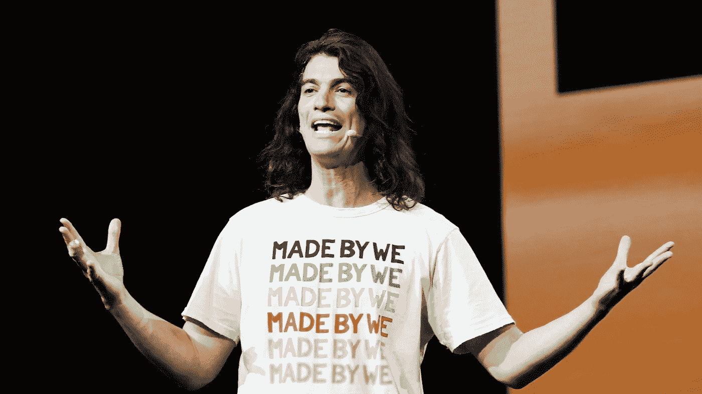

# [第 1 部分，共 4 部分]我们这一代最伟大的推销员怎么了？

> 原文：<https://medium.com/coinmonks/part-1-of-4-what-happened-to-the-greatest-salesman-of-our-generation-73e416c293e2?source=collection_archive---------47----------------------->

Adam Neumann is the world’s greatest magician.

有人说他是世界上最伟大的操纵者。

一些人称他为世纪魔术师，因为他创造了世界上最臭名昭著和最成功的独角兽之一，然后将其摧毁并带走了超过 10 亿美元。

关于他的滑稽动作、行为、操纵、谎言和魅力的童话和谣言像致命的风暴一样席卷了整个创业世界。

光着脚在纽约街头漫步，疯狂的大麻派对，把“我们”品牌卖给自己的公司，鼓励员工在工作时喝龙舌兰酒。

在所有的疯狂中，我不得不承认，他是一个迷人的家伙。

魅力被定义为取悦、吸引或迷住他人的力量或品质。

这是一种可以学习的性格特征，但只有少数人能够掌握。

像任何超级力量一样，魅力也可以被利用或滥用。

这是一种介于说服和操纵之间的色彩渐变。

史蒂夫·乔布斯、特拉维斯·卡兰尼克和亚当·诺伊曼是迷人的首席执行官的典型代表，他们能在冬天的暴风雪中把冰卖给爱斯基摩人。

如果你喜欢虚构的角色，擎天柱就是一个迷人领袖的好例子。

他说什么或让你做什么并不重要，你可能会在听到他用他深沉、丰富和可信的声音说话后去做。

亚当亚当亚当。

从创业公司最热门的十粒玉米背后的奇迹 CEO 到一个可笑的值得纪念的失宠。

WeWork 一度价值高达 470 亿美元。

在经历了所有的混乱和戏剧性之后，它以不到 90 亿美元的估值完成了与特殊目的收购公司的合并。

还是独角兽，不用担心，但不再是两位数了。

To be fair, everything can be taken out of context.

他在 WeWork 的生活简直就是一部正在制作中的好莱坞电影。

既然特拉维斯有了一部电影，你可以打赌亚当的也快了。

亚当单枪匹马地让我相信，作为一名雄心勃勃的首席执行官，私人飞机是他工作的精髓。

我是认真的。

想想吧。

110 个城市，每隔一周飞行一次，每周 3-5 个城市，面对面招待和会见企业客户以达成交易。

每个企业客户价值数亿。

获得一笔企业交易不仅可以弥补飞机的成本，还可以为更多的人提供就业机会。

这在很大程度上证明了私人飞机的合理性。

我不知道确切的数学方法，但原则上这很有说服力。

那么，自从 WeWork 发生内爆以来，这位神话般的亿万富翁到底怎么了？

在接下来的部分，我将深入了解他自内爆以来的首次公开采访。

-

你认为亚当·诺伊曼是一个有魅力的 CEO 吗？

-

# startups # business # startupx # growth # success # social media # culture # entrepreneur # strategy # adamneumann # adamwework # we work # we worksage # we workstory # masa yoshison # unicorn # deca corn #软银

> *加入 Coinmonks* [*电报频道*](https://t.me/coincodecap) *和* [*Youtube 频道*](https://www.youtube.com/c/coinmonks/videos) *了解加密交易和投资*

# 另外，阅读

*   [3 商业评论](/coinmonks/3commas-review-an-excellent-crypto-trading-bot-2020-1313a58bec92) | [Pionex 评论](https://coincodecap.com/pionex-review-exchange-with-crypto-trading-bot) | [Coinrule 评论](/coinmonks/coinrule-review-2021-a-beginner-friendly-crypto-trading-bot-daf0504848ba)
*   [莱杰 vs n 格拉夫](/coinmonks/ledger-vs-ngrave-zero-7e40f0c1d694) | [莱杰纳诺 s vs x](/coinmonks/ledger-nano-s-vs-x-battery-hardware-price-storage-59a6663fe3b0) | [币安评论](/coinmonks/binance-review-ee10d3bf3b6e)
*   [Bybit Exchange 审查](/coinmonks/bybit-exchange-review-dbd570019b71) | [Bityard 审查](https://coincodecap.com/bityard-reivew) | [Jet-Bot 审查](https://coincodecap.com/jet-bot-review)
*   [3 commas vs crypto hopper](/coinmonks/3commas-vs-pionex-vs-cryptohopper-best-crypto-bot-6a98d2baa203)|[赚取加密利息](/coinmonks/earn-crypto-interest-b10b810fdda3)
*   最好的比特币[硬件钱包](/coinmonks/hardware-wallets-dfa1211730c6) | [BitBox02 回顾](/coinmonks/bitbox02-review-your-swiss-bitcoin-hardware-wallet-c36c88fff29)
*   [BlockFi vs Celsius](/coinmonks/blockfi-vs-celsius-vs-hodlnaut-8a1cc8c26630)|[Hodlnaut 点评](/coinmonks/hodlnaut-review-best-way-to-hodl-is-to-earn-interest-on-your-bitcoin-6658a8c19edf) | [KuCoin 点评](https://coincodecap.com/kucoin-review)