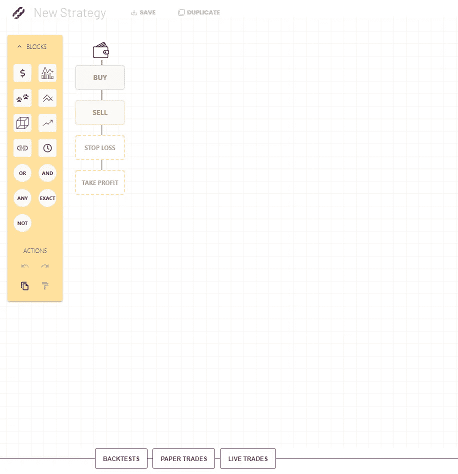
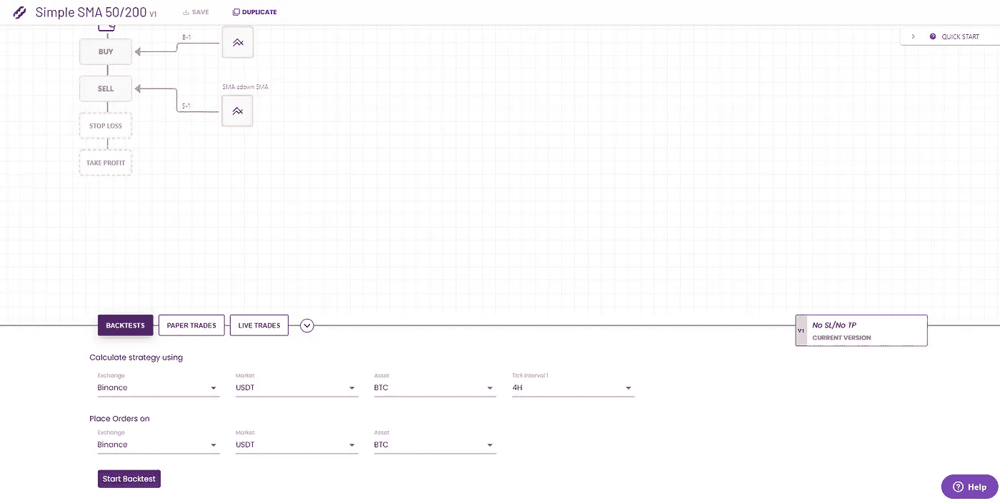
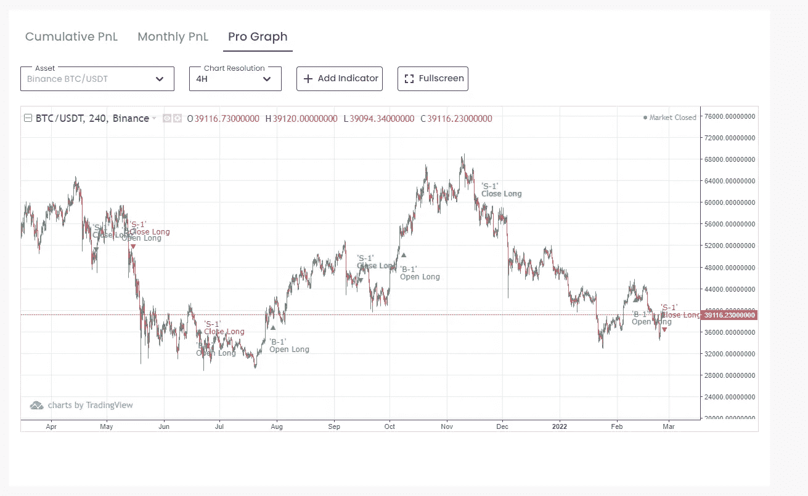

# 第 2 部分:Mudrex 构建

> 原文：<https://medium.com/coinmonks/part-2-mudrex-build-ca22a9dcc30a?source=collection_archive---------31----------------------->

Shout out to [https://www.instagram.com/maximhopman/](https://www.instagram.com/maximhopman/) for the image!

请记住这不是财务建议，请阅读文章底部的免责声明。

在本文中，我们将覆盖 [Mudrex](https://mudrex.com/signup?referral_code=MARK8081) 的**构建**部分。如果您还没有阅读这篇概述文章，请先阅读这篇文章，这样才有意义！

概述— [此处](https://realisticcrypto.medium.com/is-this-free-automated-trading-and-investment-platform-something-that-all-crypto-traders-and-1cb8440adaef)

第一部分:Mudrex **投资** — [此处](https://realisticcrypto.medium.com/fa40c3dcfa75)

第 2 部分:Mudrex **构建** — [此处](https://realisticcrypto.medium.com/part-2-mudrex-build-ca22a9dcc30a)

第 3 部分:Mudrex **MONITISE** — [此处](https://realisticcrypto.medium.com/part-3-mudrex-monetise-2575e5d91b28)

**建造简介。**

这是我见过的最强大而简单的界面之一，可以用来创建交易策略。可能性是无限的，无代码定制的水平是首屈一指的。

你可以通过一个拖放界面来构建你想要的每一个策略。如果你想在 50 均线穿过 200 均线时交易简单的均线策略，你可以这么做。如果你想交易一个简单的移动平均线策略，当 50 毫安穿过 200 毫安，RSI 低于 20，最后 7 根棒线的交易量高于最后 10 根棒线的平均交易量，或者在最后 6 根棒线有一根熊市吞没蜡烛线，你也可以这么做。我想说的是，无论你的策略是简单的还是极其复杂的，你都可以在 Mudrex 中自动化它，并进行回溯测试！

对于已经在使用 TradingView 的人来说，你可能已经遇到了和我相似的挑战。我不知道 PineScript，如果我想在多种情况下创建一个警报，我需要学习 PineScript 或花钱请人帮我做这件事。

习惯上，我用[币安](https://accounts.binance.com/en/register?ref=OKF5252M)，[3 commas](https://3commas.io/?c=realisticcrypto)&[trading view](https://www.tradingview.com/gopro/?share_your_love=MarkRealisticCrypto)。 [3Commas](https://3commas.io/?c=realisticcrypto) 和 [TradingView](https://www.tradingview.com/gopro/?share_your_love=MarkRealisticCrypto) 是付费订阅，虽然它们提供的东西与 [Mudrex](https://mudrex.com/signup?referral_code=MARK8081) 略有不同，但如果你只是使用 [3Commas](https://3commas.io/?c=realisticcrypto) 和 [TradingView](https://www.tradingview.com/gopro/?share_your_love=MarkRealisticCrypto) 根据 [TradingView](https://www.tradingview.com/gopro/?share_your_love=MarkRealisticCrypto) 信号进行交易，那你就是在浪费钱。

交易所方面， [Mudrex](https://mudrex.com/signup?referral_code=MARK8081) 支持[币安](https://accounts.binance.com/en/register?ref=OKF5252M)、[币安期货](https://accounts.binance.com/en/register?ref=OKF5252M)、币安美盘、Bitmex、 [Bybit](https://www.bybit.com/en-US/invite?ref=7BJYO%230) 、CoinbasePro、Deribit、FTX、OKEX。

在这篇文章中，我将带你经历创建、回溯测试和回顾一个策略的步骤，向你展示它是多么容易。

下面的第一个屏幕截图显示了您打开 **BUILD** 时看到的第一个屏幕。如你所见，这里有一个策略列表，大部分都是样本。要创建一个新策略，您可以点击可视化编辑器按钮。

现在你可以看到一个空白的画布。左边是模块——这些是创建你的战略背后的逻辑。将鼠标悬停在每个街区上会给你一个他们做什么的描述。您还可以添加额外的语句，如 OR、ANY、EXACT、NOT。

我将为本文构建一个简单的 SMA 交叉策略。我首先将比较块拖放到画布上。

一旦它在那里，我可以双击或单击小铅笔图标来配置块。比较模块根据您选择的操作比较两个指标的值。在本例中，我比较了 50 SMA(左侧)和 200 SMA(右侧)。在“比较”部分，我将标准设置为交叉。当这种情况发生时，我会设置它来触发买入。

注意:不要担心时间框架。这个以后再说。

我已经完成了与上面相同的步骤，但是将卖出的标准改为向下交叉，这就是我现在的情况。我已经把十字向上箭头拖到了买入，把十字向下箭头拖到了卖出。我还没有应用止损或止盈，所以从长期来看，这将发生在 50 日均线穿过 200 日均线上方时，反之亦然。

要设置止损，你只需双击止损并设置百分比。如果这是你策略的一部分，你也可以设置一个跟踪百分比。

要设置止盈，和止损是一样的。下面的屏幕截图

现在我们有了 SMA 交叉策略，是时候对其进行回溯测试了。单击回溯测试按钮，您将看到许多选项。如果您还没有为策略命名，那么在您继续之前会提示您这样做。

设置要测试策略的时间范围和配对，然后单击开始回溯测试。

提示:在这一点上，我还建议在右下方的版本中放一个描述符，并包含您的 TP/SL 设置。您可以在以后使用它们，只需点击一个按钮就可以返回到以前的版本。

因此，一旦回溯测试运行，你会看到它已经计算出的结果，它会告诉你平均每月回报，亏损月份和业绩得分。您可以单击它深入查看更多详细信息。

单击回溯测试后，您将有机会更详细地研究性能。它显示了总体回报，每个月的表现，胜率和更多的图表。您也可以调整您的费用百分比。右边还有一个查看细节按钮。点击这个。

点击“更多详细信息”按钮后，您可以利用杠杆重新计算，更改日期范围并查看与策略相关的更多详细信息。

向下滚动，你可以看到 PnL 与市场回报的对比。

你也可以看 PnL 月刊。

这是我最喜欢的观点之一。专业图表。这将买入和卖出叠加在交易视图图上，这样你就可以分析你策略的进场和出场。

继续向下滚动，您可以看到已经进行的交易。第一笔交易以 100 美元开始，并滚入 100%的账户余额，以提供结果。在这个屏幕上，你可以看到输入余额，最大提款，利润和交易的时间(敞口)。

日志屏幕显示信号和根据路径名采取的行动。如果您在策略中配置了多个买入/卖出块，这就很方便了。

如果在分析了这些屏幕后，我想返回并更改止盈，这就像回到策略一样简单，双击止盈按钮，添加止盈目标，然后单击确定。

进行更改后，当您打开回溯测试屏幕时，将会创建一个新版本的策略(v1、v2 等)。设置你的时间框架和硬币，点击开始回溯测试，你会得到新的结果。

如果你想开始纸上交易或现场交易，过程和回溯测试一样，选择你的时间框架，然后点击开始纸上交易或开始现场交易。

系统会提示您输入 USDT 的数量(在本例中)，然后您单击 OK，自动策略就开始运行了。

当你回到主 [Mudrex](https://mudrex.com/signup?referral_code=MARK8081) 网站时，你会看到实时运行和纸质运行。如果运行，这些策略将在那里详述。

这只是一个简单的策略，但这个平台的可能性是无限的。你可以配置任何东西。我建议免费注册，尝试一下它的功能，看看它是否能让你的策略自动化。

这涵盖了本系列的**构建**部分。如果你还没有注册，你可以在这里免费注册[。](https://mudrex.com/signup?referral_code=MARK8081)

我还在下面添加了链接，以返回到概述文章、**投资**文章和**货币化**文章。

概述— [此处](https://realisticcrypto.medium.com/is-this-free-automated-trading-and-investment-platform-something-that-all-crypto-traders-and-1cb8440adaef)

第一部分:Mudrex **投资** — [此处](https://realisticcrypto.medium.com/fa40c3dcfa75)

第 2 部分:Mudrex **构建** — [此处](https://realisticcrypto.medium.com/part-2-mudrex-build-ca22a9dcc30a)

第三部分:Mudrex**moni tise**——[此处](https://realisticcrypto.medium.com/part-3-mudrex-monetise-2575e5d91b28)

**附属链接**

更多的好处你也可以在这里找到:[https://linktr.ee/RealisticCrypto](https://linktr.ee/RealisticCrypto)

还有，如果你想请我喝杯咖啡或者啤酒:) :

BTC—BC 1 qaxaq 2 q 9 js 89 gyzhr 0202 sxt 6 hgchprqjga 5 px

基于 ETH、BNB、AVAX、SOL 和 FTM 的令牌—0 x3b 7b 843d 8125 Fe 7 EBA 541 e 1d 751 a4 a 73 f 0 cfad 4c

**免责声明**

这不是财务建议，我不是财务顾问或会计或税务专家。这是我对帮助过我的软件工具的体验，以及我使用它们的经历。

我在本指南中使用了推荐链接。使用这些工具有助于以后的文章，所以如果你觉得这篇文章有用，并且想看看我提到的工具，请使用它们。我还会叫出你在哪里打折——双赢对吧？

> 加入 Coinmonks [电报频道](https://t.me/coincodecap)和 [Youtube 频道](https://www.youtube.com/c/coinmonks/videos)了解加密交易和投资

# 另外，阅读

 [## 第 1 部分:Mudrex 投资

### 请记住这不是财务建议，请阅读文章底部的免责声明。

medium.com](/coinmonks/part-1-mudrex-invest-fa40c3dcfa75) 

*   [WazirX vs coin dcx vs bit bns](/coinmonks/wazirx-vs-coindcx-vs-bitbns-149f4f19a2f1)|[block fi vs coin loan vs Nexo](/coinmonks/blockfi-vs-coinloan-vs-nexo-cb624635230d)
*   [BlockFi 信用卡](https://coincodecap.com/blockfi-credit-card) | [如何在币安购买比特币](https://coincodecap.com/buy-bitcoin-binance)
*   [火币交易机器人](https://coincodecap.com/huobi-trading-bot) | [如何购买 ADA](https://coincodecap.com/buy-ada-cardano) | [Geco。一次回顾](https://coincodecap.com/geco-one-review)
*   [加密复制交易平台](/coinmonks/top-10-crypto-copy-trading-platforms-for-beginners-d0c37c7d698c) | [五大 BlockFi 替代品](https://coincodecap.com/blockfi-alternatives)
*   [CoinLoan 点评](https://coincodecap.com/coinloan-review)|[Crypto.com 点评](/coinmonks/crypto-com-review-f143dca1f74c) | [火币保证金交易](/coinmonks/huobi-margin-trading-b3b06cdc1519)
*   [Bybit vs 币安](https://coincodecap.com/bybit-binance-moonxbt)|[stealth x 回顾](/coinmonks/stealthex-review-396c67309988) | [Probit 回顾](https://coincodecap.com/probit-review)
*   [顶级付费加密货币和区块链课程](https://coincodecap.com/blockchain-courses)
*   [CBET 回顾](https://coincodecap.com/cbet-casino-review) | [库币 vs 比特币基地](https://coincodecap.com/kucoin-vs-coinbase) | [拜比特 vs 比特币基地](https://coincodecap.com/bybit-vs-coinbase)
*   [如何在加拿大购买加密货币？](https://coincodecap.com/how-to-buy-cryptocurrency-in-canada)