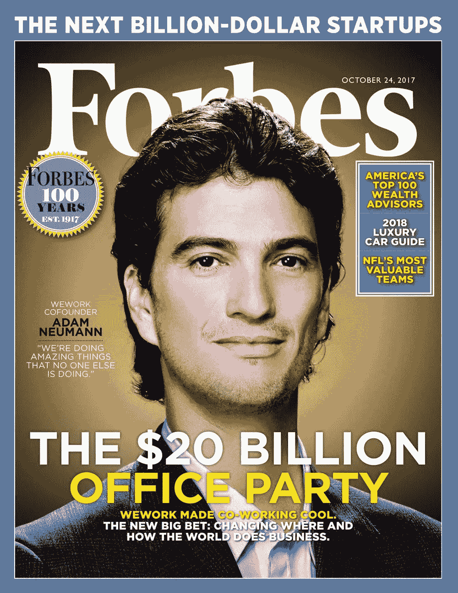
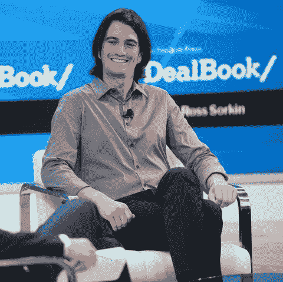
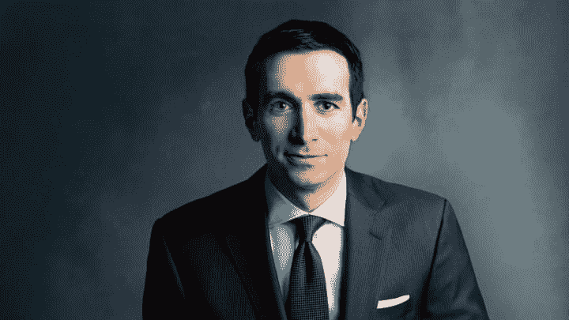

# [第 2 部分，共 4 部分]亚当·诺伊曼离开 WeWork 后一直在做什么？

> 原文：<https://medium.com/coinmonks/part-2-of-4-what-has-adam-neumann-been-up-to-since-leaving-wework-f8235c502530?source=collection_archive---------29----------------------->

Adam Neumann on the cover of Forbes 2017

那么，自从 WeWork 发生内爆以来，这位神话般的亿万富翁亚当·诺伊曼(Adam Neumann)到底怎么样了？

显然没什么。

他说他经历了一段很长的反思期，试图理解从那以后发生的一切。

公平地说，即使对亚当来说，这也是一大笔钱。

有背叛，内幕交易，脏话，痛苦的揭露，公开的责骂，公开的解雇和大量的戏剧，即使是一个经验丰富的专业人士也会筋疲力尽。

我们都认为他带走了几十亿美元，与我们的工作无关。

显然，他声称自己参与了特殊目的收购公司的合并，参与了与孙正义的所有谈判，甚至多次试图拯救公司。

他用沉着冷静、充满魅力的声音揭示了这一切，几乎就像冥想应用中的叙述者。

你看过亚当·诺伊曼离开 WeWork 后的第一次公开采访吗？

Calm, composed, but ever so charming.

[https://youtu.be/Dgp-CM-gQik](https://youtu.be/Dgp-CM-gQik)

让我总结几个要点，但如果你有时间，一定要看 48 分钟的视频。

听着，我不是在这里传播 FUD 教或者质疑亚当的所作所为。

我有什么资格评判和指责？

肯定有人在这个过程中受到伤害，他们可以成为裁判。

我只是想对他所做的一切有一点了解，如果有的话，挑出一些要点。

Andrew Ross Sorkin is a seasoned interviewer with style and poise.

采访者是安德鲁·罗斯·索尔金，值得称赞的是，他非常专业、强硬和公正。

他不停地追问答案，不让亚当挣脱出来。

提出大多数人脑海中的问题的道具，但当直接看着亚当时，可能不会想到要问他。

我必须说，从任何意义上来说，安德鲁也是一位迷人的采访者。

他的表达非常清晰，反驳时泰然自若，在适当的时候很有耐心。

注意他是如何提高语调的，在问一个可能非常困难的问题之前，尽量让自己听起来真正感兴趣。

这样做是为了让受访者放心，并促使他们给出诚实的回答。

大师级。

哦，是的，你也可以从面试官那里学到东西。

因此，简而言之，亚当花了很多时间反思，经营他的家庭办公室，还投资了一个名为 Klima 的 DAO，自那以来下跌了近 90%(公平地说，所有奥林巴斯福克斯在最近的秘密冬季月份都暴跌了)。

即使发生了这一切，拥有一个家族理财室来管理你所有的钱是多么美好啊。

在第四部分之后的特别节目中会有更多的介绍！

请注意下一部分，我将强调亚当在面试中使用的一项关键技能，它将极大地提升你的谈判水平。

-

你认为没有亚当·诺依曼我们的工作会更好吗？

-

# startups # business # startupx # growth # success # social media # culture # entrepreneur # strategy # adamneumann # adamwework # we work # we worksage # we workstory # masa yoshison # unicorn # deca corn #软银