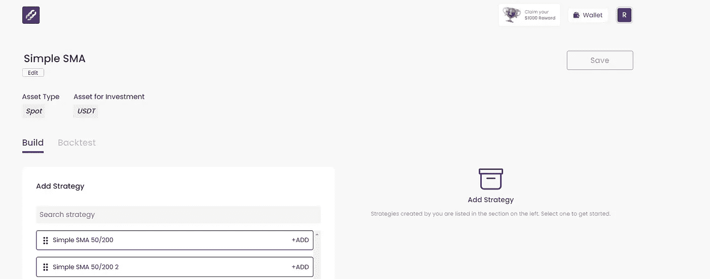

# 第三部分:Mudrex 货币化

> 原文：<https://medium.com/coinmonks/part-3-mudrex-monetise-2575e5d91b28?source=collection_archive---------38----------------------->

Shout out to [https://www.instagram.com/maximhopman/](https://www.instagram.com/maximhopman/) for the image!

请记住这不是财务建议，请阅读文章底部的免责声明。

在这篇文章中，我们将覆盖掉 [Mudrex](https://mudrex.com/signup?referral_code=MARK8081) 的**货币化**部分。如果您还没有阅读概述文章或**构建**文章，那么请先阅读它们，这样才有意义(下面的链接)！

概述— [此处](https://realisticcrypto.medium.com/is-this-free-automated-trading-and-investment-platform-something-that-all-crypto-traders-and-1cb8440adaef)

第一部分:Mudrex **投资** — [此处](https://realisticcrypto.medium.com/fa40c3dcfa75)

第 2 部分:Mudrex **构建** — [此处](https://realisticcrypto.medium.com/part-2-mudrex-build-ca22a9dcc30a)

第三部分:Mudrex**moni tise**——[此处](https://realisticcrypto.medium.com/part-3-mudrex-monetise-2575e5d91b28)

在第三部分，也是最后一部分，我将带你了解你在 Mudrex 上建立的战略。这是指南的**货币化**部分。一旦这些被公布，其他投资者可以订阅你的策略并通过平台的**投资**部分赚钱，你可以从费用中获得一些不错的被动收入。

所以首先，当你打开网站上的**货币化**版块，你可以点击新捆绑按钮。

您将被要求命名您的产品包，选择类型(现货/期货)和投资资产(基础货币)。

然后，您需要将这些策略添加到您的资料包中。您可以在此添加多个策略。因此，坚持构建示例，您可以为 BTC、瑞士联邦理工学院和 BNB 添加三次 SMA 交叉策略。

一旦您添加了一个策略，您将需要配置时间范围、交换和要使用的资产。

添加策略后(最多可添加 20 个)，单击保存并计算回溯测试按钮。

一旦回溯测试计算完成，您就可以在发布之前检查统计数据。

点击“发布”后，您将进入一个屏幕，在这里您可以设置每月价格、最低费用、单个投资者可以投资的最高金额以及总投资限额。每月价格%用于计算每月价格。如果你设定每月 1%的费用，有人投资 1000 美元，你将获得每月 1000 美元的 1%(10 美元)。

如果启用了 Mudrex Protect，如果捆绑包在任何月份的损失超过市场，您将需要退还费用。

再次单击发布，您的策略将生效。

如你所见，这个策略是实时的，没有最新的统计数据。

这就是如何将你建立的赚取一些被动收入的策略货币化的方法。

这就结束了 [Mudrex](https://mudrex.com/signup?referral_code=MARK8081) 系列。我希望你发现这些信息很有价值。

概述— [此处](https://realisticcrypto.medium.com/is-this-free-automated-trading-and-investment-platform-something-that-all-crypto-traders-and-1cb8440adaef)

第一部分:Mudrex **投资** — [此处](https://realisticcrypto.medium.com/fa40c3dcfa75)

第 2 部分:Mudrex **构建** — [此处](https://realisticcrypto.medium.com/part-2-mudrex-build-ca22a9dcc30a)

第 3 部分:Mudrex **MONITISE** — [此处](https://realisticcrypto.medium.com/part-3-mudrex-monetise-2575e5d91b28)

**附属链接**

更多的好处你也可以在这里找到:[https://linktr.ee/RealisticCrypto](https://linktr.ee/RealisticCrypto)

还有，如果你想请我喝杯咖啡或者啤酒:) :

BTC—BC 1 qaxaq 2 q 9 js 89 gyzhr 0202 sxt 6 hgchprqjga 5 px

基于 ETH、BNB、AVAX、SOL 和 FTM 的令牌—0 x3b 7b 843d 8125 Fe 7 EBA 541 e 1d 751 a4 a 73 f 0 cfad 4c

**免责声明**

这不是财务建议，我不是财务顾问或会计或税务专家。这是我对帮助过我的软件工具的体验，以及我使用它们的经历。

我在本指南中使用了推荐链接。使用这些工具有助于以后的文章，所以如果你觉得这篇文章有用，并且想看看我提到的工具，请使用它们。我还会叫出你在哪里打折——双赢对吧？

> 加入 Coinmonks [电报频道](https://t.me/coincodecap)和 [Youtube 频道](https://www.youtube.com/c/coinmonks/videos)了解加密交易和投资

# 另外，阅读

*   [无聊猿游艇俱乐部(BAYC)评论](https://coincodecap.com/bored-ape-yacht-club-bayc-review)
*   [5 款最佳加密交易终端](https://coincodecap.com/crypto-trading-terminals) | [最佳 DeFi 应用](https://coincodecap.com/best-defi-apps)
*   [在美国如何使用 BitMEX？](https://coincodecap.com/use-bitmex-in-usa) | [BitMEX 评论](https://coincodecap.com/bitmex-review)
*   [最佳期货交易信号](https://coincodecap.com/futures-trading-signals) | [期交所评论](https://coincodecap.com/liquid-exchange-review)
*   [南非的加密交易所](https://coincodecap.com/crypto-exchanges-in-south-africa) | [BitMEX 加密信号](https://coincodecap.com/bitmex-crypto-signals)
*   [MoonXBT 副本交易](https://coincodecap.com/moonxbt-copy-trading) | [阿联酋的加密钱包](https://coincodecap.com/crypto-wallets-in-uae)
*   [Remitano 审查](https://coincodecap.com/remitano-review)|[1 英寸协议指南](https://coincodecap.com/1inch) | [购买 Floki](https://coincodecap.com/buy-floki-inu-token)
*   [MoonXBT vs Bybit vs 币安](https://coincodecap.com/bybit-binance-moonxbt) | [Arbitrum:第二层解决方案](https://coincodecap.com/arbitrum)