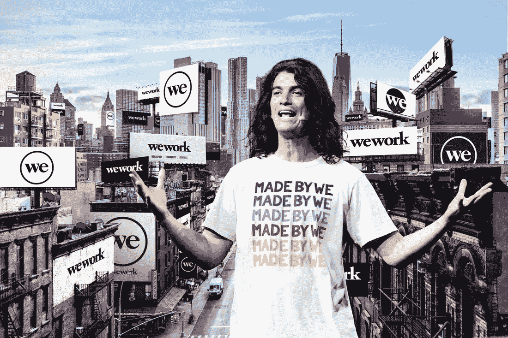

# [第 3 部分，共 4 部分]这是我们都可以从亚当·诺依曼那里学到的强大技能。

> 原文：<https://medium.com/coinmonks/part-3-of-4-a-powerful-skill-we-can-all-learn-from-adam-neumann-96867838b7ab?source=collection_archive---------29----------------------->

Adam’s new superpower, besides his charm, is his ability to contextualise his responses and articulate himself clearly and calmly, like a boss.

我们看到的从 WeWork 的大屠杀中走出来的亚当·诺伊曼是完全不同的。

除了迷人和沉稳之外，他的回答也很聪明，能够将直接向他提出的非常困难的问题联系起来。

根据亚当的解释，大部分事情，如果不是全部，都被断章取义了。

媒体在传播半真半假的事实和歪曲事实方面扮演了魔鬼般的角色。

亚当确实可怕地荡到了危险和疯狂的悬崖边，但他最终还是控制住了线，没有掉下去。

他一次也没有发脾气或情绪激动地回答。

这绝对是公关、肢体语言方面的大师级课程，对棘手的问题给出甜美、合理的答案。

每个人都应该知道，这就是被“媒体训练”的感觉。

但老实说，他事先被告知问题，他像接受审判一样准备好了，他接受了回答问题的训练。

亚当沉着、冷静、沉着，回答问题时几乎是循规蹈矩的。

这就像奇异博士在地球上施了一个全球性的咒语。

我听到的都是“我明白……”和“我犯了很多错误”，然后是一些语境化的回答。

就是这样。

把你的回答放在上下文中。

问题越难，越尖锐，你就越应该把它放在上下文中。

通过将你的回答联系起来，你创造了一个想象的边界，无论你的回答是什么，都是最有意义的。

Go watch the interview if you haven’t already.

观看他对安德鲁·索尔金[https://youtu.be/Dgp-CM-gQik](https://youtu.be/Dgp-CM-gQik)的采访

语境化。

律师和政治家一直都在用这个。

人们将开始从你的角度来看，在你刚刚构建的界限内，很难反驳你。

“当时似乎是合理的…”

“以我现在所知，我当然不会那样做……”

“深入细节很重要……”

我对一件事感到惊讶，安德鲁确实问了非常非常难的问题，亚当也确实公开承认了明显的错误。

他一点都没有隐瞒，也没有刷掉。

他在直接回答之前先联系了上下文。

给你。

那是一个创业公司 CEO 的终极水平。

即使你搞砸了，也要承认。

大胆一点，冒险一点，搞砸一点，拥有它，人们(尤其是投资者)会更爱你。

即使在职业生涯结束后失宠，我们仍然可以从亚当身上学到一些东西，这难道不令人惊讶吗？

永远不会结束。

永远不要放弃。

-

你认为亚当·诺依曼做错了什么吗？

-

# startups # business # startupx # growth # success # social media # culture # entrepreneur # strategy # adamneumann # adamwework # we work # we worksage # we workstory # masa yoshison # unicorn # deca corn #软银