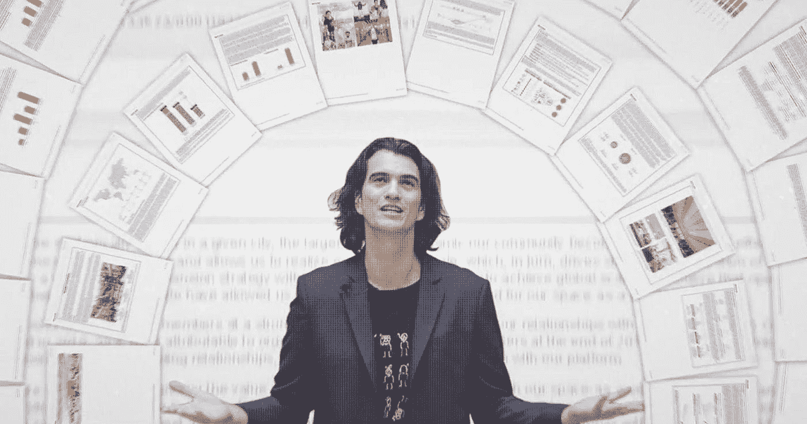

# 那么我们能从亚当·诺依曼身上学到什么呢？

> 原文：<https://medium.com/coinmonks/part-4-of-4-so-what-can-we-learn-from-adam-neumann-bb70b83b4421?source=collection_archive---------21----------------------->

The king of charisma

WeWork 的传奇 CEO 亚当·诺伊曼(Adam Neumann)是一个相当有个性的人，他因疯狂的滑稽动作而臭名昭著，并让一个 470 亿美元的帝国屈服。

他迷人而自信，沉着而聪明。

难怪投资者迫不及待地将资金投向他。

实际上，他让我相信，对于像他这样雄心勃勃的首席执行官来说，私人飞机是必不可少的。

明确一点，他既不是骗子也不是罪犯。

他没有欺骗任何人，也没有做任何违法的事情。

他不是塞拉诺斯的伊丽莎白·霍姆斯或乔丹·贝尔福特。

他所做的一切都是合法的(也许是边缘的)，他有一支训练有素的专业团队在指导他。

在所有的麻烦、混乱和悲伤中，我们能学到什么吗？

将你的回答放在上下文中会让你比任何提出尖锐问题的人都有优势。

不管情况如何，保持冷静和沉着是一种超能力。

即使在风暴燃烧的时候，保持沉默，不与媒体交谈，可能是痛苦的首席执行官所能做的最聪明的事情。

我最大的爱好之一是阅读 YouTube 视频中的评论。

在所有评论中，我最喜欢的一句话是:

“绝对的天才。他发现了如何从一家从未盈利过的公司赚到 10 亿美元。”

“老兄，我 100000%相信，私人飞机对于 wework 的成功是必不可少的，就像水对于人类生活一样。哇哦。厉害了。”

"这是心理操纵的大师课."

我怎么想？

我很确定很多事情都被断章取义了，这就是媒体的本质和业务。

他们制造炒作，新闻越令人兴奋，他们卖得越好。

我想指出的是，当亚当在 WeWork 估值 470 亿美元的巅峰时期展翅高飞时，支持他的那些新闻和科技记者，很可能就是在看到他失宠后抓住机会的那些人。

下雨时，倾盆大雨。

但这并不意味着一个著名的首席执行官可以滥用和藐视规则。

他犯错了吗？

毫无疑问。

他向他们学习了吗？

我也这么认为

Adam even has a TV series played by Jared Leto and Anne Hathaway.

他听起来确实更加成熟和严肃。

他承认难以置信的估价冲昏了他的头脑。

他承认对所有遭受痛苦却一无所有的员工感到非常抱歉。

他确实承认自己很傲慢，在时间安排上有问题(迟到)。

他承认之前遇到蒂姆·库克时话太多，并为此后悔。

我祝他一切顺利。

由于他在 WeWork 的传奇经历，来自世界各地的企业家将有机会学习和研究这个史诗般的传奇。

现在他带着新的 web3 x 可持续发展创业公司回来了！

-

你喜欢亚当·诺依曼吗？

-

# startups # business # startupx # growth # success # social media # culture # entrepreneur # strategy # adamneumann # adamwework # we work # we worksage # we workstory # masa yoshison # unicorn # deca corn #软银

> 加入 Coinmonks [电报频道](https://t.me/coincodecap)和 [Youtube 频道](https://www.youtube.com/c/coinmonks/videos)了解加密交易和投资

# 另外，阅读

*   [币安 vs FTX](https://coincodecap.com/binance-vs-ftx) | [最佳(SOL)索拉纳钱包](https://coincodecap.com/solana-wallets)
*   [比诺莫评论](https://coincodecap.com/binomo-review) | [斯多葛派 vs 3Commas vs TradeSanta](https://coincodecap.com/stoic-vs-3commas-vs-tradesanta)
*   [Capital.com 评论](https://coincodecap.com/capital-com-review) | [香港的加密借贷平台](https://coincodecap.com/crypto-lending-hong-kong)
*   [如何在 Uniswap 上交换加密？](https://coincodecap.com/swap-crypto-on-uniswap) | [A-Ads 审查](https://coincodecap.com/a-ads-review)
*   [WazirX vs coin dcx vs bit bns](/coinmonks/wazirx-vs-coindcx-vs-bitbns-149f4f19a2f1)|[block fi vs coin loan vs Nexo](/coinmonks/blockfi-vs-coinloan-vs-nexo-cb624635230d)
*   [本地比特币评论](/coinmonks/localbitcoins-review-6cc001c6ed56) | [加密货币储蓄账户](https://coincodecap.com/cryptocurrency-savings-accounts)
*   什么是融资融券交易