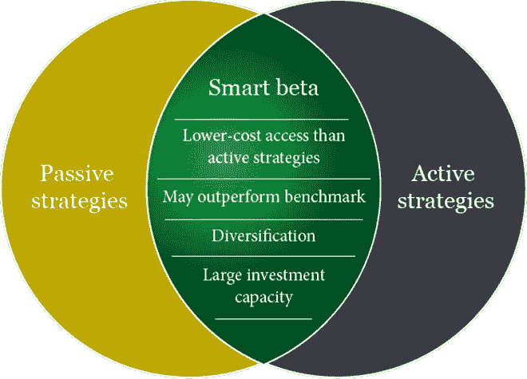
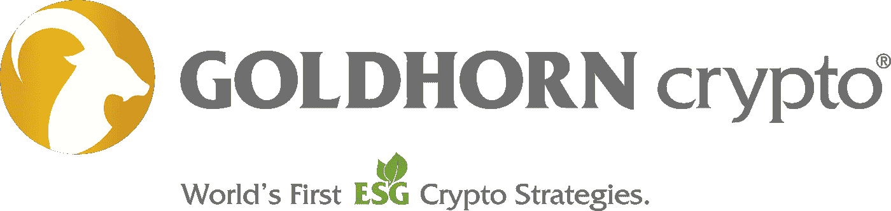

# 被动曝光加密解决方案的部分分配

> 原文：<https://medium.com/coinmonks/partial-allocation-to-passive-exposure-crypto-solution-e05a8f6b54f7?source=collection_archive---------71----------------------->

**将你的一部分加密资产**分配给**的被动加密解决方案**和**的 GoldHorn Crypto Top25** 策略**会给你带来更高的长期收益**和**更低的交易成本**，这体现在**低跟踪误差(基准)**。

虽然在**发展新的资产类别**的时期进行主动交易在短期和中期更有利可图，但是**被动解决方案在长期表现更好**。

使用相同的加密暴露但不同的易失性级别:

GoldHorn Crypto Top25 策略:

-风险:**按市值排名的前 25 种加密货币**

——波动:****[**均衡**](https://www.iconomi.com/asset/GH25B) & [**保守**](https://www.iconomi.com/asset/GH25C)****

****-类型:**被动式******

****-覆盖率:**90.00%以上的加密市值******

****-结构:**等权重******

****-重新平衡:**双月******

****结构“前 25 名”调整:**季刊******

*****Marko Pavlovic，GoldHorn Crypto 管理委员会成员*****

*   ******金角加密**推特****
*   ******金角加密**LinkedIn****
*   ******金角加密**介质****
*   ******金角加密**是[区块链联盟欧洲](https://blockchainalliance.si/)的成员****
*   ******GoldHorn Crypto** 是斯洛文尼亚[比特币协会](https://bitcoin.si/)的成员****
*   ******金角密码** [www](https://www.goldhorn-crypto.com/strategies/overview)****
*   ******金角加密**电子邮件【support@goldhorn-crypto.com 电子邮件****

********

> *****加入 Coinmonks* [*电报频道*](https://t.me/coincodecap) *和* [*Youtube 频道*](https://www.youtube.com/c/coinmonks/videos) *了解加密交易和投资*****

# ****另外，阅读****

*   ****[3 商业评论](/coinmonks/3commas-review-an-excellent-crypto-trading-bot-2020-1313a58bec92) | [Pionex 评论](https://coincodecap.com/pionex-review-exchange-with-crypto-trading-bot) | [Coinrule 评论](/coinmonks/coinrule-review-2021-a-beginner-friendly-crypto-trading-bot-daf0504848ba)****
*   ****[莱杰 vs n rave](/coinmonks/ledger-vs-ngrave-zero-7e40f0c1d694)|[莱杰 nano s vs x](/coinmonks/ledger-nano-s-vs-x-battery-hardware-price-storage-59a6663fe3b0) | [币安评论](/coinmonks/binance-review-ee10d3bf3b6e)****
*   ****[Bybit Exchange 审查](/coinmonks/bybit-exchange-review-dbd570019b71) | [Bityard 审查](https://coincodecap.com/bityard-reivew) | [Jet-Bot 审查](https://coincodecap.com/jet-bot-review)****
*   ****[3 commas vs crypto hopper](/coinmonks/3commas-vs-pionex-vs-cryptohopper-best-crypto-bot-6a98d2baa203)|[赚取加密利息](/coinmonks/earn-crypto-interest-b10b810fdda3)****
*   ****最好的比特币[硬件钱包](/coinmonks/hardware-wallets-dfa1211730c6) | [BitBox02 回顾](/coinmonks/bitbox02-review-your-swiss-bitcoin-hardware-wallet-c36c88fff29)****