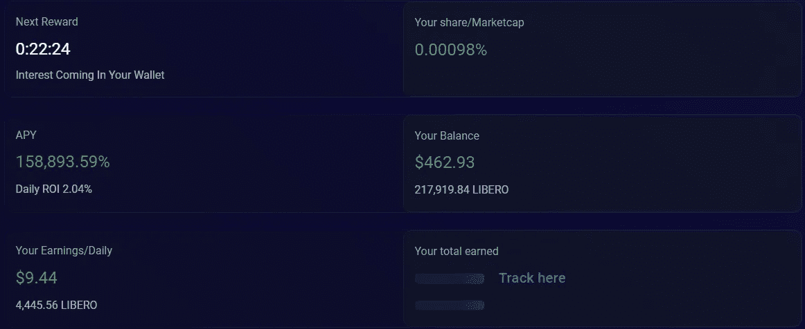
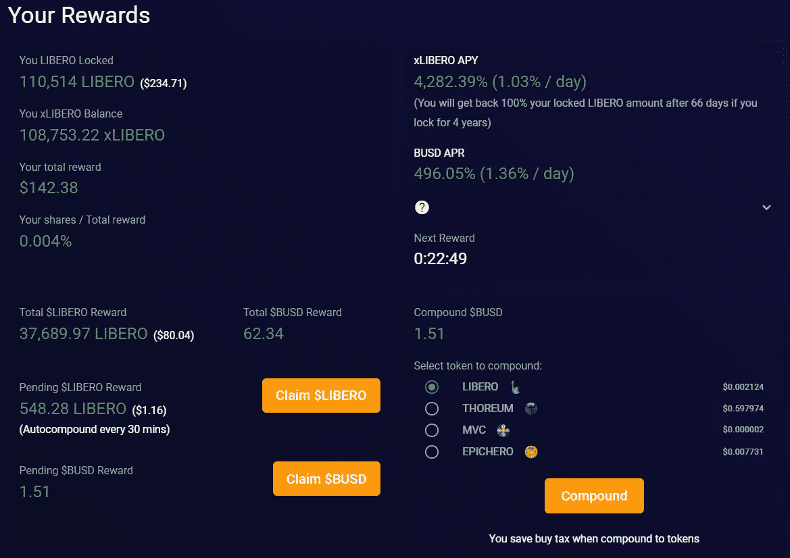
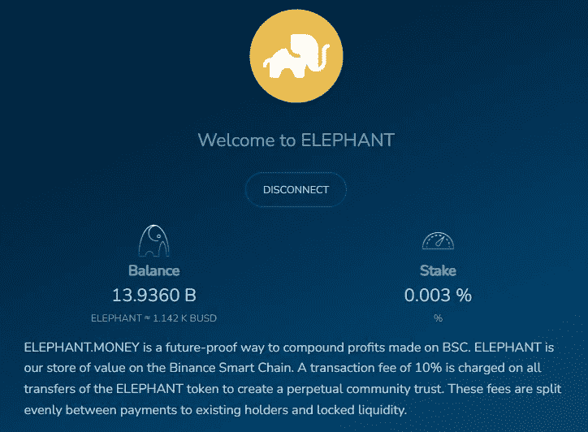
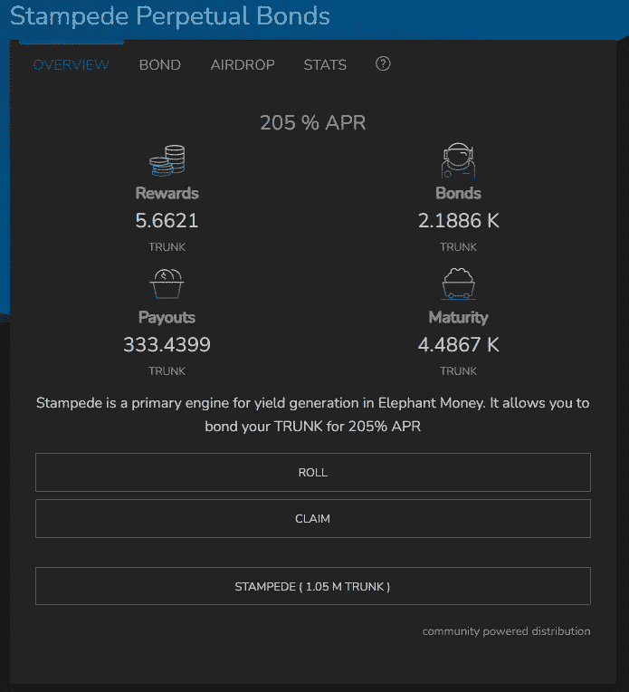
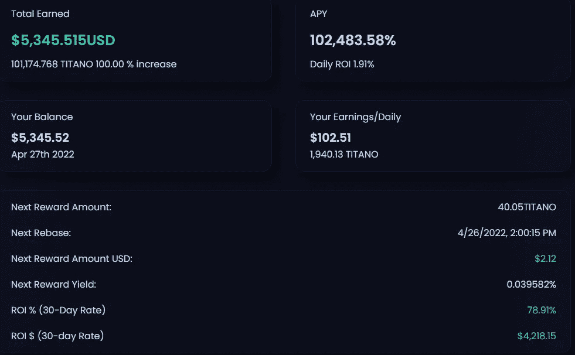
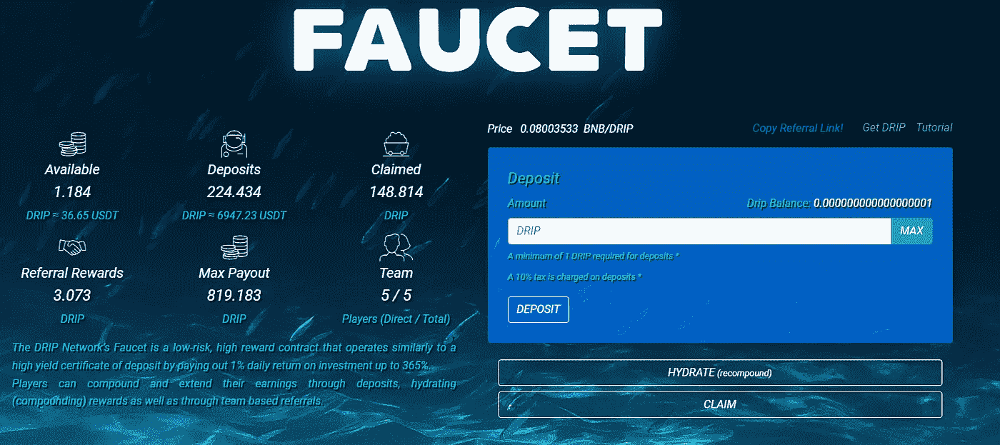
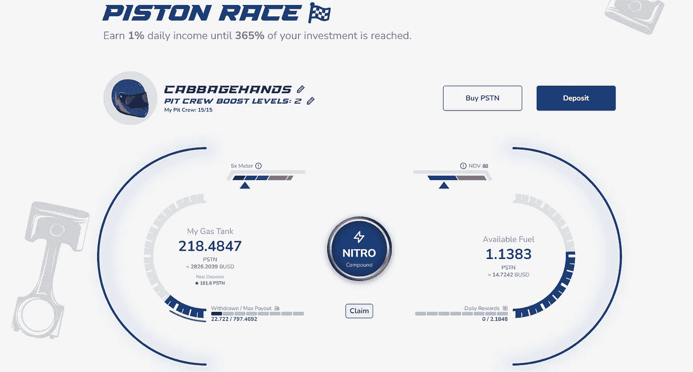

# 被动收入模拟草案 DeFi 版。看看我把谁列为我最喜欢的分散式金融项目的第一名。

> 原文：<https://medium.com/coinmonks/passive-income-mock-draft-defi-edition-e4fe434fb5b8?source=collection_archive---------8----------------------->

让我先说一件事——我是你见过的最大的 NFL 选秀书呆子之一。25 年来，我从未错过一次选秀，其中包括数月的炒作、采访、谣言和在线旅行社。

从周四晚上开始到周末，将会有数百个名字被职业组织邀请开始他们的职业足球之旅。改变他们所有人的生活，希望所有球迷都能实现超级碗的愿望。

正如你们中的一些人可能知道的，在正式选秀之前有几个月的“模拟选秀”,试图预测球员将在哪里登陆。球迷在休赛期买入并保持参与很好，而老板/总经理制造烟幕让没有人“选秀”也很好。数以吨计的心理游戏被玩了几个月，让你的专营权的未来在三天内建成。

# **如果我们对 DeFi 采用这种方法，并起草我们当前的五大项目，会怎么样？**

这正是我要做的。在我投资的所有 DeFi 项目中——我将告诉你我的前 5 名中有谁。一段时间以来，我一直想更新我的关注者，所以作为奖励，我将向你展示我迄今为止取得的进展。

# **# 5——自由金融**

排在第五位的是自由金融公司。类似于 Titano Finance 的自动下注协议，不仅奖励 rebases，还通过 Libero 银行打开了$BUSD 被动收入的大门。如果你还没有，你可以在我的前两篇文章中读到关于这个协议的更深入的评论，这两篇文章分别是[这里](/p/90222b9ca877)和[这里](/p/1ea9741c1e11)。

以下是 Libero 迄今为止取得的进展:

正如你所看到的，对我来说最突出的是稳定的 BUSD 币被动收入，它是通过自由银行每天交易量的 7%发放的。无论$Libero 的价格如何波动，我总能通过银行依赖我的奖励。

# # 4——大象的钱

如果你在一个月前问我(或 DeFi 的任何人)大象的钱，这很容易成为共识#1 的选择。伟大的象征经济学，伟大的团队，几乎没有人能在大象金钱的可持续性中找到漏洞。直到——一个漏洞被发现，储备金通过快速贷款被耗尽。点击此处，通过媒体文章[找到协议的更新。](/elephant-money/reserve-exploit-52fd36ccc7e8)

以下是我对大象金钱的看法:

我在 DeFi 整体上的较大投资之一——我能够在漏洞利用后实现 DCA(美元平均成本),并将我在 Elephant 的头寸翻倍。我的债券通过踩踏事件保持稳定，当我继续每天“滚动”(复合)时，我每天大约赚 12 个树干。如果你还没有，你可以通过我在大肆宣传之前写的一篇文章了解更多关于大象金钱的信息。

# #3 — Titano 金融公司

启动这一切的自动赌注协议。提塔诺仍然拥有我的心，因为我能够在非常看好他们的团队后很早就加入到协议中。这是我今年迄今为止最赚钱的项目，提取了几千英镑来帮助巩固在其他项目中的头寸，并将一些转换成法定货币。从现在开始提塔诺就是我们的房子了！

下面看看我的现状:

Titano 刚刚发布了他们的新平台 Swych，该平台允许投资者使用 Swych 作为交易所，直接兑换 Titano token。更不用说游戏回归和新的 Titano 彩票了。点击查看他们的白皮书[中即将推出的功能。](https://docs.titano.finance/)

# #2 —滴水龙头

“good ol’reliable”在第一次整体评选中有争议，但最近的价格波动、动物农场、存钱罐和一次又一次的延迟问题使该协议降至第二位。几个月来，我们一直得到效用承诺，但没有任何结果，但在 DeFi 方面，滴滴比其他任何公司都更具可持续性。4 月 22 日，滴滴迎来了一周年纪念日，并继续停留在 30-40 美元的价格区间。

以下是我在四个月的治疗后的情况:

投资回报率是在 ATH 阶段实现的——希望 Forex Shark 在达到最大支出后，当鲸鱼开始退出项目时，价格上涨。就像我之前说的——很好，很可靠。

# #1 —活塞令牌

第一次整体选秀权，挑战逻辑选择——活塞令牌！！

日常 ROI 协议 Piston Token 出现的时间不长，但现在还有什么不喜欢的呢？比滴滴更有吸引力的价格，通过将价格与 BUSD 而不是 BNB 联系起来而获得更好的象征经济学，能够在七天内退出协议，复利税更少，更好的转诊系统，并且不需要投资 BR34P 来获得激励。我是否提到了一个与他们的社区密切合作的专业开发团队？

对我来说，现在最简单的选择是 Piston Token——以下是我目前的结果:

由于诱人的激励，我非常专注于通过 Piston 建立一个团队。如果你想了解更多关于“维修站工作人员”以及为什么你需要开始建立一个团队[这里](/p/b739b831c4a2)，请查看我最近关于 Piston 的文章。

为什么我如此专注于建立一个团队？去做滴滴早期投资人做的事情——和我的团队分享回报。是的，没错，如果你读过白皮书，你就会确切地知道我所说的循环制是什么。我希望我们所有人都能在 Piston 取得成功，并带着你们一起“兜风”。加入我的团队，从 5/8/22 开始赢取每周免费空投！

从 2012 年 5 月 8 日开始，我将根据我们累积的奖励金额每周向我的团队空投一次。不要错过这个以 12 美元的价格进入滴滴克隆的机会！

前往:
[活塞令牌网站](https://piston-token.com/race)

在你的账户里准备好$BUSD 来兑换。去网站顶部的“交换”,确定你想买多少活塞。

点击“比赛”选项卡，并存放您的活塞。

当要求加入一个团队时，输入:
0x cf 95 a 7 D2 b 19746 b 3782d 36 ef 5d 32433 b8e 3232 a 8

使用整数表示 PSTN 的数量，以避免存款时出现 gas 错误。

开始享受每周免费空投！！

你也可以在这里加入我的不和谐服务器[。](https://discord.gg/BgGCYRz8)

前往#piston-token 频道聊天或直接向我寻求帮助！

期待在那里见到你。

> 加入 Coinmonks [电报频道](https://t.me/coincodecap)和 [Youtube 频道](https://www.youtube.com/c/coinmonks/videos)了解加密交易和投资

# 另外，阅读

*   [OKEx vs KuCoin](https://coincodecap.com/okex-kucoin) | [摄氏替代品](https://coincodecap.com/celsius-alternatives) | [如何购买 VeChain](https://coincodecap.com/buy-vechain)
*   [ProfitFarmers 点评](https://coincodecap.com/profitfarmers-review) | [如何使用 Cornix Trading Bot](https://coincodecap.com/cornix-trading-bot)
*   [如何匿名购买比特币](https://coincodecap.com/buy-bitcoin-anonymously) | [比特币现金钱包](https://coincodecap.com/bitcoin-cash-wallets)
*   [瓦济里克斯 NFT 评论](https://coincodecap.com/wazirx-nft-review)|[Bitsgap vs Pionex](https://coincodecap.com/bitsgap-vs-pionex)|[Tangem 评论](https://coincodecap.com/tangem-wallet-review)
*   [如何使用 Solidity 在以太坊上创建 DApp？](https://coincodecap.com/create-a-dapp-on-ethereum-using-solidity)