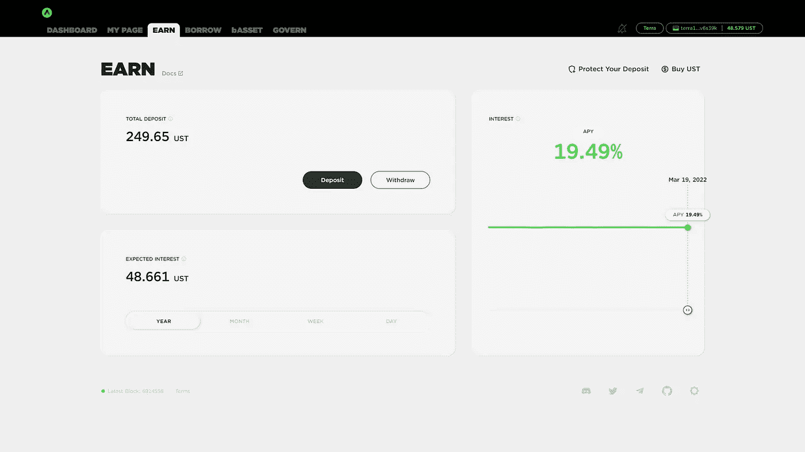

# 锚协议 3 个月的被动收入

> 原文：<https://medium.com/coinmonks/passive-income-with-anchor-protocol-for-3-months-28bc7097bfc3?source=collection_archive---------2----------------------->

3 个月前，我决定投资一小笔钱到一个叫做 Anchor Protocol 的 defi 项目。这个项目在密码市场的疯狂波动中越来越受欢迎，因为它标榜自己是一个节省协议。

坐拥 Terra 网络，Anchor 协议稳步增长，其总锁定价值从 2021 年 3 月的 7000 万美元增长到撰写本文时 TVL 的 100 多亿美元。

在我抛锚的前 6 个星期，我的 233 美元储蓄增加到 238 美元。这大约是 2%的增长，尽管是一个很小的数量，但这是非常令人印象深刻的。目前我最好的高收益储蓄账户是联合银行，它的 APY 只有 0.5%。

从我开始使用 Anchor Protocol 到现在已经 3 个月了，一路上发生了一些变化。在这篇文章中，我与你分享我在 Anchor 三个月的成果，关于这个项目和 Terra 的一些新闻，以及我对 Anchor 前进的计划。

# Terra 网络更新

Terra 生态系统正在成为加密领域的宠儿，尤其是在锚协议中使用了 TerraUSD (UST) stablecoin。虽然这种增长和广泛采用是好事，但它也暴露了一些问题。该领域最近的波动促使该网络考虑用比特币储备支持其稳定的硬币。

今年早些时候，UST 遇到了一些麻烦，并因为与仙境 DeFi 项目的密切联系而与 peg 决裂。当其领导人之一是一个众所周知的密码骗子的消息传出后，用户的大量涌入足以将 UST 和另一种稳定的货币“神奇互联网货币”( Magic Internet Money，简称 MIM)从 1 美元的位置上击垮。

由于开发者不希望这种情况再次发生，他们决定通过将比特币加入他们的储备来增加 UST 的价值。尽管 UST 应该与美元挂钩，但这种稳定的货币并非如此。它的 1 美元价值与 LUNA 的价值密切相关。这两个密码具有弹性总供给，它们彼此[连接](https://docs.terra.money/docs/learn/protocol.html)。

如果 UST 跌破 1 美元，UST 持有者可以燃烧他们的代币换取月神奖励。当价格超过 1 美元时，月神持有者可以焚烧月神来铸造新 UST。

随着仙境问题，它证明了目前的进程无法抵挡这样的事件。与 UST 脱钩导致了卢娜的价值迅速缩水。

2 月下旬，Terra 团队筹集了 10 亿美元来帮助生态系统，给 UST 带来稳定。截至今天，Terra 计划在 BTC 购买 100 亿美元作为 UST 储备。根据 Terra 的创始人 Do Kwon 的说法，选择 BTC 而不是美元作为储备是因为 OG 令牌对人们来说更有吸引力，也更容易使用。

# 锚协议更新

**动态赚取率建议**

第一个更新是关于主播赚取率。三月初提交了一份名为“动态收益率”的提案。该提案建议，随着协议越来越受欢迎，半动态收益率应该反映平台的成功。

例如，如果产量储备在增长，收益率可能会增加；如果收益率储备下降，利率可能会下降。收益储备的变化率取自一个月的时间段。为了使收入率更加稳定，还将实施每期 1.5%的收入率限制。

公式:

> *(%收益率变化)= min( abs(1.5%，((年%变化)-3%)))*

然后，在当前目标存款利率的基础上加上或减去收益率的变化。

> *新收益率=活期存款利率+/- %收益率变动*

该提案于 3 月 23 日截止，所以如果你愿意，可以在 Anchor Protocol 网站上投票。一旦提案通过，我将更新我的博客来反映这些变化。

**雪崩和锚协议**

Anchor 的另一个重大更新不是发生在项目内部，而是与一个非常大的区块链合作。Avalanche network 在 1 月下旬宣布，他们将引入 TerraUSD (UST)作为其网络的主要稳定中心。

通过 Avalanche Rush 计划，他们试图激励 Avalanche 上的 dapp 开发者使用 UST 而不是其他 stablecoins。Avalanche 上的本地 DEX 穿山甲宣布参与 Avalanche Rush 计划，并表示此举是其承诺的一部分，以支持推动创新边界的分散稳定中心。

> [#穿山甲](https://twitter.com/hashtag/PangolinDEX?src=hash&ref_src=twsrc%5Etfw)加入[#雪崩](https://twitter.com/hashtag/Avalanche?src=hash&ref_src=twsrc%5Etfw)拉什带来 [$UST](https://twitter.com/search?q=%24UST&src=ctag&ref_src=twsrc%5Etfw) 到 [#AVAX](https://twitter.com/hashtag/AVAX?src=hash&ref_src=twsrc%5Etfw) 是任何区块链中最丰富和最广泛使用的算法稳定币！今天晚些时候，我们的新农场将提供巨额奖励，作为我们的第二轮超级农场。
> 
> 更多阅读:[https://t.co/RQEIIlLNpd](https://t.co/RQEIIlLNpd)
> 
> —穿山甲🔺(@穿山甲指数)[2022 年 1 月 27 日](https://twitter.com/pangolindex/status/1486747709461737472?ref_src=twsrc%5Etfw)

正因为如此，Avalanche 用户现在可以将他们的 UST 押在 Anchor 协议上，而不必将他们的资金从链上取走。这标志着 Avalanche 成为第一家通过 Anchor 提供低波动性、高百分比收益的非 Terra 链。

# 我在 Anchor 协议中 3 个月的结果

你可以明白为什么我从一开始就坚持这个项目。Anchor 的潜力如此巨大，很难不看到它在未来取得更大的飞跃。更多的伙伴关系正在建立，更多的 dapps 正在 Terra 网络上开发，在接下来的几个月或几年里，会有更多的实用程序向我们走来。

11 月 16 日，我以 233 美元的投资——不，是储蓄——创办了 Anchor。在我的前 6 周，我收到了 5 美元的利息收入，或 2%的回报率。

3 月 19 日，我查看了使用 Anchor Protocol 三个月的结果，节省的 233 美元增加到了 249.65 美元。这比三个月前增长了大约 7.15%。以我的积蓄，估计我一天能挣 13 美分，一年能挣 48.66 美元。

As of March 19th, 2022\. Expected yearly earnings of $48.

# 我对锚协议的计划

我只能说这个项目是积极的，因为它为我提供了源源不断的利息收入。截至目前没有遇到新的问题，所以打算长期留在 Anchor。

随着 Terra network 及其一系列新项目的发展，我有理由长期坚持使用 Anchor。我在考虑从每月 50 美元开始，或者取决于我的预算允许我做什么。这样，我可以在协议中增加我的储蓄，同时也可以利用 Terra 和 Anchor 的增长。

按照我的工作方式，我开始将更多的资产转移到加密领域。我还没有胆量移动所有东西，不像你看到的其他加密 youtubers，但这是我今年计划采取的行动。我宁愿慢慢来，试探这个平台，看看它是否会让我更加被动地获得收入。

归根结底，这就是我们的目标——在加密领域赚钱和积累财富，这样我就可以用这些钱在未来创造更多的被动收入。

> 加入 Coinmonks [电报频道](https://t.me/coincodecap)和 [Youtube 频道](https://www.youtube.com/c/coinmonks/videos)了解加密交易和投资

# 另外，阅读

*   [霍比评论](https://coincodecap.com/huobi-review) | [OKEx 保证金交易](https://coincodecap.com/okex-margin-trading) | [期货交易](https://coincodecap.com/futures-trading)
*   [电网交易机器人](https://coincodecap.com/grid-trading) | [Cryptohopper 审核](/coinmonks/cryptohopper-review-a388ff5bae88) | [Bexplus 审核](https://coincodecap.com/bexplus-review)
*   [7 个最佳零费用加密交易平台](https://coincodecap.com/zero-fee-crypto-exchanges)
*   [氹欞侊贸易评论](https://coincodecap.com/anny-trade-review) | [霍比融资融券交易](/coinmonks/huobi-margin-trading-b3b06cdc1519)
*   [分散交易所](https://coincodecap.com/what-are-decentralized-exchanges) | [比特 FIP](https://coincodecap.com/bitbns-fip) | [Pionex 审查](https://coincodecap.com/pionex-review-exchange-with-crypto-trading-bot)