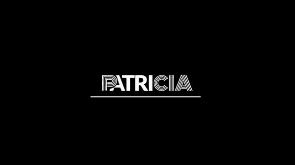

# 帕特丽夏 vs 非洲飞镖

> 原文：<https://medium.com/coinmonks/patricia-vs-dart-africa-a24b492978a?source=collection_archive---------41----------------------->

通过交易平台，在非洲出售加密货币变得很容易。即使商业银行被禁止使用加密钱包或投资平台进行交易，你也可以用你的本地货币出售你的加密货币。然而，这并没有阻止加密货币在非洲千禧一代中的流行，特别是在尼日利亚。

**尼日利亚采用加密货币**

根据 Statista 的数据，尼日利亚的比特币使用量在世界上排名第三，仅次于美国和俄罗斯，仅在 2020 年就交易了超过 4 亿美元的比特币，32%的尼日利亚人是加密货币的用户，是世界上最高的。尽管政府颁布了禁令。加密货币已经获得了足够的赞誉，有资格用于支付或接收支付，并作为对冲通胀的投资工具。这导致各种经济分析师建议尼日利亚央行应该像一些发达国家一样监管加密货币市场，而不是禁止该行业。

然而，我们在这里不是要辩论尼日利亚中央银行是否应该取消加密禁令，而是要指出在尼日利亚和加纳运营的两个加密交换平台 Dart Africa 和 Patricia 之间的一些相似之处和不同之处。如果你想出售你的加密货币，在加密货币交易所开户是一个很好的开始。

## **帕特丽夏**

Patricia

Patricia 利用加密货币的力量为金融基础设施、数字支付和全球电子商务创造了替代解决方案。该平台允许您安全地购买或出售任何价值的比特币和礼品卡，将它们存储在加密或本地货币钱包中，并在两个钱包之间轻松切换，以支付日常公用事业账单，如通话时间、数据和有线电视订阅。Patricia 在 play store 上的下载量超过 100，000 次。

**特色**

*   你可以在 Patricia 上设置一个比特币钱包，就像任何流行的加密钱包一样，直接将资金存入钱包。
*   多资产支持；
*   菲亚特和比特币钱包都有
*   购买/销售礼品卡
*   用礼品卡和密码支付水电费
*   快速交易时间
*   在尼日利亚中央银行颁布禁令之前，虚拟和实体借记卡曾经是可用的，现在这项功能被搁置了。

## **达特非洲**

Dart Africa

[Dart Africa](http://dartafrica.io) 是一个值得信赖的交易平台，其特点是惊人的汇率和快速的支付时间。Dart Africa 专注于客户的便利性和超快的支付时间，在加密兑换市场中从其他加密货币买家中脱颖而出。

Dart Africa 通过其全自动销售平台提供了最快的支付系统，这使得在该平台上销售变得非常容易。对客户的付款在几分钟内处理完毕，一旦加密货币交易被确认，相应的 Cedis 或 Naira 金额将在几分钟内发送到您的帐户，具体取决于您在尼日利亚或加纳的位置。Dart Africa 已被证明是一个快速可靠的加密交换平台。

Dart Africa 始终提供外汇市场上最优惠的汇率。当您与 Dart Africa 交易时，您只能以市场上最优惠的价格出售您的比特币。您可以随时使用 [Dart Africa 的汇率计算器](https://dartafrica.io/coincalculator)查看不同加密货币的汇率。

**在 Dart Africa 交易的加密货币**

*   比特币
*   以太坊
*   道奇硬币
*   莱特币
*   美元硬币
*   USDT 系绳

[Dart Africa 的](http://dartafrica.io)全天候卓越客户服务的特点是对您在使用该平台时可能遇到的任何问题做出快速、友好的响应。客户服务是全方位的，在你需要的任何时候都可以得到。

## **如何在 Dart Africa 上销售加密货币**

*   [使用您的凭据登录](https://dartafrica.io/login)您的帐户，如果您没有帐户，请创建一个帐户。
*   单击工具栏图标(左上角的三条垂直直线)。您将在您的帐户面板上看到此信息。
*   点击出售硬币。
*   在硬币栏中选择要出售的加密货币。
*   输入您要出售的加密硬币的数量，相应的美元和奈拉金额将显示在列中。注意:你可以出售的 BTC 或任何加密货币的最低美元价格是 20 美元。
*   点击立即出售硬币。
*   将提供一个钱包地址和一个 QR 码。您可以通过手动输入地址或扫描二维码来发送您在上述步骤中选择的加密金额。付款被确认后，你将立即被记入贷方。

> 加入 Coinmonks [电报频道](https://t.me/coincodecap)和 [Youtube 频道](https://www.youtube.com/c/coinmonks/videos)了解加密交易和投资

# 另外，阅读

*   [3 商业评论](/coinmonks/3commas-review-an-excellent-crypto-trading-bot-2020-1313a58bec92) | [Pionex 评论](https://coincodecap.com/pionex-review-exchange-with-crypto-trading-bot) | [Coinrule 评论](/coinmonks/coinrule-review-2021-a-beginner-friendly-crypto-trading-bot-daf0504848ba)
*   [莱杰 vs Ngrave](/coinmonks/ledger-vs-ngrave-zero-7e40f0c1d694) | [莱杰 nano s vs x](/coinmonks/ledger-nano-s-vs-x-battery-hardware-price-storage-59a6663fe3b0) | [币安评论](/coinmonks/binance-review-ee10d3bf3b6e)
*   [Bybit Exchange 评论](/coinmonks/bybit-exchange-review-dbd570019b71) | [Bityard 评论](https://coincodecap.com/bityard-reivew) | [Jet-Bot 评论](https://coincodecap.com/jet-bot-review)
*   [3 commas vs crypto hopper](/coinmonks/3commas-vs-pionex-vs-cryptohopper-best-crypto-bot-6a98d2baa203)|[赚取加密利息](/coinmonks/earn-crypto-interest-b10b810fdda3)
*   最好的比特币[硬件钱包](/coinmonks/hardware-wallets-dfa1211730c6) | [BitBox02 回顾](/coinmonks/bitbox02-review-your-swiss-bitcoin-hardware-wallet-c36c88fff29)