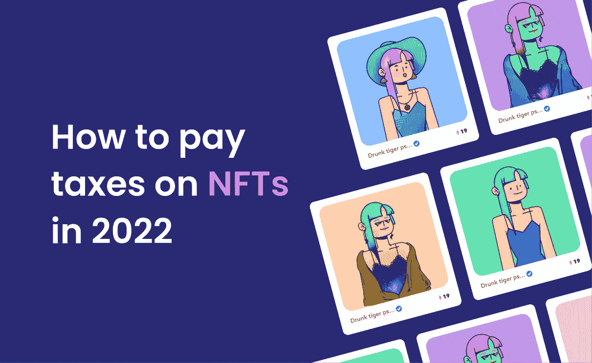

# 2022 年缴纳非税收入税

> 原文：<https://medium.com/coinmonks/paying-taxes-on-nfts-in-2022-b46989698460?source=collection_archive---------60----------------------->

在不断增长的加密世界中，投资者仍在纠结如何为不可替代代币(NFT)缴税。甚至国税局还在研究如何对这些数字艺术品的加密部分进行分类。它们是收藏品还是证券？非关税壁垒的税率是多少？

不要担心，Cointelli 为你提供了如何在 2022 年缴纳 NFT 税的分步指南。如果你去年从无聊的猿类身上挖到了金子——即使你遭受了损失——以下是你需要知道的关于支付非金融资产税的信息。

# 第一步:将您的加密投资组合跟踪器与您的数字钱包联系起来

缴纳 NFT 税的第一步是了解以下信息:

1.  为了购买或铸造你的 NFTs，你买了多少密码
2.  购买和/或铸造的成本是多少
3.  你从出售 NFT 中获得了多少收入(作为创作者或收藏者)
4.  你的资本收益或损失是多少

追踪这些信息的一种方法是自制电子表格。然而，Excel 和 Google Sheets 有其局限性，尤其是当你必须跟踪多个加密钱包，并且必须记录不断变化的加密市场中的交易时。价格无处不在，例如，当购买索拉纳区块链上制造的 NFT 时，将 ETH 换成 SOL 就足够复杂了。

通过把你的钱包和像 Cointelli 这样的软件[联系起来，你可以更容易地记录来来回回，并保持你已经净赚了多少的动态平衡。](https://cointelli.com/)

只需几个简单的步骤，您就可以连接您的钱包和交易所，或者只需上传您的交易的 CSV 文件。您可以上传的交易数量没有限制。Cointelli 软件会将您的交易历史与提取的数据进行比较，自动修复错误，并计算您一年的总亏损或盈利。你会在一份全面的税务报告中得到结果，你可以用它来完成你的 IRS 申报表。

关于安全性的一个快速提示:确保与同行和在线评论一起验证你的加密税务软件的算法有多安全。Cointelli 不会询问您的私钥，也不会将您的加密数据出售给第三方。这应该是你使用的任何加密税务软件的标准。

# 第二步:填写你的国税局申报表

使用加密税务组合软件可以使这一步变得更容易，该软件可以自动将您的报告发送给税务专家，或者与 TurboTax 或 TaxAct 等税务平台集成。Cointelli 的软件统一收费 49 美元，可以完成所有要求的 IRS 表格。

# 第三步:了解 NFT 税是如何运作的

虽然铸造非功能性金融工具不算纳税事件，但购买或销售非功能性金融工具有可能产生纳税时刻的连锁反应——甚至可能从您第一次购买 ETH 开始。

以下是你应该知道的关于 NFT 税收运作的一般联邦税收准则。

(*请注意，每个州都有额外的税务指南，此列表并不全面。始终咨询专门从事加密的税务专业人士，并了解最新的加密税务新闻，以了解加密税务的最新法规。密码是一个新生的领域，并且一直在变化。)*

1.  单独购买 crypto 是没有税收的，但是当你把它换成其他东西的时候，IRS 想知道这件事。
2.  无论你是否出售，购买 NFT 商品都是要纳税的。这是因为从技术上来说，购买 NFT 需要你购买并持有一段时间的密码，然后才能换成新的数字资产。
3.  单独铸造 NFT 是免税的。
4.  如果您创建了您正在销售的 NFT，您需要将销售所得作为应税收入进行申报。
5.  如果你是一个收藏家，出售 NFT 会导致资本收益或损失。
6.  [空投](https://cointelli.com/blog/crypto-airdrop-taxes)很可能按照你的普通税率(美元等值)征税，根据你的 NFT 的估计价值。
7.  当计算资本损失或收益时，你可以在你的成本基础上计算汽油费。

没有人加入 Web3 世界，因为他们喜欢整天处理数字——好吧，也许有些人会。使用加密税务投资组合跟踪器有助于简化流程，以便您可以回到自己热爱的生活和社区。

*免责声明:本帖仅供参考，不应被解释为或依赖于替代财务、法律或税务专业人士的建议。此外，本内容仅涉及美国公民和居民的美国联邦所得税后果，不涉及可能与受特殊规则约束的特定人员(如经销商或贸易商)相关的税务后果。您应该咨询您自己的财务、法律或税务专业人士，以报告和提交您的加密税或根据您的特定情况做出决定。法律、法规或现有法律的解释可能会发生变化，这可能会对未来或追溯产生不利影响。这篇文章的内容可能会有变化。*

> 加入 Coinmonks [电报频道](https://t.me/coincodecap)和 [Youtube 频道](https://www.youtube.com/c/coinmonks/videos)了解加密交易和投资

# 另外，阅读

 [## 5 款最佳加密税务软件

### 加密报税可能是一个漫长而艰巨的过程。此外，选择最好的加密税务软件可能…

medium.com](/coinmonks/crypto-tax-software-ed4b4810e338) 

*   如何使用 MetaMask Wallet 获得 KCC 地址？
*   [如何获得自己的。XYZ 领域？](https://coincodecap.com/xyz-domain)
*   [最佳密码交换平台](https://coincodecap.com/best-crypto-swap-platforms) | [最佳密码交易所](https://coincodecap.com/crypto-exchange)
*   [购买比特币印度](/coinmonks/buy-bitcoin-in-india-feb50ddfef94) | [Pionex 评论](/coinmonks/pionex-review-exchange-with-crypto-trading-bot-1e459d0191ea) | [加密交易机器人](/coinmonks/crypto-trading-bot-c2ffce8acb2a)
*   [n rave ZERO Review](/coinmonks/ngrave-zero-review-c465cf8307fc)|[phe MEX Review](/coinmonks/phemex-review-4cfba0b49e28)|[PrimeXBT Review](/coinmonks/primexbt-review-88e0815be858)