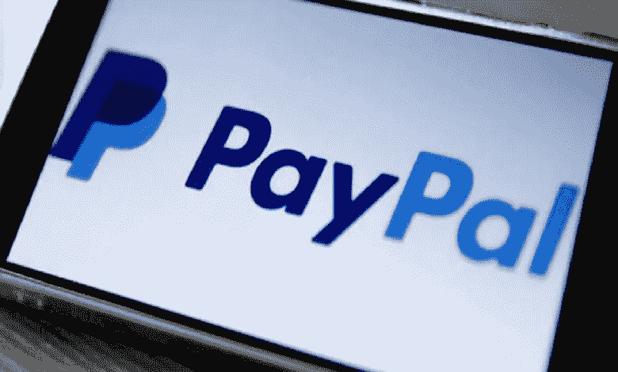

# PayPal 确认开发自己的 stablecoin？！

> 原文：<https://medium.com/coinmonks/paypal-confirms-development-of-its-own-stablecoin-e8f1b60ae74d?source=collection_archive---------16----------------------->

PayPal 已经证实了其创造自己的稳定币的意图。特别是，一名开发人员在这家美国巨头的 iPhone 应用程序代码中发现了美元支持的“ **PayPal 硬币**”的痕迹。

## 很快一枚贝宝币？

PayPal 证实了其推出自己的 stablecoin 的意图，该币将被称为“PayPal Coin”。这个的发展…