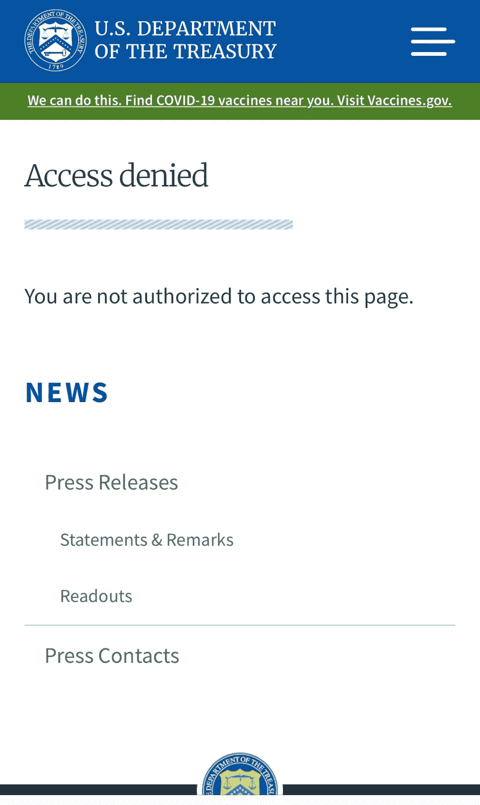
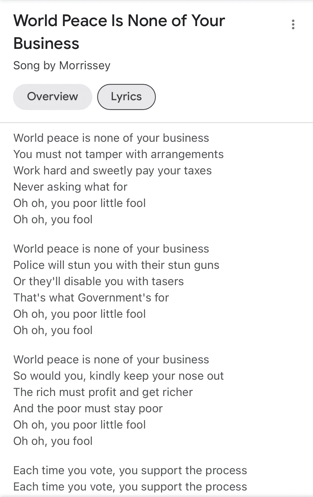

# 躲猫猫行政命令提振比特币

> 原文：<https://medium.com/coinmonks/peek-a-boo-executive-order-boosts-bitcoin-5b2560ed5f76?source=collection_archive---------55----------------------->

哇…那是什么？？

3 月 8 日发布的一份日期为 3 月 9 日的新闻稿泄露了政府的秘密。

看看财政部的页面，现在看起来是这样的:

该报告的一个关键观点是，美国政府将“支持涉及加密货币的负责任的创新”。交易员们瞄准了“支持”这个词，这个词为推出比特币提供了充足的燃料，再一次延续了比特币在过去一个月里的反复无常。截至目前，它仍然高于新闻“泄漏”的时间，在 42，500 美元左右。Altcoins 紧随比特币的反弹，紧随其后。

以太坊尤其受益于这一不合时宜的发布，因为它一直在下沉，刚刚超过 2200.00 美元的危险区域。现在，它已经轻松回到了 2，751.00 美元的水平

大多数替代硬币(如果不是全部的话)已经飙升，现在正在缓慢修正。Fantom(FTM)的表现逊于大盘反弹，投资者和交易员仍对安德烈·克罗吉(Andre Cronje)“离开 crypto”的消息感到震惊

元宇宙 cryptos 也继续表现不佳，但正在增加他们的支持水平较低的力量。

Terra Luna 接近历史高点 99.50 美元，Near Protocol 上涨 14%，至 11.27 美元

在拜登行政命令“泄露”之前，市场一直处于极度恐惧之中，似乎随时都会失去立足点，跌至投降水平。

很难弄清楚拜登政府对密码的计划。被前总统唐纳德·特朗普(Donald Trump)称为“风中奇缘”(Pocahontas)的参议员伊丽莎白·沃伦(Donald Trump)一直在与加密技术进行斗争，并对加密货币带来的威胁以及她认为加密货币对环境的“危害”直言不讳。众所周知，希拉里与银行业有着深厚的关系，她也对比特币和其他证明有效的区块链极其不满，因为它们对能源有着贪得无厌的胃口，将它们描绘成邪恶的光，就像吸血鬼一样寻找投资者的血液。

特朗普也质疑比特币的崛起，并担心它“与美元竞争”。特朗普还喜欢说“加密不会有好结果。”我们都知道，随着大选的临近，一旦加密游说团下注，特朗普肯定会转而支持比特币。

另一方面，由参议员特德·克鲁兹领导的共和党人大多支持加密，因为美国继续接受加密货币背后的技术很重要。德克萨斯州的目标是成为秘密采矿的中心，尽管在俄罗斯石油禁运后，该州的石油和天然气田重获生机。德州人现在可能对西德州中质油令人难以置信的飙升更加欣喜若狂，而不是比特币…

拜登政府反对加密的任何古怪举动都将被视为鲁莽，对美国在科技领域的主导地位具有破坏性。

民主党人现在意识到，如果他们的政党被贴上“杀死加密的政党”的标签，未来的选举后果可能会非常严重，因此最好不要过多干预这一新兴领域。

希望拜登政府意识到“加密”不再仅仅是；耗能的比特币，“高气费”，shitcoins 和骗局，但它也是；“信任”，捐赠的新铁路，被剥夺权利者的银行业务，web3.0，元宇宙，也许有一天会带来世界和平。

但正如莫里西喜欢说的，“世界和平与你无关。”

