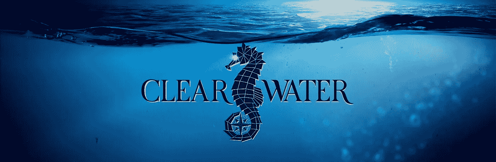

# 人们正在死去，而你们有些人却不在乎

> 原文：<https://medium.com/coinmonks/people-are-dying-and-some-of-you-dont-care-20451c0f5aa9?source=collection_archive---------49----------------------->

*观众谨慎建议*(但你可能真的想看下面的视频)

但你知道谁在乎吗？[清水](http://www.clearwaterclw.com) *。*

[Clear Water](http://www.clearwaterclw.com) 是一家三部门企业(和加密货币),专注于清洁饮用水和海洋清洁解决方案。你听说过污染和气候变化吗？是啊。那些家伙。他们是最好的朋友。他们存在。如果你问地球，他们是真正的混蛋。如果你问我，我会说他们是魔鬼。

有一次污染约我出去。我拒绝了，因为他是垃圾。在一个阳光明媚的周五下午，气候变化要求我下班后陪她走回家。我告诉他他对我来说太“性感”了。尽管拒绝了他们的请求，我还是每天都能见到他们。他们是缠着我的影子的跟踪者。他们跟随着我的每一个方向。

我感兴趣的那个人叫 Solution。他按照我喜欢的方式分他的头发，给我希望，治愈我因亲眼所见的悲剧而破碎的心。他也是一个很好的依偎伙伴。我很喜欢当小勺子。

旁注:我们永远无法“解决”气候变化，但我们肯定可以减缓它。我们永远也不可能完全消除世界上已经存在的塑料垃圾，但是我们可以停止给叠人塔添加积木。

**回到正题**

清水公司的目标是用更环保的铝替代品取代塑料瓶，让世界摆脱塑料瓶。但是等等…

Seahorse: The real king of the ocean

清水组织的慈善部门向世界上有需要的地区捐赠地下饮用水井。显然，世界上每天都有人因为无法获得干净的饮用水而死亡。*惊喜。*这其实是个东西。沿着这条线的某个地方，我们一定是回到了 17 世纪，忘记了我们是谁，忘记了我们是有爱心的人类，把我们的先进技术留在了 2022 年。可耻。谁*是*你？谁是*我们*？如果我们不听，我们会变成什么？

**数字**

*   脏水导致的疾病每年杀死的人比任何形式的暴力(包括战争)都多
*   43%的死亡是 5 岁以下的儿童
*   仅在非洲，女性每年就要花 400 多亿小时去取水

我从来没有喝不到干净的水。事实上，我现在有 4 种不同的方法可以在 10 秒钟内获得干净的饮用水。给我 30 秒，我有 6 种不同的方法。给近 10 亿人 30 秒的时间，他们将开始向最近的水源长途跋涉。这水可能很脏。对于这些人中的许多人来说，仅仅到达水源并回家就需要相当于一个美国人平均工作日的时间。许多地区的儿童无法上学，因为他们一天的全部时间都用来来回走动取水。水。*水。我个人代表人类感到尴尬，因为我们还没有解决这个问题。*

想象这是你的孩子…

或者你的侄女…

这是你年轻时的样子…

这是你和你妹妹。

想象一下在别人的光脚里。

如果你一生中什么也没做，至少看看下面的视频。我大概看了 15 遍，我的朋友们，这一点也不夸张。

但是公平的警告:这个视频给我的感觉和莎拉·麦克拉克兰 ASPCA 的广告一样。所以调暗灯光。把音量调大。按播放。*随时准备感受事物。也许不要在你试图打动的女孩面前看它…*

那么，我为什么要支持新兴的加密/商业混合体 [*清水*](http://www.clearwaterclw.com) 的努力呢？因为他们改变了人们的生活。因为他们实际上是在致力于改善大多数人不了解或选择忽视的完全陌生的人的生活体验。

> “我们不仅仅是为了钱而推出的加密货币……”
> 
> *“那么多人在受苦。我们可以有所作为。你和我，我们可以有所作为。我们可以让他们的生活变得更好。我们可以拯救他们的生命。”*
> 
> “我们是来改变世界的。我请求你和我们一起去。”

**更多统计数据**

大约有 7.71 亿人无法获得安全饮用水

*   全世界十分之一的人
*   美国人口的两倍
*   由于“长途跋涉”,数百万儿童无法上学
*   数百万成年人因“跋涉”而无法赚取工资
*   数百万人从不安全的水源感染疾病
*   我们不要忘记那些死去的人

他们是陌生人也没关系。你永远不会在街上遇到他们。你永远不会知道他们的名字。但是我们作为人类有机会为他们提供最基本的生活必需品:干净的水。

如果你有兴趣单独为水危机捐款，那么 [Charity: Water](http://www.charitywater.org) 是个不错的选择。如果你有兴趣投资一个潜在的大型初创企业，其相关的加密货币可以对抗污染，改变世界，并为解决水危机和海洋清洁捐款，那么[清水](http://www.clearwaterclw.com)是一个值得关注的地方。就我个人而言，我选择后者，因为我投资的一部分用于解决多个世界问题，而我投资的其余部分增长为退休收入。

我只知道，我不能坐以待毙。我的良心会跟随我到坟墓，到星星和他们所有的空白空间。

**清水链接:**

[网站](http://www.clearwaterclw.com) | [电报](http://t.me/clearwaterclw) | [推特](http://twitter.com/clearwaterclw) | [如何投资](https://www.clearwaterclw.com/#how-to-buy) | [投资者回报](https://www.clearwaterclw.com/#rewards) | [联系方式](http://loren@clearwaterclw.com)

**一如既往，投资加密货币时要做好自己的研究。要善良。保重。做好事。繁荣。**

> 加入 Coinmonks [电报频道](https://t.me/coincodecap)和 [Youtube 频道](https://www.youtube.com/c/coinmonks/videos)了解加密交易和投资

# 另外，阅读

*   [Bookmap 评论](https://coincodecap.com/bookmap-review-2021-best-trading-software) | [美国 5 大最佳加密交易所](https://coincodecap.com/crypto-exchange-usa)
*   最佳加密[硬件钱包](/coinmonks/hardware-wallets-dfa1211730c6) | [Bitbns 评论](/coinmonks/bitbns-review-38256a07e161)
*   [新加坡十大最佳加密交易所](https://coincodecap.com/crypto-exchange-in-singapore) | [购买 AXS](https://coincodecap.com/buy-axs-token)
*   [红狗赌场评论](https://coincodecap.com/red-dog-casino-review) | [Swyftx 评论](https://coincodecap.com/swyftx-review) | [造币厂评论](https://coincodecap.com/coingate-review)
*   [投资印度的最佳密码](https://coincodecap.com/best-crypto-to-invest-in-india-in-2021)|[WazirX P2P](https://coincodecap.com/wazirx-p2p)|[Hi Dollar Review](https://coincodecap.com/hi-dollar-review)