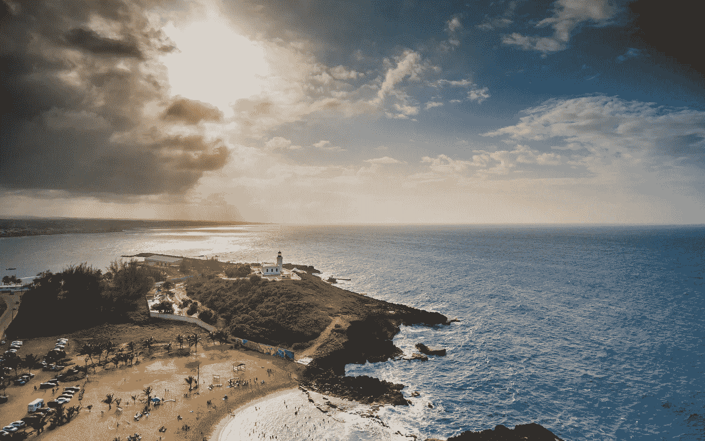

# 人们用密码在地球上创造他们的天堂

> 原文：<https://medium.com/coinmonks/people-are-making-their-paradise-on-earth-with-crypto-54d6ec4ee300?source=collection_archive---------56----------------------->

Island and Ocean Under A Cloudy Sky by [Caleb Oquendo](https://www.pexels.com/@caleboquendo/)

如果你在一个宗教色彩浓厚的国家长大，你不可能没有听说过“天堂”。“天堂”被宗教人士视为他们在地球上辛苦劳作后所做善事的回报。他们梦想并渴望他们的“埃尔多拉多”，一个财富和财富的地方；一个满足他们欲望的地方。

这就是密码领主和巨头们试图创造的世界。从波多黎各的圣胡安到佐藤岛(是的，你猜对了。它是以比特币的开发者中本聪的名字命名的)在瓦努阿图，加密巨头们正在寻求建立他们自己的国家，在那里区块链和密码是法定货币。

你可能认为这不是新的，是的，它不是。像萨尔瓦多和 CAR 这样的国家接受比特币作为法定货币，但让比特币成为法定货币并不是你的加密头们的唯一目标。萨尔瓦多和 CAR 仍然保留他们的国家货币，不像这个乌托邦，所有的交易都将完全是加密货币。

Ripple, Ethereum and Bitcoin and Micro Sdhc Card by WordSpectrum

有没有什么隐秘的乌托邦？

秘密城市的想法已经传播了一段时间。一个突出的例子是斐济的 Crypto land，这一努力后来失败了，因为投资者无法购买这一财产。加密世界被认为是一个国际中心，让加密爱好者尽情享受加密生活，“加密爱好者为加密爱好者创造的天堂”。

密码大男孩也盯上了波多黎各，他们成群结队地向这个岛移动。我的意思是，有什么能比一个拥有美丽风景和低税收背景的岛屿更好呢——一个亿万富翁的完美天堂。你的秘密首脑们正在抓住这个岛的秘密友好政策的机会。你知道蛋糕上的糖衣吗？美国公民可以保留他们的公民身份，因为这个国家是美国的领土。

瓦努阿图的 Satoshi 岛是另一个被设计来吸引全世界加密爱好者的岛屿。房地产投资者安东尼·韦尔奇正打算把他的南太平洋岛屿变成一个秘密天堂。直到最近几年，韦尔奇一直将这些岛屿宣传为螃蟹的保护区。这个大部分无人居住的岛屿被推销为你的密码爱好者的完美“埃尔多拉多”；我想你不必再在南美寻找这个神话了，韦尔奇正把它带到南太平洋。是的，但是宝藏会在区块链。

有了加密，你可以让你的人间天堂。

你认为密码乌托邦可能吗？

> 加入 Coinmonks [电报频道](https://t.me/coincodecap)和 [Youtube 频道](https://www.youtube.com/c/coinmonks/videos)了解加密交易和投资

# 另外，阅读

*   [如何在 FTX 交易所交易期货](https://coincodecap.com/ftx-futures-trading) | [OKEx vs 币安](https://coincodecap.com/okex-vs-binance)
*   [CoinLoan 评论](https://coincodecap.com/coinloan-review) | [YouHodler 评论](/coinmonks/youhodler-4-easy-ways-to-make-money-98969b9689f2) | [BlockFi 评论](https://coincodecap.com/blockfi-review)
*   [XT.COM 评论](https://coincodecap.com/profittradingapp-for-binance)币安评论 |
*   [SmithBot 评论](https://coincodecap.com/smithbot-review) | [4 款最佳免费开源交易机器人](https://coincodecap.com/free-open-source-trading-bots)
*   [比特币基地僵尸程序](/coinmonks/coinbase-bots-ac6359e897f3) | [AscendEX 审查](/coinmonks/ascendex-review-53e829cf75fa) | [OKEx 交易僵尸程序](/coinmonks/okex-trading-bots-234920f61e60)