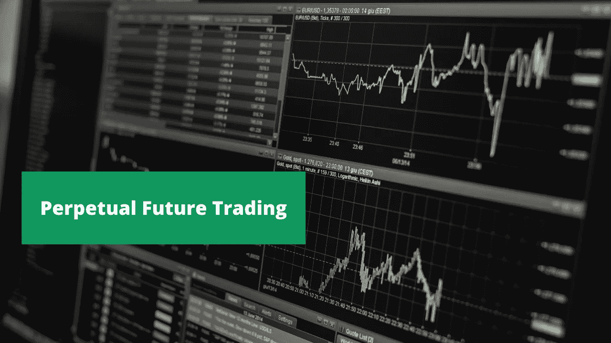
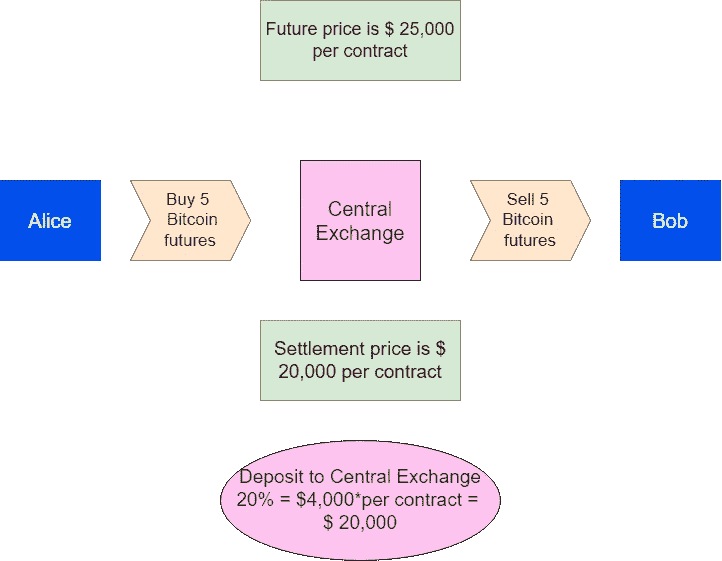
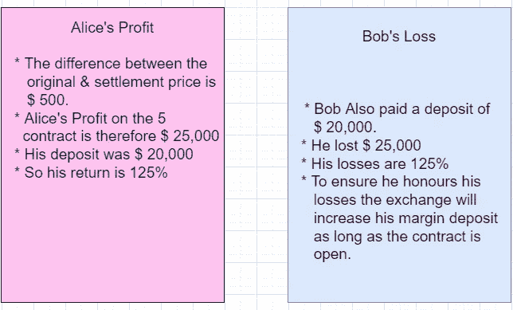

# 加密的永久期货交易

> 原文：<https://medium.com/coinmonks/perpetual-futures-trading-in-crypto-7507b5bea62c?source=collection_archive---------14----------------------->

加密衍生品交易所广泛提供永久合约，其设计类似于传统的期货合约。

# 比特币期货是如何运作的？

想象有两个交易者，爱丽丝和鲍勃，他们有不同的思维模式。爱丽丝认为比特币的价格可能会在未来几天上涨。所以他打算购买比特币期货。鲍勃觉得未来比特币的价格会因为某种原因下跌，所以他打算卖出比特币期货。

A real-time scenario of a future contract

所以爱丽丝的赌注是，合约到期时，比特币价格会高于'[结算价](https://www.investopedia.com/terms/s/settlementprice.asp#:~:text=Settlement%20price%20refers%20to%20the,date%20of%20a%20particular%20contract.)'。与此同时，鲍勃的赌注是比特币价格将低于结算价格。在这份合同中，双方都没有持有任何比特币。

这是处理未来交易的**杠杆**，爱丽丝想赌 5 个比特币的价格上涨，现在让我们假设爱丽丝不需要投入未来市场，这与比特币市场本身不同，他不需要支付全部合同价格，所以他不会交出 100，000 美元，这是 5 乘以 20，作为保证金投入中央交易所，鲍勃也是如此。

Profit vs Loss scenario

因此，爱丽丝可能以每枚 20，000 美元的价格购买了 5 枚比特币，或者总共购买了 100，000 美元。如果价格随后上涨到每枚硬币 25000 美元，他的利润是 25000 美元(5*5000)，这只是 25%的回报。杠杆率提高了 5 倍。

# **为什么永久期货交易很重要**

在永久期货交易中，交易者可以想持有多久就持有多久，其中涉及的合约没有任何到期日。一份**永续期货合约**，又称一份 [**永续掉期**](https://en.wikipedia.org/wiki/Perpetual_futures) **。**

加密货币衍生品交易所提供的永久合约通常由上述公式的版本定价，其中一天与另一天的加密货币价格差异可以被视为资产所有者应得的股息。

# CrossTower 推出永久期货交易

[全球最快、最领先的加密和数字资产交易所之一 CrossTower Inc.](https://crosstower.com/) 很高兴宣布推出永久期货交易，现已在 CrossTower 的百慕大数字交易所推出。

CrossTower 的联合创始人&首席执行官 Kapil Rathi 说:“永续期货为投资者提供了关键的工具，可以促进和塑造他们的投资目标。永续期货交易的优势对于投资组合的构建来说确实具有吸引力，我们很高兴能够为数字资产生态系统的成熟做出贡献。CrossTower 正在开发尖端的交易产品，我们很高兴能够站在创新的前沿。”

# **如何进入 CrossTower 永久期货交易？**

这可以通过 CrossTower Global Pro 平台访问，合格的客户可以进行期货交易。这将有利于机构——包括资产和财富管理公司、家族理财室、对冲基金、买卖双方的专业交易员——以及老练的零售客户。

您可以在这里注册[多塔交易账户。](https://trading.crosstower.com/registration)

*参考资料:-*

*   [https://www . business today . in/crypto/story/crypto-exchange-crosstower-introduces-perpetual-futures-trading-329936-2022-04-15](https://globalfintechseries.com/trading/crosstower-introduces-perpetual-futures-trading/)
*   加密货币期货，[来源](https://www.investopedia.com/articles/investing/012215/how-invest-bitcoin-exchange-futures.asp#citation-9)
*   要了解更多加密知识，请访问 [CrossTower 教育资源](https://crosstower.com/resources/education/)

> 加入 Coinmonks [电报频道](https://t.me/coincodecap)和 [Youtube 频道](https://www.youtube.com/c/coinmonks/videos)了解加密交易和投资

# 另外，阅读

*   [如何在 FTX 交易所交易期货](https://coincodecap.com/ftx-futures-trading) | [OKEx vs 币安](https://coincodecap.com/okex-vs-binance)
*   [CoinLoan 审查](https://coincodecap.com/coinloan-review) | [YouHodler 审查](/coinmonks/youhodler-4-easy-ways-to-make-money-98969b9689f2) | [BlockFi 审查](https://coincodecap.com/blockfi-review)
*   XT.COM 评论 | [币安评论](https://coincodecap.com/xt-com-review)
*   [SmithBot 评论](https://coincodecap.com/smithbot-review) | [4 款最佳免费开源交易机器人](https://coincodecap.com/free-open-source-trading-bots)
*   [比特币基地僵尸程序](/coinmonks/coinbase-bots-ac6359e897f3) | [AscendEX 审查](/coinmonks/ascendex-review-53e829cf75fa) | [OKEx 交易僵尸程序](/coinmonks/okex-trading-bots-234920f61e60)