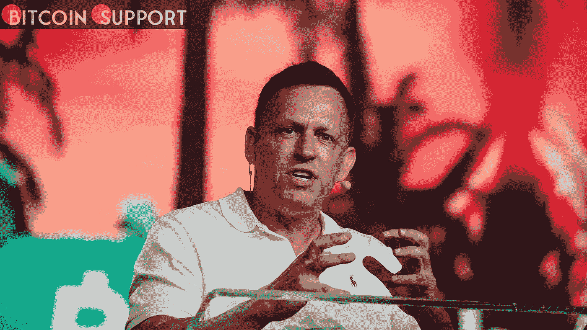

# 由于未能成为一个完全的秘密名人，彼得·泰尔称沃伦·巴菲特为“反社会的爷爷”

> 原文：<https://medium.com/coinmonks/peter-thiel-describes-warren-buffett-as-a-sociopathic-grandpa-due-to-his-inability-to-be-a-4984ba45dd5e?source=collection_archive---------33----------------------->

**Visit our website for full blog :-** [**https://bitcoinsupports.com/peter-thiel-describes-warren-buffett-as-a-sociopathic-grandpa-due-to-his-inability-to-be-a-complete-crypto-superstar-head/**](https://bitcoinsupports.com/peter-thiel-describes-warren-buffett-as-a-sociopathic-grandpa-due-to-his-inability-to-be-a-complete-crypto-superstar-head/)

需要注意的是，巴菲特的公司向巴西一家专注于加密货币的数字银行投资了 10 亿美元。如果你也是亿万富翁，这没什么区别；在彼得·泰尔的书中，你要么相信加密货币的未来，要么就是“敌人”“头号敌人:来自奥马哈的反社会爷爷，”亿万富翁贝宝(PayPal)联合创始人、支持特朗普的共和党超级捐助者泰尔(Thiel)本周在迈阿密的一次加密货币会议上发表演讲时，对商业巨头、内布拉斯加州人沃伦·巴菲特(Warren Buffett)嗤之以鼻。泰尔目前的公司积累了相当大的比特币财富，他还指出摩根大通董事长杰米·戴蒙和贝莱德首席执行官拉里·芬克是比特币的“敌人”，称戴蒙、芬克和巴菲特是阻碍进步的三大老年暴君。泰尔的评论是他将加密货币重新塑造为右翼文化问题的最新尝试，他称赞比特币是一场革命性的保守运动，与“觉醒”的企业和金融机构进行斗争。

会议的发言人阵容读起来像是争夺秘密经济权力中心控制权的那些人的名人录——这种经济之所以崛起，部分是因为它缺乏一个中央集权或组织机构。它包括超级碗冠军小奥黛尔·贝克汉姆(Odell Beckham Jr .)、网球巨星塞雷娜·威廉姆斯(Serena Williams)、足球运动员和新当选的反暴力偶像亚伦·罗杰斯(Aaron Rodgers)，他们都是接受加密的众多名人中的一员——他们中的许多人都获得了传播加密的报酬。记者格伦·格林沃尔德和人权领袖乔丹·彼得森都是出于意识形态的原因出现在大会上的。格林沃尔德在周四的一次小组讨论中称赞比特币在全世界推进了“言论自由和反帝国主义”，并补充说，唐纳德·特朗普和希拉里·克林顿都认为加密技术“对现行秩序如此有害”，以至于他们团结起来反对它。与此同时，彼得森利用他在会议上的亮相将比特币描述为资本主义的下一个前沿，称“自由市场和资本主义有两个理由。”它为好战的个人提供了一个非破坏性的出口。泰尔发誓要“揭露”他的亿万富翁伙伴们，他们可能对加密技术更加怀疑——尽管甚至那些在泰尔所谓的对手名单上的人也清楚地看到了潜在的利润我所称的——我们不得不认为是一场革命青年运动——是通过像 ESG 这样愚蠢的美德信号/仇恨工厂术语来管理国家的金融老人政治。”“他们不配置比特币的决定是一个深刻的政治决定，我们必须反击他们。https://twitter.com/buildordie_/status/1512130566363176965“另一方面，巴菲特的公司在 2 月份向一家专门从事加密货币的巴西数字银行投资了 10 亿美元。戴蒙称比特币是一种“欺诈性”和“毫无价值”的资产。芬克称，比特币是一种“洗钱指数”。然而，像巴菲特一样，芬克正在逐渐对比特币产生兴趣，他在 3 月份给股东的一封信中表示，“精心设计的全球数字支付系统可以改善国际交易的结算，同时降低洗钱和腐败的风险。"就连此前拒绝将数字硬币称为“货币”的戴蒙，最近也在给摩根大通股东的信中称赞了比特币的区块链技术. "戴蒙在本周的年度股东信中写道:“区块链有许多应用可以用来取代或改善合同、数据所有权和其他增强功能。”。泰尔在他的会议演讲中建议投资者放弃政府支持的金融系统，如果他们想在即将到来的全球通货膨胀浪潮中幸存下来，就加入加密潮流。在承认加密货币的未来不确定且难以预测后，泰尔坚称比特币“永远是世界上最诚实、最高效的市场。"

**访问我们的网站获取完整博客:-**[**https://bitcoinsupports . com/Peter-Thiel-described-Warren-Buffett-as-a-a-a-a-social opathic-爷爷-due-to-a-of-his-ability-be-complete-crypto-super-head/**](https://bitcoinsupports.com/peter-thiel-describes-warren-buffett-as-a-sociopathic-grandpa-due-to-his-inability-to-be-a-complete-crypto-superstar-head/)

**免责声明:以上为作者观点，不应视为投资建议。读者应该自己做研究。**

> 加入 Coinmonks [电报频道](https://t.me/coincodecap)和 [Youtube 频道](https://www.youtube.com/c/coinmonks/videos)了解加密交易和投资

# 另外，阅读

*   [Bookmap 点评](https://coincodecap.com/bookmap-review-2021-best-trading-software) | [美国 5 大最佳加密交易所](https://coincodecap.com/crypto-exchange-usa)
*   最佳加密[硬件钱包](/coinmonks/hardware-wallets-dfa1211730c6) | [Bitbns 评论](/coinmonks/bitbns-review-38256a07e161)
*   [新加坡十大最佳加密交易所](https://coincodecap.com/crypto-exchange-in-singapore) | [购买 AXS](https://coincodecap.com/buy-axs-token)
*   [红狗赌场评论](https://coincodecap.com/red-dog-casino-review) | [Swyftx 评论](https://coincodecap.com/swyftx-review) | [CoinGate 评论](https://coincodecap.com/coingate-review)
*   [投资印度的最佳密码](https://coincodecap.com/best-crypto-to-invest-in-india-in-2021)|[WazirX P2P](https://coincodecap.com/wazirx-p2p)|[Hi Dollar Review](https://coincodecap.com/hi-dollar-review)