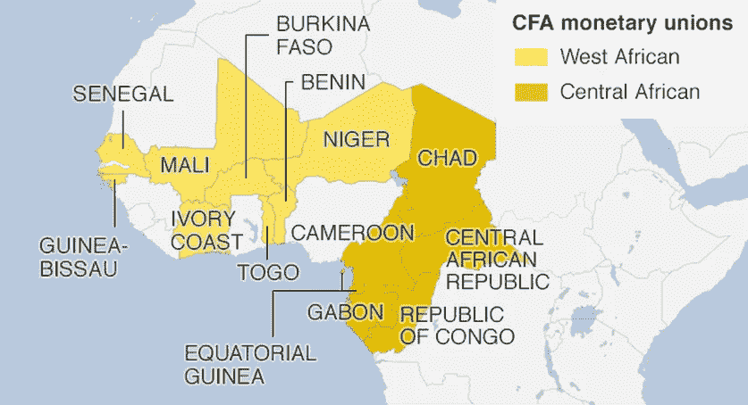
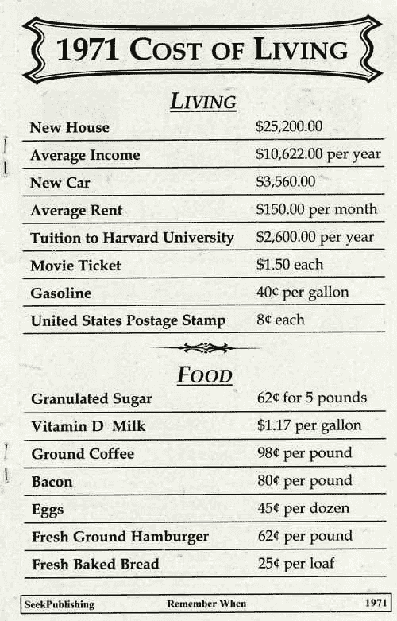
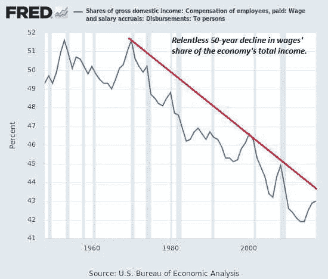
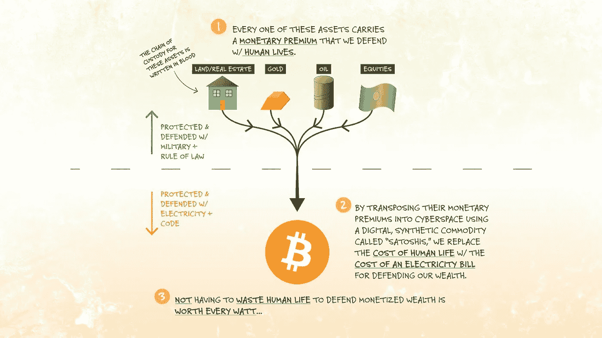
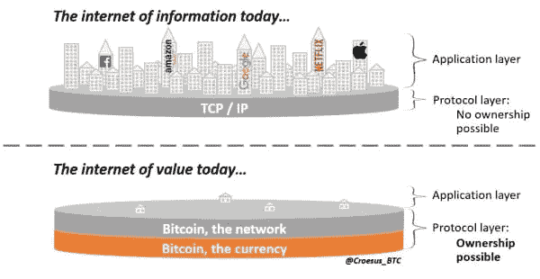
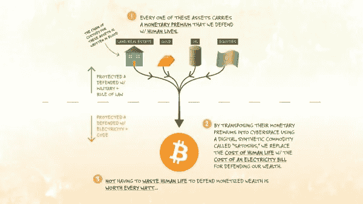

# 石油美元 Vs 比特币

> 原文：<https://medium.com/coinmonks/petrodollar-vs-bitcoin-1f2d20ccca7b?source=collection_archive---------7----------------------->

给我控制一个国家的货币供应，我不在乎谁来制定法律 

*迈尔·阿姆谢尔·罗特席尔德*

几个世纪以来，非洲经历了无数的冲突和不公正。从跨大西洋奴隶贸易到随后欧洲列强对该大陆的殖民化，该大陆的自然和人力资源遭到大规模掠夺，留下了一系列经济破坏，这些破坏至今仍未得到纠正。第二次世界大战后，许多非洲国家开始获得独立。失去北非领土后，法国这个在非洲拥有仅次于英国的殖民地的国家，下定决心要维持对西非和中非殖民地的控制。

该区域由 14 个国家组成，面积超过 250 万平方公里，人口至少为 1 . 8 亿。为了做到这一点，法国决定放弃对其领土的政治控制，同时保留货币控制。1945 年 12 月 26 日法国批准布雷顿森林协定后，非洲金融共同体法郎诞生；这是一种由巴黎控制的货币，在非洲的前法国殖民地使用。

[在当时](https://www.bceao.int/en/content/history-cfa-franc)，这个名字的意思是“非洲法属殖民地的法郎”,但后来对于西非货币联盟(WAMU)的国家，它被改为“非洲金融共同体的法郎”,对于中部非洲货币联盟(CAMU)的国家，它被改为“中部非洲金融合作的法郎”。根据经济学家 Ndongo Samba Sylla 的说法，CFA 系统有四个支柱支撑着它。

首先是**储备集中化。**有两个中央银行控制着每个货币联盟，一个是西非国家的中央银行(BCEAO ),另一个是中部非洲国家的中央银行(BEAC)。这些中央银行持有各自地区每个国家的外汇储备(即国民储蓄)，但他们被要求将这些储备的 50%(目前价值约 114 亿美元)存入法国财政部的一个特别账户！这些国家不知道这些储备是如何使用或管理的，而另一方面，法国完全知道非洲金融共同体地区的每个国家是如何花钱的。

第二个支柱是非洲金融共同体和欧元之间的固定汇率，即 1: 656 非洲金融共同体法郎兑 1 欧元。成员国对这种挂钩没有控制权，任何调整都是由法国人完成的。这种固定汇率最终会使这些国家的出口产品在国际市场上更加昂贵，而进口产品更加便宜，从而阻碍经济增长。它还赋予法国以当地货币采购廉价原材料，并以欧元向这些国家转售成品的特权。真是祸不单行。第三个支柱是法国担保的法郎对欧元的无限制兑换(T2)，最后一个支柱是法郎区内资本的自由流动(T4)。后两个支柱的影响是，它们促使资本大规模逃离这些国家。

总之，非洲金融共同体体系有以下缺点:它严重限制了成员国的经济增长和工业化，增加了贫困和失业，并阻碍了成员国之间的贸易。多年来，许多试图反对终审法院制度的非洲领导人不是被暗杀就是被赶下台。多哥总统希尔瓦努斯·奥林匹亚和布吉纳法索总统托马斯·桑卡拉**都是终审法院的坚定反对者，他们分别于 1963 年和 1987 年被暗杀**。**结果，超过 1 . 8 亿人被剥夺了经济发展的真正机会，因为他们参与了一个对他们不利的经济体系。甚至像国际货币基金组织和世界银行这样的多边机构也帮助法国实施了终审法院制度。货币帝国主义的极致。**

你可能会想，只有这些非洲“不幸的人”才是这种货币殖民主义的受害者，但事实是，这种情况并不是他们独有的。这是在法定货币体系下每个人的故事，而终审法院体系代表了其中的一个极端版本。正如我们在前面的文章[“钱是什么？”](https://kudzai.substack.com/p/what-is-money) 货币不是国家的发明，而是市场汇聚在交易中使用的货币媒介。没有法令或法律规定黄金作为货币使用，但黄金成为货币是基于其货币属性的健全性。法定货币的情况正好相反，它们通过法律(主要是通过枪杆子)成为“法定货币”，尤其是在第一次世界大战后放弃金本位制之后。在比特币发明之前，他们已经享受了一个多世纪的特权。

在这篇文章中，我们将探讨 1971 年后的全球货币秩序，通常被称为“*石油美元体系。”*正是这一体系支撑了当今的全球贸易，并使美元成为全球储备货币。你很可能会注意到这个系统和我们刚刚简单探讨过的 CFA 系统之间的相似之处。两者之间的唯一区别是，一个系统只统治着 14 个非洲国家，而另一个系统统治着全球。

***“我很难过，在政治上不方便承认大家都知道的事情:伊拉克战争主要与石油有关。”***

艾伦·格林斯潘

在尼克松总统于 1971 年结束美元与黄金的兑换后，世界上所有的货币都变成了无支撑的法定纸币。到 1974 年，由于一系列地缘政治冲突，美国经济陷入混乱，油价飙升，工资停滞不前，天然气管道成为常态，通胀飙升。尼克松总统促成了与沙特阿拉伯(以及随后与石油输出国组织)的交易，催生了我们今天的石油美元体系。

交易的条件很简单；沙特阿拉伯将完全用美元定价和出售其石油，作为交换，美国不仅会购买沙特的石油，还会向沙特提供军事支持和合作。美元和石油的联姻在某种意义上用石油支撑了美元，但不是以预先设定的汇率。沙特人也同意从他们的石油收入中“回收”这些石油美元，通过购买美国国债(即美国债务)来为美国的支出融资。

由于这项交易，全球对美元的需求不断增加，因为现在每个国家都需要美元来购买石油。这种对美元的永久需求最终导致各国以美元为其出口产品定价，从而实现了美元在国际贸易中的霸权地位。

无论在国内还是国外，这个系统都要付出巨大的代价。根据金融分析师 Lyn Alden 的说法，石油美元体系导致美国与世界其他国家持续保持贸易逆差，以便向全球经济注入足够的美元，从而维持美元的主导地位。因此，赤字由外国政府买单，而不是由国内政府买单。换句话说，美国有能力维持天文数字的赤字，为战争和国内社会项目提供资金，而其他国家则承担部分费用。

此外，美元霸权是以美国蓝领工作岗位为代价的，由于强势美元导致劳动力成本上升，这些岗位最终被转移到海外。由于工资停滞、生活成本上升和失业，这加剧了财富不平等。换句话说，美元霸权的好处主要由金融机构、资产持有者和大企业享受，而成本则由工人承担。

石油美元体系迫使新兴市场优先积累美元，而不是进行必要的国内投资，以使其经济免受货币危机的影响。新兴市场经济体的大部分贸易都是以美元计价的，如果本币贬值，以本币收款的企业就会获得不可持续的美元债务。这引发了世界各地的债务危机，如 20 世纪 80 年代的[拉丁美洲债务危机](https://en.wikipedia.org/wiki/Latin_American_debt_crisis)。拉丁美洲国家拖欠其美元计价的债务，因为在此期间美元的走强使其无法偿还债务。这种以高美元计价的债务对低美元储备的现象也是 1997 年亚洲危机的原因，它目前正困扰着阿根廷和土耳其的经济。这也是这些国家经历通货膨胀失控的部分原因。

2000 年 11 月，萨达姆·侯赛因试图与 T4 的石油美元体系抗衡，决定用欧元而不是美元来出售伊拉克的石油。到 2003 年 2 月，他已经向€出售了价值约 260 亿美元的石油，然而同年美国入侵伊拉克并推翻了萨达姆政权。同年 6 月，伊拉克恢复用美元出售石油。石油欧元过早消亡，一切回归“正常”。这和我们上面讨论的 CFA 系统有相似之处。这两种法定货币体系都有军事实力的支持，维持它们需要付出成千上万人的生命代价。与菲亚特形成鲜明对比的是，比特币是由强大的矿工网络、强大的货币属性和分散的节点运营商维系的，这些节点运营商通过电能到货币能量的转换粘合在一起。参与比特币网络完全是自愿的。不需要暴力或胁迫。

组装这个拼图的全部意义在于让你看到并理解当前货币体系对你的直接或间接影响。由于金融系统的不透明性、媒体的误导、金融教育的缺乏以及“美联储的说法”的盛行，很难真正找出大多数社会金融弊病的根源。

世界上大多数最大的问题都因为试图从造成这些问题的同一个经济体系中解决而变得更加糟糕。在个人层面上也是如此。了解这种货币秩序的设计和运作中的内在缺陷，是防范这些缺陷的重要的第一步。既然我们已经简要介绍了石油美元体系及其缺陷，那么是时候看看为什么比特币是保护你的财富免受这些系统性缺陷影响的最佳防御系统了。

***“我认为银行机构对我们的自由来说比常备军更危险。如果美国人民曾经允许私人银行控制他们的货币发行，首先通过通货膨胀，然后通过通货紧缩，银行和公司将在他们周围成长，剥夺人民的所有财产，直到他们的孩子在他们的父辈征服的大陆上醒来无家可归。发行权应该从银行手中收回，归还给人民，因为它理应属于人民。”***

*托马斯·杰弗逊*

1958 年，几内亚试图脱离非洲金融共同体体系，从法国那里获得货币自主权。在一次充满激情的演讲中，塞古·杜尔对当时正在访问的法国总统夏尔·戴高乐说:我们宁愿在自由中贫穷，也不愿在奴役中富裕此后不久，几内亚退出了终审法院系统。在两个多月的时间里，法国人撤离了几内亚，带走了所有东西，从灯泡到污水管道计划，他们甚至焚烧了基本药品。给他们其他领地的信息很清楚，但这仅仅是报复的开始。

下一步是通过一项被称为*Persil 行动*的秘密行动来破坏几内亚的稳定，破坏经济繁荣的任何努力，他们在那里伪造几内亚钞票并将其涌入该国。其意图是造成恶性通货膨胀和经济崩溃，并随后引发反对几内亚政府的武装叛乱。事实证明，法国生产的纸币比官方发行的纸币更能抵抗几内亚气候的湿度，因此成功引发了该国的经济不稳定，几内亚经济崩溃。

在一个将比特币作为法定货币的国家，执行这样的操作是不可能的，因为比特币的最大供应量是 2100 万。这一供给上限不仅限制了央行随心所欲地扩大货币供给，还防止了外部侵略者发动这种形式的经济战。当比特币也被视为国防系统时，它就变得具有国家战略重要性。

或许，在 CFA 体系下的民族国家需要考虑承认比特币为法定货币，以此作为从法国获得货币独立的关键一步，从而确保本国人民的经济繁荣。与法定货币不同，比特币不能被殖民或伪造。

“我滑向冰球将要去的地方，而不是它已经去过的地方。”

*韦恩·格雷兹基*

去年，在 2021 年，萨尔瓦多史无前例地成为世界上第一个承认比特币为法定货币的主权国家。此外，萨尔瓦多开始购买比特币，以增加其国家储备。出于显而易见的原因，这一举措遭到了世界银行和国际货币基金组织的尖锐批评。截至 2021 年 9 月，在萨尔瓦多政府推出 Chivo 比特币钱包后不到 3 周，该应用已经拥有超过 210 万活跃用户，根据总统 Nayib Bukele 的推特[消息。到 2022 年 1 月，这一数字已经上升到 650 万人口中的 400 万。考虑到这个国家 70%的人没有银行账户，这是一个巨大的成就。](https://twitter.com/nayibbukele/status/1441846960332361730?lang=en)

萨尔瓦多也将于 2022 年 3 月推出比特币债券，以筹集 10 亿美元，其中一半用于收购更多比特币，其余用于建设比特币采矿基础设施。当人们考虑到我们所探索的石油美元体系的问题时，这一举措的意义就变得显而易见了；以及萨尔瓦多在 2001 年美元化之前经历了一场货币危机。此外，其国内生产总值的 22%来自汇款，而且严重依赖进口。这是一个将在以后的文章中深入探讨的话题。

富达数字资产在其题为“*”*[*研究综述:2021 年趋势及其潜在未来影响”*](https://www.fidelitydigitalassets.com/articles/2021-trends-impact) 的报告中，对比特币做出了以下值得注意的观察:

历史表明，资本会流向待遇最好的地方，拥抱创新会带来更多的财富和繁荣。我们还认为，这里有一个非常高风险的博弈论在起作用，即如果比特币的采用增加，那么今天保护一些比特币的国家将比其他国家更具竞争力。因此，即使其他国家不相信投资理论或采用比特币， ***他们也会被迫收购一些作为一种保险形式。*** *换句话说，与未来几年潜在的更大成本相比，今天可以支付一小笔成本作为对冲。因此，我们不会对 2022 年看到其他主权国家收购比特币感到惊讶，甚至可能看到一家央行进行收购。*

根据 Fidelity 的这一评论，我们可以得出结论，更多的民族国家将在 2022 年及以后步萨尔瓦多的后尘。。[俄罗斯宣布](https://blockworks.co/russia-moves-to-recognize-crypto-as-a-form-of-currency/)计划承认比特币为外币，并对其进行监管。鉴于目前俄罗斯和西方之间的紧张关系，想象俄罗斯央行将比特币加入其国库的情景并不牵强。在国库中持有比特币等升值资产比美国国债更有意义，美国国债的最高收益率为 2.24%，而通胀率为 7.5%。

像特斯拉和 Microstrategy 这样的公司也将比特币作为财政部的储备资产添加到了他们的资产负债表中。事实上，截至本文撰写之时，超过 150 万枚比特币由民族国家、公共和私营公司持有，约占 2100 万枚比特币的 7.24%。随着通货膨胀的威胁继续显现，越来越多的公司预计将获得比特币，因为它是最好的通货膨胀对冲工具。

对你个人来说也是如此。为什么要把你的储蓄放在一种法定货币上，这种货币会随着时间的推移而贬值，而比特币会随着时间的推移而升值？考虑一下这个想法；如果世界上有超过 5000 万名百万富翁，而比特币总数为 2100 万，这实际上意味着没有足够的比特币让地球上的每个百万富翁拥有 1 个完整的比特币。在此期间买一些不是很有意义吗？

除此之外，拥有比特币相当于拥有一部分互联网本身(又名价值互联网)加上一个全球结算层。这在信息互联网中是不可能的。把它想象成能够拥有互联网的基础层，并接触到它上面的所有创新(例如，谷歌、脸书、网飞等。)而不必押注于某个特定的公司。为了充分理解比特币带来的巨大机遇，这一领域的范式转变是绝对必要的。

框定比特币从而更好地理解它的最佳方式之一，是将其作为一种防御系统，保护你的财富免受法定货币体系固有弱点的影响。比特币也是对未来的一瞥，是诚实的货币，是价值互联网的基础。比特币是一种抵御一切形式货币压制的并行系统，也是一种跨时间保值的储蓄技术。在研究了历史上的通胀事件后，一些观察结果突显出来:没有一个受影响的人得到补偿，政策制定者玩着推卸责任的游戏，却不承担任何责任，他们也不会道歉。

如今，石油美元体系的裂痕比以往任何时候都更加明显，因为世界似乎正逐步走向去美元化。中国和俄罗斯最近达成了一项为期 30 年的天然气协议，根据该协议，俄罗斯将向中国供应天然气，并以欧元而非美元结算。事实上，两国之间以美元计价的交易现在只占 33%，而七年前这一比例为 98%。随着减少化石燃料使用的努力以及更多可再生能源获得支持，在一个不再以石油为中心的世界里，美元及其与石油挂钩的汇率将何去何从？

美国在全球 GDP 中的份额已经从二战后的 40%下降到目前的 15%。随着全球经济和能源市场的持续增长，用只占 15%份额的单一货币进行交易已经不再可行。在目前的形式下，石油美元体系的日子屈指可数，没有一个国家的货币大到足以取代它。比特币再一次有机会完美填补这一角色，成为下一个全球储备资产。没有人知道石油美元体系何时会崩溃，但在此期间，你所能做的就是采取行动保护自己。

# 承认

1. **BTC，克罗伊斯。**推特。[在线][引用日期:2022 年 2 月 12 日。]

[克罗伊斯🔴@克罗伊斯 _BTC](https://twitter.com/Croesus_BTC/status/1367165017280237569?s=20.)

有了#比特币，就有可能获得整个价值网络的所有权。这在互联网信息时代是不可能的。这是棘手的范式转变之一，新投资者必须绞尽脑汁才能理解比特币的全部价值。

【2021 年 3 月 3 日

[288 条转发 871 个赞](https://twitter.com/Croesus_BTC/status/1367165017280237569?s=20.)

2.**劳雷·杰森。**推特。[在线][引用日期:2022 年 2 月 12 日。]

[杰森·洛维里@杰森·保罗里](https://twitter.com/JasonPLowery/status/1491826850569637889?s=20&t=dn7STlA4wNzxOela_PizJA.)

[很少有人懂……#比特币](https://twitter.com/JasonPLowery/status/1491826850569637889?s=20&t=dn7STlA4wNzxOela_PizJA.)

[2022 年 2 月 10 日](https://twitter.com/JasonPLowery/status/1491826850569637889?s=20&t=dn7STlA4wNzxOela_PizJA.)

[191 条转发 621 个赞](https://twitter.com/JasonPLowery/status/1491826850569637889?s=20&t=dn7STlA4wNzxOela_PizJA.)

3.**富达数字资产。**富达数字资产。*先比特币。*【在线】【引用日期:2022 年 2 月 12 日。][https://www . fidelity digital assets . com/articles/bit coin-first？sf253214177=1。](https://www.fidelitydigitalassets.com/articles/bitcoin-first?sf253214177=1.)

> 加入 Coinmonks [电报频道](https://t.me/coincodecap)和 [Youtube 频道](https://www.youtube.com/c/coinmonks/videos)了解加密交易和投资

# 另外，阅读

*   [BigONE 交易所评论](/coinmonks/bigone-exchange-review-64705d85a1d4) | [CEX。IO 审查](https://coincodecap.com/cex-io-review) | [交换区审查](/coinmonks/swapzone-review-crypto-exchange-data-aggregator-e0ad78e55ed7)
*   [最佳比特币保证金交易](/coinmonks/bitcoin-margin-trading-exchange-bcbfcbf7b8e3) | [比特币保证金交易](https://coincodecap.com/bityard-margin-trading)
*   [加密保证金交易交易所](/coinmonks/crypto-margin-trading-exchanges-428b1f7ad108) | [赚取比特币](/coinmonks/earn-bitcoin-6e8bd3c592d9)
*   [WazirX vs coin dcx vs bit bns](/coinmonks/wazirx-vs-coindcx-vs-bitbns-149f4f19a2f1)|[block fi vs coin loan vs Nexo](/coinmonks/blockfi-vs-coinloan-vs-nexo-cb624635230d)
*   [BlockFi 信用卡](https://coincodecap.com/blockfi-credit-card) | [如何在币安购买比特币](https://coincodecap.com/buy-bitcoin-binance)
*   [火币交易机器人](https://coincodecap.com/huobi-trading-bot) | [如何购买 ADA](https://coincodecap.com/buy-ada-cardano) | [Geco。一次回顾](https://coincodecap.com/geco-one-review)