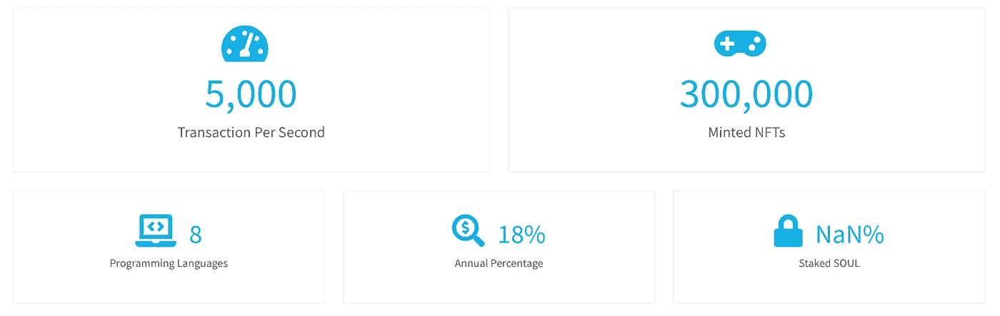
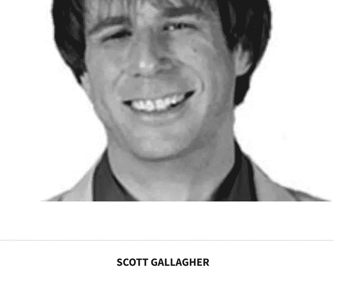
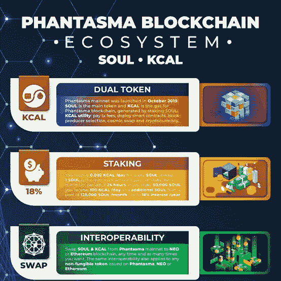

# 幻影——一个新时代的 NFT & GameFi 生态系统

> 原文：<https://medium.com/coinmonks/phantasma-a-new-age-nft-gamefi-ecosystem-72fc32867522?source=collection_archive---------49----------------------->

# CoinDCXpathbreaker

**项目** : [幻影显形](https://medium.com/u/c40e5bf1767?source=post_page-----72fc32867522--------------------------------)

**项目代号** : $SOUL

**直接引用项目白皮书:**

> “幻影链是一种快速、安全且可扩展的区块链解决方案，它允许与其他区块链实现互操作性，同时保持分散的治理系统。凭借创新的赌注机制和双令牌系统，它允许用户访问通信、娱乐、市场和存储领域的不同数字商品和服务。我们的目标是创造一个人们想要使用的 dApps 生态系统，所有这些都在同一个经济体系下。”

**访问项目的网络地址:**

*   **以太坊—合同:**0x 79 c 75 e 2 e 8720 b 39 e 258 f 41 c 37 cc 4 f 309 e 0 b 0 ff 80
*   **Neo —合同**:ed 07 cf fad 18 f 1308 db 51920d 99 a2 af 60 AC 66 a7 b 3
*   **币安智能链(BSC) —合同:**0x C3 adbf 524513863102 df 6784 E1 ab 5652165 c 7912

## 幻影的独特卖点

*   第一层碳中性区块链(生态友好)
*   艺术家的版税默认是永久的
*   无限创建侧链
*   每块 10，000 笔交易。这适用于主链和每个侧链
*   支持 c#；JavaSolidity & Python 开发者语言(更多编码语言将在以后实现)
*   面向 dApp 开发者的分散式存储解决方案
*   该项目整合了自己的 Oracle 数据源支持
*   在生态系统中实施自己的 Oracle 可确保幻影成为以下方面的首选:

1.  **区块链互通甲骨文**
2.  **价格神谕**
3.  第三方神谕

*   幻影不使用复杂的合同地址来发送/接收令牌，而是利用一个命名系统——类似于 **ENS** (以太坊名称服务)

## 智能 NFTs

**开发智能 NFTs，功能包括:**

*   多层 NFTs
*   多种资产的注入
*   NFT 的按需铸造

**智能 NFT 集成使用案例**

*   NFT 本地市场
*   集成在视频游戏中的 NFT
*   数据
*   通信协议
*   支持电子商务(在生态系统内)

## 项目审计报告

在我的研究中，我没有发现项目提交合同地址进行安全审计的证据。

以上图片来源: [Cer.live](https://cer.live/cryptocurrency-security-rating/phantasma)

## 项目团队:

一些团队成员完全是 DOX——这意味着他们的信息是公开的。

## 项目合作伙伴和风险投资家:

与**拯救地球组织** ($SPE)的合作再次确认了这样一个事实，即**幻影**的目标是成为碳中和的区块链。他们的其他合作伙伴涵盖了从 NFTs 到游戏再到电子商务的其他重点领域。

## 项目路线图:

Image Source: Official Project Roadmap Website

项目最初的路线图是 2019 年到 2021 年。然而，他们的 2022 年路线图仅涵盖 Q1 和 Q2。之前的路线图附后:

## 项目令牌组学:

Token Numbers of Phantasma

*   $SOUL 是治理令牌，最初提供 9400 万个令牌
*   $SOUL 是一个“通货膨胀”的象征，每年额外铸造 3%(这就是为什么上图中的最大供应量不可用)
*   目前流通供应量为 105，220，281 美元，总供应量也是这个数字

铸造的代币每月的分发情况如下:

*   1%的供应量分配给砌块生产商(网络验证者)
*   1%的供应分配给 Phantom Force(开发人员社区)
*   1%的供应分配给各种生态系统激励措施

**$KCAL** 是网络令牌，用于支付交易费用

*   下注$SOUL 获得$KCAL 奖励
*   赌注$SOUL 也使用户能够在链上要求他们的幻影名称
*   50，000 美元的灵魂赌注为用户赢得了灵魂大师的称号&分享 1，250，000 美元的灵魂奖励池
*   活跃的区块生产商将获得 75%的灵魂通货膨胀，加上他们验证的区块的最低 25%的交易费(千卡)
*   备用块生产者收到 25%的每日通货膨胀的$灵魂
*   要成为一名街区制作人，你必须首先成为一名灵魂大师(要求如上所述)
*   灵魂大师保持赌注不退，每隔 90 天就会得到一个**皇冠 NFT**

**$千卡赌注奖励**

## 授权和代币分配

我找不到任何信息来源指向幻影计划的授权时间表。

## 社区支持:

*   **推特句柄**:[https://www.twitter.com/phantasmachain](https://mobile.twitter.com/phantasmachain)
*   **Reddit**:[https://www.reddit.com/r/phantasma/](https://www.reddit.com/r/phantasma/)
*   **YouTube**:[https://www.youtube.com/channel/UCdojlc5ps_cHjGCQRS4MXqg](https://www.youtube.com/channel/UCdojlc5ps_cHjGCQRS4MXqg)
*   **中等**:[https://medium.com/phantasticphantasma](https://medium.com/phantasticphantasma)
*   **幻影新闻**:[https://phantasma.io/news/](https://phantasma.io/news/)
*   **不和**:[https://t.co/cCJKiIkrP7](https://t.co/cCJKiIkrP7)
*   **电报**:https://t.co/S83R70A3u
*   **白皮书**:[https://phantasma.io/wp-](https://phantasma.io/wp-)内容/上传/2020/09/幻影 _ 白皮书 _en.pdf
*   **网站**:[https://phantasma.io/](https://phantasma.io/)

## 结论

幻影**是一个令人惊奇的第一层项目，他们已经建造这个项目很多年了。在我的研究期间，项目的赌注机制和基于奖励的系统也确实吸引了我。**

尽管该项目本质上是通货膨胀，但团队非常聪明地实现了$KCAL 奖励系统，让用户发现下注$SOUL token 比丢弃它们更有吸引力。

这个难题中一个绝对重要的缺失部分与项目审计报告有关。我觉得我的研究报告不完整，一个可靠的项目无法提供审计报告，但该项目已经存在了相当一段时间，我们必须在加密领域承担一定的风险。

可悲的是，加密情绪现在并没有达到顶峰，BTC 的交易价格低于 34，000 美元(在撰写本文时)……因此，由于投资者情绪的低迷，每个项目都将出现下降趋势。我个人对此的看法是，这个项目是可靠的，并且增加了价值，但是在你的投资组合中增加任何项目之前，你必须做好尽职调查。

**本研究报告纯粹是为了读者利益的教育内容。这绝不应被视为投资建议！**

…

通过几个简单的步骤，用 CoinDCX 开始您的交易之旅:

*   用您的姓名、电子邮件和手机号码注册
*   接受 CoinDCX 的服务条款
*   完成您的 KYC 验证并添加您的银行帐户详细信息
*   一旦批准，存款菲亚特通过您批准的银行帐户或转移加密从您的其他加密钱包，你就完成了

**# coindcxpathbeaker**

> 加入 Coinmonks [电报频道](https://t.me/coincodecap)和 [Youtube 频道](https://www.youtube.com/c/coinmonks/videos)了解加密交易和投资

# 另外，阅读

*   [币安收费](/coinmonks/binance-fees-8588ec17965) | [僵尸加密审查](/coinmonks/botcrypto-review-2021-build-your-own-trading-bot-coincodecap-6b8332d736c7) | [热点审查](/coinmonks/hotbit-review-cd5bec41dafb)
*   [MyConstant Review](https://coincodecap.com/myconstant-review) | [8 款最佳摇摆交易机器人](https://coincodecap.com/best-swing-trading-bots)
*   [我的密码交易经历](/coinmonks/my-experience-with-crypto-copy-trading-d6feb2ce3ac5) | [AAX 交易所评论](/coinmonks/aax-exchange-review-2021-67c5ea09330c)
*   [Bybit 融资融券交易](/coinmonks/bybit-margin-trading-e5071676244e) | [币安融资融券交易](/coinmonks/binance-margin-trading-c9eb5e9d2116) | [Overbit 审核](/coinmonks/overbit-review-9446ed4f2188)
*   [有哪些交易信号？](https://coincodecap.com/trading-signal) | [比特斯坦普 vs 比特币基地](https://coincodecap.com/bitstamp-coinbase)