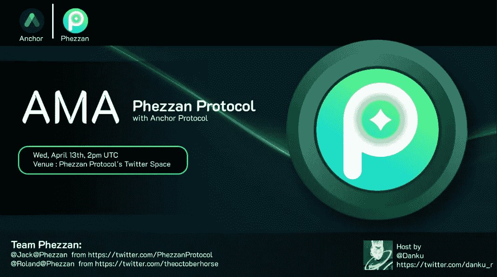

# 费赞·AMA 与主播对话

> 原文：<https://medium.com/coinmonks/phezzan-ama-with-anchor-transcript-ac9a24f0ea4b?source=collection_archive---------15----------------------->

下面是丹库主办的 AMA 费赞协议和锚协议的文字记录。我们尽量保持原样。

嘿，先生们，怎么了？

BitN8:你好你好，另一个(Phezzan 团队:你好)AMA 周。

我有一种感觉，我已经几个月没和你说过话了，但是我想-

BitN8:我知道，已经 2 周了，但我认为，2 周在加密术语中差不多是 6 或 8 个月。也许吧。

是的，甚至更多，因为在过去的三天里我试着做我的税。

哦，天啊，我知道这也让我多活了一年。

*大笑*

是的，你知道的。在德国，我发现如果你和税务顾问合作的话，你甚至可以把你的税挪到下一年。所以我说就像…不不不，明年，未来你会处理。*比特 8 笑了*

哦，伙计，我不知道我是否想在这个纳税年度后有两个纳税年度。*更多的笑声*

这就是为什么我会在未来付钱给别人来做这些事情。就好像，拜托，人家应该这么做，但是我想想……大概是在监狱里，但是在监狱里——* bitn 8 笑*(无法理解)在监狱里。你那里有好的监狱吗？也许是的，或者我应该多呆一会儿-

不，呆着，呆在欧洲，说到监狱。*咯咯的笑声*

好的，好东西。我们应该再等几分钟再开始吗？我想，我们有多少人，100。嗯，看起来已经不错了。

是的，没错。

Danku_r:太酷了，是的，我的意思是，也许，也许我们只是……在我们关注 Phezzan 协议之前，我需要更多关于 Anchor 协议现在正在做什么的信息，或者你也可以告诉我如何正确发音，这可能不是我说这个的正确方式，然后我们有 5 分钟时间，然后我们可以从这个 AMA 开始。最新的锚定协议是什么？

BitN8:让我们实际上放弃一些阿尔法，然后，是的，继续。

费森团队:哦不，我只是说费森很好。

比特 8:费赞，费赞，耶，k，好吧，酷。

是啊，那么我们有什么阿尔法智能？我们总是有阿尔法，对不对？这个怎么样，锚借 V2.1 怎么样，那个怎么样？

你也可以告诉我***(为了隐私，名字被去掉了)是否已经和你一起工作了，每天都是。

他一直在用电报联系我们。我们和他有一些公开渠道，所以这很好。当然，他提出了一些很好的建议{6:00 mark}，我们非常高兴。让他去 I&L，也许是几天前，那太好了。

是的，很多人都在努力工作，我认为很快也会有一些阿尔法战士出现。我要说的是，jump 的许多股东和另一个大股东聚在一起，想出可能的解决方案，比如对他们收入方面的资本控制。这是一个很好的开端，令人兴奋。我们实际上没有做任何外部的事情，比如，5 月 1 日开始生效的动态利率变化，然后在借款人方面，是的。我们需要重新校准，我认为，正如我上次提到的，我们做了 AMA，我们真的需要让借贷端，无摩擦和无缝{7:00 mark}，作为收入端，对吧。这有点……我们在盈利方面的成功有点像我们的致命弱点，对吧。把钱投入到收入端几乎太容易了，所以我们需要找出如何让借贷变得太容易，对吗，*笑*所以…看着这一点，我们试图重复我们已经做的事情，V2 和每个人都记得 V2 正在远离像债券资产这样的衍生品，这些衍生品提供协议的赌注回报-我们正在远离这一点， 因为它花了多长时间…想想它花了多长时间来获得 bATOM，bSOL，对，它甚至还不像“我们几乎在那里”，这应该像下周，有另一个阿尔法作品进来… {8:00 马克}

是的，向流动资产衍生品的资本效率迈进，对，自动复利流动资产衍生品，这是 V2，对…但我们需要让它更简单。有很多机构的需求，有很多鲸鱼的需求，只是想借用 Luna，对，所以我只能输出这么多。将会有一个论坛帖子来了，所以我会指导你们继续检查那里的论坛，并期待我会在那里发帖。把这个列表出来，我不想透露太多，因为我想增加论坛的流量。*咯咯的笑声*

上次你说你现在有足够的流量，但我看到它可能正在变慢-

BitN8:慢了一点点，是的，慢了一点点，人们有点接受了动态速率变化正在发生，这是逐渐减少的，所以我们必须通过 Anchor Borrow V2.1 增加一点兴奋感。

你知道我这边除了听你{9:00 mark}以外还有什么令人兴奋的吗，你的背景中有一只小猴子在尖叫吗，或者那是什么？

BitN8:其实真的是很稀有的鸟。我住在红树林的边缘，所以那里有很多不同的鸟，有时在早上，是的，它们会发出这些叫声。那里也有猴子，但是你没有听到猴子作为一只鸟发出像猴子一样的声音。

你需要猿类一直在你身边。猩猩会变成猩猩。

BitN8:正是。

Danku_r:好的，不，我的意思是，很好，然后我们立即开始谈论论坛，我会关注那个论坛，看看你的 Alpha 是否会加入，我的意思是，它会列出一个很长的借用方锚协议列表，对，还有更多；如果我没记错的话，我们现在有吗？bLuna，bETH，bATOM，我们有 AVAX，然后很快会有 bSOL，这很酷，然后，是的，那么哪一个是 61278？

BitN8:那应该是 native ETH，对，嗯，实际上，当我们在以太坊上线时，对，所以我不认为{10:00 mark}是一个新资产，但是我们可能会，你知道，Phantom 和 Polygon 都在列表上，我们仍在关注它们，因为 Phantom 现在有一些奇怪的能量，对吧。这就像“那个项目注定要失败吗？”。老实说，我不知道，我们真的要在这方面投入开发精力吗？这个问题最近出现了，你知道，那里发生的愤怒戒断，所以，我们会看到，但幻影可能在名单上。多边形也在列表中——点——这是一个新的点，对，这将是本机点，我认为，在 5 月份的某个时候，我们仍然依赖于，比如，定子和利多，以及他们如何获得液体打桩导数，以及新的借入模型如何实现，但在下一个季度，在这里，我们应该看看这些。

是的，酷，是的。正如您所说，数据也将出现在 Phantom 上，如果他们有这种赌注衍生品，如 LunaX，如果是 PhantomX，我认为{11:00 mark}如果他们转向“太大而不能倒”，这可能会是一件有趣的事情。它不应该基于一个人，是的，但我的意思是，如果我们会失去我们的“稳定的主人”,我当然也会听说。

BitN8:是的，是的，当然，我没有看到它失败，看起来它已经稳定下来了，但是已经有一些社区，内部谈论“它值得吗”，所以我认为，所以定子将会继续存在。也许我不应该放弃他们的阿尔法，但他们将在未来几周内没有 PhantomX 实际生活。

很好，是的——我上次问他为什么他在结尾退出而不是在开头，为什么 Luna 是用小写字母写的，没有大写字母。*笑*看看是不是 PhantomX 然后队 DM 也是。*咯咯的笑声*增加了其他所有令人捧腹的东西。

BitN8:我觉得可以。

丹库 _r:是的，不，酷，是的，然后，让我们来谈谈 Phezzan 协议，对，一点点，是什么让你在这里。当你们{12:00 mark}伸出手说“嘿”时，我非常兴奋。你愿意在这里作为一个 MOD 来支持一下这个话题吗？”我说“如果涉及到锚协议，我很乐意这么做。我总是很高兴来到这里。”所以也许你们可以先解释一下这个新协议在做什么，因为我想很多人可能还没有听说过，你们在做什么，你们的目标是什么。

是的，当然，听起来不错。所以，Phezzan 协议是一个有趣的交叉渲染指数，所以，如果观众不知道罪犯是什么意思，就像，这基本上是一个非常资本有效的交易方式。加密是杠杆，所以我们是这样一个指数，我们的测试网将在本月推出，它使用锚协议-基本上，aUST 作为抵押品，所以用户，交易商和有限合伙人可以在这里的所有活动中赚取约 19%的 APY。

与大多数 dex { 13:00 mark }协议使用分散的 stablecoins 不同，例如，我们使用 UST 作为报价令牌，使用 aUST 作为抵押品。我们也结算 pnl，也结算所有在澳大利亚的资金支付。我们的团队认为，分散的经济确实需要分散的稳定硬币，所以现在，如果你看看它，aUST——它真的没有被使用，对吧，所以你有，像，镜像协议，所以除此之外什么都没有。我们相信我们的协议会让 aUST 更受欢迎，反过来，它也会让 UST 更受欢迎。嗯，一件事是，像，我们将部署在 EVM 转移，而不是 Terra。这很重要，因为现在已经有一些 perp DEXs 了。{14:00 mark}在 Terra 上，例如 Vertex，对，他们在为 Forex 做 perp，但也为 Terra 做 perp…你看一下，实际上没有任何 perp DEX 使用，例如，UST 或 aUST，而且，我们在距离上与 Terra 保持一致，对。是的，像锚，UST 也是跨链。我们也想帮助 UST 走向跨链。是的，就像简而言之，我们是一个永久的 DEX，它使用 aUST 进行抵押，融资支付，PnL 结算。因此，交易者和 LP 在这里交易时可以赚取大约 19%的 APY。

是的，明白了，你知道超级酷——我的意思是，上周我已经有了自己的第一次 perp 交易经验，使用他们的 testnet 和 Levana 协议。我的意思是，如果有人知道如何在加密中进行交易，{15:00 mark}目前有更多的衍生品交易，而不是普通的现货交易，所以这非常重要，我也知道 Nate 对我来说更像是一个专业的交易者，这是我几个月前才发现的，我非常惊讶，Nate，你是不是基本上把这些放在一起说“我们需要 aUST on perp DEX”？*大笑*

我希望，我希望，现在他们来找我，我就像“摇滚小子”。让我们实现这一点，让我们想出如何让锚借用也发生在你们那里。”我只是…我显然完全支持让 ust 成为 dex 背后的主要稳定成员，对吧，没有比这更好的跨链用例采用了，对吧？这是 UST 的另一个使用案例，不是 Anchor，对吧，所以我们肯定需要更多这样的案例，也许你可以稍微谈一谈，比如，你正在推出什么样的链，你为什么选择…让你深入了解一下，我知道我们已经讨论过了，但你也深入了解一下怎么样。{16:00 马克}

费森团队:所以你是在问我们的计划“为什么我们选择使用哪条链”或“我们使用哪条链”，对吗？

BitN8:是的，是的，没错，让用户知道，一旦你们上线，他们可以在哪里使用这个，我认为这很重要。

Phezzan 团队:当然，所以，我们的计划是这样的:我们将在 Rinkeby 上推出，这个月，原因是，在 Rinkeby 上推出是最快的，在其他连锁店上需要一些其他依赖。然后，我们将在其他链上发布，很可能是在 AVAX 和 zkSync 2.0 上。因此，在 AVAX 上已经有了 Anchor，所以，有非常高的 TVL，所以在那里推出 zkSync 2.0 是合理的，就像，我们一直想推出它，现在有点像被他们的 Solidity 支持所阻止，就像，他们只支持 Solidity 0.8，他们实际上正在努力，所以一旦他们解除对我们的阻止，我们也将推出 zkSync 2.0，{17:00 mark}我们非常看好 ZK 本身。我们可以以后再谈。是啊所以。我认为主要原因是我们最初想在 Terra 上发布，我们和很多人谈过，包括 Nate 和其他一些来自 TFL 的人，我认为 Terra 实际上没有建立一个有竞争力的 L1，就像 AVAX 或 Solana 那样。它的主要目标是建立像分散的 stablecoin，主要是 UST，并使 UST 在所有连锁店，像所有主要连锁店中受欢迎。所以，我认为这是我们的主要收获，所以我们想让 UST 在所有连锁店中更受欢迎，现在，我认为，90%的连锁店，主要连锁店，都位于 EVM。而不是像《铁锈》里的{18:00 mark}，对。因此，首先在其他连锁店推出真的很有意义，另一件事是 Terra 已经有了一些很棒的产品，如 Vertex。所以，是的，这就是为什么我们转向 EVM 连锁店。-

丹库 _r:是，是，(费赞团队:说吧。)这可能是一个观点，因为可能不是每个人都意识到了这一点，因为我的意思是，我自己并不积极参与任何 Rinkeby，基本上是 ETH 的测试网之一。好的，基本上它是在以太坊上部署的，这也是你说的事情之一，因为 EVM 链仍然是主要的链，如果你总结一下除 ETH 之外 DeFi 周围的所有 TVL，就像 Avalanche 本身在 EVM 支持的链中，我们有 Phantom 在那里，这是 EVM 支持的，对，还有许多其他的，你说这是现在音乐正在播放的地方。另一方面，这也有助于 UST 获得更多的链外流动性，这对保持影响并使其长期更具抵抗力也至关重要。这是我在这里的理解，所以你能不能也详细说明一下你什么时候决定去 aUST，而不是 UST，以及你看到在你的 Anchor 协议、用例方面有什么好处，甚至对那些想在将来在你的平台上使用 Luna 的用户有什么好处？

费森团队:是的，当然可以，所以我们从一开始就决定使用 aUST。我们很清楚。所以，我们是锚用户，就像当你使用锚你存款 UST 对不对？然后把 aUST 拿出来，但就像我说的，没有其他地方可以使用 aUST，就像有 100 亿美元坐在那里无所事事。那么我们能做些什么呢？很明显，用 aUST 作为抵押品，来交易东西，比如说，perp，对吗？因此，用户可以赚取非常高的 APY {20:00 马克}，同时交易或成为 LP，就像是，perp 交易本身，这是一个非常巨大的市场，我认为，它占总加密交易量的 60%至 70%，而且，使用 aUST 显然是对 perp 指数的增值。而且，就像，aUST 是相当分散的，因为就像，它是 UST 的衍生物，就像，我们认为，就像，我们是 Terra 的忠实信徒。我们非常热爱 Terra，因为我们认为……看看 USDC 和 USDT 吧。他们有巨大的市值。他们主要用于交易。然而，目前 UST 除了 Anchor 之外没有主要的用例。还没有。未来不会是这样，但现在，许多用例只是使用 Anchor，就像我们的团队真正相信分散式 stablecoin 的价值，因为它非常有用，就像{ 21:00 mark } UST 的市值，从 17，000，000，000 增长到 10 倍甚至数百倍。我们认为 UST 也必须用于交易，是的，这就是我们使用澳元的原因。我们选择 Terra eco，因为我们相信这种分散的稳定社区，这是因为它有很高的收益。

Danku_r:是的，我明白你的意思，很好。我的意思是，作为一名社区成员，我想我也要对“这就是我们需要的”，对，UST 的更多使用案例表示感谢。我们昨天得到了惊人的消息，至少对我来说是这样。我想是昨天晚上币安美国也使用了 UST。你已经知道比特币/UST 之间的配对在币安发生了变化，所以看起来不像 UST 与零挂钩，这看起来总是有点奇怪。

因此，我认为有越来越多的使用案例是一个好消息，我想向 Nate 或 Anchor 团队提出一个简短的社区问题，即——您如何看待 aUST 在此类平台上使用{22:00 mark},因为现在利率有更多的波动性，或者这也可能是 Phezzan 协议团队的一个问题，如果这是计划的一部分，或者你们如何看待这一点？我不知道谁想接手主播团队还是费奥多。

BitN8:我先拿过来，然后踢给他们，了解他们的想法。你知道我的看法是，你知道，利润可能是可变的，对吧，这是一种你通常为利润支付的方式，所以从你的 LP 营销职位上获得报酬，这是一个巨大的好处，对吧，所以有一个可变的利率，即使它是 4%，也是巨大的，对吧，你在赚钱的同时也在赚钱。所以我认为浮动汇率很好。决定了做市时的无风险利率，我认为这是你应该得到的。{23:00 马克}

Phezzan 协议，是的，继续。

费森团队:是的，就像我们同意内特的观点，我们认为变量很好，就像现在，利率很高，也像增加…我们谈论锚的收益方面，也像锚的借贷方面，现在，我们认为借贷的 APY 大约为 4%，这非常低，就像我们希望在锚上整合借贷方面，因为我们相信锚要成功，它需要增长，对，借贷需求也需要增长。对于 perp 交易，我们通常会在这种利息交换中看到人们出于交易目的借出大量资金，我们相信我们也会为借款方集成 Anchor，人们也会为借款支付 APY { 24:00 mark }，甚至每个人都很好，因为它非常低。

Danku_r:你能帮助我解释一下你将如何整合它吗，因为我说过我自己不是一个大的交易者，我没有每天都在铁杆基础上使用任何 per 平台，所以你已经部分地说有这个需要，但是:它基本上是一个典型的 Anchor 借款网站，作为一个 Web 应用程序也整合到你的协议中吗？

Phezzan 团队:哦，这很像，它取决于收入方和借款方，所以对于任何规模都非常简单——我们只是称之为智能合同后端。我把借用放在一边，我们正在与 Nate 讨论，就像我们实际上在等待 Anchor 的借用 SDK 一样，所以在那之后集成真的很容易——我们只需使用 Anchor 的 SDK。然后，人们可以在网站上使用 Anchor，我们会在内部调用。在内部，我们称之为锚协议，但用户实际上不知道{25:00 mark}，所以对用户来说，只需点击一下按钮，然后嘣。借了更多的钱或者存了更多的钱。

danku _ r:*笑*我喜欢“嘣”。听说借 SDK mate？那是什么？

BitN8:是的，是的，是的，另一个我已经说了很久的阿尔法，好的，我们知道了，这和我之前在这个电话中谈到的一样，对吧。这就像好吧，我们让赚钱变得很容易，但你需要借钱才能让这个 earm 工作，这就对了——大市值。我们没有借用 SDK，所以……我们与 Phezzan 谈论他们，然后实际上进行集成——我就像是“啊哈”了一声，我就像是“好的。这是一个很好的机会，对吧”。LP 对上的 aUST 有意义，对吧。但只有当这个平台也在促进借贷市场为 LP earn 网站创造收益时，这才有意义。所以我们会说:好吧。这很有意义，如果我们可以很容易地拥有一个借款 SDK，每个人都可以插入，每个分散的交易所都可以开始这样做，然后你实际上可以在杠杆头寸上创建一个可持续的 LPing 和借款配对，这非常有趣，因为在传统的资本市场中。大部分的东西都是在保证金权利下交易的。它通过期货或期权进行交易，这些都是杠杆多头头寸，所以能够在链上本地借入，因为，你知道，我们将不得不跨链借入 SDK 工作，对，这创造了一个非常有用的价值主张。所以，当我们得到一键借下来，你可以只借露娜。在费森，对，然后以此为基础，创造你想要的任何其他类型的收益率策略，然后用 aUST 进一步产生收益率。这就像一个美丽的配对。{27:00 马克}

Danku_r:明白了，看到所有这些整合在一起并变得更容易理解，真是令人惊讶。我想很多人这是我说的至少对我自己来说没有意识到这是多么巨大，你已经做了与雪崩锚交叉链。你可以在 Avalanche 上与 Anchor 进行本地交互，如果这是现在的风格，那么借入方也可以基本上进行本地跨链。呼。迫不及待地想看到它的实际应用，我认为这是一个令人惊叹的使用案例，所以…也许我们会继续前进，所以我现在自己理解了 Phezzan 协议。这就来了。成功了。同样有趣的是，就 Phezzan 协议而言，您还有哪些有趣的使用案例——它的独特之处是什么？

我想你之前也解释过，你将会和 ZK 的产品整合在一起。也许你能解释一下这是怎么回事或者总体情况？你还会有哪些有趣的用例？{28:00 马克}

Phezzan 团队:是的，所以，所以我们有两个关键优势。一个是我们使用 UST 和其他人。就像我们计划在 ZK 瀑布，我们认为这是区块链最好的解决方案之一。因此，我们将简要解释它是什么，所以基本上 ZK 汇总是解决区块链三难问题的扩展解决方案。基本上或典型地，有去中心化、安全性和可伸缩性。你至少牺牲了其中一个，例如 Eth 1.0 牺牲了可伸缩性。索拉纳为权力下放做出了牺牲。对于多链生态系统来说，比如像 Cosmos——牺牲了安全。因此，ZK 卷是一项技术，使所有这一切成为可能。这听起来好得难以置信，所以它实际上是通过将链上计算移出链来实现的。所以，它所做的是，批量计算一批交易，然后把计算结果发送回 L1，返回到基链。{29:00 mark}，例如以太坊，就像，在每批被批准的内容中，基本上它的批准是在说“嘿。这个计算是正确的。”因此，即使计算是在链外完成的，比如，在链上，你也可以验证——计算是正确的。因此，通过将计算移出链来节省成本，并通过将验证纳入轨道来保持分散化。这样，有了 ZK 卷，交易会非常便宜，也非常安全，也非常分散，所以现在有 2 个领先的 ZK 卷供应商。他们是 zkSync 和 Starkware。因此，我们将使用 zkSync 2.0，它现在在 testnet 中，zkSync 2.0，mainnet 将在几个月内推出{30:00 mark}，兼容 EVM，因此，以太坊上的所有智能合约或 AVAX 都可以很容易地迁移到 zkSync，现在在 zkSync 上进行令牌交换只需 30 美分左右。这与 Terra 或 AVAX 非常相似，但更酷的是，随着进一步优化，已经有了 EIP 4844，实施后，交易成本理论上大约为 0.003 美元。这几乎可以忽略不计，我们相信从长远来看，zkSync 上的交易成本会非常非常低，所以我们可以忽略这些成本。如果我们在 zkSync 等平台上进行迁移，在合理的未来，这将为 DEX 打开更多的设计空间。{31:00 mark}例如，除了 Solana 之外，我们可以在链上订购，这实际上是不可能的，因为 Solana 不是分散的。这将使我们的 DEX 非常、非常具有资本效率，同时也使我们的 DEX 非常便宜、非常快，并且仍然是分散的。因此，我们相信，几年后，perp DEX 的主要玩家将会在 ZK 汇总，就像，如果人们在这个空间，就像，他们应该知道 dYdX 在 Starkware 上，就像，这是 ZK 汇总之一。它非常便宜，所以我们非常看好 ZK 的汇总，我们相信如果未来很多金融活动将采用 ZK 的汇总，我们应该让 UST 和 aUST 在 ZK 的汇总中受欢迎，否则如果人们仍然使用 USDT 的 USDC，对我们来说就没有任何意义，因为它不是抗审查的，也有很多对应方的风险。是的，这就是我们看好 ZK 汇总的原因，这就是我们要在此基础上发展的原因。{32:00 马克}

BitN8:我看好你。我们看到了乐观滚动的许多问题，我并不反对乐观滚动，我只是说，我们看到了这些事情的关键好处，就像虫洞一样。我们已经遇到了乐观汇总的问题，对吧，因为你必须验证，所以，这样做。要进行汇总，您必须在一定程度上实际验证过去的交易。你有办法在桥上验证这一点吗？然后，我们必须验证他们的汇总方法实际上是正确的，所以乐观汇总是…这是目前 ZK 汇总的替代方案，只是为了给大家描绘这幅图，所以你有像 Arbitrum，乐观主义，他们与乐观汇总一起工作，所以你有这个问题，但是的，真的看好{33:00 mark}这一点，它可以有很大的意义，你知道，中央链上限价订单簿:也许我们可以谈论一下，因为我认为这是一点

在你进入下一个问题之前，可能只有一个问题:哪一个 ust 将被用于 Phezzan 协议，对吗？会不会是虫洞，会不会是 Axelar，因为你说基本上，虫洞可能会去一个不同的方向，我不知道，如果你能谈论哪个，UST/奥斯特将被使用。

BitN8:我其实……嗯，说吧。

费森团队:是啊，那里，你去。你可以走了，走吧。是啊。

BitN8:不，实际上我还没有谈到这个问题，所以我们来看看你们在哪里。

Phezzan 团队:所以现在我们正在运行 testnet，所以我们就像在为他们制造 aUST，就像我们自己一样，就像最有可能的虫洞一样，就像我们还没有到达那个点。是的，我们刚刚，我们刚刚自己铸造的。内特，你有什么要补充的吗？

是的，我认为虫洞很有意义。显然，我们选择了虫洞，它是我们正在做的事情的主要桥梁提供商之一。核心 TFL 也在使用虫洞。当虫洞不是一个选项时，还有 Axelar 作为备份和 Synapse。但是，我认为 Womrholes 是一个很好的用例。你也有一个第 0 层出来，这可能很有趣，但迄今为止，虫洞是市场上的第一个，对不对。在这一点上，它有一个成熟的技术。Jump Capital 背后有很多强大的后盾，这也很重要，所以我认为这很有意义。

丹库 _r:是的，但是我们删掉了之前《费森协议》中提到的，他们自己也在制造外星人。这是*笑*我已经看到人们削减代表说“你看，这就是你，是(？)."不-

是的-是的，好主意，好主意。

丹库 _r: {35:00 马克}我们会把它和其他的东西一起带走-

BitN8:是的，所以我想提出来，是的，我想提出来，因为我不想在这个呼叫中变得太细，失去每个人，但是恒定乘积盒，做市商函数 K = X*Y 是一个非常低效的公式，它存在的原因是因为链上数据的限制，对吧。做那件事要花钱。本质限制链上订购书变得更有趣，因为现在你不必局限于 K = X*Y 方程。成本，你在 Solana 上看到这一点的唯一原因，只是为了澄清一下，不只是 Solana，我们在 Terra 上也有一些:Vertex 也将在中央限制链上订单簿内推出，因为在 Terra 上这样做的成本实际上也是可控的，但是的，我认为这是未来的趋势。如果你看看传统的做市，他们不只是在曲线上运行一个简单的方程，对吧，他们分散了许多不同的伽马和维加风险，这是不同的波动性措施，如投资组合凸度等，所以，你需要一个中央限价簿，这样你就可以移动市场上的价差，所以，当波动性增加时，市场上的价差增加，有一个中央限价订单簿允许做市商在市场移动时移动，这真的很重要。

费森团队:是的，这就像…内特…这是正确的。这就是我们如何在我们的 V2 探索可能的订单簿，例如，或者可能，例如，混合订单簿/AMM，例如，我们的观点非常简单，我们的观点是，实际上 AMM 现在运行在 Rinkeby 上，并将运行在 AVAX 上，可能在 AVAX 和 zkSync 上，因为他们-从 AMM 开始允许我们{37:00 mark}以最快的速度推出，然后，例如，在我们的 V2 上。比如，至少我们在尝试整合订单簿，或者像旧的订单簿加上 AMM，再一次，在我们的 DEX 上。所以，是的，这是我们将在 V2 探索的东西，也将是在今年。

Danku_r:是的，然后，也许你需要打开一个论坛，一篇文章，只是为了解释(Phezzan 团队:是的)订单类型的不同版本，所以我留下了“密封”这个词，就像你说的那样，基本上是在解释，你会(无法区分)在那里，但我认为在那个空间发生的事情很有趣。你们觉得我们应该在 AMA 开一点会吗？如果有人想提问，可以上来问两个队任何问题，只要把你的手举过麦克风就行了。你可以点击请求，但在我们把人带到这里之前，你们认为我们还没有谈论的任何事情，你都可以在那里发表，因为也是“文令牌”的主题{38:00 mark}对吧？我认为，如果这是一个新的协议，我们总是需要问:在 Phezzan 协议的令牌方面是否有其他东西，是否可能有像 aUST 持有者将获得空投的东西，我不知道，我只是大声思考。*咯咯的笑声*

BitN8:是的，是的，我认为在提问之前，他们可能会先简单介绍一下他们的代币经济学，可能的空投，可能的代币投放，谁在投资，然后再提问。

费森团队:对。所以你想…你想让我们从记号组学领域开始吗？

BitN8:也许也许，把空投留给(听不懂)大概每个人吧。*笑*每个人都有每个人，每个人都会离开，如果你先空投。

费森团队:就像我很困惑，就像，我以为你们让他先回答问题。

先生，现在是象征经济学，开始吧。*大笑*

费赞团队:等等，现在我们到了最后。{39:00 马克}

是的……现在进行记号经济学，然后带我们去空投，然后我们打开问题。(BitN8:对，对对。)

费森团队:好的，当然，当然。所以，首先是空投。嗯，所以，就像，我们的团队不会推出令牌，对吧，直到协议达到所谓的产品市场适合度，或者换句话说，就像-在我们的协议有任何价值之前，我们不会推出令牌，这有几个原因。所以，就像，一个原因，我们不想测试我们的人性，对吧。我们不想筹集，比方说，几千万美元，坐在一堆现金上测试它，看看我们是否还会努力工作，就像我们知道我们在工作一样。我们会努力工作，但我们不想测试人性，然后我们也想在开始时更有机地发展 Phezzan 协议，因为否则，很多空投猎人会来…这将增加很多噪音，另一个原因是，我们希望有更多的时间来设计更好的令牌组学，就像现在我们还没有花所有的时间，我们需要更多的时间，最后一个原因是，我们希望找到志同道合的投资者所以，他们不想，只是筹集一些代币，然后扔掉。目前 Token 发布的预计时间是 2022 年第四季度，也就是费赞·V2 发布的时间。

但同样，最重要的事情是:如果我们没有找到，就像，只是，协议提供任何价值，我们不会启动令牌，所以没有令牌，直到我们找到协议的价值。然后，在奖励方面——对测试用户会有追溯性奖励，但它实际上更多的是一种操作的姿态，operation——对不起，只是接受我们的赞赏，所以，如果你在这里喜欢寻找免费令牌{41:00 mark}，就像，我们可以保证你喜欢——它不会值得你花时间。它不会，就像，很多权利。但是如果你真的对了解我们感兴趣，那太好了。所以我们真的-你能做什么加入-测试我们，就像加入我们的不和，我们链接我们的 Twitter 个人资料，你们可以看看。至于代币组学，就像我们说的，就像现在我们没有非常详细的代币组学——我们所知道的是一个社区将获得至少 56%的初始代币分配，所以，就像，我们希望将大部分代币分发给社区，就像我说的，将会有追溯奖励，但机制仍未确定，就像这些奖励而言，将不会有归属，就像我们的协议将包括汽油费，我们将帮助将这些代币分发给将获得奖励的人。嗯{42:00 mark}，行权期结束后也会有通货膨胀，但通货膨胀率会很低。我们已经看到一些协议，比如，疯狂的通货膨胀，然后人们开始抛售。有什么好的吗？所以，最后，但并非最不重要的是，我们的团队必须真正找出确切的记号组学。我们知道这非常重要，但在我们真正找到该协议的价值之前，设计一个非常坚实的令牌组学是没有意义的。我们更多地认为令牌是协议的价值捕获，对，所以现在由于产品的价值为零，令牌将捕获类似于零的价值。这就像，如果我们今天发布它，它将像实际上是 scammy 项目。我们不会那么做的。所以，是的，在我们找到适合该协议的产品市场{43:00 mark}后，我们将有望在第四季度推出令牌，但没有承诺，是的，如果您是来获取免费令牌的，请不要费心，但是的。

Danku_r: Q4 承诺我听到了*笑* (Phezzan 团队:不承诺，不承诺！)

BitN(2):不，不是那样，那不是一种非常务实的看待它的方式。有多少项目就像他们的象征性价格一样失败了，因为他们在产品发布时就启动了，在他们证明任何收入流之前，在他们证明产品适合市场之前，在他们证明他们有可持续的收入流之前。很聪明的想法，很喜欢你的角度。

是的，我也是你的超级粉丝。我的意思是，我想我们都在这里，当然，我们希望击中一个疯狂的令牌，我想，我们大多数人已经在 Luna 中找到了它，希望在 Terra 生态系统和其他生态系统中找到许多其他令牌，但最后，我很喜欢忘记令牌，专注于产品本身，因为，我的意思是，令牌应该最终有助于通过这两个部分获得收入和分散的投票权， 但是协议的核心也像锚一样，它在没有 ANC 令牌的情况下工作，我的意思是，直到 veANC 出现，但至少作为一个例子。 那么，为什么要担心呢，我的意思是，令牌价格不幸地给了很多关于协议的正面或负面的影响，而开发人员这么快就做了一些事情，因为令牌的价格可能没有反映协议实际上在做什么，希望是以正确的方式，所以我认为只是说“让我们做一个产品”是一个好主意，无论如何在开始时——它是集中的， 因为团队需要有行动的可能性，你在做什么，你在发展它，然后一旦你 30 岁了你就可以继续前进，但是…给我一个信息:为什么是 56%？ 这是我需要了解的任何一种内幕吗，通常是 42%，对，现在这是一个惊喜。

费赞团队:那只是一个大概的数字；所以核心就是:我们想给社区至少一半的贡献。{45:00 马克}

我原本期待一个 10 小时的故事，解释为什么(费森团队:魔术)会有这样/真实的数字。

BitN8:但是那不是好多了吗？只要建立一个伟大的社区，我们就奖励热爱它的人？

是的，很棒，非常非常酷。Nate，从你的角度，或者，我的意思是，从主播团队的角度，你对 Phezzan 协议的未来有什么看法，或者你们是如何一起工作的？

BitN8:我认为这很棒，这可能是我们做的第一个借入方 API 集成之一，所以这真的可以为其他借入方集成设置标杆，这是 Anchor 可持续发展的一个重要部分，所以我认为这真的很令人兴奋。再加上他们在那里使用 UST 作为他们平台上的默认硬币，把 EVM 链作为一个有机用例对我来说很有意义。{46:00 mark}所以我真的很喜欢他们正在做的事情，很高兴与他们合作，我有一个原则:如果有人联系我，因为很明显人们现在知道我是谁了，每个协议都想使用 aUST，对吧，就像“嘿，我有个好主意。我们将把它放入 aUST，我们将向用户支付 15%，我们将收取 5%，好主意”，对。对于任何这样做的人，我的实际问题是“你在为借款方做什么？”*咯咯笑*这正是我在这里说的，他们喜欢“是啊，让我们这样做。”。所以，你知道，越多的人想借钱，越好。

是的，说得好。我的意思是，我说，我只是一个社区成员，我总是看到 earn 方面也有一个零售优先工具来获得关注，这就是为什么比率这么高。但是如果有协议说“你知道吗？我正在帮助引导双方。”—这是更自然、更健康的方式，从长远来看是可持续的，我认为这很好，所以每个人，如果你有一个如何整合两者的想法，请联系内特。他刚才说他一整天都没事做，所以他会回来困扰你的想法，和你谈谈-什么是正确的方式内特，我的意思是，也许有人在这里也有-

BitN8:好的，我不能-我个人不能说，但我们都知道结束这次通话通常是安全的，但是的，去论坛。*大笑*

好的，就是这样，爱它——是的，它在等待一个合适的时机让你放弃这个论坛。

BitN8:但公平地说，也有不和谐的地方，我认为这是一种未被充分利用的资源，对，我们有一些很好的社区，那里的版主可以通过主播协议回答技术问题，可以传播思想，实时交流，对，论坛有点像静态的部分，不和谐有点像动态的部分。

有点好东西，是的，让我们向社区开放一点，如果有人想问一些问题的话。我的意思是，有时候你可以问:ANC 的整合是如何进行的？也许你想更多地了解 Phezzan 协议的工作原理？也许你想知道更多关于杠杆交易的历史——只要来到这里，要求麦克风，然后我们带你上去，我们可以再谈几分钟。

嘿，问你个问题。那么，Phezzan 是不是提供了一个基本功能，这样你就可以建立一个基本的，类似于机器人交易的功能。你知道，网格和再平衡器之类的模式，或者你觉得订单的滑点对于更高频率的交易来说太高了，比如，你对 Phezzan 上订单的价差有什么看法，这将构成有利可图的交易，比如，你知道，任何超过 0.3%的交易对这种事情来说都开始变得有点问题。

费森团队:是的，谢谢 Cephii，这是一个很好很好的问题。因此，从理论上来说，我们的 DEX 是完全链上的，任何人都可以通过调用我们的智能合约来运行机器人或其他东西，实际上你甚至可以构建自己的对冲。策略，或者甚至像你自己的 stable 一样使用我们自己的 DEX，所以现在，在开始时，我们相信，我想，我们几天前刚刚尝试过，比如:我们在我们的 DEX 中投入 200 万美元，如果你投入，比如说，1 万美元的交易，这种滑点将小于 0.1%。这实际上取决于你要交易的{50:00 马克}的数量，但对于较小的交易者来说，完全没有问题，而且，我们计划，我们也想谈谈我们的筹资计划，因为我们想在测试网之后筹集资金，然后，我们可以为我们的主网建立真正的流动性；所以我们想吸引很多，比如，有限合伙人或者很多资本在我们的池中，希望到那时，到我们推出 mainnet 的时候，你可以运行你的机器人来实现不同的，比如，贸易策略，或者其他什么，是的。所以答案是:是的，你可以运行你的不同策略，因为我们只是在链上，到时候，到我们在主网上的时候，主网，流动性，就像，希望，会足够，就像这样，我们会做到这一点。是啊。{51:00 马克}

Cephii:也许，也许给我们一些概念，比如，什么类型的资产可以在平台上交易？

费森团队:当然，所以一开始我们会非常非常有限，因为我们的资源有限。就像……现在我们肯定会有像 BTC、瑞士联邦理工学院这样的机构，这取决于——我们是在 AVAX 还是瑞士联邦理工学院，对，我们要么增加像 AVAX 这样的机构，要么增加 Luna 这样的机构，所以我们开始时可能会有 3 个或 4 个代币，然后要求增加流动性。会有更多的代币，我们会一个接一个地添加。所以，就像，如果你经常交易对手，你知道，前 10 对可能占了至少 80%的交易量。没错，永久牌是高度集中的，所以我们会先积累，比如说，最初是为了顶级代币，等我们完成后，我们会添加更多代币。是的，就像，它将是一个{52:00 mark}非常有限的开始，我们将在此过程中添加它们。

嗯，你所需要的就是露娜对吧。

BitN8:只长 Luna，不短，只是长只是一个方向，直行。*大笑*

是的，让这个机器人失去能力然后-*咯咯地笑*

BitN8:我会很快回到 Cephii 的问题，是的，中央，中央，链上…中央限制链上订单簿为这样的交易提供了广泛的可能性。显然，这是有限度的，我不确定那是什么。这将是一件有趣的事情:高频交易真的可以存在吗？什么样的交易链不能存在呢？我认为我们越来越接近验证这一点了。当更多的连锁订购书出现的时候。

Cephii:不一定是高频率的，你知道，成千上万的人{53:00 mark}为此目的单独运行机器人；从理论上讲，它可能是一个单一的协议，就像一个保险库策略一样运行，其中的订单是成批的。嗯，就像，你知道，金库里每个人的资金池都在执行这种类型的交易策略，当然，就像大订单一样，然后你知道像前跑这样的问题……是的，像前跑这样的问题，一个明显的和潜在的滑点问题开始在这种情况下发挥作用。

BitN8:是的，绝对是，这肯定是-

将会有一个特性——将会有一个特性，仙灵将会得到一个链上的重新平衡。我看到那个了。如果仍然没有接近，但可能比我们预期的更接近，因为人们总是在不断发展，让我们继续前进，也因为我们现在有几个演讲者在这里。让我们把它给安德里-安德鲁·福尔曼，继续。{54:00 马克}

Andrew Forman:嘿，伙计们，伟大的 AMA，我真的对你们正在做的事情感到兴奋，也对使用 zkSync 感到兴奋，所以期待着去那里。我想问几个问题，一个是给 Nate 和 Anchor 团队的，比如，你们能不能多谈谈那里的外桥工程，它是不是就像是一个，一个仅仅为 aUST 准备的门户，就像，除了 SDK 之外，会不会有一个用户特性，然后，对于 Phezzan 的人…就像我在 Arbitrum，GMX 和 TracerDAO 上使用的一些其他 perp DEXs 一样， 我在想，你能不能做一个和其他一些 perp DEXs 的特征比较，你们是如何处理价格反馈，金库，路由器之类的东西的。

BitN8:对，所以桥的工作方式是双向的，所以本质上，简单地说，你只是用不同的包装和消息标准发送令牌。所以，我们就以 AVAX 为例吧。是的，aUST 通过虫洞桥发送到 AVAX，然后它在 AVAX 上以包装的标准形式存在，因此它为用户包装了 aUST，当他们向 sAVAX 借款时，AVAX 实际上是，sAVAX 被发送回 Terra，因此它存在于 CW-20 端，即 w-a-s — wasAVAX。因此，桥是双向工作的，然后他们借用的 ust 被发送回虫洞，因为 UST —(它)实际上有一个 wrap 标准，但我们与 Trader Joe 的团队合作，在 AVAX 上将默认的 UST 标准设置为虫洞，但对于用户{56:00 mark}来说，它只是 UST，对于 Trader Joe 上的任何人来说，有一个实际的池已经退役，所以您将实际看到 UST。我相信是斧头或者类似的东西，或者是铝。这很酷，它已经退役了，但是的，我们正在努力使它变得非常简单，默认网桥将是该链的默认“本机令牌”。

Andrew Forman:明白了，明白了，很有道理，我喜欢简化缩写，因为我最近想使用所有这些不同的桥梁和索引，就像这些标记的缩写和后缀有点失控。

BitN8:是的，我想补充一下你的另一个问题，是的，如果你想从用户那里发送任何你需要的东西，你可以通过虫洞发送到 Avalanche 或其他链。

Danku_r:在问题的第二部分，与其他平台相比，Phezzan 协议是正确的。

安德鲁·福马尔:是的，就像你们用金库做比较一样，也有点好奇你们用价格、价格反馈、神谕做比较。

费泽团队:好的，当然，首先是未来的差异，然后是价格预言。所以，区别，就像，我们有几个区别，就像我们使用澳元，所以，即使当你不交易时，你也可以获得大约 19%的 APY，如果你把钱投入我们，所有的钱支付和 PnL 都以澳元结算。所以，你的资产总是有收益，这是一个很大的好处，另一个好处是很多交易所仍然没有限价单和止损单。在我们的 mainnet 之前，我们将有限价单和止损单。第三个大问题是，如果你想在我们的平台上进行保证金交易，APR 相当低。它的目的，就像有时甚至更低，对，现在他们知道了。因此，在所有指数中，这里是{58:00 mark}进行保证金交易的最佳场所。就像，就像你提到的几个不同的指数，像 GMX，我们也经常使用它，但是，对于 GMX，它接受订单，就像它接受订单的价格，它来自，比如说，指数利率，对吧。所以它从其他交易所获取价格并进行交易。在我们的……我们的指数中，价格总是被引用，就像，在我们自己的指数中，所以就像更多，我不知道怎么说，就像或多或少倾向于，就像，价格的市场操纵。接下来，让我们来看看 oracles，我们现在使用 Chainlink，将来我们也会与其他协议集成，比如 Band，还有很多其他协议。我们的目标是让我们的神谕更能抵抗价格操纵{59:00 mark}，是的，所以我们暂时使用 Chainlink。

安德鲁·福尔曼:是的，有道理。我想那些人也在这么做。我认为这是我听说的事情，就像有许多数据工作，需要做的是引入可靠和分散的价格馈送…这可能更像是借款，就像，我的意思是“土豆的工作”，实际上使罪犯交易工作。

是的，很重要。

酷，谢谢你，先生。伟大的问题，让我们继续德根小猫内疚，继续。

嘿，你能听到我说话吗？

是的，完美。

德根·基蒂:好的，很好，谢谢邀请我，真的很兴奋，非常非常酷。我喜欢所有这些跨链活动。很牛。我有几个问题，其中一个是比较容易思考的问题，请随便回答问题。因此，这个虫洞发生了很多事情，并从那个 Terra 桥出来，所以这是一个关于 Anchor 和{1:00:00 mark}的问题，然后我也有一个关于 Phezzan 协议的问题，所以… Axelar 与虫洞，那里发生了什么:Axelar 被否决了吗？我读到过 Terra 桥正朝着使用传送门和虫洞的方向发展，那是，那是一种方向吗？这就像问题 1。第二个问题是，Phezzan，你考虑过这个问题吗，我知道你说过你的令牌组学仍在不断完善，但你有没有考虑过 liquid staking 或任何你可以放弃的 alpha，比如，你知道，围绕 staking 或任何此类用途的任何初步想法…对于协议令牌，然后我的最后一个问题是，你放弃的 borrow SDK alpha，Anchor，那里有任何更多信息，会有文档吗，GitHub 在哪里？什么时候发射？会兼容什么样的语言？我只想知道关于它的一切，所以这些是我的问题。

BitN8:是啊，是啊那个？那将会到来，我们已经有一些很棒的开发人员在这方面工作。{1:01:00 马克}我想我会把它留在那里，医生会带着它出来，它会解释一切。它将拥有比我们过去的 SDK 更多的功能，因此在这方面真的很令人兴奋。我不会叫阿克塞尔(？)正在…受到赞赏，我们刚刚为我们要转移到的某些 chaain 选择了虫洞，让 ust 到其他连锁店，我们仍将在那里使用 Axelar，伟大的团队，伟大的项目，不想说我们完全放弃了他们，我们没有。Synapse 也将用于某些链，所以并不是所有的赌注都在虫洞上，锚团队，我们必须做出艰难的决定，我们必须选择一个桥来建立，以快速迭代，我们不能为每个不同的桥建立技术栈，这是浪费资源，但我们可以支持最强大的一个，所以我们的资源倾向于{1:02:00 mark}选择一个赢家，这可能更成功。

德根凯蒂:是的，很好，谢谢你。我注意到虫洞正在以更快的速度被采用，例如，你知道，然后是最近的合作，但不是试图兜售其他东西，而是最近与几个链的合作，看起来他们选择了虫洞，所以…谢谢你的反馈，最后是 Phezzan:首先，液体打桩或任何东西，你有没有想过锁定，以及正在发生的任何类型的激励，变得越来越普遍，这种锁定和所有这种液体打桩的东西，如果你想到任何东西，任何东西？

费森团队:嗯，我们想了想，但现在，我说这只是猜测，因为它不会被设置，直到我们更接近 V2 发射。当然，所以，一般来说，我们希望让令牌持有者的激励措施与协议保持长期一致，所以，就像，就像锁定是一种手段，你可以这样做，对，就像，你还可以谈论我们将使用什么，它用于什么，令牌。可能会有几个{1:03:00 mark}，对，例如在我们的协议中发现的保险，例如，规定的令牌可用于保险基金，使我们的协议保持流动，也可用于一些交易费用奖励，还可用作价值捕获的一部分。也许我们可以，比如，烧一些代币，在交易量增加的时候，或者当交易量上升的时候，比如，比如，但是就像我说的，代币有很多用处，我认为对于 perp DEX 来说，代币有很多价值。为了管理风险，我们也希望将整个令牌设计成，比如说，人们可以希望长期持有令牌，因为，比如说，我们的令牌捕获价值，希望它可以随着协议的增长而增长，提供更多的价值……也是如此……所以，我想说的是，我们的令牌设计实际上还没有，我们还没有投入所有的时间。我们去了，从什么时候开始，当它就像…一旦我们确定我们的，我们的协议可以提供价值，一旦我们可以建立一个 DEX，人们真的喜欢使用，这就像说…我想这就是我在这一点上能说的。所以是的，但这是个很好的问题。

德根小猫:谢谢。感谢您邀请我，我想以下面的问题来结束我的提问，我真的非常感谢您所说的“在真正有价值之前不会推出令牌”。我认为你正在做的事情非常重要而且非常美好，因为这只是。我看到了社区正在前进的方向，那就是我们试图在长期内相互支持，所以看到这样的事情真的很高兴…谢谢让我站起来，谢谢大家。谢谢你的时间。

酷，谢谢你，很好的问题，嗯，我们从来没有计划过这个，但是我们不寻常地正好打了一个小时。我认为这是完美的。{1:05:00 马克}

BitN8:再说一次，我们越来越擅长这个，我们是专业人士*

那么，两个月后今年的结果会是什么呢？你能告诉我那个吗？*大笑*

BitN8:我们还没那么好，或者说还没那么好。*咯咯的笑声*

我们正在慢慢地到达那里，不，超级酷，我的意思是，我对这里发生的一切感到兴奋。这太酷了，我们看到越来越多的 UST 用例脱链，这对一个稳定的硬币来说是如此重要，真正解除和保持挂钩，更具抵抗力。我不知道 Phezzan 协议，如果你们想添加一些东西或-或内特基本上关闭这一个。

Phezzan 团队:嗯，所以，我想，是的，我们最后想说的是，我们真的很感谢主播邀请我们来这里，感谢 Danku_r 招待我们，我想感谢每一个转发我们的人。还有其他人，做着其他像，对不起，只是为了帮助我们，是的，非常感谢大家，如果你有兴趣，加入我们的不和，链接在我们的 Twitter 个人资料中，希望我们会在那里看到你，是的。

BitN8:是的，你们正在做的事情令人兴奋，感谢你们伸出援手。期待着第一个借用集成，从锚的角度来看，这真的很令人兴奋，到论坛，到 bSOL 白名单。一个帖子是活的，将很快得到一个投票，所以这将是另一个被添加的令牌。然后，是的，每天的某个时候，接下来的几天，或者下周初，继续查看论坛。我将放弃锚借 2.1 版，并很高兴听到一些反馈。

太酷了，现在每个人都遵守 Phezzan 协议，他们太好了。在互动之后，我可以肯定地说，我喜欢并享受这一点，就没有炮轰，只是提供而言，这很酷，但给他们一个超级酷的关注。很好，那么我想说谢谢大家的聆听。回头再聊，拜拜。

费森团队:再见各位，谢谢再见。

再见，谢谢。

{转录结束}

> 加入 Coinmonks [电报频道](https://t.me/coincodecap)和 [Youtube 频道](https://www.youtube.com/c/coinmonks/videos)了解加密交易和投资

# 另外，阅读

*   [OKEx vs KuCoin](https://coincodecap.com/okex-kucoin) | [摄氏替代品](https://coincodecap.com/celsius-alternatives) | [如何购买 VeChain](https://coincodecap.com/buy-vechain)
*   [币安期货交易](https://coincodecap.com/binance-futures-trading)|[3 comas vs Mudrex vs eToro](https://coincodecap.com/mudrex-3commas-etoro)
*   [如何购买 Monero](https://coincodecap.com/buy-monero) | [IDEX 评论](https://coincodecap.com/idex-review) | [BitKan 交易机器人](https://coincodecap.com/bitkan-trading-bot)
*   [CoinDCX 评论](/coinmonks/coindcx-review-8444db3621a2) | [加密保证金交易交易所](https://coincodecap.com/crypto-margin-trading-exchanges)
*   [红狗赌场评论](https://coincodecap.com/red-dog-casino-review) | [Swyftx 评论](https://coincodecap.com/swyftx-review) | [CoinGate 评论](https://coincodecap.com/coingate-review)