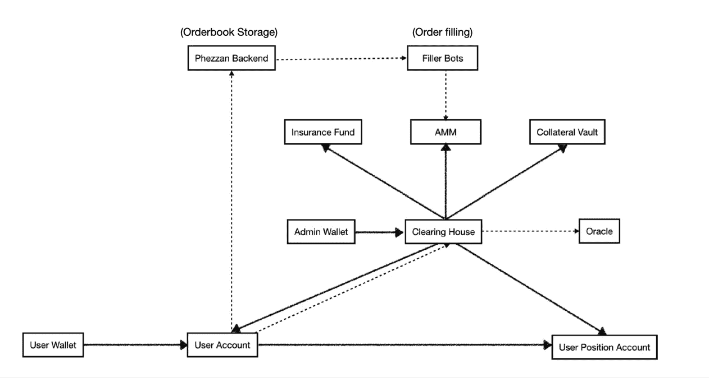

# Phezzan 协议测试网精简版论文

> 原文：<https://medium.com/coinmonks/phezzan-protocol-testnet-lite-paper-3f0af066aead?source=collection_archive---------8----------------------->

【注:本帖写回 2022 年 3 月。从那以后，Phezzan 协议发生了很大的变化。我们将在我们的 DEX 中使用收益率资产和稳定币，而不是 UST/澳大利亚，我们欢迎您加入我们的[社区](https://discord.gg/5dmBgdDA)！]

# 1.摘要

Phezzan Protocol 是一款为散户投资者打造的永久生息 DEX。它的测试网在 Rinkeby 上直播，并将在 2022 年 Q2 的 zkSync 2.0 上推出。

费森的使命是**让所有人的永久交易民主化。**

衍生品交易是金融市场的重要组成部分。目前，超过 70%的加密交易量来自永久交易。永久 dex 目前的市场份额不到 1%。在 5 年内，随着 NFT/SocialFi/GameFi 的发展，用户的资产将在链上，在 dex 上的交易将比在 CEXs 上的交易更方便。

散户投资者在永久 dex 上只有 0.5%-1%的交易量。这仅仅是因为永久索引不够快，不够便宜，而且设计糟糕。Phezzan 将是快速的，将有超级便宜的天然气费，并将是一个为散户投资者建立的协议。

# 2.费赞协议

# 2.1 DeFi 的分散稳定控制

Phezzan 团队认为 DeFi 是面向大众的，而不仅仅是面向少数人的。

许多 dex 的日交易量为 1 亿美元，但有大约 200 名用户，其中大多数是机器人。Phezzan 团队将为 Joe Sixpack 设计和构建 Phezzan 协议，而不仅仅是为老牌公司和鲸鱼。

为此，Phezzan 将在 zkSync 2.0 上推出，在不牺牲安全性的情况下，可以获得最佳的交易速度和最低的汽油费。

Phezzan 团队将尽力打造一款对散户友好的产品。

# 2.2 特点

## 2.2.1 多抵押品支持

Phezzan 协议将支持多种抵押品。用户可以存入稳定的硬币、收益资产和其他硬币作为抵押品。

## **2.2.2 押物赚 APY**

Phezzan 协议将支持产出承载资产，如 stETH 和 aDAI(作为示例列出，具体资产将在 mainnet 启动前确定)，作为抵押品。交易者和 LP 可以在使用 Phezzan 的同时赚取利息。

## 2.2.3 限价和止损单

Phezzan 协议将在其 mainnet 推出之前支持限价和止损单。

Phezzan 团队还没有确定实现细节，一旦我们确定了我们的设计，就会在这里更新。

## 2.2.4 友好的用户界面和 UX

Phezzan 团队多年来一直在制作社交网络产品。我们理解良好的用户界面/UX 对散户投资者的重要性。Phezzan 协议将努力成为最用户友好的永久索引。

# 2.4 Phezzan 协议设计

## 2.4.1 费赞使用 AMM 模型

Phezzan 协议测试网选择了混合订单簿/AMM 模型。对于流动性方面:

1) Orderbook 主要是针对不那么波动的资产的专业做市商，如 ETH。

2) AMM 主要面向零售有限合伙人。市场标记倾向于远离高波动性资产，如$APE 和$GMT。Phezzan Protocol 的 AMM 将很好地服务于这些不稳定的资产。零售 LP 不需要主动管理头寸来赚取费用。

对于交易方面，所有交易者可以使用 AMM 或订单簿。Phezzan 协议将在 mainnet 启动前支持限价单和止损单。

## 架构图

实线表示一个组件对另一个组件拥有权限。比如用户钱包对 Phezzan 协议上的用户账号拥有完全控制权。

虚线表示一个组件引用了另一个组件。例如，清算所可以调用 Oracle。

## 2.4.3 抵押品、交易对和杠杆

Phezzan 协议将支持多种抵押品。用户可以存入稳定的硬币、收益率资产和其他加密硬币作为抵押品。

Phezzan Protocol testnet 支持的交易对将包括 ETH 和散户喜爱的 2-3 枚硬币，如$APE 或$GMT。

Phezzan 协议测试网支持高达 10 倍的杠杆作用。

## 交易费用

Phezzan Protocol 的交易费将为交易规模的 0.1%，最低费用为 0.5 美元，以支付汽油费。交易者不需要担心汽油费。收取的交易费用的 70%将流向流动性提供商(LP)，其余的(30%)将流向 Phezzan Protocol。

Phezzan 协议有基于层的交易费用折扣。交易量较高的用户可以在交易费用上获得更多优惠。

Phezzan 协议也将有转介计划。推荐人在前 6 个月的交易中将获得 5%的交易费折扣。推荐人将获得推荐人交易费的 10%。

# 3.象征经济学和治理

Phezzan 协议将不会推出其令牌，直到有足够的产品市场适合以下原因。

1)让 Phezzan 团队在早期阶段专注于构建一个有意义的产品；

2)首先有机地生长 Phezzan 协议；

3)给 Phezzan 团队更多的时间来设计更好的记号组学；

4)将 Phezzan 协议与志同道合的长期思考用户和投资者联系起来。

Phezzan 团队相信社区和分权的力量。一旦 Phezzan 协议达到产品-市场契合度，Phezzan 团队将逐渐将对 Phezzan 协议的控制权移交给 Phezzan 社区。

理想情况下，Phezzan 令牌将于 2022 年第四季度与 Phezzan 协议 V2 一起推出。其白皮书将涵盖细节。

Phezzan 协议产生的费用将支持 Phezzan 令牌的价值。

Phezzan 团队正在研究一些关于记号组学的事情:

1)代币价值捕获来自交易费用和回购/烧钱；

2)交易费用折扣和投票权的象征性效用；

3)鼓励负责任投票的权力结构；

4)保守的初始令牌分布；

5)弹性通货膨胀/通货紧缩。

# 4.路标

# 4.1 测试网和 V1

Phezzan 团队计划在 2022 年 4 月在 zkSync 2.0 上推出 testnet，并在 2022 年 6 月在 zkSync 2.0 上推出 Mainnet V1。Phezzan 协议测试网和 V1 的参与者将在 Phezzan 令牌发布时获得追溯奖励。

# 4.2 维护网

Phezzan 团队计划在 2022 年第四季度推出 Phezzan 协议 V2 和 Phezzan 令牌。Phezzan 协议 V2 白皮书将涵盖细节。

> 加入 Coinmonks [电报频道](https://t.me/coincodecap)和 [Youtube 频道](https://www.youtube.com/c/coinmonks/videos)了解加密交易和投资

# 另外，阅读

*   [币安期货交易](https://coincodecap.com/binance-futures-trading)|[3 commas vs Mudrex vs eToro](https://coincodecap.com/mudrex-3commas-etoro)
*   [如何购买 Monero](https://coincodecap.com/buy-monero) | [IDEX 评论](https://coincodecap.com/idex-review) | [BitKan 交易机器人](https://coincodecap.com/bitkan-trading-bot)
*   [CoinDCX 评论](/coinmonks/coindcx-review-8444db3621a2) | [加密保证金交易交易所](https://coincodecap.com/crypto-margin-trading-exchanges)
*   [红狗赌场评论](https://coincodecap.com/red-dog-casino-review) | [Swyftx 评论](https://coincodecap.com/swyftx-review) | [CoinGate 评论](https://coincodecap.com/coingate-review)