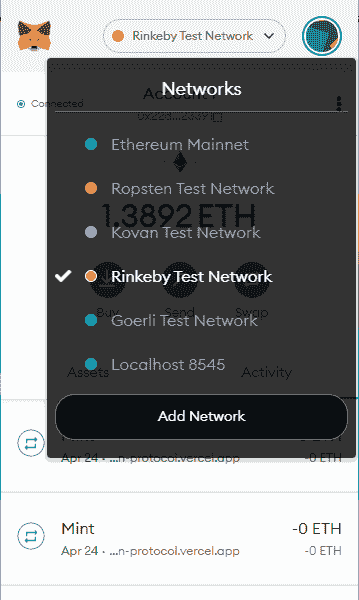
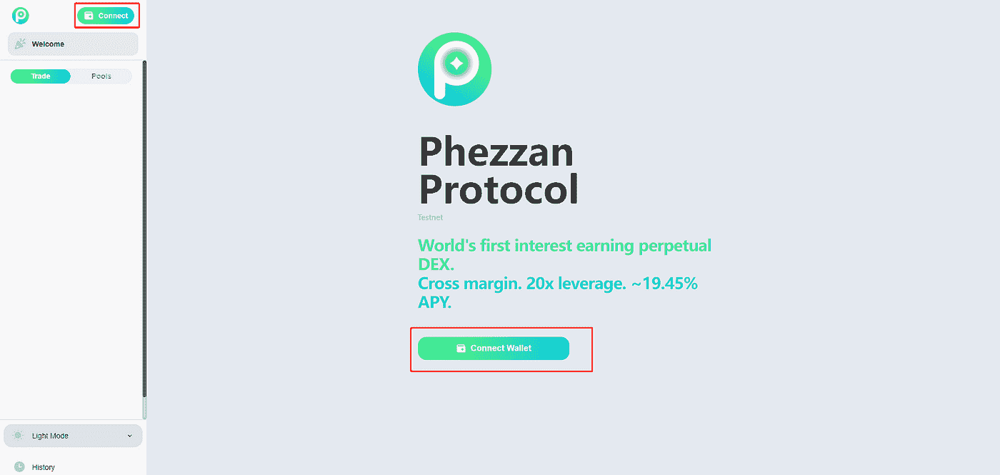

# Phezzan 协议测试网走查

> 原文：<https://medium.com/coinmonks/phezzan-protocol-testnet-walk-through-f041b0f21357?source=collection_archive---------0----------------------->

对于那些不熟悉 crypto 或 DeFi 的人来说，这是一个详细的演练。如果你是德根，请阅读我们的推文。Phezzan 协议测试网与其他测试网没有什么不同。

Phezzan 协议测试网网站:【https://testnet.phezzan.xyz/ 

Rinkeby 上选定的 Phezzan 协议 testnet 智能合同地址:

清算所:[https://rinkeby . ethers can . io/address/0x 033400 AC 31958 c 65d 3 ebb 7716 aa 55 ddabc 9261 f 4](https://rinkeby.etherscan.io/address/0x033400Ac31958c65D3ebb7716Aa55dDABc9261f4)

保险资金:[https://rinkeby . ethers can . io/address/0x 837 c 9 E0 d6c 708743 a 2d 010 a 5398 df 8 ff 2 EAD 9815](https://rinkeby.etherscan.io/address/0x837c9E0D6c708743A2D010a5398Df8FF2eAD9815)

金库:[https://rinke by . ethers can . io/address/0x 10997376148781 da 6b 68684 c 048 beb 13875 CDB 5d](https://rinkeby.etherscan.io/address/0x10997376148781Da6B68684C048BeB13875cdB5d)

# 1.Phezzan 协议简介

Phezzan 协议是一个有利息的永久索引。它使用 UST 作为报价货币，澳元作为抵押品/融资付款/PnL。

UST 是一个分散的算法稳定币，试图保持 1.00 美元的值。

aUST 是由 Anchor Protocol 发行的收益率资产。截至 2022 年 4 月 26 日，澳大利亚的 APY 为 19.39%。

# 2.关于 Phezzan testnet 和 Rinkeby

Phezzan 协议首先在以太坊的测试网 Rinkeby 上推出了它的测试网。然后 Phezzan 协议 testnet 会在支持 Solidity 向后兼容的情况下在 zkSync 2.0 上启动。

# 3.将 Rinkeby 添加到元遮罩中

Phezzan 团队建议您为 testnet 活动使用新地址。

3.1 来自 MetaMask 浏览器扩展

点击浏览器扩展上的 MetaMask 图标，然后点击“以太坊 Mainnet”，再从下拉菜单中选择“Rinkeby 测试网络”。

如果您在下拉菜单中没有看到 Rinkeby，请单击您的个人资料图片，打开 MetaMask 设置，选择“高级”，然后打开“显示测试网络”

3.2 来自 MetaMask Mobile

打开 MetaMask 应用程序，点击屏幕中间上方的“钱包”，然后选择“Rinkeby 测试网络”

# 4.如何获取 testnet ETH？

你将需要一些 testnet ETH 来支付汽油费，这比在 ETH mainnet 上交易便宜(在 Rinkeby 上每笔交易大约 0.00005ETH)，0.1 ETH 可以使用很长时间。在以下地址获取 testnet ETH:

[https://faucet.paradigm.xyz/](https://faucet.paradigm.xyz/)

[https://rinkebyfaucet.com/](https://rinkebyfaucet.com/)

[https://faucets.chain.link/rinkeby](https://faucets.chain.link/rinkeby)

他们都有某种限制，请相应地遵循他们的要求。

# 5.将您的钱包连接到 Phezzan Testnet

当你在 https://testnet.phezzan.xyz/的[上，点击“连接”或“连接钱包”，然后你可以使用 MetaMask 浏览器扩展或任何支持钱包连接的手机钱包。](https://testnet.phezzan.xyz/)

# 6.如何获得 testnet aUST？

将你的钱包连接到 Phezzan testnet，点击“存款”。

然后点击“认领 aUST”。

您每次将获得 100，000 澳元，您可以申请的次数没有限制。如果你想在 MetaMask 上显示你的 testnet aUST，令牌契约地址是*0x 5689 c8 c 064 aa 6 D3 e 05 C2 bb 94219d 09 c 49 c 53 EAA 2*。

请参见[https://meta mask . zendesk . com/HC/en-us/articles/360015489031-How-to-add-unlisted-tokens-custom-tokens-in-meta mask](https://metamask.zendesk.com/hc/en-us/articles/360015489031-How-to-add-unlisted-tokens-custom-tokens-in-MetaMask)了解如何向元掩码添加令牌的说明

# 7.将您的 aUST 存入和取出到 Phezzan Testnet

在您可以交易或提供流动性之前，您需要将您的 aUST 存入 Phezzan testnet。

当你在 testnet 网站上([https://testnet.phezzan.xyz/](https://testnet.phezzan.xyz/))，点击“存款”。

您将看到一个提示。输入您要存入的金额。如果这是您第一次存款，您需要先点击“批准”按钮。批准存款后，单击提示上的“存款”按钮。

类似于澳大利亚的提款。

# 8.如何交易？

在 testnet 网站的左侧面板，有一个可以交易的硬币列表。点击你想交易的硬币。

在右上角，您会看到一个表单，您可以在其中提交订单。目前，Phezzan testnet 仅支持市场订单。稍后将支持限价单和止损单。

您可以切换顶部的“长”和“短”，以选择长订单或短订单。

下面，你可以输入你想交易的金额。或者，您可以拖动“购买力”滑块来选择您想要使用的购买力百分比。

下面，你可以选择你能接受的最大滑动量。如果您的订单未能在您的最大滑点内执行，您的订单将失败，即使您仍然需要支付汽油费。

点击“确认多头/空头”提交您的订单。

一旦您的订单成功执行，您可以在底部面板查看您的头寸。

要平仓，只需点击底部面板中的“平仓”按钮。

# 9.如何做一个 LP？

在 testnet 网站的左侧面板上，切换“Pools”按钮。你会看到一个硬币清单，你可以提供流动性。点击你想提供流动性的硬币。

在网页右侧，点击“添加流动性”按钮。

在弹出的提示中，您可以选择您想要提供的流动性数量。你也可以选择价格范围和最大滑动公差。

点击“添加流动性”按钮进行确认。

一旦您的订单成功执行，您可以在“流动性头寸”部分查看您的 LP 头寸。

# 10.从哪里提建议？

你可以加入我们的 [Discord 服务器](https://discord.gg/phezzan)或者[电报组](https://t.me/phezzanprotocol)来提供一些反馈。我们感谢您的宝贵时间，并将认真倾听。也可以发邮件联系@phezzan.xyz

# 11.有焦点小组吗？

Phezzan 团队将尽力回答每一个问题，解决每一个建议。但是，如果由于数量原因，我们无法处理所有问题/建议，我们可能会成立一个焦点小组。如果我们将来选择成立焦点小组，我们将公布具体细节。

# 12.文空投？

**被选中的** testnet 参与者将在令牌发布会上获得 Phezzan 令牌空投。截至 2022 年 4 月 26 日，谁/何时/如何/快照等具体细节仍未确定。Phezzan 团队将在 testnet 关闭后**公布细节，很可能是在 token 发布会上。如果你只参加空投的 Phezzan 协议测试网，Phezzan 团队会尽力让你失望。**

最好的，

费森团队

> 加入 Coinmonks [电报频道](https://t.me/coincodecap)和 [Youtube 频道](https://www.youtube.com/c/coinmonks/videos)了解加密交易和投资

# 另外，阅读

 [## 6 2022 年最佳加密税务软件—回顾与比较

### 不管你是刚接触加密还是已经在这个领域呆了一段时间，你都需要交税。

medium.com](/coinmonks/best-crypto-tax-tool-for-my-money-72d4b430816b) 

*   [最佳以太坊钱包](https://coincodecap.com/best-ethereum-wallets) | [电报上的加密货币机器人](https://coincodecap.com/telegram-crypto-bots)
*   [交易杠杆代币的最佳交易所](https://coincodecap.com/leveraged-token-exchanges) | [购买 Floki](https://coincodecap.com/buy-floki-inu-token)
*   [3Commas 对 Pionex 对 Cryptohopper](https://coincodecap.com/3commas-vs-pionex-vs-cryptohopper)|[Bingbon Review](https://coincodecap.com/bingbon-review)
*   [加密复制交易平台](/coinmonks/top-10-crypto-copy-trading-platforms-for-beginners-d0c37c7d698c) | [如何在 WazirX 上购买比特币](/coinmonks/buy-bitcoin-on-wazirx-2d12b7989af1)
*   [CoinLoan 评论](https://coincodecap.com/coinloan-review)|[Crypto.com 评论](/coinmonks/crypto-com-review-f143dca1f74c)