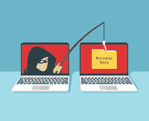
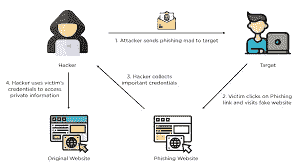

# 网络钓鱼攻击:如何识别它们并避免加密诈骗？

> 原文：<https://medium.com/coinmonks/phishing-attacks-how-to-recognize-them-and-avoid-crypto-scams-2c5775d3f27d?source=collection_archive---------53----------------------->

# 网络钓鱼攻击:如何识别它们并避免加密诈骗？

# 目录:

什么是网络钓鱼攻击？

钓鱼能彻底杜绝吗？

避免网络钓鱼攻击的提示

结论

随着加密货币世界的发展和在散户投资者中获得更广泛的接受，它吸引了各方的大量关注。

一方面，越来越多的个人现在对加密货币市场感兴趣，我们可以看到他们已经开始欣赏区块链技术的优势。与此同时，各种机构投资者也改变了立场，现在更支持加密货币作为合法的交易媒介。

然而，随着所有这些积极的关注，加密世界也为骗子提供了有利可图的机会，钓鱼欺诈在不同的加密货币交易所变得非常普遍

在本文中，我们将讨论什么是网络钓鱼诈骗，以及您可以采取哪些措施来防止受到此类攻击的影响。

# 什么是网络钓鱼攻击？

**网络钓鱼**是一种社交工程，攻击者旨在获取您帐户的敏感信息，如您的用户名、密码、私钥和您钱包的其他敏感信息。

虽然网络钓鱼攻击试图获取您所有帐户的信息，但本文将重点关注保护您的加密资产免受攻击。

# 不同类型的攻击

用户经常成为诈骗者采用的各种方法的网络钓鱼攻击的受害者，例如:欺骗、伪造或其他欺骗性的方法

电子邮件欺骗的使用

创建虚假网站(与原始网站相似)

发送带有虚假链接的即时消息(将您带到虚假交易所和您的钱包数据的链接)

带有虚假交易所和钱包链接的社交网站

与一个虚假的支持团队聊天(他们会欺骗您提供有关您钱包的敏感信息)

旨在获取您的加密货币钱包信息的 Wi-fi 网络钓鱼攻击

# 钓鱼能彻底杜绝吗？

对于数字公司是否真的可以安全到不可能出现网络钓鱼的程度，已经进行了大量的研究，但是，总体结果表明，网络钓鱼攻击无法完全阻止，而是可以由用户自己来阻止。

因此，作为用户，您有责任确保您的加密钱包是安全的，并且您不会被诈骗。

# 为什么完全免疫是不可能的？

让网站或加密钱包完全免受网络钓鱼攻击是不可能的，原因有几个，其中最大的原因是所使用的攻击形式在不断变化。

例如，当电子邮件提供商试图通过创建一个良好的垃圾邮件拦截器来防止用户接收诈骗电子邮件时，攻击者只是提高他们电子邮件的质量来绕过此类垃圾邮件过滤器。

一些攻击可以绕过安全措施，看起来完全合法。他们还针对那些更有可能点击网络上未经授权的域名链接的用户，从而增加了风险。

这基本上意味着减少网络钓鱼的责任在于加密货币交易所的用户，他们应该专注于改善他们的个人安全，以此作为防止此类安全漏洞的最佳方式。

虽然交易所可以加强其安全措施，以确保用户数据受到保护，不会发生泄露，但网络钓鱼更有可能以用户为目标，而不是以数字公司为目标，因为他们上当受骗的可能性要高得多。

# 避免网络钓鱼攻击的提示

随着攻击者在如何实施此类攻击方面变得越来越聪明、越来越先进，确切地知道如何防止自己成为目标就变得非常重要。下面讨论了一些在线访问加密货币时必须遵循的提示和建议。

# 提示 1:识别并避免搜索引擎中的虚假广告

当在 google 搜索引擎中键入 exchange 名称或转到外部来源或网站发送给您的任何链接时，请确保再次检查 URL 是否合法，即再次检查网站名称的拼写是否正确。点击谷歌广告时要格外小心，确保你检查的网址是合法的，因为众所周知钓鱼网站会发布虚假广告。

# 技巧 2:创建强密码

保护你的钱包免受恶意黑客攻击的一个最基本的方法是为你所有与加密相关的账户和钱包创建并使用强密码。这将防止黑客使用暴力攻击来尝试和猜测您的密码，以便他们可以窃取您的钱。

每当你为了交易而在加密货币交易所(或任何类型的钱包)上创建账户时，请确保你的密码和代码不会被轻易猜到。

最近的一项研究表明，超过 50%的用户在不同的账户间重复使用他们的密码，这是一个薄弱的安全措施，让骗子更容易获得你的详细信息，进而得到你的钱包。

一个强而安全的密码或代码通常超过 10 个字符，由字母、数字和特殊符号组合而成。大多数密码生成器在互联网上可以很容易地为您提供这样的密码，将保持您的数据安全，并确保您的钱包地址高度安全。

# 技巧 3:使用密码管理器

当你决定使用各种复杂的私钥和密码来保证加密货币账户的安全时，记住它们可能并不容易。这就是密码管理器等软件发挥作用的地方。

通过使用密码管理器，您可以确保永远不必记住钱包的凭证，同时仍然保持高度的安全性。这将防止恶意骗子能够窃取您的加密货币。

# 技巧 4:使用自动填充防止网络钓鱼

另一个优势是，由于大多数密码管理器都有自动填充选项，可以在您希望登录时输入您的凭据，因此它们可以帮助您识别页面看起来像您的加密交换的假冒网站。

因此，由于你的经理不会在这样的网站上自动填充你的证书，你可以发现这样的计划，是安全的。

# 技巧 5:启用双因素身份验证

与此同时，你应该采取的另一个重要措施是在你的账户上启用双因素认证，以增加另一层安全保护你的数据和数字资产。

这将确保没有人可以访问您的帐户或从您的加密钱包中提取资金，除非输入发送到您的手机或任何其他设备的代码。

这样做将要求钓鱼黑客能够访问你的手机，即使他们以某种方式获得了你的密钥和其他数据。

# 技巧 6:质疑一切

最后，确保你不会成为这种骗局的受害者的一个重要方法是简单地质疑一切。以下是你可以注意的:

## 可疑邮件

举个例子，如果你收到一封邮件，告诉你你的帐户已经被锁定，确保它是来自你的加密交易所的官方电子邮件地址。

同样，在点击你可能通过网站或社交媒体收到的任何页面链接之前，确保它们是合法的。

## 提供您的代码和登录详细信息

这同样适用于在任何网站上提供您的登录信息。通常，成为网络钓鱼受害者的人不会检查他们向其提供数据的网站是否合法，这导致他们损失金钱。

## 反网络钓鱼提示—演练

当你收到来自交易所的信息时，无论是通过电子邮件还是通过他们的社交媒体，这里有一些提示:

检查是否有官方账户或电子邮件联系过您。

确保您被引导至的页面的 URL 与您的交易所的 URL 完全相同，而不是类似的。

确保沟通风格和语言与您之前从公司收到的信息一致，并且不像来自骗子和攻击者的信息。

检查您的浏览器是否记得过去访问过该网站。如果你被带到交易所的网页，那么你的浏览器会识别出这家公司。

不要向您不认识的用户发送任何加密货币。没有交易所会联系你说你的账户被封了，可以用钱来交换，如果你收到这样的电子邮件，它很可能是由恶意攻击者发送的，他们希望通过访问你的钱包来窃取你的资金。

在您的设备上安装良好的防病毒软件，以确保您可以轻松检测到任何包含恶意软件或通过引入恶意软件而导致您的电脑面临风险的网站的电子邮件。

# 结论

虽然用户或交易所都无法完全防止网络钓鱼，但各种强大的安全措施可以确保您尽可能减少他们的机会，在这个数字世界中保护您自己和您的加密货币的安全。

> 加入 Coinmonks [电报频道](https://t.me/coincodecap)和 [Youtube 频道](https://www.youtube.com/c/coinmonks/videos)了解加密交易和投资

# 另外，阅读

*   [Bookmap 点评](https://coincodecap.com/bookmap-review-2021-best-trading-software) | [美国 5 大最佳加密交易所](https://coincodecap.com/crypto-exchange-usa)
*   [如何在 FTX 交易所交易期货](https://coincodecap.com/ftx-futures-trading) | [OKEx vs 币安](https://coincodecap.com/okex-vs-binance)
*   [CoinLoan 审查](https://coincodecap.com/coinloan-review) | [YouHodler 审查](/coinmonks/youhodler-4-easy-ways-to-make-money-98969b9689f2) | [BlockFi 审查](https://coincodecap.com/blockfi-review)
*   XT.COM 评论[币安评论](https://coincodecap.com/profittradingapp-for-binance) |
*   [SmithBot 评论](https://coincodecap.com/smithbot-review) | [4 款最佳免费开源交易机器人](https://coincodecap.com/free-open-source-trading-bots)
*   [比特币基地僵尸程序](/coinmonks/coinbase-bots-ac6359e897f3) | [AscendEX 审查](/coinmonks/ascendex-review-53e829cf75fa) | [OKEx 交易僵尸程序](/coinmonks/okex-trading-bots-234920f61e60)