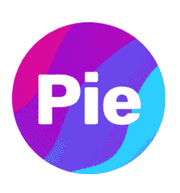
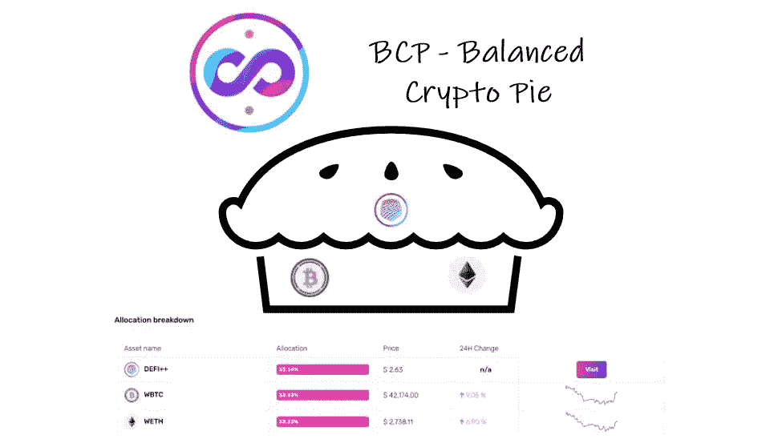
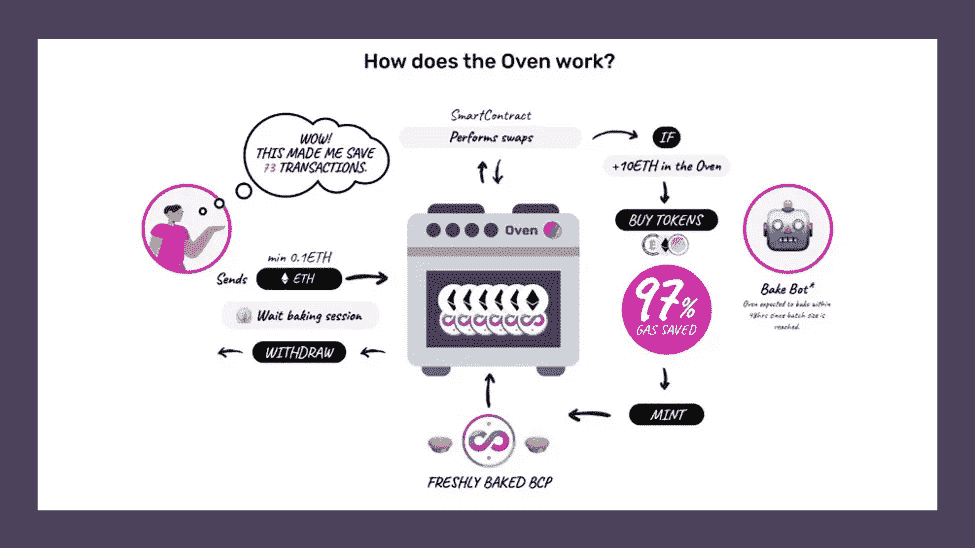
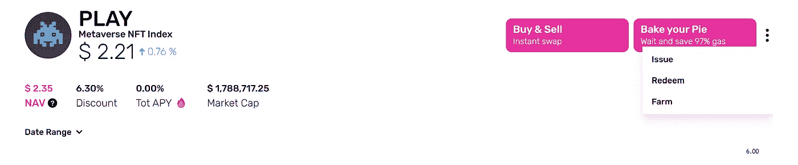
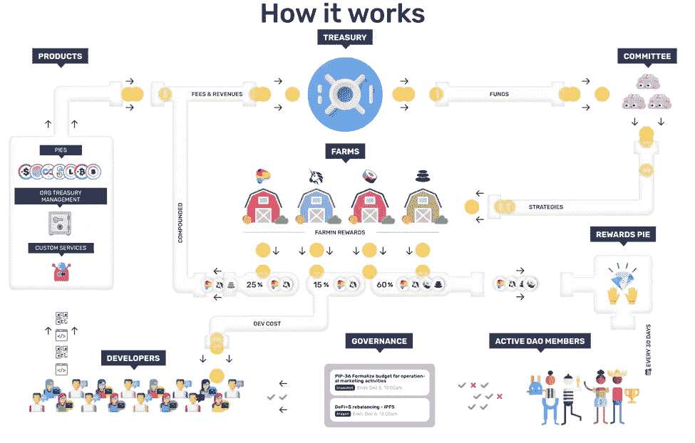

# 皮岛:美味网 3 曝光

> 原文：<https://medium.com/coinmonks/piedao-delicious-web3-exposure-7579d5335b12?source=collection_archive---------42----------------------->

Tasty

我成为#FulltimeTokenHolder 和 [@PieDAO](https://twitter.com/PieDAO_DeFi?s=20) 已经有一段时间了，我对自己花了这么长时间来写这个感到失望。这个小组非常出色，因为它为被动和主动用户都提供了选择。该协议及其背后的团队/社区有很大的潜力。我认为它为所有类型的 DeFi 用户提供了一种经济有效的方式来增加整个 web3 的曝光率。无论你是鲸鱼、小鱼、老手、新手，在[皮岛](https://www.piedao.org/#/)都有很好的机会。

# 成本有效的曝光

还记得汽油费一直在 100+的时候吗？你知道那段时间吗？每次我们看到汽油价格涨到 90 GWEI 时，我们都会有一种交易的幻觉。

这是一个很好的例子，说明 PieDAO 可以为那些希望以低成本获得广泛投资的个人提供好处。

让我们说，在一个非常基本的水平，我想购买一些$BTC，$瑞士法郎，以及良好的措施，让我们扔在一个混合的大，小盘代币从整个 DeFi 空间。我可能会对皮岛的[平衡密码派(BCP)](https://www.piedao.org/#/pie/0xe4f726adc8e89c6a6017f01eada77865db22da14) 感兴趣。这个饼图是一个指数或 16 个令牌的篮子，提供$BTC，$瑞士联邦理工学院，$MKR，$YFI，$寿司，$UNI，$UMA，$BAL 和许多其他主要的 DeFi 玩家。

我可以支付一大笔交易费来积累这 16 个代币。最重要的是，如果你试图抓住天然气价格的低端，这可能需要很长时间。

有了 PieDAO，我可以大幅减少这些交易、费用和时间。PieDAO 注意到节省了 97%的汽油，并消除了约 73 笔交易，以获得 BCP 指数中包含的令牌。

Can you smell what the BAKERY is cooking?

# 接触陌生的空间

Web3 以势不可挡的速度前进。即使是当地人和全职员工也很难跟上。普通的乔/约瑟芬/机器人应该如何获得巨大的机会，而不沉浸在他们可能非常松散理解的话题的持续新闻流中？

就我个人而言，我在 DeFi 领域花费了大量的时间、精力和精力，但我对 web3 游戏的未来非常乐观。皮岛的[戏派](https://www.piedao.org/#/pie/0x33e18a092a93ff21ad04746c7da12e35d34dc7c4)在这方面非常适合我。

通过拥有 PLAY，我可以接触到$MANA、$SAND、$AXS、$ILV 等大牌。PieDAO Giga-brains 和全职代币持有者大量参与 Web3 管理策略、更新和变化，以便我可以接触 Web3 的游戏方面，同时继续关注 DeFi。这再次为我节省了研究和交易的时间以及成本。

# 索引标记很棒，但是…

如果我想要我持有的馅饼中的实际资产呢？你可以拥有它们！😊

没错。如果您想兑换您的$PLAY PIE 或任何其他 PIE，您可以兑换下面的代币！虽然您将不得不运行更多的交易，但这仍然比不上 PieDAO 通过将所有这些资产“烘焙”成一个馅饼而为您节省的交易数量。

# 参与是值得的

虽然以上几点主张采取更被动的方法，皮岛也有机会采取更积极的立场。用户可以为$veDOUGH 投入$DOUGH 来参与治理投票。一旦下注，会员将被视为“[全职代币持有者](https://www.piedao.org/#/staking-simulator)”。全职员工对整个协议的治理进行投票，并每月获得当月所选馅饼的$片奖励。这使得全职员工有动力确保 PIE 以积极的方式得到管理，并关心整个协议本身。活跃会员获得 60%的 DAO 利润，剩下的 40%在财资部(25%)和 Dev (15%)之间分配。一个重要的注意事项是，只有积极的成员得到奖励。要成为“活跃”会员，会员需要每月至少参与一次 DAO 快照投票。

# 在面包店周围嗡嗡作响

PieDAO 在 web3 领域有一个非常活跃的社区，并充分利用了这一点。代币持有者已经从 NFT 伙伴关系、奥克索早期访问、POAP 的(对你的收藏者来说)以及更多的项目中受益。更令人兴奋的是，我们看到了第一个似乎是新举措的举措，即资金管理。[沙盒游戏刚刚被宣布成为新的财政管理试点项目](https://twitter.com/piedao_defi/status/1503818446676676617?s=21)的一部分！全职员工和面包师似乎要变得更忙了，我只能想象当这项新举措开始实施时，人们对$SLICE 奖励的兴奋程度。

感谢阅读！任何/所有错误或不准确是我自己的。

链接:

*   馅饼—【https://www.piedao.org/#/pies 
*   学习—[https://www.piedao.org/#/learn](https://www.piedao.org/#/learn)
*   烤箱—[https://www.piedao.org/#/oven](https://www.piedao.org/#/oven)
*   不和谐—[http://discord.link/PieDAO](http://discord.link/PieDAO)
*   推特——https://twitter.com/PieDAO_DeFi?s=20
*   中等—【https://medium.com/piedao 
*   论坛—[https://forum.piedao.org/](https://forum.piedao.org/)
*   文件—[https://docs.piedao.org/](https://docs.piedao.org/)
*   活跃的社区成员(有偿治理)——[https://www.piedao.org/#/staking-simulator](https://www.piedao.org/#/staking-simulator)
*   沙盒公告[https://twitter.com/piedao_defi/status/1503818446676676617?s=21](https://twitter.com/piedao_defi/status/1503818446676676617?s=21)
*   沙盒游戏推特[https://twitter.com/thesandboxgame?s=21](https://twitter.com/thesandboxgame?s=21)

> 加入 Coinmonks [电报频道](https://t.me/coincodecap)和 [Youtube 频道](https://www.youtube.com/c/coinmonks/videos)了解加密交易和投资

# 另外，阅读

*   [我的密码交易经验](/coinmonks/my-experience-with-crypto-copy-trading-d6feb2ce3ac5) | [比特币基地评论](/coinmonks/coinbase-review-6ef4e0f56064)
*   [CoinFLEX 评论](https://coincodecap.com/coinflex-review) | [AEX 交易所评论](https://coincodecap.com/aex-exchange-review) | [UPbit 评论](https://coincodecap.com/upbit-review)
*   [AscendEx 保证金交易](https://coincodecap.com/ascendex-margin-trading) | [Bitfinex 赌注](https://coincodecap.com/bitfinex-staking) | [bitFlyer 审核](https://coincodecap.com/bitflyer-review)
*   [麻雀交换评论](https://coincodecap.com/sparrow-exchange-review) | [纳什交换评论](https://coincodecap.com/nash-exchange-review)
*   [维护卡审核](https://coincodecap.com/uphold-card-review) | [信任钱包 vs MetaMask](https://coincodecap.com/trust-wallet-vs-metamask)