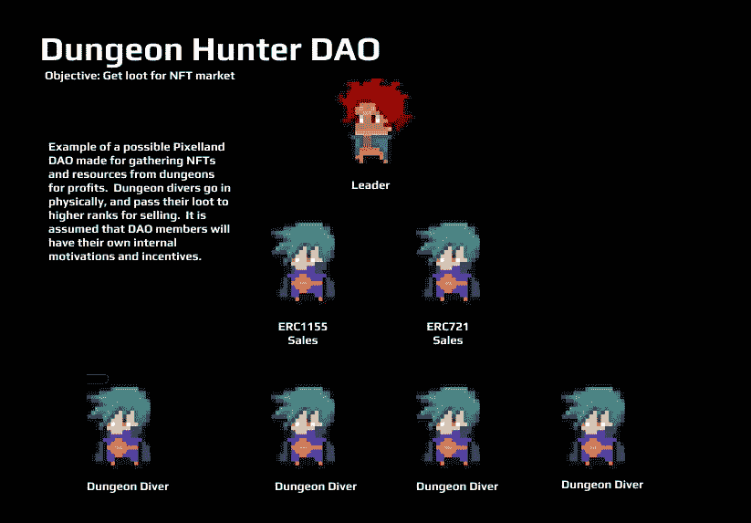

# 像素与道

> 原文：<https://medium.com/coinmonks/pixelland-daos-836bfc9e5acc?source=collection_archive---------70----------------------->

氏族、派系和公会一直是游戏世界中令人兴奋的部分。部落鼓励社会互动和协调的游戏策略，这增强了玩家的体验和沉浸感。玩家经常利用部落进行突袭来对抗具有挑战性的首领，并为他们的成员获得最好的战利品。这就是 Pixelland 选择加入 DAOs 并鼓励玩家合作的原因。由于 DAO 当然是链上的，玩家可以自由地为 Pixelland 构建他们想要的任何类型的 DAO，并且顶级 DAO 将在游戏内的氏族菜单上可见。DAOs 将使 Pixelland 的经济变得更加互动和复杂，并给玩家更多定制的任务来为他们的氏族完成。每一个成功的道都会有一个名字，等级结构，目的，以及对其成员的奖励分配方案。只有像素和聚焦 Dao 将被包括在游戏内的氏族菜单中。可能的 Dao 例子: **NFT 猎人**:一个部落是为了积累尽可能多的 NFT 而建立的。这个部落很特别，因为它没有领袖，而且它包含了限制出售非道的智能契约。只有会员可以装备和使用这些物品，但是没有特别的投票他们不能出售。

**建筑者工会**:这个部落专注于获取石头和木头等资源，用于建造专门的房屋和耕种。他们的目的是垄断木材和石材市场，并确保所有成员都有足够的资源。**商人刀**:商人刀，用于在市场上买卖资源和非物质财富以获取利润。顶级奸商可以根据结果逐级晋升，并获得佣金。其他玩家和公会经常会找这个公会来推销他们的物品。

时尚收藏者之刀:这是一个刀的例子，其主要目的是让玩家在 Pixelland 穿得最有创意，并尽可能地时尚。这个公会可能会举办选美或服装比赛，最受欢迎的角色会得到奖励和捐赠。这把刀是专为娱乐而造的，但也可以用来推销非功能性食品和广告。

正如你所看到的，在 Pixelland 中有许多有趣的 Dao 用例，我们相信它将极大地增强 Pixelland 的游戏环境。Dao 通过鼓励复杂的社会发展，使 Pixelland 更具互动性，并增强了市场经济。这个列表是 Pixelland 中各种 Dao 的一个例子，并不详尽。玩家将拥有 EVM 和智能合约的完全自由来决定他们想要如何建立他们的 Dao。

*   VRMETA

> 加入 Coinmonks [电报频道](https://t.me/coincodecap)和 [Youtube 频道](https://www.youtube.com/c/coinmonks/videos)了解加密交易和投资

# 另外，阅读

*   [折叠 App 审核](https://coincodecap.com/fold-app-review) | [Kucoin 交易机器人](/coinmonks/kucoin-trading-bot-automate-your-trades-8cf0ca2138e0) | [Probit 审核](https://coincodecap.com/probit-review)
*   [如何匿名购买比特币](https://coincodecap.com/buy-bitcoin-anonymously) | [比特币现金钱包](https://coincodecap.com/bitcoin-cash-wallets)
*   [币安 vs FTX](https://coincodecap.com/binance-vs-ftx) | [最佳(SOL)索拉纳钱包](https://coincodecap.com/solana-wallets)
*   [比诺莫评论](https://coincodecap.com/binomo-review) | [斯多葛派 vs 3Commas vs TradeSanta](https://coincodecap.com/stoic-vs-3commas-vs-tradesanta)
*   [Capital.com 评论](https://coincodecap.com/capital-com-review) | [香港的加密借贷平台](https://coincodecap.com/crypto-lending-hong-kong)
*   [如何在 Uniswap 上交换加密？](https://coincodecap.com/swap-crypto-on-uniswap) | [A-Ads 评论](https://coincodecap.com/a-ads-review)