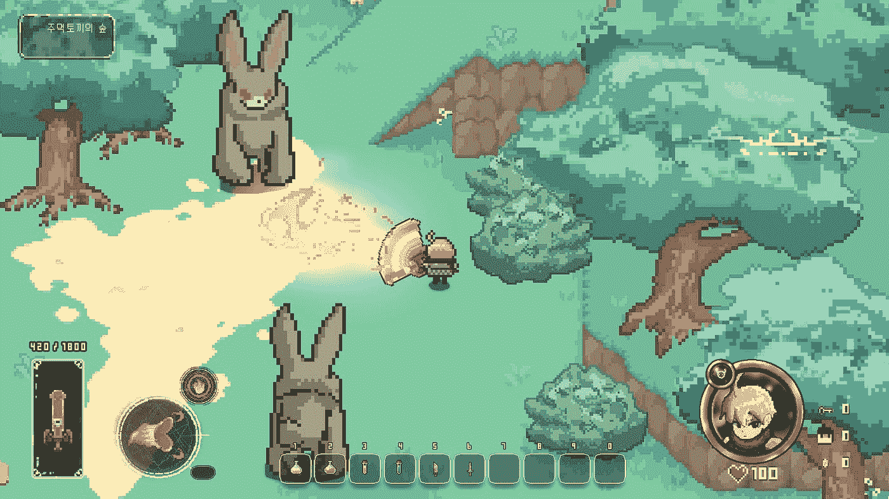

# 像素世界游戏功能

> 原文：<https://medium.com/coinmonks/pixelland-game-features-9ff51ba9ef50?source=collection_archive---------44----------------------->

在 Pixelland，来自任何背景的每个人都可以在这个广阔的元宇宙找到事情做并享受。从探索野外到农耕，从地牢潜水到钓鱼，有很多可以体验的。

Fighting monsters in the wild. Players can use spells, potions, weapons and armor to boost their chances of survival.

**制作** —玩家可以将资源和难以找到的物品组合起来制作装备和特殊消耗品，供自己使用，或者在公开市场上作为 ERC1155 或 ERC721 NFTs 出售。该装备用于定制或支持进入危险区域。玩家制造附魔、武器和药剂供自己使用或在探险时使用。

**探索**——没有一个巨大的世界可供探索，任何现代游戏或元宇宙都是不完整的。玩家可以探索像素世界中的一切:地牢和洞穴，田野和森林，城镇和村庄，荒地和海滩。没有流浪者会对探索像素世界感到无聊。Pixelland 的每个地形都有不同种类的怪物和与之匹配的战利品。

Exploring the ice caps of Pixelland. Snow monsters and cool winter pets ^^

**资源收集**—pixel land 的许多活动都需要资源，并鼓励玩家为所有活动收集资源。这些包括制造、建造、食用和建造特殊的非功能性食物。采矿、砍树、收集骨骼、捕鱼和耕作只是在 Pixelland 中手动获取资源的方式的几个例子。其他方式包括在市场上交易有价值的武器和装备，以从其他玩家那里换取这些资源，或者为任务给予者执行任务并获得它们作为奖励。

Forming a group with the game chat system.

社交互动——pixel land 有一个简单的聊天工具，所以朋友们可以在游戏中互相聊天。玩家可以这样讨论组建团队、游戏内市场趋势、谈判交易和合作。

**怪物狩猎** —旅行和探险最令人兴奋的原因之一就是寻找怪物和测试你的技能。在 Pixelland，有许多怪物需要寻找和战斗。有些很容易找到并掉落像样的战利品，而有些则很罕见且难以击败。他们越难被发现和击败，NFTs 掉落就越罕见。一些怪物会掉落特殊的原料来制作。像素世界的怪物包括骷髅、不死生物、强盗和巨大的怪物兔子等等。

这是玩家在 Pixelland 中可以做的所有事情的简要概述。我们正在把 Pixelland 打造成一个内容不断丰富的开放世界 MMORPG。玩家可以期待 Pixelland 与其他流行的 MMORPGs(如魔兽世界、无尽的任务和激战)处于同一类别，拥有所有相同的功能。

Pixelland 的一个独特之处在于，它也可以作为一款单人游戏来玩。玩家仍然可以离线玩游戏，积累相同的资源和战利品，以后当他们选择这样做时，可以在 Web3 市场进行交易。

由于 Pixelland 是一个社区驱动的游戏，我们重视感兴趣的读者的投入和想法。你对 Pixelland 迄今为止的游戏特色有什么看法？你想看看还有什么补充吗？我们很想听听你的想法和主意，它们很可能会包含在游戏中！:)

— VRMETA

> 加入 Coinmonks [电报频道](https://t.me/coincodecap)和 [Youtube 频道](https://www.youtube.com/c/coinmonks/videos)了解加密交易和投资

# 另外，阅读

*   [3 商业评论](/coinmonks/3commas-review-an-excellent-crypto-trading-bot-2020-1313a58bec92) | [Pionex 评论](https://coincodecap.com/pionex-review-exchange-with-crypto-trading-bot) | [Coinrule 评论](/coinmonks/coinrule-review-2021-a-beginner-friendly-crypto-trading-bot-daf0504848ba)
*   [莱杰 vs n rave](/coinmonks/ledger-vs-ngrave-zero-7e40f0c1d694)|[莱杰 nano s vs x](/coinmonks/ledger-nano-s-vs-x-battery-hardware-price-storage-59a6663fe3b0) | [币安评论](/coinmonks/binance-review-ee10d3bf3b6e)
*   [Bybit Exchange 审查](/coinmonks/bybit-exchange-review-dbd570019b71) | [Bityard 审查](https://coincodecap.com/bityard-reivew) | [Jet-Bot 审查](https://coincodecap.com/jet-bot-review)
*   [3 commas vs crypto hopper](/coinmonks/3commas-vs-pionex-vs-cryptohopper-best-crypto-bot-6a98d2baa203)|[赚取加密利息](/coinmonks/earn-crypto-interest-b10b810fdda3)
*   最好的比特币[硬件钱包](/coinmonks/hardware-wallets-dfa1211730c6) | [BitBox02 回顾](/coinmonks/bitbox02-review-your-swiss-bitcoin-hardware-wallet-c36c88fff29)