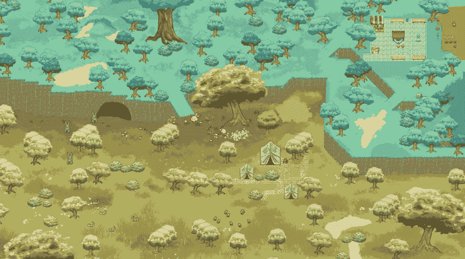

# Pixelland:为什么像素对元宇宙来说是完美的

> 原文：<https://medium.com/coinmonks/pixelland-why-pixels-are-perfect-for-metaverse-85b624f0ccc8?source=collection_archive---------30----------------------->

Pixelland 是 VRMETA 生态系统中最令人兴奋的项目之一，这是有充分理由的。Pixelland 是一款基于 2D 像素的元宇宙，具有无限的可扩展性，在游戏中可以做很多事情。

Pixelland 的 2D 引擎允许整个游戏直接存储在电脑的系统内存中。因此，世界上任何人，无论计算机规格或金融背景，都可以玩和享受 Pixelland。即使是移动设备也可以安全地运行 Pixelland 而不会出现故障。

**像素:元宇宙的未来**

像素…元宇宙的未来？！？！？是的，像素是 metaverses 的未来。“像素”是可以控制的最基本的计算机图像形式，因此它们的存储要求是最低的。Pixelland 将不会是那些越来越常见的需要 60 多 GB 存储空间的 AAA 游戏之一；不，Pixelland 将低于 300 MB。此外，不要被像素的简单本质所迷惑——它们允许非常优秀的艺术家最大限度地控制他们的设计，而不受现代 3D 引擎的限制。正如你在上面的图片中看到的，我们的艺术家已经掌握了 3D 世界的像素艺术风格，而没有牺牲性能。

Battling in a dungeon with magic!

由于运行 Pixelland 的性能要求较低，我们的游戏开发人员可以更少地关注图形，而更多地关注元宇宙中真正重要的内容和功能。你有没有注意到最近，新的游戏不断牺牲游戏功能，同时获得越来越好的图形？一个明显的例子就是*上古卷轴*系列。*晨风*被粉丝们认为是传奇，充满了丰富的派别，广阔的任务故事线，每种武器的多种技能，以及创造性的地下城。在那之后的每一个连续的游戏都提高了游戏的真实性，但是在每一个连续的版本中放弃了许多技能树，派系和能力。《上古卷轴》系列在这方面并不孤单，因为当前的游戏场景充斥着这种对现实主义的牺牲。进一步增加的问题是，这些游戏选择尽可能真实的图形疏远了许多潜在的玩家，因为不断增加的技术规格要求和摆脱球迷喜爱的功能。

Pixelland 通过基于像素的方式解决了这个问题。它可以同时运行多个敌人，具有宏伟的魔法效果和动画，并且包括比像 Skyrim 这样的大型 AAA 游戏更多的功能。当 Pixelland 想要添加更多功能时，它相对简单——添加功能和动画就完成了。这方面的一个例子是砍伐树木获取木材的能力，木材是像素世界中用于建筑的重要资源。这个功能对 Pixelland 的生态系统真的很重要，如果我们专注于现实主义，它就不可用。这将需要更多的时间来开发游戏中的物理障碍。

我们希望我们的玩家感觉他们在一个真实的元宇宙，远离现实。人们经常玩游戏，这样他们可以发挥想象力，表达自己，而不受现实的限制。Pixelland 独特的艺术风格让玩家以一种容易理解的方式成为他们想成为的人。

**虫子**

基于像素的游戏的另一个巨大优势是减少了破坏游戏的错误。3D 游戏在发布时经常受到 bug 的困扰，这通常是由游戏对象不能正常运行游戏物理造成的。即使它们看起来很高级，这些物体也需要更多的关注来确保碰撞平面不会与其他游戏物体冲突。这个问题在基于 2D 像素的游戏中变得无关紧要；碰撞平面被压缩成一个单一的[x，y]平面(2D)，大大降低了游戏出错/崩溃的可能性。这个[x，y]网格也非常适合我们的智能合同来有效地跟踪和记录土地所有权。Pixelland 的 2D 引擎让我们的游戏制作人可以更有效地专注于游戏和测试 bug，这样我们就可以为社区带来更多内容。我们的游戏不太可能出现错误，这对于我们的 Web3 功能来说极其重要，在 web 3 功能中，性能应该是一致的，并且不受所有攻击媒介的影响。

你怎么想呢?请在下面的评论中告诉我们！

*   VRMETA

> *加入 Coinmonks* [*电报频道*](https://t.me/coincodecap) *和* [*Youtube 频道*](https://www.youtube.com/c/coinmonks/videos) *了解加密交易和投资*

# 另外，阅读

*   [Bookmap 评论](https://coincodecap.com/bookmap-review-2021-best-trading-software) | [美国 5 大最佳加密交易所](https://coincodecap.com/crypto-exchange-usa)
*   最佳加密[硬件钱包](/coinmonks/hardware-wallets-dfa1211730c6) | [Bitbns 评论](/coinmonks/bitbns-review-38256a07e161)
*   [新加坡十大最佳加密交易所](https://coincodecap.com/crypto-exchange-in-singapore) | [收购 AXS](https://coincodecap.com/buy-axs-token)
*   [红狗赌场评论](https://coincodecap.com/red-dog-casino-review) | [Swyftx 评论](https://coincodecap.com/swyftx-review) | [CoinGate 评论](https://coincodecap.com/coingate-review)
*   [投资印度的最佳加密软件](https://coincodecap.com/best-crypto-to-invest-in-india-in-2021)|[WazirX P2P](https://coincodecap.com/wazirx-p2p)|[Hi Dollar Review](https://coincodecap.com/hi-dollar-review)