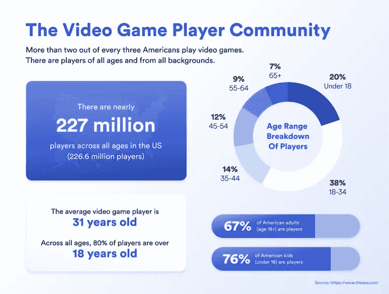

# 游戏赚钱——加密市场的新趋势，它可能是一种收入解决方案吗？

> 原文：<https://medium.com/coinmonks/play-to-earn-a-new-trend-on-the-crypto-market-could-it-be-an-income-solution-c55f4e42b2a5?source=collection_archive---------57----------------------->

## 为了赚钱而玩——这是什么？

电子游戏已经改变了整整一代人的娱乐偏好。自 1958 年《双人网球》的序言以来，游戏风靡全球，像《英雄联盟》、《堡垒之夜》和《《我的世界》》这样的游戏被全球数百万玩家玩了。

2018 年，路透社报道称，游戏在利润方面已经超过了与图片、电视和音乐类似的其他娱乐媒体，这种逐渐上升的趋势没有减速的迹象。娱乐软件协会(ESA) [估计有 2 . 27 亿美国人玩视频游戏](https://www.ign.com/articles/new-esa-report-reveals-covid-19-pandemic-changed-gaming)——大约占全国人口的 66%。衡量无数的条纹和偏见，视频游戏是文化和娱乐的巨大力量。

[**视频游戏**](https://en.m.wikipedia.org/wiki/Blockchain_game) 发明家们已经建立了一个种类繁多的数字世界，植入了大量的游戏机制、视觉美学和叙事姿态。无论是通过引人入胜的故事，完美的游戏，还是基于技能的多人动态，录像带游戏为玩家提供了大量引人入胜的互动手势，这些手势很容易通过其他媒体复制。

在曾经无数次，一种新型的游戏体验已经在区块链生态系统内生根发芽，被称为 [**【玩赚】【P2E】**](https://en.m.wikipedia.org/wiki/Blockchain_game)。这种游戏的兴起秩序提供了游戏内货币的内在力量，以及加密货币和[不可替代代币](/@BitYard/still-looking-for-nft-cryptos-to-buy-here-are-our-top-5-choices-aef36618f422?source=your_stories_page----------------------------------------)(NFT)所带来的细节，它们与更大的、与现实世界价值相关联的数字节俭有着直接联系。

这篇文章探讨了这种从玩到赚的游戏的初步转变对区块链的影响，玩家为他们在游戏中投入的时间、麻烦和财阀获得了实实在在的奖励。

## 了解游戏中的价值:

游戏内价值指的是游戏内细节具有现实世界价值的奇迹。对于各种各样的热门游戏来说，游戏内的价值已经有了不可动摇的趋势。事实上，传统的游戏盈利模式已经证明，如果有合适的环境和地形，玩家会对录像带游戏的内容给予包容性的价值，从游戏功能到功能性和纯粹装饰性的游戏细节。

在类似于[**【CSGO】**](https://www.counter-strike.net/)[**Valorant**](https://playvalorant.com/en-us/)【魔兽世界】【Genshin Impact】等游戏中，强劲的商业和对罕见游戏细节的估价进一步显示了玩家在多种多样的录像带游戏中创造价值的增长趋势。

**CSGO 是一款流行的、极具竞争力的多人第一人称射击(FPS)游戏。在传统模式中，玩家加入一个五人排，与另一个五人排对抗。配备了许多可供所有玩家反向使用的精选细节，那些具有时尚游戏感和目标完美性的玩家会上升到排行榜的首位。**

**CSGO**中一些最珍贵的装饰性兽皮在游戏外的商业中以敲掉数千块骨头的价格出售。在游戏平台内，玩家还可以购买“盒子”，或破坏盒，它们分布着各种随机的游戏细节。这些细节纯粹是装饰性的，但罕见的细节很大程度上受到 CSGO 玩家的重视。****

********

****Other Videotape game stripes similar as largely multiplayer online part- playing games (MMORPGs) offer particulars that give players an in- game advantage. These games frequently employ a “ pay-to- palm” model, in which the players who spend the utmost plutocrat and time have the strongest attributes or most important particulars available in the game.****

****然而，与**、 [**不同的是，MMORPG**](https://en.m.wikipedia.org/wiki/Massively_multiplayer_online_role-playing_game)在很大程度上保证了与现实世界节俭的正式联系——然而，它们经常既有强劲的游戏内请求，也有未经批准的交易，即游戏内商品被兑换成真实货币。未经批准的交易很常见，玩家在游戏之外进行交流以进行点对点交易或使用第三方网站，这些网站在没有游戏提供商许可的情况下进行交易。这可能会影响游戏中的修正，玩家通过这种方式来应对威胁。尽管如此，需求是存在的，并且许多玩家参与了这些地下请求。******

****在类似 Genshin Impact 的“gachapon 游戏”中，为了获得时尚的细节和角色，玩家不断地在现实世界的财阀身上花钱，游戏中的价值占了游戏发明者利润的相当大一部分。在很大程度上受欢迎的 Genshin Impact 的 gachapon 模型导致这款游戏在第一时间比其他任何游戏都带来了更大的利润，证明了游戏内商品作为价值驾驶者的力量——对于没有内置玩家业务的游戏来说确实如此。****

****无论是当玩家在基于技能的 FPS 中摧毁对手时的酷酷的新皮肤，还是通过游戏中的[**【MMORPG】**](https://en.m.wikipedia.org/wiki/Massively_multiplayer_online_role-playing_game)或 gachapon 宠溺箱获得最强的细节，一个明确的事实是，这些游戏中的细节的真正价值是由玩家创造并永久化的。通过决定购买游戏中的细节或垃圾盒，玩家以一种真正真实的方式赋予一个看不见的数字物品价值。****

## ****是什么推动了游戏价值？****

****游戏价值的概念经常让非游戏玩家感到困惑。为什么玩家如此看重游戏中的细节？****

****一个核心原因是，类似于同行竞争和社交商务的社交刺激，以及类似于表现和刺激的因素，构成了玩家玩视频游戏的动机的很大一部分。玩家经常在游戏周围创建社区，这些社区时尚地满足这些自然需求，从内到外创造价值。****

****这可以通过看一个类似高尔夫球的传统体育运动的插图来理解。在基地位置，可以单独打高尔夫。找一套球杆，找一门课程，你就可以开始了。这是单人高尔夫。****

****尽管如此，单人高尔夫在多人模式中获得了新的动力。有了一群火枪手，高尔夫成为一种竞技和社交体验。每一杆都要与其他杆进行比较，标准杆成为标准，技能等级也变得明显。火枪手(或对手)出现了，社会规模开始形成，游戏作为玩家消磨时间的有意义的方式变得越来越不重要。****

****高尔夫环境中的社会地位通过类似于球杆和服装的细节来体现，这两者都强调并超越了价值方面的纯粹里程。在单人模式下，只有让球员的击球更加、更加重要或更加准确的高尔夫球杆才是珍贵的。现在，考虑到社会动态和竞争游戏的加入，那些高尔夫球杆确实更加珍贵。在这种新的动态下，类似于专业人士的印花 t 恤和头饰的商品成为了一种身份，增加了社会和现实世界的价值。****

****这在流行的专业健身操中非常普遍。从运动员赞助的鞋子到墨水球衣和游戏装备，世界各地的傻瓜都在这些收藏品中找到价值，其中许多都没有实际里程。流行的录像带游戏正在传递这种完全相同的效果，表现为游戏中珍贵的细节和货币。****

****作为一个协作者，玩家们蜂拥至那些在娱乐和社区方面都符合他们要求的游戏中。无论是提供一个有趣的竞争体验，提供一个受欢迎的分心，还是满足其他一些核心需求，游戏内的价值是通过结合游戏和它的玩家来建立的。通过在正确的地形中进行功能整合，玩家和游戏共同努力，为游戏价值奠定了坚实的基础。尽管如此，实际上许多游戏都实现了这种协同平衡。****

## ****通过游戏赚钱建立玩家经济:****

****众多兴起的 [**区块链游戏**](https://en.m.wikipedia.org/wiki/Blockchain_game) 正致力于通过 [**NFTs**](https://en.m.wikipedia.org/wiki/Non-fungible_token) 给予玩家游戏中细节的经验数字力量，并通过纪念活动将游戏中的货币与现实世界的需求联系起来。这些游戏适合于通过无许可的、玩家控制的管理为玩家提供公平的、无偏见的、切实有益的游戏体验。****

****通过 [**【区块链】**](https://en.m.wikipedia.org/wiki/Blockchain_game) ，游戏可以来玩来赚，玩家驱动的价值附录允许健壮、独特和正式的畜牧业的诞生。虽然从开发的角度来看，游戏的雏形可能会被巩固，但是游戏中的非功能性游戏和玩家交易都是不允许的。在这些开放的平台上，没有现实可以放弃交易细节的能力或者从玩家那里拿走游戏中的细节。****

****区块链和 NFTs 建立在半透明、分散和协作决策的基础上，可以作为新游戏的基础起点，以这些价值观从头开始，或者作为游戏开始走向更平等和公平的系统——为真正的玩家拥有的游戏打开大门。****

## ****NFT 如何支持基于技能的游戏:****

****技能型游戏的玩家也可以从 [**NFTs**](https://en.m.wikipedia.org/wiki/Non-fungible_token) 中获利。纯粹装饰性的细节对其他玩家来说确实很珍贵，更正式的商业和节俭可以将这些游戏带到未来的位置。****

****像《CSGO》这样的游戏，以前有商业运作来促进游戏内部细节和外部世界的交易，可以从更低的运费和更友好的姿态中获利。此外，**权力和转让在没有游戏开发公司参与的情况下也是可能的，这有助于建立基于经验权力的抵制删节的生态系统，类似于第三方商务和使用相同 NFTs 的新产品。******

## ******从玩到赚的模式转变:******

******“玩即赚”游戏的全部可能性尚未完全实现。用于点对点信息传输的社交媒体平台的时尚性见证了音调影响者、音乐家和三角旗形成了基于数字广告、微支付和订阅模式的全新畜牧业。此外，通过协作决策和数字手段的经验力量，play to earn 有能力改变录像带游戏的游戏规则。******

******随着玩家适合分享他们游戏时间的价值，玩游戏的可能性是无限的，而**[**加密货币**](https://www.bityard.com/account/register?ru=AebNkR&f=Medium) 和分散的神秘网络是重要的工具，可以为这种新一代的视频游戏提供进一步的有效性、时机和结构。********

****这些处决才刚刚开始。虽然无法确切知道未来会是什么样子，但区块链技术的核心原则指向通过公平、权力和向所有人开放的请求来增加玩家佣金。****

****阅读更多信息:****

**** [## 产量农业解释说。

### 产量农业是一种实践，它利用或推进加密手段，以在市场中获得高回报或高价格

medium.com](/@BitYard/yield-farming-explained-3e9d07fbf409)  [## 什么时候是“买入蘸酱”的好时机？

### “当在股票和密码中提出好的策略时，买进是最常见的迷因之一…

medium.com](/bityard/when-is-it-a-good-time-to-buy-the-dip-b00eb291f8f1) 

比特码交换:[**BitYard.com**](https://www.bityard.com/account/register?ru=AebNkR&f=Medium)

客户支持:[Support @ bityard . exchange](https://support.bityard.com/hc/en-us/articles/900007640623-How-to-find-customer-service-support-)

业务请求:levi@bityard.exchange

**比特码电报社区**

BitYard 新闻和事件—[https://t.me/BITYARDNEWS](https://t.me/BITYARDNEWS)

英语—[https://t.me/BityardEnglish](https://t.me/BityardEnglish)

越南语—【https://t.me/BitYardVietNamChat 

印度尼西亚语—【https://t.me/bityardindonesia 

菲律宾—[https://t.me/BityardPhilippines](https://t.me/BityardPhilippines)

**BitYard 官方社交媒体**

YouTube—[https://www.youtube.com/c/BityardOfficial/](https://www.youtube.com/c/BityardOfficial/)

https://www.facebook.com/Bityardofficial 脸书

推特—[https://twitter.com/Bityard_Global](https://twitter.com/BitYard_Global)

中—[https://medium.com/bityard](https://medium.com/bityard)

**平台堆场入驻**

coincodex—[https://coincodex.com/exchange/bityard](https://coincodex.com/exchange/bityard)

辣椒粉—[https://coinpaprika.com/exchanges/bityard/](https://coinpaprika.com/exchanges/bityard/)

神秘冒险—[https://cryptoadventure.com/discover/exchanges](https://cryptoadventure.com/discover/exchanges)

> *加入 Coinmonks* [*电报频道*](https://t.me/coincodecap) *和* [*Youtube 频道*](https://www.youtube.com/c/coinmonks/videos) *了解加密交易和投资*

# 另外，阅读

*   [Bookmap 评论](https://coincodecap.com/bookmap-review-2021-best-trading-software) | [美国 5 大最佳加密交易所](https://coincodecap.com/crypto-exchange-usa)
*   最佳加密[硬件钱包](/coinmonks/hardware-wallets-dfa1211730c6) | [Bitbns 评论](/coinmonks/bitbns-review-38256a07e161)
*   [新加坡十大最佳加密交易所](https://coincodecap.com/crypto-exchange-in-singapore) | [收购 AXS](https://coincodecap.com/buy-axs-token)
*   [红狗赌场评论](https://coincodecap.com/red-dog-casino-review) | [Swyftx 评论](https://coincodecap.com/swyftx-review) | [CoinGate 评论](https://coincodecap.com/coingate-review)
*   [投资印度的最佳加密软件](https://coincodecap.com/best-crypto-to-invest-in-india-in-2021)|[WazirX P2P](https://coincodecap.com/wazirx-p2p)|[Hi Dollar Review](https://coincodecap.com/hi-dollar-review)
*   [加拿大最佳加密交易机器人](https://coincodecap.com/5-best-crypto-trading-bots-in-canada) | [库币评论](https://coincodecap.com/kucoin-review)
*   [火币的加密交易信号](https://coincodecap.com/huobi-crypto-trading-signals) | [HitBTC 审查](/coinmonks/hitbtc-review-c5143c5d53c2)
*   [如何在 FTX 交易所交易期货](https://coincodecap.com/ftx-futures-trading) | [OKEx vs 币安](https://coincodecap.com/okex-vs-binance)
*   [OKEx vs KuCoin](https://coincodecap.com/okex-kucoin) | [摄氏替代品](https://coincodecap.com/celsius-alternatives) | [如何购买 VeChain](https://coincodecap.com/buy-vechain)****