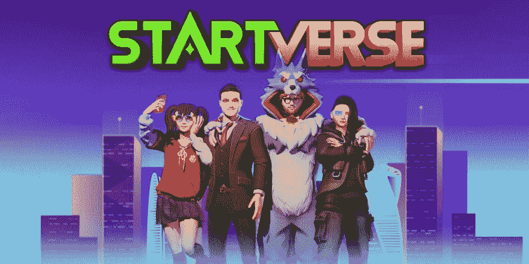
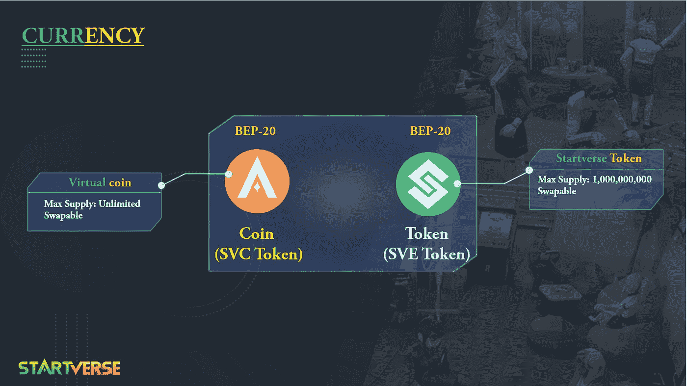

# 从玩到赚的游戏“start verse”&如何赚？

> 原文：<https://medium.com/coinmonks/play-to-earn-game-startverse-how-to-earn-303336ec156?source=collection_archive---------50----------------------->

## 在这个游戏中做一个精明的交易者！

**关于 Startverse**
Startverse 是一款元宇宙游戏，面向所有想要建立自己的创业公司的人。在这里，你可以成为老板、著名的艺术家、英俊的披萨外卖员，你甚至可以成为赌场的老板，或者建立一个专门从事土地承包的行会，随心所欲地经营你的帝国！

要在游戏中成功，你必须在事业和人际关系两方面都成功。玩家必须满足他们的需求，平衡睡眠、饮食、工作、健身，就像真正的人类一样。他们还需要找工作或建立自己的公司来赚钱。游戏的真正目标是帮助你的角色用他梦想的职业获得成功。

**Startverse 货币**
用户可以赚取游戏中的现金，并使用 Startverse 的 NFT 电子商务模式将其转换为真实的货币。玩家在登陆这个星球的那天会被交给一些杂务去完成。您将从游戏系统中获得硬币/代币来完成这些活动，这些硬币/代币可以用来换钱或用来发展公司。用户必须招募更多的人力资源，通过招募朋友或其他 NPC 玩家与他们合作，以建立他们的业务。

对于 Startverse 中的交易，有两种基本货币:

**1。币(SVC Token):** 这是为玩家而生的系统虚拟货币，在整个游戏中使用，不限量。SVC 将用于升级和游戏中的动作。比如:升级房子，土地，公司&员工。

**2。代币(SVE 代币):**这是一种更加稀有和稳定的硬币，玩家只能在特殊活动期间领取。SVE 将用于从市场上购买/借贷。

此外，SVC 代币被用来允许玩家在城市之间移动。两种货币都将根据市场价格运行。

**在 Startverse 怎么赚？**

**1。免费玩家**

●做日常和迷你任务赚币。

●完成活动任务将获得代币。

**2。Boss 玩家** ●通过完成事件任务领取代币。

●当你的员工完成任务后，你会收到代币和硬币。
●通过在市场上出售/出借 NFT 物品获得代币:员工、公司、建筑和土地。

**3。土地持有者通过在市场上出售/借出 NFT 物品如建筑物和土地来获得代币。**

希望这篇文章给你提供了有用的信息。如果你有任何问题或者想和 **Startverse** 讨论这个帖子，请在下面留下评论！

*在****Startverse****加入来自世界各地的创业公司、老板、土地持有者的社区，同时接收最新的项目消息，享受特别内容:*

[网站](https://startverse.io/) | [脸书](https://www.facebook.com/Startverse-Global-102077955725659/) | [推特](https://twitter.com/StartverseGame) | [不和](https://discord.gg/cfUSrHUvSz) | [电报](https://t.me/StarverseGlobal) | [白皮书](https://whitepaper.startverse.io/)

> 加入 Coinmonks [电报频道](https://t.me/coincodecap)和 [Youtube 频道](https://www.youtube.com/c/coinmonks/videos)了解加密交易和投资

# 另外，阅读

*   [南非的加密交易所](https://coincodecap.com/crypto-exchanges-in-south-africa) | [BitMEX 加密信号](https://coincodecap.com/bitmex-crypto-signals)
*   如何在 WazirX 上购买柴犬(SHIB)硬币？
*   [MoonXBT 副本交易](https://coincodecap.com/moonxbt-copy-trading) | [阿联酋的加密钱包](https://coincodecap.com/crypto-wallets-in-uae)
*   [MoonXBT vs Bybit vs 币安](https://coincodecap.com/bybit-binance-moonxbt) | [硬件钱包](/coinmonks/hardware-wallets-dfa1211730c6)
*   [雷米塔诺审查](https://coincodecap.com/remitano-review)|[1 英寸协议指南](https://coincodecap.com/1inch)
*   [十大最佳加密货币博客](https://coincodecap.com/best-cryptocurrency-blogs) | [YouHodler 评论](https://coincodecap.com/youhodler-review)
*   [KuCoin vs 币安](https://coincodecap.com/kucoin-vs-binance) | [Bitrue 点评](https://coincodecap.com/bitrue-review) | [Jet-Bot 点评](https://coincodecap.com/jet-bot-review)