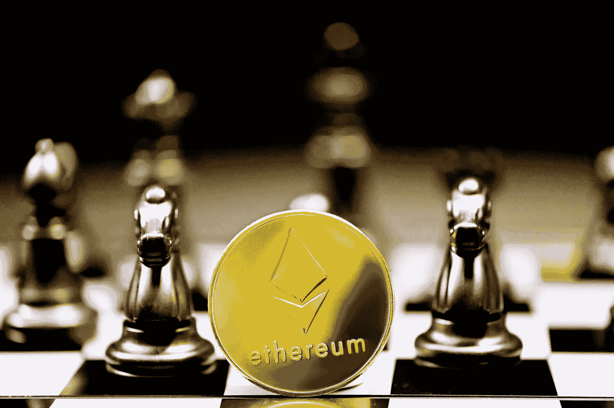

# 玩赚？NGMI

> 原文：<https://medium.com/coinmonks/play-to-earn-ngmi-83c7b35cf0a4?source=collection_archive---------23----------------------->

Photo by [Kanchanara](https://unsplash.com/@kanchanara?utm_source=unsplash&utm_medium=referral&utm_content=creditCopyText) on [Unsplash](https://unsplash.com/s/photos/blockchain-game?utm_source=unsplash&utm_medium=referral&utm_content=creditCopyText)

[动机被误导；如果你击中了目标，那么就不需要它了](https://genius.com/Pusha-t-king-push-lyrics)

我先说一个故事。

我在中学的时候，我的朋友埃里克喜欢玩暗黑破坏神 2。我们住在两个街区之外，所以几乎每天放学后，我们都会一起走回家。在许多这样的日子里，他会在回家的路上停在 Action Arcade。

就直升机父母而言，我母亲是黑鹰，所以自然不允许我和他一起去。我只会看着他穿过被黑漆漆的窗户包围着的难闻的香烟烟雾，走下黑暗的入口，然后继续我快乐的路。

后来，我着迷地问他——你在那里玩什么？他的回答让我震惊——他说他真的没有去*玩*任何游戏。相反，他大多只是出售自己玩游戏时收集的物品。

谁会真的花钱买游戏道具呢？我很惊讶——他告诉我，律师、医生、很多成年人，他们只是没有时间去磨几个小时，但想用更好的物品玩游戏，他们都愿意从他那里买下它们。它让我大吃一惊。

> *订阅*[***coin monks Youtube 频道***](https://www.youtube.com/c/coinmonks/videos) *获取每日加密新闻。*

几十年后，我们来到了这里，区块链给游戏带来的好处是显而易见的。很容易看出吸引力。

这就像《暗黑破坏神 2》一样，除了当时，如果你违反了一些深奥的暴雪条款，“那个人”理论上可以关闭你的账户，没收你辛辛苦苦得到的所有物品——因为所有这些物品都只是游戏公司拥有的中央数据库中的条目，大概是在一些与你的物品列表链接的表格中，其中有你的用户 ID 和用户名(“something-something-69”)。

当一个中央集权的实体拥有你的东西时，总是有风险的。

有了区块链和一个分布式的、分散的数据库，其中 NFT 代表你的数字商品，你的游戏账户可以从你的物品中模块化出来。因为这些物品是附在你的区块链钱包里的，而不是任何游戏专用的账户，所以你可以在共享同一个钱包的不同游戏之间转移物品。

请记住，区块链的唯一区别在于数据库架构。过去，你的物品仍然仅仅是数字财产，同样无形，同样虚无缥缈。除了一个中央集权的实体是拥有写权限的独裁管理者。在区块链，没有一个实体拥有单方面的权力。因此，区块链和 NFTs(超越艺术收藏 jpg)的“有用”实现，无疑将是游戏的未来。它只是打开了一个互操作性和跨游戏机制的世界，这在过去是没有的。

这就是未来。然而*目前*的“玩赚”状态是 NGMI。

为什么？因为激励结构没有调整好——完全颠倒了。它试图在对游戏的需求存在之前创造对物品的需求。

这些游戏大多过于强调区块链的新奇。他们让它成为价值主张和营销的核心，而不是一个方便的副作用功能。看看名字和描述就知道了——[去中心化](https://decentraland.org/)、[密码时代](https://www.ageofcryptology.com/)、[沙盒游戏](https://www.sandbox.game/en/)(“用户生成密码&区块链游戏”)。

他们自称为 play to earn、GameFi 等。本质上，广播他们的目标观众是寻求赚钱的加密游戏玩家，*而不是*仅仅是为了游戏而游戏。

他们忽略了(非赌博)电子游戏的第一优先——最重要的是，它们应该是有趣和娱乐性的。让游戏经济学见鬼去吧。

这些暗黑破坏神 2 项目的价值本质上在于这样一个事实，即因为游戏一开始就已经非常有趣，人们想要更好的项目来进一步改善现有的一流游戏体验。飞轮效应以增强这种体验为中心，并因此作为下游效应创造了对其产品的需求。

游戏体验是整个生态系统的主要基础设施。如果人们不想玩暗黑破坏神 2，游戏物品将立即失去价值。

反而像 Axie Infinity 这样的游戏是本末倒置。忽视导致[浪人桥被黑](https://cointelegraph.com/news/the-aftermath-of-axie-infinity-s-650m-ronin-bridge-hack)的安全问题，他们的方法简直是倒退。

以“玩赚”为名营销游戏，在主页上强调“有史以来最贵的
Axie ”,并为玩游戏做广告赚取 AXS 代币，这完全是一种颠倒的，在我看来是错误的做法。区块链的功能不应该是主要产品，而仅仅是一个增强整体的工具。

这就像一个应用程序吹嘘他们的 NoSQL 数据库有多好，而不是他们的应用程序有多好。抱歉，但没人在乎。产品需要作为主要关注点；数据库实现应该仅仅作为一种改进核心产品并创造更好的用户体验的机制，而不是目的本身。

通过不断强调游戏的“赚钱”方面，他们吸引了错误的早期采用者，那些仅仅是为了赚钱而玩游戏的人。你是怎么挣的？通过研磨来收集物品，希望最终出售所述物品来获利。好吧，物品只有在有需求的情况下才有价值，而有弹性的需求只有在游戏开始时很有趣的情况下才存在。

你没有吸引正直的游戏玩家(也就是物品的购买者)，而是最终得到了一个充满研磨者(也就是卖家)的生态系统。炒作支撑的卖方压力失衡过剩。

这些研磨者的祖先，以及他们的血统，都来自一个平民阶层，我认为他们不能成为游戏经济的支柱；他们是那些在过去点击网页广告获得微小奖励的人(“点击赚取”)。他们是 web1 和 web2 的真正后代。

它们没有错——但它们不会给生态系统带来附加值。他们是为了赚钱(因为你一开始就是这样引诱他们玩的！)，因此将竭尽全力创造和提振需求，不管是不是人为的。他们的忠诚不在于娱乐，而在于利润。他们是雇佣兵。

简单来说，激励结构不匹配。这是一种庞兹经济学和纯粹投机的味道，研磨者只是不停地研磨，希望他们可以将他们的游戏物品典当给更绝望的人，然后他们带着他们的收入 GTFO。

我不认为让游戏具有类似工作的功能是一个乐观的长期解决方案——无论是对工作还是对游戏。这是黑镜的第一集。

玩游戏的需求必须排在第一位，在经济之前。

因此，我认为区块链游戏最有效的方式是将 NFTs 和区块链的功能整合到现有的游戏中，这些游戏已经很有趣并被广泛采用。仅仅是加入一个区块链元素，整合 GameFi 作为分散现有游戏项目和改善用户体验的副作用——而不是把 UX 全部建立在区块链奖励的软肋上。

不要误解我，我理解为什么会这样发展——游戏公司是中央集权的庞然大物，在关系建立、销售周期、技术整合等方面需要更多的跑腿工作。(更不用说可怕的“集中化”方面，这与加密的精神背道而驰。)

编写糟糕的简单网页游戏要比开发一个伟大、有趣、复杂的游戏更容易，也能帮助你更快地推向市场，而这个游戏恰好融入了一些分散化的元素。

但是，我总是觉得，仅仅因为去中心化是一个有益的特性，并不意味着它需要被硬塞进每个应用程序的每个方面。不需要 100%去中心化或者什么都不要。这感觉太天真了。

这就是为什么对我来说，我对 GameFi 中短期未来的押注是在传统游戏专营权上，通过区块链集成对其游戏内经济进行微小的调整和改进。本质上，暗黑破坏神 4，但非保管，易于交易，分散管理的游戏项目。

鱼钩必须是游戏，而不是赚钱的机会。

> 加入 Coinmonks [Telegram group](https://t.me/joinchat/Trz8jaxd6xEsBI4p) 并了解加密交易和投资