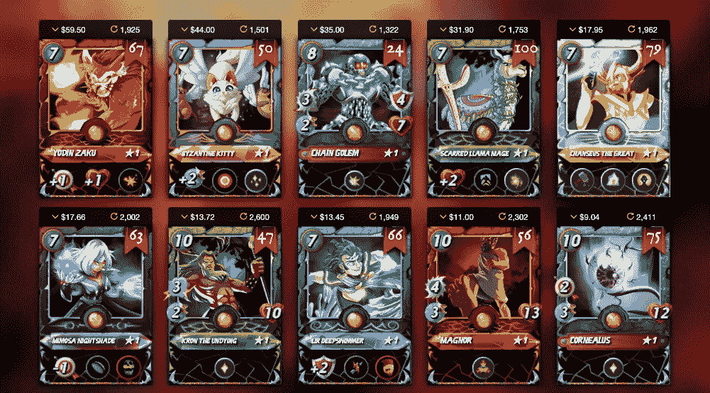
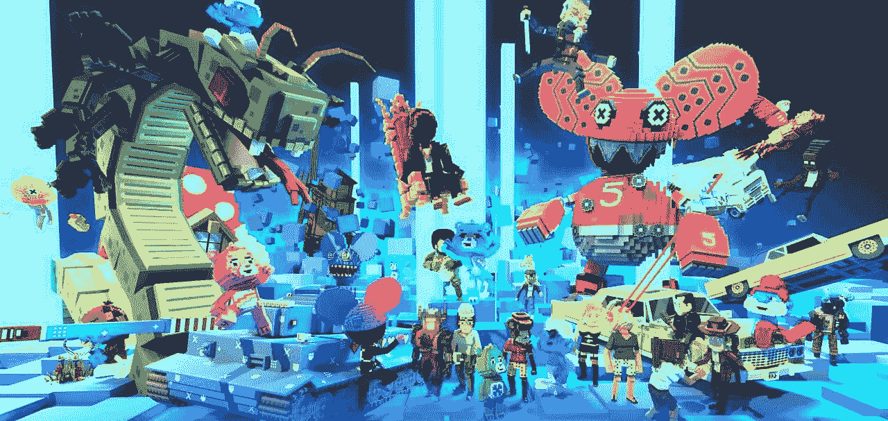

# 通过 NFTs 赢得比赛

> 原文：<https://medium.com/coinmonks/play-to-win-with-nfts-3f7534ef0d15?source=collection_archive---------73----------------------->

无论您是在线游戏玩家、虚拟现实(VR)游戏玩家还是增强现实(AR)游戏玩家，不可替代的代币(NFT)都通过彻底改变游戏玩家和开发者对使用区块链技术的游戏内资产的无限潜力的思考方式，将游戏体验带到了一个全新的水平。

当从全球范围来看游戏行业时，当前的系统似乎没有太多问题，因为市场仍在增长，仍然有利可图。然而，当你开始看它的基础设施时，你会意识到它是以一种主要让游戏开发者受益的方式构建的。传统游戏平台的建立是为了让价值单向流动，玩家花钱来解锁新的关卡和游戏内资产。

与此相反，NFTs 在游戏中的作用使玩家能够从体验中获得更多价值，这就是 BlockBet 的私人玩家俱乐部概念的由来。

区块链构建的游戏由代表游戏内内容的 NFT 驱动，并有能力定义每个游戏的效用和配置。这些区块链网络本质上有助于 NFT 执行其功能，即向玩家提供所有权、互操作性和不可变的游戏旅程。这鼓励并满足了业内对更多个性化的需求，从而为游戏开发商带来更多收入。总之，所有这些优势都有可能通过应用更公平的游戏模型的思想，将 NFTs 进一步推向主流采用。

一些世界上最畅销的 NFT 来自“玩到赚”(P2E)平台，如沙盒、分散土地、NFT 世界等。这些虚拟游戏是 NFTs 的很好的用例，它们已经对游戏行业产生了影响，因为它们继续提升游戏潜力。

这些平台的吸引力很大程度上也是基于 NFT 的盈利能力。因为它们是稀有和稀缺的，你可以以高于原价的价格出售你的代币，或者用它们换另一个当时可能更有利的代币。开发人员也从中受益，因为他们能够创建自己的 NFT，通过每次转售产生版税。

一般来说，大多数游戏中的资产和物品一旦被使用，往往会比它们自己更长寿或者变得多余，但是当资产变得像 NFT 一样令牌化时，它们的使用就不再有上限了。随着 BlockBet 为其私人玩家俱乐部的成员推出自己的 NFT 系列，游戏玩家将能够享受元宇宙激励措施的竞争白名单，这也超越了数字世界，可以在现实世界中使用。对于游戏行业来说，这是革命性的，并且很可能是这个行业有机会通过技术领域的发展经受住时间考验的主要原因之一。

> 加入 Coinmonks [电报频道](https://t.me/coincodecap)和 [Youtube 频道](https://www.youtube.com/c/coinmonks/videos)了解加密交易和投资

# 另外，阅读

*   [3 商业评论](/coinmonks/3commas-review-an-excellent-crypto-trading-bot-2020-1313a58bec92) | [Pionex 评论](https://coincodecap.com/pionex-review-exchange-with-crypto-trading-bot) | [Coinrule 评论](/coinmonks/coinrule-review-2021-a-beginner-friendly-crypto-trading-bot-daf0504848ba)
*   [莱杰 vs n rave](/coinmonks/ledger-vs-ngrave-zero-7e40f0c1d694)|[莱杰 nano s vs x](/coinmonks/ledger-nano-s-vs-x-battery-hardware-price-storage-59a6663fe3b0) | [币安评论](/coinmonks/binance-review-ee10d3bf3b6e)
*   [Bybit Exchange 审查](/coinmonks/bybit-exchange-review-dbd570019b71) | [Bityard 审查](https://coincodecap.com/bityard-reivew) | [Jet-Bot 审查](https://coincodecap.com/jet-bot-review)
*   [3 commas vs crypto hopper](/coinmonks/3commas-vs-pionex-vs-cryptohopper-best-crypto-bot-6a98d2baa203)|[赚取加密利息](/coinmonks/earn-crypto-interest-b10b810fdda3)
*   最好的比特币[硬件钱包](/coinmonks/hardware-wallets-dfa1211730c6) | [BitBox02 回顾](/coinmonks/bitbox02-review-your-swiss-bitcoin-hardware-wallet-c36c88fff29)