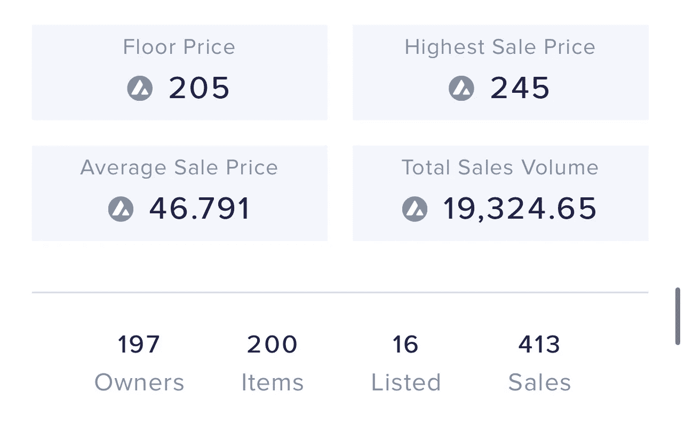
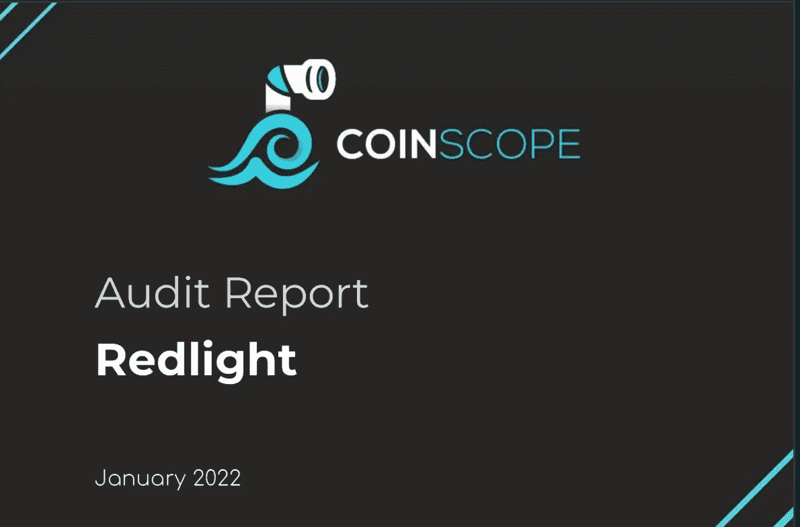
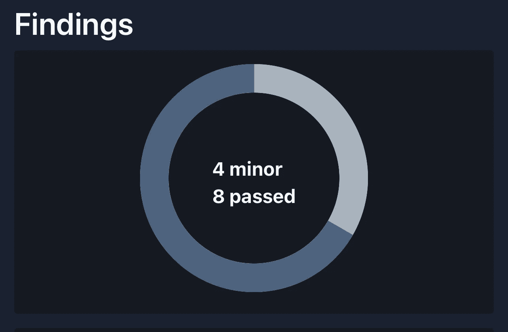
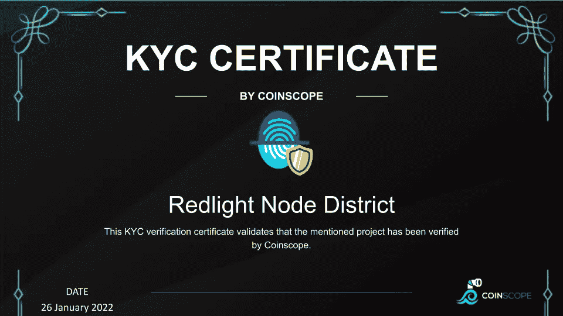
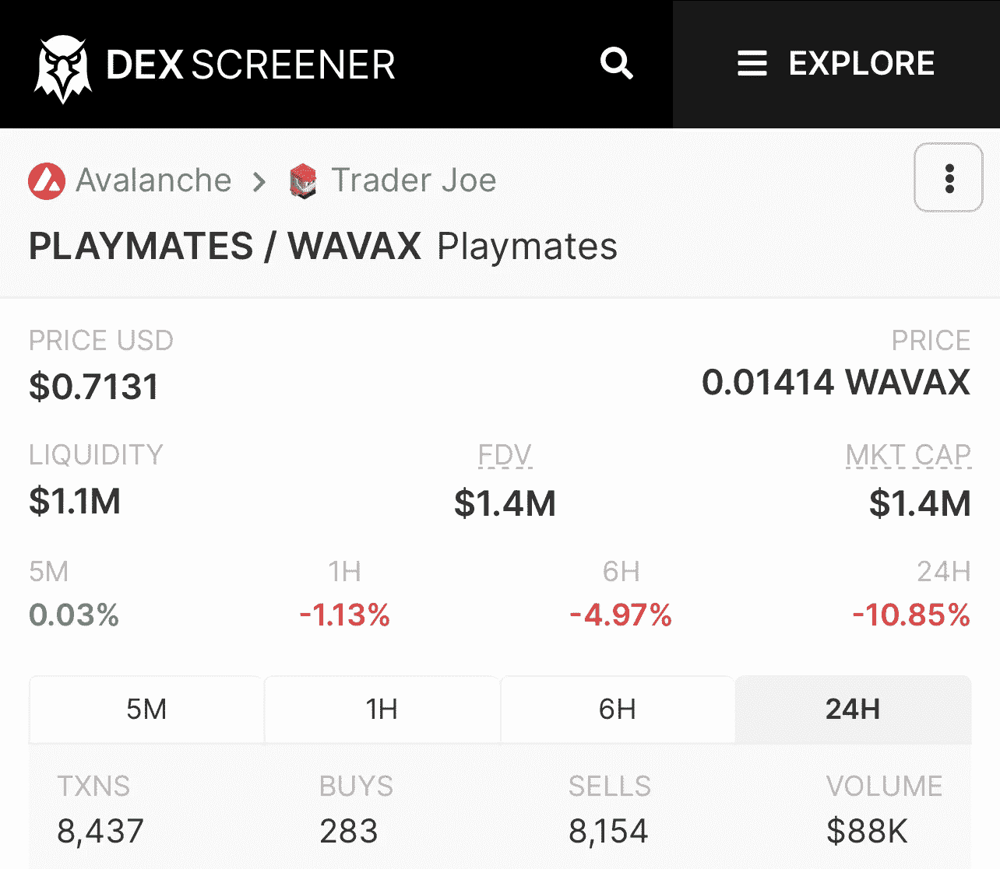
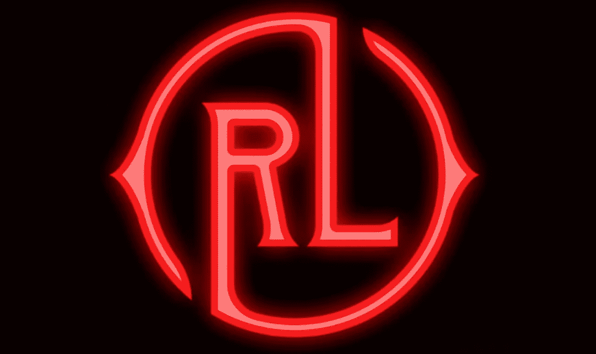
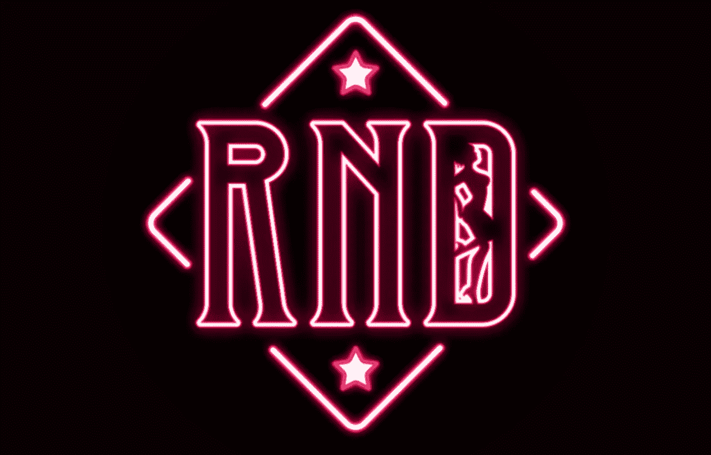
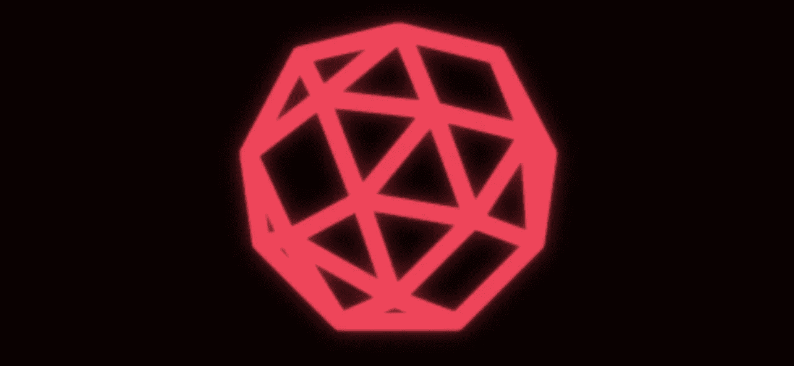

# $玩伴-与众不同的被动奖励生态系统

> 原文：<https://medium.com/coinmonks/playmates-passive-reward-ecosystem-with-a-difference-81125c7aada7?source=collection_archive---------56----------------------->

# CoinDCXpathbreaker

$PLAYMATES- RedLight Node District

**项目**:红灯节点区

**项目代号**:$玩伴

直接引用白皮书:

> “Redlight Nodes 系统通过允许投资者建立和复合主动奖励系统的技术，被动地奖励其用户。通过 NFTs、即玩即赚游戏和我们的可持续令牌组学的力量，我们的用户将有能力获得比当前任何其他活跃的节点系统更多的收入。”

**项目网络可用性:**

由于该项目建立在 **Avalanche 区块链**上，用户可以使用下面提到的合同地址来访问该项目

*   **雪崩合同地址**:0x 490 BF 3 ABC ab 1 FB 5c 88533d 850 F2 A8 d6d 38298465
*   **NFT 交易员核实**

NFT Trader

在可以找到[NFT 项目的总统计数据](https://nftrade.com/assets/avalanche/0x3026c8ce0da81709a633e5a4a6745a188c255137)

## 项目的独特卖点:

*   空间内最可持续的节点项目之一
*   目前作为**利益的证明** (PoS)，在他们的 P2E 游戏发布后，该模型将开始在**节点即服务** (NaaS) & **定义即服务** (DaaS)的混合上运行
*   **100，210 节点**创建(在写这篇文章的时候)
*   截至 2022 年 3 月最受欢迎的**AVAX dapp 之一**

生态系统将支持几层节点:

目前在售的有**豪宅** & **区。**将会有一个三线节点——**城市**稍后发布。还包括一个潜在的第 4 层，以迷你节点的形式(仍在开发中)。

*   **$玩伴**持有者的赌注选项
*   该团队正忙于开发他们自己的独立区块链(正在开发中)
*   NFT 节点俱乐部(尚未推出)

以下内容仅适用于地区和城市节点

1.  针对节点发行的 NFT 成为可交易的资产(购买和出售)
2.  现在有一个针对 VIP 俱乐部的 NFT 市场，它给予钱包中所有税收 25%的减免
3.  P2E 游戏(开发中)
4.  元宇宙还将整合用户节点“端点”,以便基于云的节点将转变为真正的数字节点。端点将是某些位置，例如酒吧、俱乐部等。端点还将托管活动的 NFT，例如他们的活动游戏、战利品、奖励等
5.  兼容手机的钱包(未来计划)
6.  许多创造性场景产生了用户可以采用的策略

## 项目审计报告:

该项目已经过 **Coinscope** 审计。报告重点如下:

Project Audit Report RISKS

**项目智能合同未发现关键、重大或高风险因素。**

智能合同通过审核的因素:

*   **ST** -停止交易
*   **OCTD**——所有者契约令牌流失
*   **OTUT** -所有者转移用户的令牌
*   **ELFM** -超限费操纵
*   **ULTW** -团队钱包的无限流动性
*   MT -铸造代币
*   **BT** -燃烧令牌
*   **BC** -黑名单合同

在审计中智能合同被宣布为轻微风险的因素:

*   L01 -公共函数可以被声明为外部的
*   **L02** -状态变量可以被声明为常量
*   **L04** -符合可靠性命名惯例
*   **L07** -遗漏事件算术

## 项目团队和顾问:

尽管该团队保持匿名，但他们已经接受了 KYC 的外部审计

KYC Certificate for Red Light Node District

该项目的当前团队成员包括:

*   **利奥(CEO)**
*   **亚历克斯(首席技术官)**
*   **贝利(CMO)**
*   **罗里(首席运营官)**

Red Light Note District DEX screener

## 合伙人和风险投资者:

老实说，我找不到任何与项目相关的投资伙伴和风投的可靠信息。

如果你碰巧知道这件事，请在评论中留下你的信息。

## 项目路线图:

在他们的路线图中有许多优秀的目标，但每个人都感到兴奋的是 P2E 游戏，这将大大增加$玩伴令牌的效用，超过其目前的水平。

Phase 1

> 在 Telegram 上推出我们的推广团体 Redlight Token 区。开始红灯节点区的规划阶段。

Phase 2

在雪崩区块链上推出红光节点区。这是项目的当前阶段。

Phase 3

> 通过点对点多人游戏和 NFT 技术，利用节点端点集成进行游戏。游戏是由 8 位密码开发的。

Phase 4

> 没有高额费用的发射台。卓越的安全性、多链兼容性、从开始到启动的协助。与本地定位集成。

## 项目令牌组学:

*   **$玩伴**是用于奖励支付的原生代币。平台费用将以 **$AVAX** 支付

**令牌分配如下:**

*   10%分配给团队
*   15%分配给预售
*   25%的 DEX 流动性分配
*   50%分配给奖励基金
*   没有关于授权时间表的可靠信息🚩

**节点复合如下:**

**反鲸功能——**这意味着，用户钱包里的**豪宅**越多，购买**豪宅**的成本就越高。增加这个机制是为了鼓励用户将豪宅升级为小区。细分如下:

*   1-10 座大厦每个花费 20 美元玩伴。
*   11-20 座大厦每个花费 25 美元玩伴
*   21-40 座大厦每个花费 30 美元玩伴
*   41-80 座大厦每个花费 35 美元玩伴
*   81-100 座豪宅每座花费 40x $玩伴
*   100 座以上的豪宅每座花费 45x $玩伴。

记住，当你将你的大厦升级为区域时，这将再次降低每座大厦的建造成本。

来源:[红灯区](https://medium.com/u/6d602ae0871c?source=post_page-----81125c7aada7--------------------------------)中

## 玩家奖励

玩家将根据他们在池中的投资水平获得相应的奖励。因此，如果池中存放了总价值为 100，000 美元的**$玩伴**，并且用户投入了总价值为 15，000 美元的**$玩伴**，则该玩家的奖励比例将为 15%。因此，玩家将在每个周期结束时获得 15%的奖励(以$MIM 支付)。

目前，还不清楚奖励的水平，我假设它们在本质上是可变的，并且肯定取决于某些条件。回报是不确定的，这是肯定的。

## 社交媒体和相关链接:

*   **推特**:[https://twitter.com/RLNodeDistrict](https://twitter.com/RLNodeDistrict)
*   **不和**:[http://redlight.finance/#Discord](http://redlight.finance/#Discord)
*   **电报【https://t.me/RLNodeDistrict】:[电报](https://t.me/RLNodeDistrict)**
*   **YouTube**:[https://www.youtube.com/channel/UCQ6UKpzNeEA2nr21_aaGp4A](https://www.youtube.com/channel/UCQ6UKpzNeEA2nr21_aaGp4A)
*   **中等**:[http://redlight.finance/#medium](http://redlight.finance/#medium)
*   **白皮书**:[https://red light . finance/WP-content/uploads/2022/03/red light-Node-District-](https://redlight.finance/wp-content/uploads/2022/03/Redlight-Node-District-)
*   **网站**:[https://redlight.finance/](https://redlight.finance/)

## 结论

就基本方面而言，这个项目看起来很可靠。随着项目的进展，我们将看到他们的 P2E 游戏全面上市，我们将看到更多的 CEX 上市。

我正在阅读更多关于这个项目的资料，并试图弄清楚整个生态系统是如何运作的。一旦我手里有了可靠的信息，我会写更多。

…

通过几个简单的步骤，用 [CoinDCX](https://coindcx.com/) 开始您的交易之旅:

*   用您的姓名、电子邮件和手机号码注册
*   接受 CoinDCX 的服务条款
*   完成您的 KYC 验证并添加您的银行帐户详细信息
*   一旦批准，存款菲亚特通过您批准的银行帐户或转移加密从您的其他加密钱包，你就完成了

**# coindcxpathbeaker**

> 加入 Coinmonks [电报频道](https://t.me/coincodecap)和 [Youtube 频道](https://www.youtube.com/c/coinmonks/videos)了解加密交易和投资

# 另外，阅读

*   [币安期货交易](https://coincodecap.com/binance-futures-trading)|[3 commas vs Mudrex vs eToro](https://coincodecap.com/mudrex-3commas-etoro)
*   [如何购买 Monero](https://coincodecap.com/buy-monero) | [IDEX 评论](https://coincodecap.com/idex-review) | [BitKan 交易机器人](https://coincodecap.com/bitkan-trading-bot)
*   [尤霍德勒 vs 考尼洛 vs 霍德诺特](/coinmonks/youhodler-vs-coinloan-vs-hodlnaut-b1050acde55a) | [Cryptohopper vs 哈斯博特](https://coincodecap.com/cryptohopper-vs-haasbot)
*   [顶级付费加密货币和区块链课程](https://coincodecap.com/blockchain-courses)
*   [MXC 交易所评论](/coinmonks/mxc-exchange-review-3af0ec1cba8c) | [Pionex vs 币安](https://coincodecap.com/pionex-vs-binance) | [Pionex 套利机器人](https://coincodecap.com/pionex-arbitrage-bot)
*   [如何在印度购买比特币？](/coinmonks/buy-bitcoin-in-india-feb50ddfef94) | [WazirX 评论](/coinmonks/wazirx-review-5c811b074f5b)