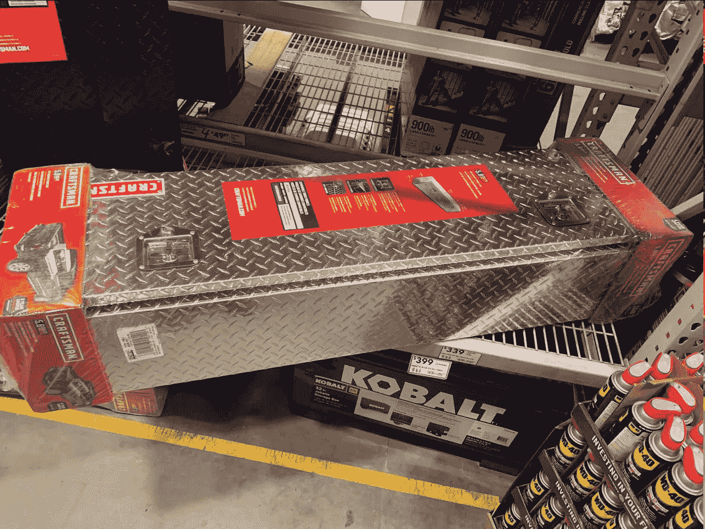
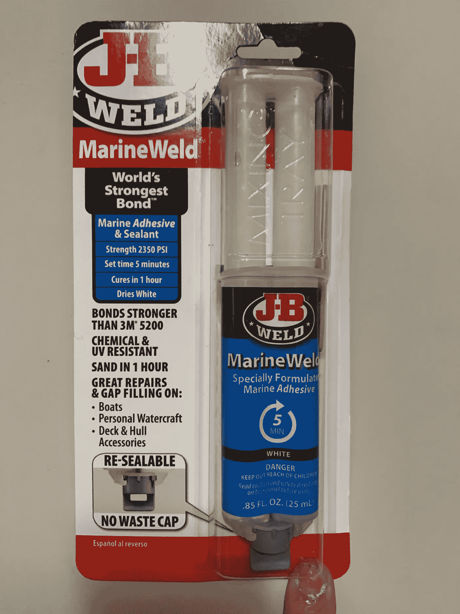
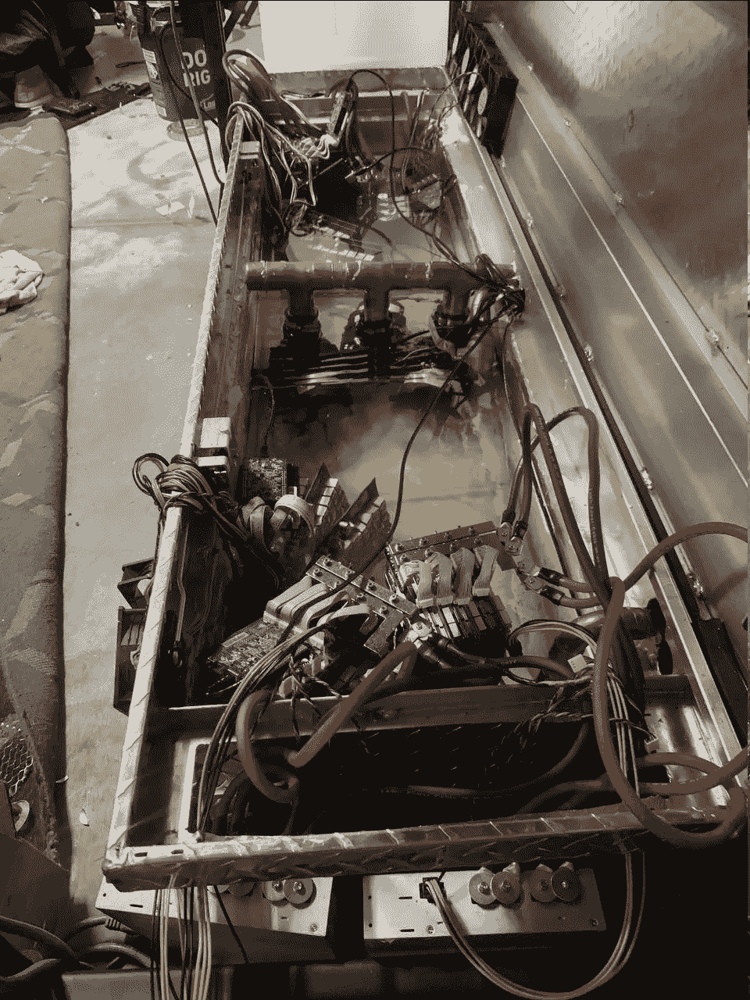

# pleb gold shell Miner Immersion[how-to+采购指南]

> 原文：<https://medium.com/coinmonks/pleb-goldshell-miner-immersion-how-to-sourcing-guide-25a98294b344?source=collection_archive---------14----------------------->

Post brought to you by ~ [Babena](https://babening.io/)

首先，简单介绍一下我自己:我是一个铁杆 PoW degen 理想主义者，投资于低 mcap 项目，我的策略设置为持有，最低套现门槛为 100 倍。对我来说，采矿是我进入市场的第一步，让我接触到强大的、不断增长的社区，我今天已经完全参与并投资了这些社区(❤ $KDA fam)。我也是一名作者，我相信我能为我们的生态系统增加价值的最好方法之一就是写这样的帖子。

我于 2021 年 12 月开始采矿，几乎完全通过 goldshell ASICs 进行 altcoin 采矿。在我看来，进入采矿业最困难的部分是最初的瓶颈:采购硬件和电力基础设施。我突破了最初的障碍，开始采矿，但很快就遇到了新的瓶颈:散热。我产生了太多的热量，尽管在我的车库中我现在称之为“采矿工作室”的地方搭建了框架，并增加了 20 安培的空调设备和强大的排气扇来循环空气，我仍然无法跟上热量的产生。

这让我发现了沉浸感，天啊，即使我完全意识到了其中的复杂性，而且还有管道经验……浸金谢尔矿工队不适合有勇无谋的人。

对于那些想要沉浸在矿工生活中的人，我强烈推荐加入[这个沉浸电报小组](https://t.me/ImmersionCoolingTechnologyTalk)。

好了，闲聊够了…让我们开始吧。

浸泡金壳矿工会使你的保修失效，或者应该失效。由于 Goldshell 矿商相对较新，生产量有限，总库存与比特大陆 Antminer 相比相形见绌，因此关于这些矿商的具体流程和挑战的信息几乎为零。一切都是反复试验的结果，对于沉浸式系统面临的挑战的普遍共识，可以作为构建一个有效系统的道路上的路标。

出于本指南的目的，我们正在从头开始构建一个中端 pleb 沉浸式系统，尽管您可以在 TG 集团购买即插即用系统，或者获得 DCX (*DNR)或 EF(工程流体$$$)的报价。每个下划线代表一个采购链接。

来潜水吧~

首先，我们在沉浸什么？

> 戈尔德谢尔 CK5 (3)
> 
> 金色外壳 HS5 (1)
> 
> 金色外壳 X5 (1)
> 
> Antminer L3++ (1)

虽然我知道有人使用纯矿物油没有任何问题，但是液体是每一个浸泡系统的基础。液体是一种不导电的原油副产品，专门用于浸泡计算机部件。考虑到矿工自身的成本，为工程流体挥霍 2 倍似乎是明智的选择。

辩证流体: [ThermaCoin 1900](https://t.me/AdvanceFluidManagement) 通过 Ryan Hawkins 上的 TG，连同数据表等。55 加仑约 2100 美元，包括电梯门送货到住宅地址。

液体运行约 1/3 的总建设成本为 pleb 沉浸式建设，虽然它可能运行食品级矿物油，我决定去这完全聚碳酸酯辩证流体。本质上是一种再利用的发动机清洁剂。我个人会比 Engineered Fluid 的 Bitcool 更推荐这款产品~ bitcool 是一种混合物，价格是 ThermaCoin 的 130%。另外，他们给我的报价是 50，000 美元，所以我很不喜欢他们。

[坦克(外墙)](https://www.lowes.com/pd/CRAFTSMAN-71-36-in-x-19-57-in-x-16-58-in-Aluminum-Crossover-Truck-Tool-Box/1000615433):洛斯的铝制工具箱，大约 300 美元

[油罐(内墙)](https://www.tapplastics.com/product/plastics/cut_to_size_plastic/acrylic_sheets_cast_clear/510):TAP Plastics 公司生产的 Chemcast 丙烯酸树脂，3/8 英寸厚的定制切割板材，两个不安全的油对流隔板，约 400 美元

[排水泵](https://www.amazon.com/dp/B00489Q0VM/ref=sspa_dk_detail_2?psc=1&pd_rd_i=B00489Q0VM&pd_rd_w=YUHki&pf_rd_p=b9951ce4-3bd8-4b04-9123-0fda35d6155e&pd_rd_wg=KTWwb&pf_rd_r=C6NSNWNGFHVDT7XW8FQZ&pd_rd_r=498e940b-a52f-430e-954d-cec6760d9d9e&s=lawn-garden&spLa=ZW5jcnlwdGVkUXVhbGlmaWVyPUEzSUQ2SDdTQUJZTzg0JmVuY3J5cHRlZElkPUEwNTEyNTg4MkFFNE5XTFFBOUFUNSZlbmNyeXB0ZWRBZElkPUEwMjAyMzE3M1VZTjVGSzc0RVkwViZ3aWRnZXROYW1lPXNwX2RldGFpbCZhY3Rpb249Y2xpY2tSZWRpcmVjdCZkb05vdExvZ0NsaWNrPXRydWU=):3 个排水泵，用于冗余和 3100 GPH/51 GPM ~130 美元的过高流速

出于削减成本的目的，可以从 TAP 塑料定制丙烯酸切片，组装一个单壁油箱，但不要忘记添加一个隔板，通过对流原理更有效地泵出最热的油。

Smexy double-walled, insulated pleb immersion tank

现在，我确保在添加辩证液之前测试油箱并确认它能盛水，但我仍然花了几天时间寻找针孔泄漏，我裸露的手臂在油中浸了几个小时，顺便说一下，DNR。我强烈推荐购买一些手套，在处理这些东西时虔诚地戴上它们，除非你喜欢皮疹和精神痛苦？为了避免这种可怕的命运…从一开始就使用合适的密封剂。

除了 Tap Plastics 的丙烯酸粘合剂之外，用合适的密封剂检查所有的储罐焊缝。大多数密封剂不适用于水下应用、高温，否则无法承受超过 32 加仑液体所产生的压力。 [JB 海洋焊缝](https://www.amazon.com/J-B-Weld-50172-MarineWeld-Adhesive/dp/B00R2CDVIW/ref=asc_df_B00R2CDVIW/?tag=hyprod-20&linkCode=df0&hvadid=312165920097&hvpos=&hvnetw=g&hvrand=9608453392710132639&hvpone=&hvptwo=&hvqmt=&hvdev=c&hvdvcmdl=&hvlocint=&hvlocphy=9001685&hvtargid=pla-569771967083&psc=1)。

现在我们已经有了一个完全密封的水箱，让我们进入系统的核心部分:HXs:热交换器。在这种情况下，我们使用水-空气 HXs，基本上是散热器的一种奇特的说法。使用四个 5 系列 Goldshell ASICs 和两个大约 6000 瓦的中型 antminers，从散热的角度来看，我可以用一个 HX 轻松过关……但为了安全裕度和未来的建造，我高估了几乎所有东西。我还计划添加一个水油 HX，这样我就可以加热我现在还不存在的热水浴缸，因为… *热水浴缸*！

[20x20 热交换器](https://www.amazon.com/20x20-Exchanger-1-Copper-Install-Flange/dp/B07VKR14JQ/ref=sr_1_5?crid=3JAOSBSHPNIU7&keywords=Heat+exchanger+22x25&qid=1644015606&sprefix=heat+exchanger+22x25%2Caps%2C212&sr=8-5):3 个并联的水-空气热交换器，再加上当地五金店的简易野餐桌。

[18 英寸工业风扇](https://www.globalindustrial.com/p/outdoor-rated-workstation-fan-18-diameter-with-yoke-mount-1-3-hp-120v)(3):Global Industrial 18 英寸工业工作站风扇，3 速，5650 CFM，160 瓦，1/3 马力

你还需要一些高 CFM 球迷，并密封他们说 HXs。我和全球工业公司的 5650 名 CFM 粉丝一起去的，每人 200 美元。它们是户外额定的，具有 10 英尺长的电线，在最高设置下持续拉动 160 瓦(提示:总是在最高设置下运行)，并且具有令人敬畏的评论，详细描述了在可怕的条件下长时间运行而没有设备故障。

管道系统:约 1，000 美元~ 1–1/2 英寸和 1 英寸铜管、1–1/2 英寸 Ts、1–1/2 英寸"-> 1 英寸异径管、90s、45s(尽可能将 90s 替换为 45s 以保持流速)。如果你选择 CPVC，你或许可以不用跑去家得宝，但当地的管道供应肯定会有你需要的铜或 CPVC 产品——就像 [Ferguson](https://www.google.com/url?sa=t&rct=j&q=&esrc=s&source=web&cd=&cad=rja&uact=8&ved=2ahUKEwjkk5Pz58H2AhXNJkQIHX1SDpsQFnoECAcQAQ&url=https%3A%2F%2Fwww.ferguson.com%2F&usg=AOvVaw0EQmP493Xc4zGLYh4uc188) 。

(can you guess where all my leaks were?)

从这个角度你看不到，但我在野餐桌上切了 20x20 的正方形，并在每个孔里放了 hx，用超宽的黑色胶带封住了所有东西。每个排气扇都包裹着 1 英寸的橡胶管绝缘材料，这些材料来自我当地的五金店，然后用胶带粘住以确保适当的密封。

铜是坚硬的、不可原谅的、昂贵的……此外，你的第一次试运行很可能会有泄漏，尤其是在一个高压系统中。由于辩证法流体大约占总建造成本的 1/3，每一滴损失都是在烧钱。不过，从水管工的角度来说，不要过分担心漏水——如果你能避免漏水，那很好，但不幸的是，这都是过程的一部分。DNR 铜，来源 CPVC。胶合比焊接容易得多。

但是，但是任——为什么不恶搞你的主要粉丝？这难道不比剪下每个风扇叶片，然后把它们挂在水箱外面容易得多吗？是的，是的，会的。基于 reddit 上一个人偷了一些 kd5 的帖子，我天真地认为上面的粉丝欺骗者会完美地运行。结果如下:

如果你是沉浸式蚂蚁矿工，这些 fan 欺骗器工作得很好(我的 L3++很强大)，但是在 Goldshell 矿工上使用 fan 欺骗器会导致 hashrate 大幅下降，随后会回升到平均 hashrate，并导致无休止的转储。DNR。

定制柔性母线: [4 AWG(规格)硅线](https://www.amazon.com/TOPSTRONGGEAR-Gauge-Black-Ground-Wire-True/dp/B08N4XLGXC/ref=sr_1_1_sspa?crid=13LUY9URFLEZI&keywords=silicon+wire+4+awg&qid=1646347688&s=hi&sprefix=silicon+wire+4awg%2Ctools%2C133&sr=1-1-spons&psc=1&spLa=ZW5jcnlwdGVkUXVhbGlmaWVyPUE4N0o1NEFJNzFBVVUmZW5jcnlwdGVkSWQ9QTAyOTg1MTYxUzNCMUlVNVc1WEsxJmVuY3J5cHRlZEFkSWQ9QTA2MzAxMjhYSDY3UjRIVzVTT0omd2lkZ2V0TmFtZT1zcF9hdGYmYWN0aW9uPWNsaWNrUmVkaXJlY3QmZG9Ob3RMb2dDbGljaz10cnVl) + [4 AWG 螺柱孔眼](https://www.amazon.com/gp/slredirect/picassoRedirect.html/ref=pa_sp_atf_aps_sr_pg1_1?ie=UTF8&adId=A07654781NUXY5M0JK9GG&url=%2FSELTERM-Battery-Eyelets-Terminal-Connectors%2Fdp%2FB085CBZX5J%2Fref%3Dsr_1_1_sspa%3Fcrid%3D1FLC8HUSC1XNG%26keywords%3D%252310%2Bring%2Bstud%2B8%2Bawg%26qid%3D1646348216%26sprefix%3D%2B10%2Bring%2Bstud%2B8%2Bawg%252Caps%252C130%26sr%3D8-1-spons%26psc%3D1&qualifier=1646348216&id=8987007878720087&widgetName=sp_atf) ~另外，1/2 "热缩和热风枪从当地供应商店购买。

定制的柔性母线很酷，如果你走这条路，你不必担心潜在的 PSU 故障。

最初，我把我的四个大矿工和他们的 PSU 完全浸入水中。将*ant miner*PSU 完全浸入是一种常见的做法……嗯，这些 PSU 导致了临时设置中的错误报告，并且 miner 不会哈希。我知道一个事实，一个社区成员能够用 47ohm 1/4 & 1/2w 的电阻欺骗 Goldshell PSU 的粉丝，但我的直接解决方案是将粉丝本身从沉浸中移除……以获得一些积极的效果——至少在几天内，一切都变得一团糟。

PSU fans

虽然这是一种权宜之计，但如果你坚持将 PSU 浸入水中，我强烈建议你走电阻路线，进行几天的 PSU 浸入，以确认你的电源在浸入条件下不太可能出现故障。我通过用手指桥接连接炸毁了我的一个 PSU，并在设备通电时插入了一个 6 针，但我 99%确定 2 个库存 Goldshell PSUs 由于浸入条件而失败。

大 oof。这大约 800 美元的课程加上 2 周的停机时间，可能还有 psu ptsd 的点缀，说服了我避免完全沉浸在我新采购的 AP280 PSUs 中，我通过这些由大约 100 美元的硅线制成的专用柔性母线做到了这一点。

Current situation

我一直推迟写这篇文章。另一场危机不可避免地引起了我的注意，但这就是我的采矿工作室目前的状况。我的 CK5 少了一块控制板，替换的也在路上。在两天内，由于一些自发的泄漏，我损失了 10 加仑的辩证流体…所以你可以看到我的油箱液位有点低。我试着让我所有的矿工都站在直立的滑板上，但是温度传感器在滑板的最上面，所以它们没有碰撞。

当我等待额外的 5 加仑液体时，我正在运行一台浸在液体中的 CK5，超频到 999mhz 和 0.51V ~由于硬件问题，我应该使用相同的平均 hashrate 股票设置。当我启动它备份时，四个板中的两个运行高硬件错误，因为如果没有更多问题，我会在哪里？

这些错误似乎是由相关芯片中的时钟/电压问题引起的……老实说，我很确定我能找出这个问题出现的原因。在我的 PSU 失败事件后，我用橡皮锤敲打板子，想把它们从外壳中释放出来，我也不建议这样做…但是有太多的胶水了！！！

在深入了解这些事情之后，我有点失去了剧情，我想知道是否有人会对这个话题感兴趣，并在我的 pleb immersion build 上发表这样一篇长篇大论的帖子。让我们把这个故事放在这里，如果人们对这个话题相对感兴趣，我将返回另一个帖子，详细介绍我的进展和缺陷。

热情地，

~任

*由 [Babena](https://babening.io/) 为您带来的帖子

附注:我陷得有多深？粗略估计，如果 PSU 失败，大约 7000-8000 美元。如果一开始就做得好，建造成本大约在 5-6，000 英镑。

> 交易新手？试试[密码交易机器人](/coinmonks/crypto-trading-bot-c2ffce8acb2a)或者[复制交易](/coinmonks/top-10-crypto-copy-trading-platforms-for-beginners-d0c37c7d698c)