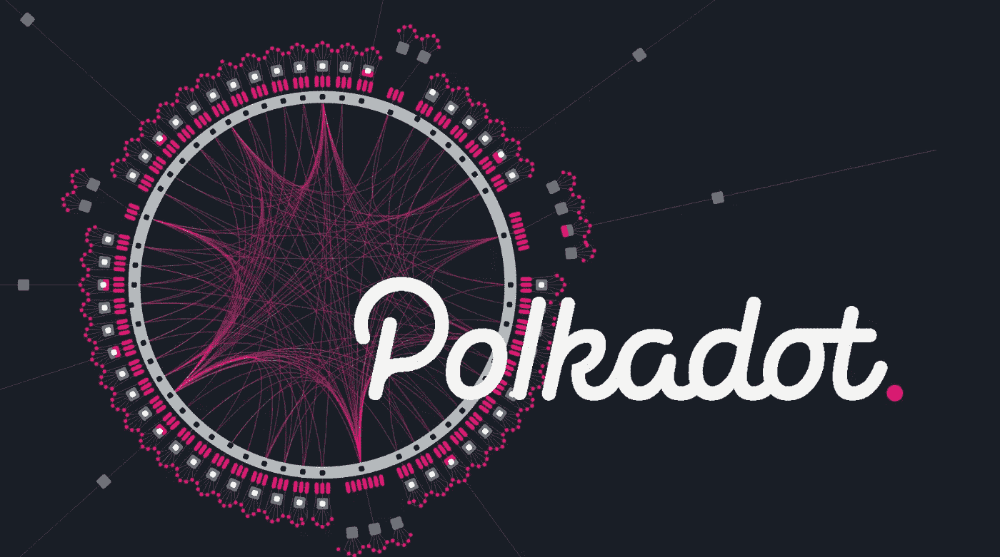

# 波尔卡多特——对“无信任”互联网的渴望

> 原文：<https://medium.com/coinmonks/polkadot-aspirations-of-a-trust-less-internet-d438a2a885ea?source=collection_archive---------30----------------------->

波尔卡多特的出现是出于推动区块链技术超越以太坊能力的需要，加文·伍德的愿景是创建一个更值得信赖和可扩展的互联网系统，奇偶校验，草间弥生和 Web3 基金会也诞生了。正如[伍德在 2020 年 12 月接受劳拉·申采访时阐述的](https://blockcast.cc/news/gavin-wood-the-advantages-of-the-polkadot-parachain-are-abstraction-and-versatility/)“波尔卡多特希望创造一种*更通用的*和*抽象的*模式，来解决区块链行业的一些问题。比特币开放了基础脚本语言，以太坊扩展了更多的金融交易，波尔卡多特希望创建一个更通用的模型。”

看到以太坊在 2016 年的局限性，并希望开发一个更具可扩展性的区块链，以及为更值得信赖的互联网版本创建区块链的系统，Polkadot 诞生于 2017 年，在过去几年中，在生态系统中工作的开发人员数量大幅增长，上线的项目越来越多，投资公司和风险资本家也提供了大量支持。在这一系列三篇文章中的第一篇，我们希望阐明 Polkadot 生态系统，它是如何产生的，它的独特技术，以及生态系统中创新项目的扩展和未来可能会发生什么。

Polkadot

你可能听说过 2021 年的‘web 3’。这个词看似凭空而来，实际上自 2014 年加文·伍德(Gavin Wood)创造了这个词“基于区块链的去中心化在线生态系统”以来就一直存在。Web3 的目标是“开放”互联网，减少核心人物对互联网的控制，成为一个更值得信赖的互联网，让用户为他们的数据付费，而不是让公司从中获利。Web 2.0 的商业模式依赖于用户的参与来创建新的内容和个人资料，并出于营销目的出售给第三方。“事实上，互联网已经成为一个巨大的应用商店，由谷歌、脸书和亚马逊的集中式应用主导，每个人都试图建立受众，收集数据，并通过有针对性的广告将数据货币化”。

然而，对于新兴技术来说，并不都是积极的。像许多颠覆者一样，也有批评者认为，新技术也可能容易出现困扰当前网络迭代的相同问题——特别是集中化方面。

我们所知的互联网

2004 年左右开始出现的 Web 2.0 与之前的 Web 有很大不同。这是一个被许多人定义为集中的网络，许多用户通过优步、脸书、谷歌等进行*互动，这些大公司出售用户数据以牟取暴利。在 2013 年一头扎进 cryptoverse 后，加文·伍德很快意识到困扰 Web 2.0 的问题，以及这些新技术可能打破现状的潜在世界，一个新的*互联网可能诞生——Web 3。**

[image](https://www.weforum.org/agenda/2022/02/web3-transform-the-internet/): representation of various iterations of the internet

如果 Web 2.0 的定义特征是读(静态)和写(用户生成的内容创建)，那么 Web3 应该是读-写和信任(用户信任他们收到的信息的能力，这是区块链验证的)。在使用 Web 2.0 超过 15 年后，数据泄露每天都在发生(查看 [*)我被 pwn 了吗？*](https://haveibeenpwned.com/) )，权力集中，审查猖獗等等，许多互联网用户都梦想有一个*更好*和更*公平*的互联网版本。

[image](https://haveibeenpwned.com/) from haveibeenpwnd?

*web 3 基金会*

2017 年，伍德与阿什利·泰森(Ashley Tyson)和彼得·查班(Peter Czaban)一起成立了 [Web3 基金会](https://web3.foundation/about/)，目标是提供一个“去中心化和公平的互联网，用户可以控制自己的数据、身份和命运”。虽然这个词进入许多人的词典显然是在 2021 年，谷歌趋势强调这个词在 2021 年圣诞节前后达到顶峰。

[web3 — Google Trends](https://trends.google.com/trends/explore?date=2021-01-01%202022-03-23&q=web3)

当被问及什么是 Web3 的便捷定义时，Gavin Wood 在 2021 年 11 月的一次采访中说“更少的信任，更多的真相。”在阐述这一点时，Wood 继续解释道“信任意味着你把某种权力放在其他人或某个组织中，他们能够以某种任意的方式使用这种权力。”谷歌和脸书等 web2 公司为用户提供了极其丰富和集中的访问点，用户可以通过这些访问点进行交流，分享个人数据等，这表明当前的系统已经崩溃，这是伍德希望通过 Polkadot 和 Web3 基金会反抗的问题的核心

波尔卡多特不是在真空中出生的——伍德在担任以太坊首席技术官的几年里，孕育了一个更加公平的去中心化互联网的想法，并思考了一个新的系统。在“Polkadot Behind the Code，ep1”视频中，Wood 回忆说，大约在 2016 年末，当团队应该实施以太坊 2.0 时，没有发生重大的发展，奇偶校验技术诞生了。为了创造一条与以太坊互补的链，波尔卡多特诞生了。Polkadot 是一个多链，数百个其他区块链可以在此基础上解决“区块链困境”；安全、可扩展和分散的能力。就区块链而言，建筑师希望在不同程度上实现去中心化、安全性和可伸缩性这三点——但往往无法在足够的程度上实现这三点。

[image](https://blog.btse.com/blockchain-dilemma-part-1-of-3-the-impossible-triangle/) of the blockchain dilemma/trillema

波尔卡多特和她的妹妹草间弥生

着手创造他们对区块链的新看法，平价在精神气质、名称和审美方面受到特立独行的迷幻艺术家草间弥生的极大启发。自 50 年代末她离开祖国日本来到纽约，成为先锋派艺术界的一员后，她就反其道而行之，非常活跃。60 年代末，她组织了一系列活动，参与者裸体被涂上色彩鲜艳的[圆点](https://en.wikipedia.org/wiki/Polka_dot)，拥抱嬉皮士反文化。尽管草间弥生在 1977 年住进了精神病院，现在已经 93 岁了，但她仍然多产，并继续创作艺术，主要是为世界各地的各种装置和博物馆创作。

[image](https://www.vogue.fr/fashion-culture/article/fiac-2019-yayoi-kusama-will-present-her-remarkable-works-at-place-vendome) of Yayoi Kusama next to her psychadelic pumpkin sculpture

如前所述，Polkadot 着手解决区块链三难困境，通过其独特的*中继链*和*副链*系统专注于安全性和可伸缩性，我们将在未来的文章中探讨这一点。Polkadot 的最终目标是实现整个去中心化网络的互操作性，这需要本地 Polkadot 链与以太坊和比特币等外部网络进行通信。波尔卡多特通过桥梁实现这一点。

Relay Chain and Parachains connecting via Bridges

奇偶技术公司决定采用不同的方法来构建他们的区块链。波尔卡多特和草间弥生区块链是用 Substrate 建造的，这是一种标准化系统，用于创建一套构建区块链的积木。随后，波尔卡多特和草间弥生生态系统吸引了大批开发商，成为区块链最活跃的项目之一。许多分析师和投资者经常查看各种链中锁定的总价值(TVL)，以了解有多少资本被锁定在链中，从而预测链的成功或价值本身，但这种方法存在缺陷，因为“在 DeFi，TVL 项目出现和崩溃的速度成为链长期成功的不可靠代表”— [哪个区块链的开发者数量最多，为什么它如此重要](https://chaindebrief.com/which-blockchain-highest-developer-count/)

2021 年 12 月，[电力资本](https://github.com/electric-capital/developer-reports/blob/master/dev_report_2021.pdf)发表了一份报告，分析了密码领域多达 50 万个独特的代码库和 1.6 亿个代码提交，以研究区块链哪个地方的活跃开发者数量最多，并从他们的研究中得出一些有趣的结论。值得注意的是，波尔卡多特的活跃开发者数量仅次于以太坊。

Polkadot is amongst the largest blockchain ecosystems

这在很大程度上是因为它使用了 Substrate，这使得开发人员可以快速构建针对他们自己特定用例的定制区块链，而无需建立他们的验证器网络。链条上活跃开发商的数量意味着新项目将会出现，区块链前景乐观。在 Electric Capital 的报告中，他们还指出，尽管当网络价格上涨时，每月活跃的开发人员可能会增加，但当出现缺点时，这一数字也保持相当平稳。这绝对是一个积极的增长指标，对 Polkadot 的信心仍然很强。

Electric Capital: Developer Count stayed flat after the price dip in the 2017 bullrun

可以理解的是，风险资本(或 VC)一直在分析这个领域的机会，并在他们认为增长和成功的可能性更大的领域进行投资。尽管*风投*对许多人来说是一个肮脏的词汇，尤其是在 Web3 领域，他们认为这是对去中心化和更公平、更值得信赖的互联网愿景的威胁，但事实仍然是，大多数成功的项目都是在经过分析师团队的审查后得到风投的支持。因此，他们通常有更高的可能性在残酷的加密世界中生存下来。

根据加密货币数据分析公司 Messari 最近的研究，截至 2022 年 3 月 3 日，Polkadot 是 2021 年第四季度加密基金持有的第一大资产。

*Messari: Polkadot was the most commonly held asset in a crypto fund*

出于对更公平互联网的愿景，并渴望建立一个比以太坊更具可扩展性的区块链，无缝连接到其他链，Wood 和团队开发了该领域最令人兴奋的生态系统之一。凭借其强大的开发者活动计数和满足截止日期(如 parachain 拍卖和升级)的历史，Polkadot 可能会继续取得成功。我们将在以后的文章中更深入地研究这项技术、当前正在进行的项目以及未来的展望。

**参考文献**

1.  Web 2.0 和 Web 3.0 是什么意思？哪个更好？。[https://www . preethikasireddy . com/post/what-do-web-2-0-and-web-3-0-mean-one-is-better](https://www.preethikasireddy.com/post/what-do-web-2-0-and-web-3-0-mean-which-one-is-better)
2.  波尔卡多。[https://polkadot . network/](https://polkadot.network/)
3.  Web3 基金会。[https://web3.foundation/about/](https://web3.foundation/about/)
4.  什么是 Web 3.0？[https://www . Forbes . com/sites/Forbes tech Council/2020/01/06/what-is-we b-3-0/？sh=16e09c2458df](https://www.forbes.com/sites/forbestechcouncil/2020/01/06/what-is-web-3-0/?sh=16e09c2458df)
5.  杰克·多西说风险投资公司真正拥有 web 3(web 3 的支持者对此非常恼火)。[https://www . the verge . com/2021/12/21/22848162/jack-dorsey-web 3-critication-a16z-ownership-venture-capital-Twitter](https://www.theverge.com/2021/12/21/22848162/jack-dorsey-web3-criticism-a16z-ownership-venture-capital-twitter)
6.  Gavin Wood:Polkadot para chain 的优点是抽象和多功能性。[https://block cast . cc/news/Gavin-wood-the-advantage-of-the-polkadot-parachain-are-abstraction-and-versatility/https://block cast . cc/news/Gavin-wood-the-advantage-of-the-polkadot-parachain-are-abstraction-and-versatility/](https://blockcast.cc/news/gavin-wood-the-advantages-of-the-polkadot-parachain-are-abstraction-and-versatility/)
7.  不可能的三位一体:维基百科。[https://en.wikipedia.org/wiki/Impossible_trinity](https://en.wikipedia.org/wiki/Impossible_trinity)
8.  为什么草间弥生的精神疾病对她的艺术生涯至关重要。[https://theartgorgeous . com/why-yayoi-ku samas-精神病-对她的艺术生涯至关重要/](https://theartgorgeous.com/why-yayoi-kusamas-mental-illness-was-crucial-for-her-art-career/)
9.  草间弥生和她的圆点世界。[https://www . dailyartmagazine . com/yayoi-ku sama-polka-dots-world/](https://www.dailyartmagazine.com/yayoi-kusama-polka-dots-world/)
10.  Web3 之父希望你少信任一些。https://www.wired.com/story/web3-gavin-wood-interview/
11.  电力资本开发者报告— GitHub。[master electric-capital/developer-reports GitHub 上的 developer-reports/dev _ report _ 2021 . pdf](https://github.com/electric-capital/developer-reports/blob/master/dev_report_2021.pdf)
12.  什么是波尔卡多？
    [https://limechain.tech/blog/what-is-polkadot/](https://limechain.tech/blog/what-is-polkadot/)
13.  区块链困境(第 1 部分，共 3 部分):不可能的三角。
    [https://blog . btse . com/区块链-困境-三分之一-不可能的三角/](https://blog.btse.com/blockchain-dilemma-part-1-of-3-the-impossible-triangle/)
14.  谷歌趋势:Web3，全球。https://trends.google.com/trends/explore?date=2021-01-012022–03–23&q = web 3

**关于比索奈**

我们为 Web3 提供区块链基础设施。

[**网站**](https://www.bisonai.com/)|[|**推特**|](https://twitter.com/bisonaiofficial)|[|**LinkedIn**|](https://www.linkedin.com/company/71578279)[|**GitHub**|](https://github.com/bisonai/)[|**LinkTree**](https://linktr.ee/bisonai)

# 也可以看看我们其他关于波尔卡多特的博客

> [Polkadot——深入了解 Dot-Sama 的架构](https://bisonai.medium.com/polkadot-a-dive-into-the-architecture-of-dot-sama-dee05f3d3257)
> 
> [*“新”互联网的 Polkadot、Parachains 和基础设施*](https://bisonai.medium.com/polkadot-parachains-and-infrastructure-for-the-new-internet-37bc9fedb8ff)

> 加入 Coinmonks [电报频道](https://t.me/coincodecap)和 [Youtube 频道](https://www.youtube.com/c/coinmonks/videos)了解加密交易和投资

# 另外，阅读

*   [TraderWagon 回顾](https://coincodecap.com/traderwagon-review) | [北海巨妖 vs 双子星 vs BitYard](https://coincodecap.com/kraken-vs-gemini-vs-bityard)
*   [如何在 FTX 交易所交易期货](https://coincodecap.com/ftx-futures-trading) | [OKEx vs 币安](https://coincodecap.com/okex-vs-binance)
*   [OKEx vs KuCoin](https://coincodecap.com/okex-kucoin) | [摄氏替代品](https://coincodecap.com/celsius-alternatives) | [如何购买 VeChain](https://coincodecap.com/buy-vechain)
*   [ProfitFarmers 点评](https://coincodecap.com/profitfarmers-review) | [如何使用 Cornix 交易机器人](https://coincodecap.com/cornix-trading-bot)
*   [如何匿名购买比特币](https://coincodecap.com/buy-bitcoin-anonymously) | [比特币现金钱包](https://coincodecap.com/bitcoin-cash-wallets)