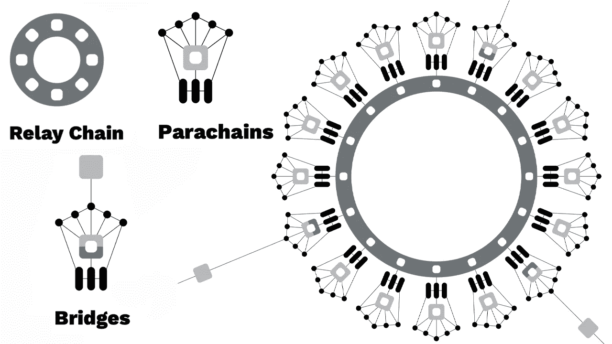
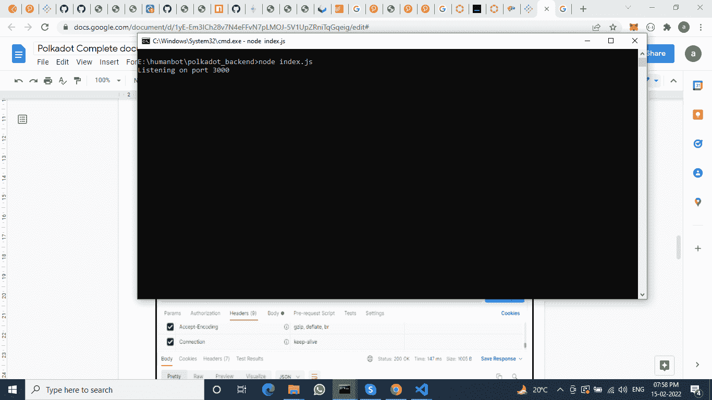
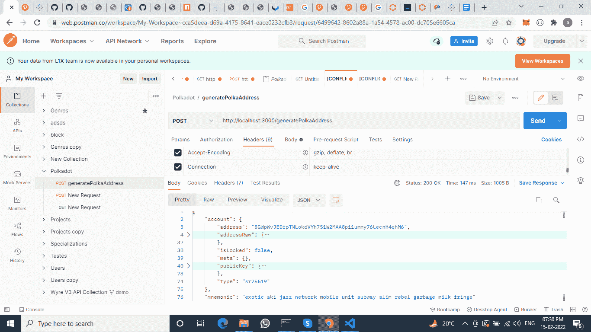
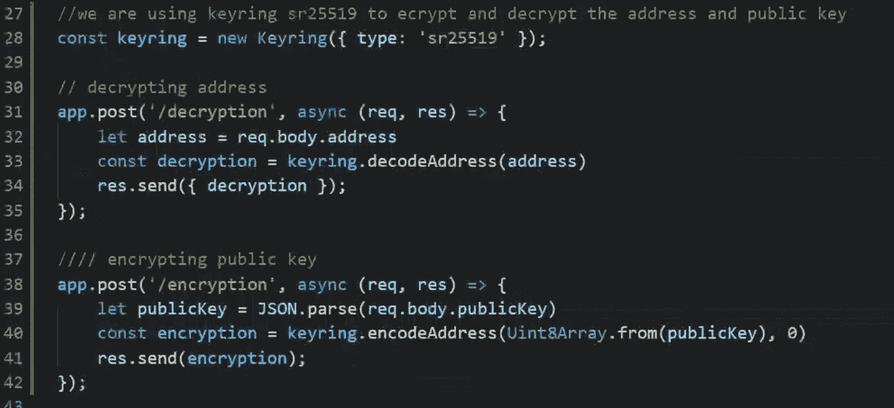
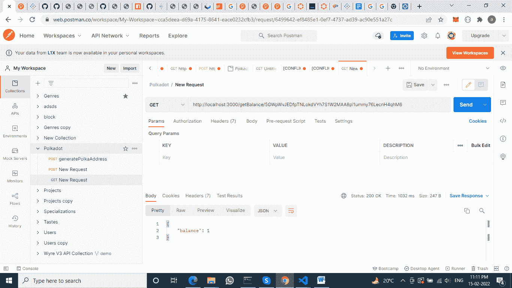
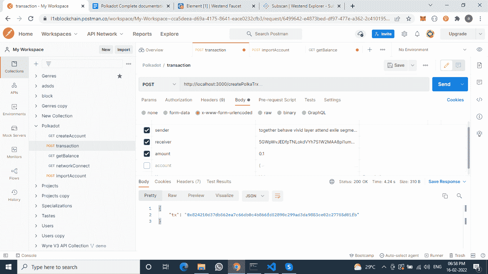
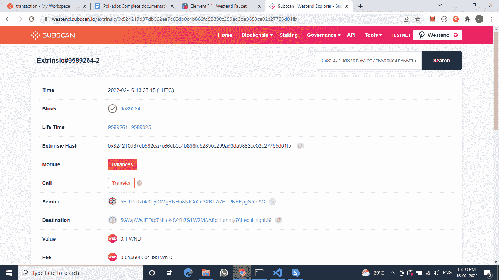

# Polkadot 后端 API 创建

> 原文：<https://medium.com/coinmonks/polkadot-backend-api-creation-61f1a3dfe435?source=collection_archive---------2----------------------->



Polkadot 是下一代区块链协议，将多个专业区块链连接成一个统一的网络。Polkadot 的设计是一个广阔的网络愿景的一部分，该愿景旨在将对互联网垄断的控制权归还给个人，它建立在以前区块链网络的革命性承诺的基础上，同时提供了几个基本优势。

首先，如果你从未接触过波尔卡多特，我推荐你阅读他们的白皮书[或查看他们的](https://polkadot.network/PolkaDotPaper.pdf)[媒体](https://medium.com/polkadot-network)。如果您对 Polkadot 有一个基本的了解，我们就让您开始编写代码吧。

**关于项目:**在本文中，我创建了一个 API，它连接 Polkadot 测试网，生成账户，获取余额，并在 Polkadot 测试网上发送交易，称为 [Westend](https://wiki.polkadot.network/docs/maintain-networks) 。在这个项目中，我们使用 Polkadot . JS .[**Polkadot-JS**](https://polkadot.js.org/docs/)是一个工具集合，它以一种精细的方式与 Polkadot 区块链接口。

**总结:**在这个项目中，我们将存档 down below 函数来创建圆点后端。

```
**- Blockchain Connection:** We are using testnet Westend for this project-testnet Url: wss://westend-rpc.polkadot.io- **Account creation** (GET): This is a method that is used to generate an account. With this account, we can access information such as Mnemonic, Address, etc. [http://ip_address:8081/generatePolkaAddress](http://ip_address:8081/generatePolkaAddress)**-Import account  (POST):** This method is used to import the account with a given Mnemonic parameter.- **Transaction  (POST):** This method is used for transaction purposes. Parameters are the sender mnemonics, receiver address, and amount to be sent. After getting the current info from the network, the transaction object is created and signed with the sender's account. Then this transaction is broadcast to the network.**- Balance Check  (GET):** This method gets the balance of the given address.
```

**Tech Stack:** Tech Stack 用在了这个项目上。

```
[Node](https://nodejs.org/en/download/)[Polkador](https://polkadot.js.org/docs/api/start/install).js[Express](https://expressjs.com/) 
```

# 波尔卡多账户

**密码术**

*   **哈希算法:**Polkadot 中使用的哈希算法是 [Blake2b](https://en.wikipedia.org/wiki/BLAKE_(hash_function)#BLAKE2) 。
*   **密钥对和签名:** Polkadot 使用 Schnorrkel/Ristretto x 25519(“Sr 25519”)作为其密钥派生和签名算法。
*   **地址类型:**基于基板的链中使用的地址格式是 SS58。SS58 是对比特币的 Base-58-check 的修改，有一些微小的变化。

```
*Address type* prefix that identifies an address as belonging to a specific network.- Polkadot addresses always start with the number 1.- Kusama addresses always start with a capital letter, such as C D, F, G, H, J.- Generic Substrate addresses always start with the number 5**- In this project we are creating Polka , Kusama and Generic account.** 
```

# 先决条件

## NodeJS

要运行这个 API，应该在运行环境中安装 NodeJS。请遵循以下步骤:

*   从 NodeJS 网站[https://nodejs.org](https://nodejs.org)下载安装程序
*   运行安装程序。
*   遵循安装步骤，同意许可协议，然后单击以下按钮。

现在，通过在命令提示符下使用以下命令打印 NodeJS 的版本来测试 NodeJS:

```
node -v // to check node version, use v16.14.0npm -v // to check npm version
```

**步骤 1** :项目运行如下步骤:

```
Clone Project- Clone the repository, open a terminal and paste below command.git clone [https://github.com/Achinta123/polkadot_backend](https://github.com/Achinta123/polkadot_backend)Go to the project folder, and run this command in the project folder in order to install npm packages.npm install
```

*   一旦项目被克隆和安装，这个命令应该在终端中的项目位置运行。
    **npm 运行节点**



**第二步:连接邮递员**

*   邮差收藏:[https://github . com/achint a123/block chian-Base-social-Platform](https://github.com/Achinta123/Blockchian-Base-Soical-Platform)
*   打开 postman 并发送 post 请求来创建我们的第一个帐户。



**第三步:**创建两个账户，为一个账户注资。

```
Adding balance to your account.Click on below link[https://app.element.io/#/room/#westend_faucet:matrix.org](https://app.element.io/#/room/#westend_faucet:matrix.org)Create account and signInType and send "!drip your_account_address"1 WND will we added in your accountMy account details :**Account1 Details****Address 1 :** 5GWpWvJEDfpTNLokdVYh7S1W2MAA8pi1ummy76LecnH4qhM6**Mnemonics :** “exotic ski jazz network mobile unit subway slim rebel garbage milk fringe”**Account 2 Details****Address :** 5ERPedz5k3PyiQMgYNHn8NtGu2q3XKT7i7EuPNFKpgNYet8C**Mnemonics :** “together behave vivid layer attend exile segment analyst ostrich give group little”
```

**第四步。解密&加密:**

*   使用 sr25519 解密地址。
*   使用 sr25519 加密公钥。



**第五步:平衡检查:**

```
Using postman ( [http://localhost:8081/getBalance/**Type account_address**](http://localhost:3000/getBalance/account_address)**)**
```



**第六步:转移硬币**

> 发送交易的过帐请求。[http://localhost:8081/get balance/**createPolkaTrx**](http://localhost:3000/getBalance/createPolkaTrx)
> 
> ***旁注:*** *大多数 BN 操作都有一个“n”版本，像****div****和****divn****、****mul****和****muln****。Theis 期望一个数字，而标准的是一个* ***BN*** *实例。*

```
Now, the only line that might seem strange is**.muln(110).divn(100)**where we seem to multiply our final value by **110** and divide by **100**, which is effectively multiplying it with **1.1**. This was taken directly from the Polkadot.js source code, which is an excellent resource that we’ll be exploring for using the API.
```



*   在 Westend Explorer 上检查交易详细信息。在其中粘贴交易 id

探险家:[https://westend.subscan.io/](https://westend.subscan.io/)



Github 链接:[https://github.com/Achinta123/polkadot_backend.git](https://github.com/Achinta123/polkadot_backend.git)

联系人:achintad171@gmail.com