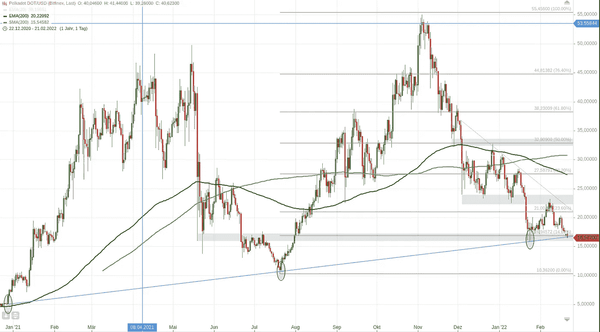
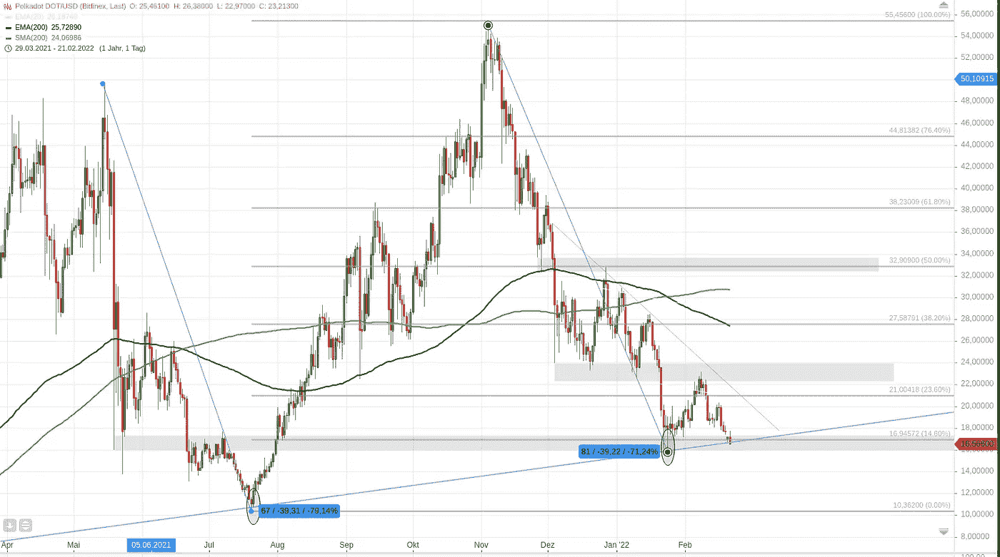
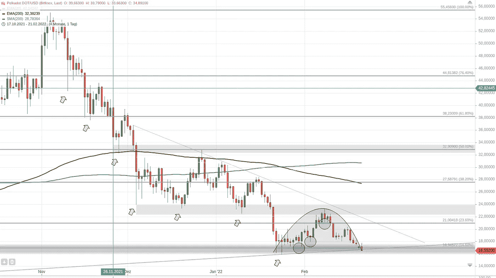
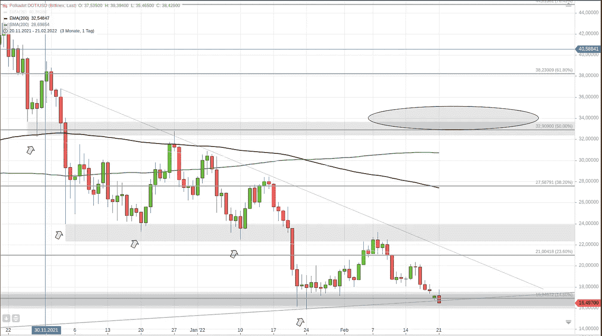

# 波尔卡多特—大图(21.02.2022)

> 原文：<https://medium.com/coinmonks/polkadot-big-picture-21-02-2022-566d531587dd?source=collection_archive---------23----------------------->

Polkadot daily candle chart — long term

# 波尔卡多特:从大处着眼

类似于比特币(见[我昨天关于比特币大图的帖子](/coinmonks/bitcoin-big-picture-20-02-2022-3f3cb2daa9e7))，Polkadot 初级走势是上升趋势。

该图显示了长期上涨趋势，以 2021 年 1 月、2021 年 7 月和 2022 年 2 月的较高低点为标志。连接高低点的蓝色趋势线有助于形象化这一事实。

在上涨过程中，价格经历了大幅上涨，随后是艰难的修正:

Polkadots recent massive corrections visualized in the daily chart

目前，波尔卡多特的价格触及长期趋势线。只要价格保持在这条线以上，长期趋势仍然可以认为是看涨的。如果这条线被打破，长期的主要趋势就结束了。对于投资者来说，这可能是一个跳出事故列车的信号。

# 我们是修正了还是崩溃了？现在还在进行吗？

如你所知，修正是每种资产都会发生的事情，它们有助于防止泡沫在更致命的价格下跌中破裂。

为了确定我们目前看到的是“正常的”调整还是崩盘，我们应该看看自上一个历史高点以来的发展情况:

*   我们在二级趋势中看到一系列下跌的低点(灰色箭头)，伴随着一系列下跌的高点
*   在第三阶段趋势中，我们看到了复苏的尝试(类似于上涨的低点，见画圈)，却发现这是一个熊市回调而不是复苏(价格随后下跌)
*   此外，“恢复”(看跌回调)未能确立价格高于先前的突出水平

但另一方面，当前的下跌似乎会在之前的水平停止，这意味着只要价格保持在 16，00 以上，并且理想情况下收于蓝色趋势线以上，那么下跌仍然是一个正在进行的修正。

由于今天的交易日还没有结束，任何事情都可能发生，现在下结论还为时过早。不过，从图表模式来看，目前情况并不乐观。

# 什么时候是开始再投资的好时机？

不用说，目前我不会建议开始新的投资或交易。我会等待一个正在进行的调整(或崩溃，我们将在未来几天看到)结束的确认信号。

如果价格设法收复突出的水平，克服先前的较低高点，这种信号可能会出现，如图所示(省略号):

When to enter a new trade or investment on Polkadot?

正如你在图表中看到的，对我来说，这样的顺周期水平应该在 32.0 左右，甚至略高。

图表中还标出了明显的支撑位和阻力位，在这里价格很可能会再次反弹。

注意，一旦趋势线出现反弹，你当然可以进入反周期交易或投资。然而，这仍然有很大的风险，因为你不知道价格是否会再次下降。等待确认信号有助于保护你的资金，即使这意味着利润会有所减少。

请注意，这不是财务建议，你要对自己的行为负责。自己做研究。

> 加入 Coinmonks [电报频道](https://t.me/coincodecap)和 [Youtube 频道](https://www.youtube.com/c/coinmonks/videos)了解加密交易和投资

# 另外，阅读

*   [杠杆令牌](/coinmonks/leveraged-token-3f5257808b22) | [最佳密码交易所](/coinmonks/crypto-exchange-dd2f9d6f3769) | [Paxful 点评](/coinmonks/paxful-review-4daf2354ab70)
*   [加密套利](/coinmonks/crypto-arbitrage-guide-how-to-make-money-as-a-beginner-62bfe5c868f6)指南| [如何做空比特币](/coinmonks/how-to-short-bitcoin-568a2d0b4ae5)
*   [币安期货交易](https://coincodecap.com/binance-futures-trading)|[3 comas vs Mudrex vs eToro](https://coincodecap.com/mudrex-3commas-etoro)
*   [如何购买 Monero](https://coincodecap.com/buy-monero) | [IDEX 评论](https://coincodecap.com/idex-review) | [BitKan 交易机器人](https://coincodecap.com/bitkan-trading-bot)
*   [尤霍德勒 vs 考尼洛 vs 霍德诺特](/coinmonks/youhodler-vs-coinloan-vs-hodlnaut-b1050acde55a) | [Cryptohopper vs 哈斯博特](https://coincodecap.com/cryptohopper-vs-haasbot)
*   [顶级付费加密货币和区块链课程](https://coincodecap.com/blockchain-courses)
*   [MXC 交易所评论](/coinmonks/mxc-exchange-review-3af0ec1cba8c) | [Pionex vs 币安](https://coincodecap.com/pionex-vs-binance) | [Pionex 套利机器人](https://coincodecap.com/pionex-arbitrage-bot)
*   [如何在印度购买比特币？](/coinmonks/buy-bitcoin-in-india-feb50ddfef94) | [WazirX 评论](/coinmonks/wazirx-review-5c811b074f5b)
*   [印度的加密交易所](/coinmonks/bitcoin-exchange-in-india-7f1fe79715c9) | [比特币储蓄账户](/coinmonks/bitcoin-savings-account-e65b13f92451)