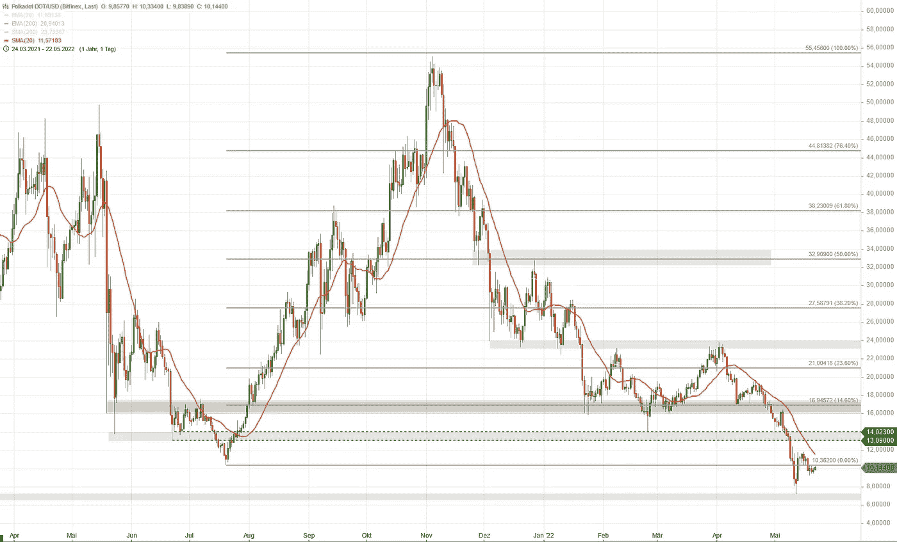
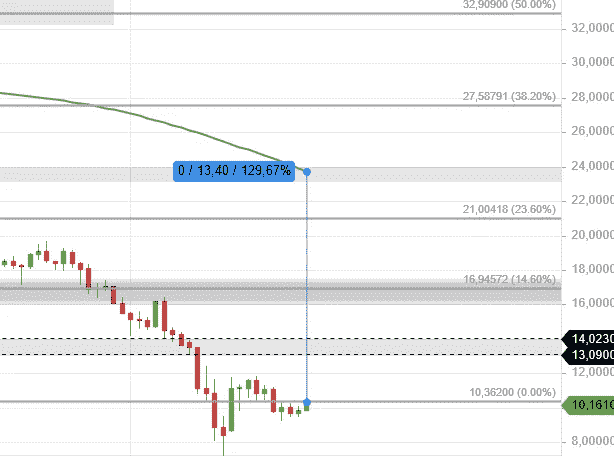
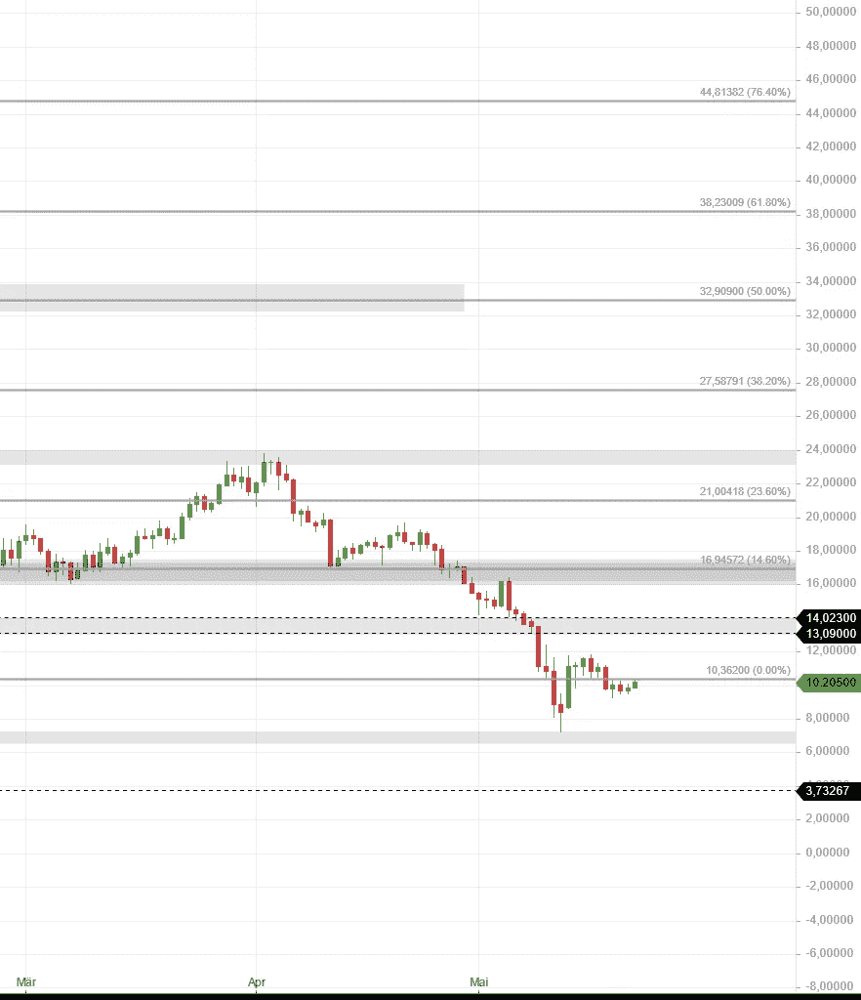
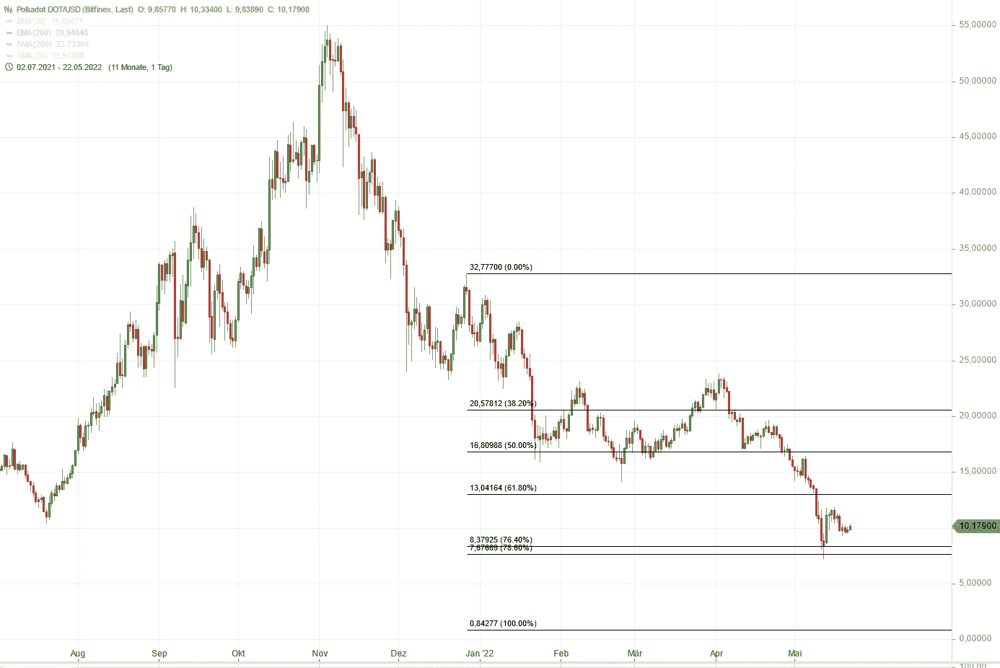

# 波尔卡多特大图(2022 年 5 月)

> 原文：<https://medium.com/coinmonks/polkadot-big-picture-may-2022-4f34d461a45c?source=collection_archive---------24----------------------->

我不知道你怎么想，但是看波尔卡多特的图表并没有给我带来快乐。

在我二月份的最后一次分析中([https://medium . com/coin monks/an-update-on-polkadot-big-picture-26-02-2022-e 0 f1 ba 7 abf 50](/coinmonks/an-update-on-polkadot-big-picture-26-02-2022-e0f1ba7abf50))，我说过如果长期趋势线被打破，价格将会下跌到 10，362 美元附近的下一个支撑。对我来说，长期上涨趋势将会失效。

这确实发生了。让我们看看当前的图表:

Polkadot technical chart

从大的方面来看，目前的低点低于 2021 年 3 月/4 月的前低点。这是一个巨大的疲软迹象，长期看涨趋势已经失效。

自上次 ATH 以来，波尔卡多特下降了近 87%(！).如果我们衡量与 SMA 200(长期趋势的良好指标)的距离，那么 Polkadot 目前的交易远离这个重要的均线:

Polkadot trading far away from its SMA 200

正如图表所示，价格需要上涨大约 130%才能再次高于 SMA 200。

# 波尔卡多特支持和阻力水平

这些是我能看到的当前支持级别:

Polkadot support levels

*   8.09 美元(疲软)
*   7.20 美元
*   3.73 美元

阻力:

*   10.36 美元
*   13.09 美元
*   14.02 美元
*   16 美元

# 波尔卡多特的前景

目前，我没有看到任何趋势变化的迹象。图表模式看起来大多是熊市。

**但是:**价格在 720 美元左右停止下跌。该区域在 2021 年 1 月之前已经过测试，可以作为关键支撑。波尔卡多特极有可能再次测试这个水平。如果这一支撑持续几天，底部形成的可能性很大。

**奖励:修正目标的 Fibo 投影**

如果你对 Fibo 级别和预测感兴趣，这里有一些适合你的东西:

Polkadot correction targets

根据 Fibo 预测，一个重要的修正点已经到达。这符合我的估计，7.20 美元左右的水平可能是一个关键的支持。如果这个水平被打破，下一个大的 Fibo 预测目标将是 0.84 美元。

> 加入 Coinmonks [电报频道](https://t.me/coincodecap)和 [Youtube 频道](https://www.youtube.com/c/coinmonks/videos)了解加密交易和投资

# 另外，阅读

*   [Bookmap 评论](https://coincodecap.com/bookmap-review-2021-best-trading-software) | [美国 5 大最佳加密交易所](https://coincodecap.com/crypto-exchange-usa)
*   最佳加密[硬件钱包](/coinmonks/hardware-wallets-dfa1211730c6) | [Bitbns 评论](/coinmonks/bitbns-review-38256a07e161)
*   [新加坡十大最佳加密交易所](https://coincodecap.com/crypto-exchange-in-singapore) | [收购 AXS](https://coincodecap.com/buy-axs-token)
*   [红狗赌场评论](https://coincodecap.com/red-dog-casino-review) | [Swyftx 评论](https://coincodecap.com/swyftx-review) | [CoinGate 评论](https://coincodecap.com/coingate-review)
*   [投资印度的最佳加密软件](https://coincodecap.com/best-crypto-to-invest-in-india-in-2021)|[WazirX P2P](https://coincodecap.com/wazirx-p2p)|[Hi Dollar Review](https://coincodecap.com/hi-dollar-review)
*   [加拿大最佳加密交易机器人](https://coincodecap.com/5-best-crypto-trading-bots-in-canada) | [库币评论](https://coincodecap.com/kucoin-review)
*   [OKEx vs KuCoin](https://coincodecap.com/okex-kucoin) | [摄氏替代品](https://coincodecap.com/celsius-alternatives) | [如何购买 VeChain](https://coincodecap.com/buy-vechain)