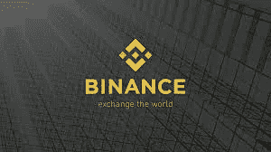

# 波尔卡多特(DOT)——寻找 APY 最佳赌注指南

> 原文：<https://medium.com/coinmonks/polkadot-dot-a-guide-to-finding-the-best-staking-apy-a7944ac93dbc?source=collection_archive---------9----------------------->

Photo credit: [https://cryptoslate.com/](https://cryptoslate.com/)

初看起来，在隐密体中航行似乎势不可挡，令人恐惧。人们真的能从这个看似陌生的金融领域获得高额回报吗？如此高的年利率，crypto 似乎让政府债券和银行年利率相形见绌？让我们找出答案。

Polkadot (DOT)是一种大型加密货币，它为用户提供了“下注”代币的可能性。赌注涉及用户通过允许他们的令牌被用于验证交易来保护网络，并且作为回报，用户被奖励更多的令牌。换句话说，你是在让你的钱发挥作用！

下面你会发现一个图表，显示了赌注点和什么类型的 APY 你可能会收到。

**1。摄氏网络**

*   Celsius Network 是一个借贷平台，目前为用户提供 9.02%的 APY，没有锁定期。
*   每周一支付利息。
*   难度等级:容易。
*   了解你的客户(KYC)要求。
*   [https://celsius . network/earn](https://celsius.network/earn)

**2。北海巨妖**

*   北海巨妖是一个加密货币交易所，为用户提供出色的 12%的 APY，用于押注他们的美元点令牌，没有锁定期。
*   利息每两周支付一次(周二和周四)。
*   难度等级:容易。
*   了解你的客户(KYC)要求。
*   [https://www.kraken.com/en-us/features/staking-coins](https://www.kraken.com/en-us/features/staking-coins)

**3。库币**

*   Kucoin 是一个加密货币交易所，为用户提供 7-10% APY 的利率，用于下注$DOT。Kucoin 的价格经常会有 28 天的锁定期。
*   锁定期结束时支付利息。
*   难度等级:中等—困难。
*   了解你的客户(KYC)不是必需的。
*   [https://www.kucoin.com/earn/lockup/staking?tab=stakings&子标签=](https://www.kucoin.com/earn/lockup/staking?tab=stakings&subTab=)

**4。币安——非美国客户。**

*   币安提供 3 种类型的定位选项:
*   12.8% —锁定 30 天。
*   14.7% —锁定 60 天。
*   17.2% —锁定 90 天。
*   乍一看，点利率似乎诱人，但撤回是锁定期。如果你不能等到锁定期到期，你总是可以选择撤出你的资产，但要注意，你将失去所有的利润，还需要支付一笔费用。
*   难度等级:容易。
*   了解你的客户(KYC)要求。
*   [https://www.binance.com/en/pos](https://www.binance.com/en/pos)

**5。无畏钱包**

*   霍元甲是 android 和 IOS 上的移动应用程序，允许用户在应用程序中转移美元点，并以平均 15.6%的 APY 入股。
*   Staking 包括选择一个验证器来运行一个节点。通俗地说，你必须研究你想把你的资产押在谁身上。如果你选择了一个懒惰的验证者，那么你的奖励可能会被削减！
*   难度等级:中等—高级。
*   了解你的客户(KYC)不是必需的。
*   [无畏钱包. io](https://fearlesswallet.io/)

**6。总账直播**

*   术语“不是你的钥匙，不是你的钱包”是一个经常在密码领域使用的术语。有了上面的所有选项，第三方就拥有了你的$DOT，并使用$DOT 来借贷或下注，以获得更高的 APY。分类账钱包让你可以 100%控制你的资产，消除被黑的风险。让我们面对现实吧，没有一家公司不受黑客攻击的影响。账本钱包让窃取你的资产成为不可能。
*   账本是一个物理对象，大小相当于一个闪存驱动器，能够存储你的资产。购买一个基本型号的账本大约需要 60 美元。一旦购买，Polkadot 将需要在设备上传输，然后设备连接到一台计算机，在那里运行一个应用程序，允许您下注您的$DOT。
*   莱杰提供 10%的 APY。
*   难度等级:高级。
*   了解你的客户(KYC)不是必需的。
*   [https://www . ledger . com/staking-polkadot #:~:text = Rewards，MINUS % 20 the % 20 validators ' % 20 commission % 20 rate](https://www.ledger.com/staking-polkadot#:~:text=Rewards,minus%20the%20validators'%20commission%20rate)。

这是一个最常见的赌博平台列表，并对每个平台进行了简单的比较。快乐的赌注！

免责声明:本文仅用于教育目的，并非财务建议。

> *加入 Coinmonks* [*电报频道*](https://t.me/coincodecap) *和* [*Youtube 频道*](https://www.youtube.com/c/coinmonks/videos) *了解加密交易和投资*

# 另外，阅读

*   [3 商业评论](/coinmonks/3commas-review-an-excellent-crypto-trading-bot-2020-1313a58bec92) | [Pionex 评论](https://coincodecap.com/pionex-review-exchange-with-crypto-trading-bot) | [Coinrule 评论](/coinmonks/coinrule-review-2021-a-beginner-friendly-crypto-trading-bot-daf0504848ba)
*   [莱杰 vs Ngrave](/coinmonks/ledger-vs-ngrave-zero-7e40f0c1d694) | [莱杰 nano s vs x](/coinmonks/ledger-nano-s-vs-x-battery-hardware-price-storage-59a6663fe3b0) | [币安评论](/coinmonks/binance-review-ee10d3bf3b6e)
*   [Bybit Exchange 评论](/coinmonks/bybit-exchange-review-dbd570019b71) | [Bityard 评论](https://coincodecap.com/bityard-reivew) | [Jet-Bot 评论](https://coincodecap.com/jet-bot-review)
*   [3 commas vs crypto hopper](/coinmonks/3commas-vs-pionex-vs-cryptohopper-best-crypto-bot-6a98d2baa203)|[赚取加密利息](/coinmonks/earn-crypto-interest-b10b810fdda3)
*   最好的比特币[硬件钱包](/coinmonks/hardware-wallets-dfa1211730c6) | [BitBox02 回顾](/coinmonks/bitbox02-review-your-swiss-bitcoin-hardware-wallet-c36c88fff29)
*   [BlockFi vs 摄氏](/coinmonks/blockfi-vs-celsius-vs-hodlnaut-8a1cc8c26630) | [Hodlnaut 点评](/coinmonks/hodlnaut-review-best-way-to-hodl-is-to-earn-interest-on-your-bitcoin-6658a8c19edf) | [KuCoin 点评](https://coincodecap.com/kucoin-review)
*   [Bitsgap 审查](/coinmonks/bitsgap-review-a-crypto-trading-bot-that-makes-easy-money-a5d88a336df2) | [Quadency 审查](/coinmonks/quadency-review-a-crypto-trading-automation-platform-3068eaa374e1) | [Bitbns 审查](/coinmonks/bitbns-review-38256a07e161)
*   [加密复制交易平台](/coinmonks/top-10-crypto-copy-trading-platforms-for-beginners-d0c37c7d698c) | [Coinmama 审核](/coinmonks/coinmama-review-ace5641bde6e)