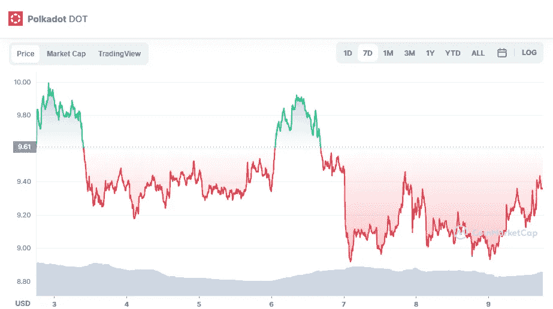

# 波尔卡多(点)价格分析

> 原文：<https://medium.com/coinmonks/polkadot-dot-price-analyse-c2d7405725ce?source=collection_archive---------31----------------------->

Source photo [Polkadot price today, DOT to USD live, marketcap and chart | CoinMarketCap](https://coinmarketcap.com/currencies/polkadot-new/)

4 小时时间周期的价格行为显示，网络股票正在下跌通道中交易。在目前的市场条件下，价格在通道的底部交易，并挑战 9 美元的支撑位。

表明超卖的条件，相对强度指数现在交易在 37，这表明数字资产可能会上升。信号线和直方图现在都…