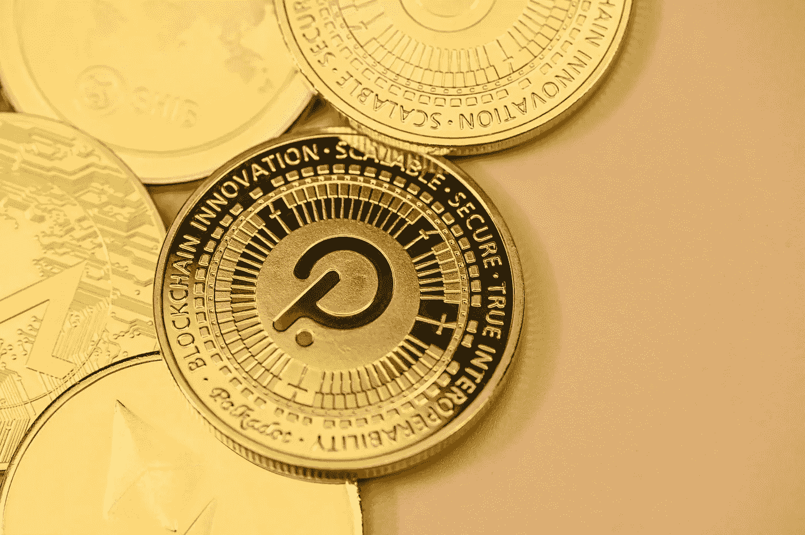

# 波尔卡多特(dot)价格预测 2022–2025

> 原文：<https://medium.com/coinmonks/polkadot-dot-price-prediction-2022-2025-73cf2c4115de?source=collection_archive---------18----------------------->

Source photo Unsplash.com

# Polkadot(点)是什么？

Polkadot 是由总部位于瑞士的 Web3 基金会创建的，它渴望提供一个完全有效且用户友好的分散平台。以太坊的联合创始人之一加文·伍德(Gavin Wood)曾在 2016 年与彼得·查班(Peter Czaban)和罗伯特·哈伯迈尔(Robert Harbermeier)合作过一个项目地图。