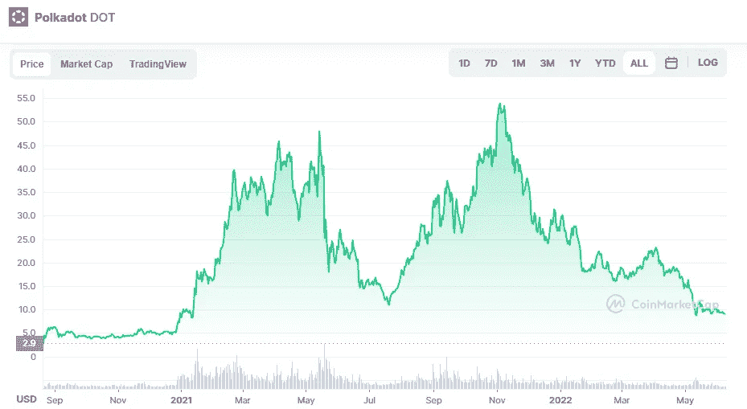

# 波尔卡多特:dot 是买入并持有吗？

> 原文：<https://medium.com/coinmonks/polkadot-is-dot-a-buy-and-hold-c234fb47f024?source=collection_archive---------31----------------------->

Source photo [Polkadot price today, DOT to USD live, marketcap and chart | CoinMarketCap](https://coinmarketcap.com/currencies/polkadot-new/)

这个区块链的建立是为了允许去中心化应用(dApps)和去中心化金融(DeFi)服务的去中心化生态系统，类似于以太坊。因此，非营利组织 Web3 基金会的联合创始人、计算机科学家加文·伍德(Gavin Wood)支持这项工作。

由波尔卡多特聚合的区块链真的很多。基于利害关系证明(PoS)的共识流程由…