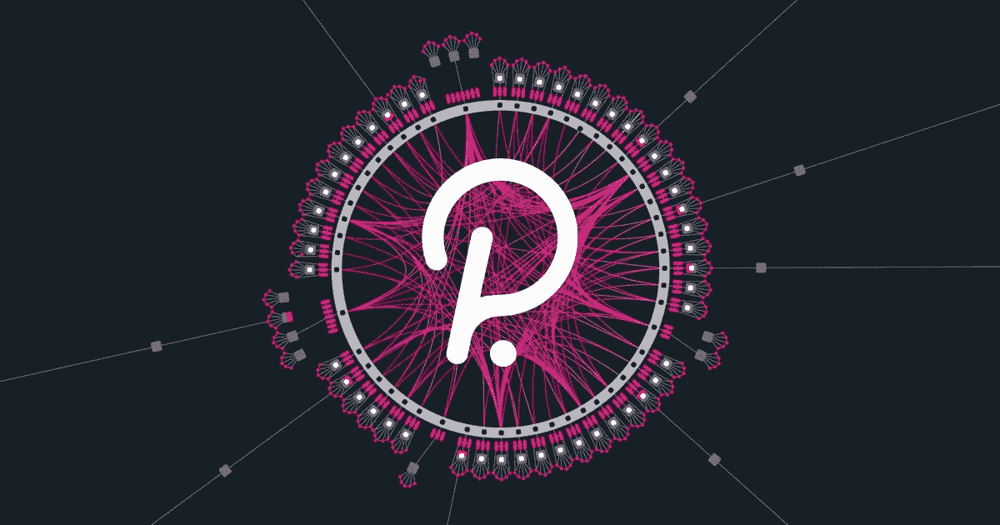

# Polkadot 正在启动 DeFi 革命的下一阶段，而可组合金融正处于中心位置。

> 原文：<https://medium.com/coinmonks/polkadot-is-kickstarting-the-next-phase-of-defi-revolution-and-composable-finance-sits-right-at-a8293c64b1de?source=collection_archive---------10----------------------->

## 波尔卡多特正在为去中心化金融的新体验设定节奏。这就是它是如何做到这一点的。

Created with meme generator

区块链的应用通过分散金融的诞生影响了金融行业，分散金融旨在颠覆传统金融世界。尽管 DeFi 仍处于初期阶段，但目前记录的总价值约为 [$101.35B](https://defipulse.com/) 。尽管 DeFi 的愿景是创建一个系统，以分散的方式向参与者提供金融服务，但它面临着一些挑战，这些挑战提出了一个引人注目的问题“DeFi 能否颠覆传统金融？”

在 DeFi 生态系统面临的其他挑战中，可扩展性问题尤为突出，因为领先区块链的固有设计限制了他们每秒可以处理的交易数量。这给 DeFi 的发展带来了巨大的挑战，因为这些网络越来越大。因此，更多的交易将导致拥堵、高昂的交易费用和漫长的响应时间，最终阻碍区块链的采用。

由于生态系统的分割性，区块链之间自由交流和共享信息的能力是生态系统面临的另一个挑战。互操作性在 DeFi 生态系统中至关重要，因为它将促进数字资产在区块链的移动，并增强两个或更多区块链之间的数据共享和访问。

为了保持相关性并满足市场需求，区块链需要升级，这是 DeFi 生态系统中的另一个常见挑战，因为传统区块链需要分叉整个网络。这可能需要几个月的工作才能实现，而硬分叉可能会分裂花时间和精力建立的社区。

已经开发了几种区块链来解决 DeFi 生态系统中存在的一些挑战。然而，Polkadot 脱颖而出，因为它负责改革分散的金融。

## **波尔卡多方案**

Source: Polkadot.network

[Polkadot](https://polkadot.network/) 是一个开源的区块链协议，由 Web3 基金会建立，目的是联合一个专门构建的区块链的整个网络，允许它们无缝地一起运行。作为 DeFi 问题的解决方案，Polkadot 汇集了多个专业区块链的最佳功能，从而为新的分散市场的兴起铺平了道路，提供了创新和便捷的方法来访问 DeFi 服务。

与 DeFi 生态系统相同的核心挑战——互操作性、可伸缩性、升级和安全性——都被 Polkadot 生态系统解决了。

Polkadot 有一个独特的异构分片模型，它将几个链连接在一个网络中，从而允许它们并行处理几个事务并交换数据。它的异构分片模型为创新提供了更多可能性，因为网络中的每个链都可以针对特定用例进行优化，而不是被迫适应一刀切的模型。实现了真正的互操作性，因为它支持跨区块链传输数据令牌和资产。

Polkadot 通过将多个专用链连接成一个分片网络来解决 DeFi 可扩展性问题，并允许并行处理各种事务。它的目标是在未来进一步开发更快的可扩展性解决方案，计划采用一种称为“嵌套中继链”的功能，这将增加添加到网络中的碎片数量。

为了确保正确的区块链升级，波尔卡多特允许区块链升级他们而不需要分叉链。这使得波尔卡多特区块链能够快速适应变化，并随着更好的技术的出现而自我升级。

Polkadot 具有 parachains 功能，这是一种先进的下一代第 1 层区块链，超越了传统网络的限制，并与 Polkadot 中继链并行运行。它还拥有草间弥生网络，这是一个为其堂兄波尔卡多特建立的网络，作为一个冒险、快速移动的“煤矿中的金丝雀”。草间弥生是一个实验性的开发环境。

DeFi 的创新和可访问性是用户需要的核心特性，Composable finance 旨在实现这一目标。

## **可组合金融:定义未来的面孔**

Source: Composable.finance

区块链和层之间缺乏兼容性是导致差异和效率的一个挑战，并且开发人员经常面临他们可以用孤立的基础设施构建什么的限制。对于用户来说，如果他们确实想要访问多个链和层的特征，则他们被迫浏览这些复杂且难以应付的过程。

[Composable Finance](https://www.composable.finance/) 旨在构建一个完全可互操作的区块链特性，能够为开发者和最终用户提供无缝的用户体验和效用。它弥合了当今孤立的区块链第 2 层扩展解决方案之间的差距，创建了一个称为“创新可用性层(IAL)”的单一统一接入点，该接入点与可组合的跨链 XM 进行通信。

Composable Finance 的一个核心功能是 Composable Labs，它是一个孵化部门，负责开发和部署新的金融应用程序集，作为新工具和技术的原型。

Composable Finance 作为一个网关和前沿解决方案，允许构建者无缝地构建和部署能够跨层和链互操作的 dApps。它具有技术堆栈功能，包括 Mosaic，这是 Avalanche、Arbitrium 或 Fantom 等项目之间的第二层桥梁，Wallace 是 NFT 桥，XCVM 是 DeFi 用户的智能路由器，Angular Finance 是 Polkadot 贷款的未来，Whirlpool Cash 是隐私和收益农业的混合，最后是创新的大众贷款方法。

Composable Finance 为 Picasso 赢得了第 13 届草间弥生 Parachain 拍卖席位，目前正在为 Polkadot Parachain 席位进行众筹贷款，这将使其能够提供实现真正无缝用户体验所需的必要的区块链无关功能。其核心是，可组合金融通过知识共享、赠款可用性和孵化来支持其生态系统的增长。

> 加入 Coinmonks [电报频道](https://t.me/coincodecap)和 [Youtube 频道](https://www.youtube.com/c/coinmonks/videos)了解加密交易和投资

## 也阅读

 [## 杠杆代币[多头代币]终极指南

### 杠杆化令牌是具有杠杆化风险敞口的 ERC20 令牌，不考虑保证金、要求、管理…

medium.com](/coinmonks/leveraged-token-3f5257808b22)  [## 最佳加密交易所| 2021 年十大加密货币交易所

### 加密货币交易所的加密交易需要了解市场，这可以帮助你获得利润。之前…

blog.coincodecap.com](https://blog.coincodecap.com/crypto-exchange)  [## 2021 年最佳加密交换平台| CoinCodeCap

### 编辑描述

blog.coincodecap.com](https://blog.coincodecap.com/best-swap-platforms)  [## 10 大最佳网上赌场[2021] |赢取免费 BTC | CoinCodeCap

### 编辑描述

blog.coincodecap.com](https://blog.coincodecap.com/best-online-casinos)  [## 2021 年最佳加密借贷平台| 6 大比特币借贷平台

### 获得比特币和其他加密货币的最佳贷款利率

medium.com](/coinmonks/top-5-crypto-lending-platforms-in-2020-that-you-need-to-know-a1b675cec3fa)  [## 2021 年 6 大最佳硬件钱包|顶级加密硬件钱包[更新]

### 最好的加密货币硬件钱包是绝对必要的。我们将在 NGRAVE、Ledger Nano X 和…

medium.com](/coinmonks/the-best-cryptocurrency-hardware-wallets-of-2020-e28b1c124069)  [## 2021 年最佳免费加密交易机器人

### 2021 年币安、比特币基地、库币和其他密码交易所的最佳密码交易机器人。四进制，位间隙…

medium.com](/coinmonks/crypto-trading-bot-c2ffce8acb2a)  [## 最佳 4 个加密交易信号电报通道

### 这是乏味的找到正确的加密交易信号提供商。因此，在本文中，我们将讨论最好的…

medium.com](/coinmonks/best-crypto-signals-telegram-5785cdbc4b2b)