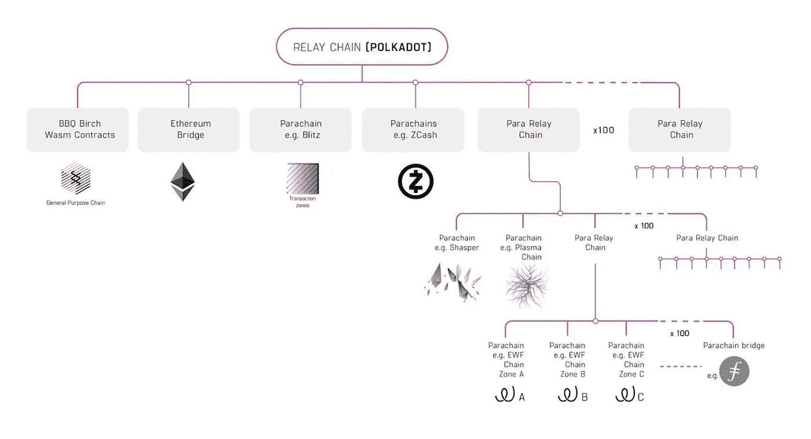

# 波尔卡多特网络

> 原文：<https://medium.com/coinmonks/polkadot-network-dot-d7221db0cf2b?source=collection_archive---------42----------------------->

支持链通信和互操作性的下一代分片网络。

Polkadot 称自己是下一代区块链协议，能够将众多专业链连接成一个单一的全球网络。Polkadot 由 **Web3 基金会**组建，专注于为 Web 3.0 创建基础设施，希望挑战互联网垄断并赋予个人用户权力。Polkadot 是作为一个更大的网络愿景的一部分而创建的，这个网络是公平、安全和有弹性的(默认为 Web 3.0)。

Polkadot 生态系统由网络的原生硬币**点**驱动，旨在解决区块链当前的几个限制，如**可扩展性**和**安全性**。它作为一种解决方案，结合了该技术的各个特性。

这个概念是在 2016 年**创造的，花了几年时间才开花结果。DOT coin 直到 2020 年 8 月才进入市场，Polkadot 于 2021 年 6 月**在**比特币基地上市，获得最终认可。**

**历史**

这个网络的名字已经很有特色了:在布料上，一个圆点图案是由一系列相同大小的巨大实心圆组成的。圆圈很可能代表几个区块链以及总体设计，波尔卡多特密码宇宙。

波尔卡多特的历史与以太坊的历史交织在一起。**盖文·伍德博士**，以太坊的首席技术官和主要开发者，是公司的创建者**。该公司的智能合同编程语言 Solidity 是由他**创造的。该项目的主要开发者于 2016 年离开以太坊，致力于更加碎片化的区块链，同年 10 月，他发表了 Polkadot 的白皮书。

伍德在以太坊工作期间，与人共同创立了 **EthCore 区块链技术公司**，最终成为**奇偶技术**。该公司开发了重要的区块链基础设施技术，如**基板开发框架**和 Polkadot 网络。

伍德还在 2017 年共同创立了 **WEB3 基金会**，这是一个非营利组织，致力于支持 Polkadot 的研发及其筹款活动。

该组织第一次负面事件发生在同年 7 月。一名黑客利用奇偶校验的 multisig 钱包实现中的一个弱点，从三个不同的钱包中取走了**153，000 ETH**(当时约 3300 万美元)。

该基金会在 10 月份首次发行硬币，在不到两周的时间里筹集了 1 . 45 亿美元，成为迄今为止最大的 ico 之一。

然而，就在代币发售后没几天，宇称科技又被**黑了**。ICO 智能合约遭到破坏，导致 66%的融资资产(1.5 亿美元)被冻结。这一事件是不可避免的，它阻碍了项目的初步进展。

WEB3 基金会团队能够通过私下出售获得足够的资金，在接下来的几个月里继续实现其发展目标，到 2019 年，一切恢复正常。

# **工作/建筑**

**继电器链**

波尔卡多特的中心链条是**中继链**。在 DOT 中，所有 Polkadot 验证器都被标记在中继链上，并为中继链进行验证。中继链具有有限数量的交易类型，包括与治理机制交互的方式、副链拍卖和 NPO 参与。例如，智能合约在中继链上不受支持，因为它在设计时考虑了最小的功能。主要任务是协调整个系统，包括副链。其他任务交给了副链，每个副链都有自己的实现和功能。

**副链**

Polkadot 副链是连接到并行运行的中继链的不同的第 1 层区块链。每个副链可以有自己的外观、感觉、功能和治理。通过链接到 Polkadot，parachains 可以访问整个网络的安全性，消除了构建自己的验证器社区的需要，并允许他们交易令牌以外的数据。

Polkadot 建立在区块链建筑不能一刀切的理念上。相反，为了支持**各种功能和用例，所有区块链都要做出权衡**。例如，一个链可能优先考虑身份管理，而另一个链优先考虑文件存储。因为区块链可以有特定的设计，他们可以提供更好的服务，同时通过消除冗余代码来提高效率和安全性。

**副线程**

Parathreads 是使用现收现付概念连接到 Polkadot 的 parachains。它们降低了不需要持续网络连接的区块链的准入门槛。根据他们的需要和中继链上副链位置的可用性，波尔卡多特上的区块链可以在成为副链和副链之间转换。

**桥梁**

传统的区块链技术缺乏桥梁，或者说缺乏一个区块链与另一个沟通和传递价值的能力。

比方说，你想在瑞士联邦理工学院买一个 NFT，但你只有 BTC。以前，你必须先将 BTC 转换成法定货币，然后再转换成瑞士法郎，或者你必须在交易所为 BTC 购买瑞士法郎。没有中间层，无论是交易所还是菲亚特，都无法将价值或数据从一个区块链传递到另一个区块链。

# 共识角色

**验证器**

验证器使用本机令牌来保护中继链(DOT)。它们验证来自副链上的排序器的证明，与其他验证器一起参与一致性，并且如果被选入活动集，则在中继链上产生块。作为交换，他们得到赌注奖励。

**提名者**

提名者还通过将他们的点标在可靠的验证器上，允许他们加入主动验证器集，从而有助于网络的安全性。作为交换，提名者通常会得到验证者赌注利润的一定百分比。

**整理器**

整理器聚合 parachain 事务，并为中继链的验证器生成证据。它们还可以使用跨链消息传递来传输和接收来自其他副链的消息(XCMP)。

**渔民**

渔民密切关注网络，并向验证者报告任何可疑活动。渔夫的工作可以由副链中的任何完整节点来扮演。

**基于基板的波尔卡多特**

**Substrate** 是一种模块化的区块链技术，将作为 Polkadot 生态系统中大多数副链的基础。它使开发人员能够轻松设计和推出具有多种功能选项的区块链，以满足各种项目需求。WebAssembly 智能合约、多级许可、加密的事务和状态、帐户级锁定和治理工具都是可用的选择。Polkadot 可以很容易地与基于基板的协议连接，允许它们在系统中形成副链并共享安全性。

**创始人**

Polkadot 是 Web3 基金会的旗舰协议，web 3 基金会是一个瑞士非营利组织，其目的是实现一个开源、功能齐全、用户友好的去中心化网络。

Gavin Wood 博士、Robert Habermeier 和 Peter Czaban 创建了 Polkadot。

Web3 基金会主席伍德是三人中最知名的，因为他是以太坊的联合创始人、平价技术的创始人以及 Solidity smart contract 脚本语言的作者。Web3 也归功于伍德，他创造了这个概念。

Habermeier 是一位著名的区块链和密码学研究者和开发者，同时也是 Thiel 的会员。Czaban 是前 Web3 Foundation 技术总监，在高度专业化的金融行业拥有丰富的经验。

## **治理**

Polkadot 的治理建立在**利益相关协议**的基础上，该协议的主要目的是确保大多数利益相关方始终拥有对网络的控制权。Polkadot 的利害关系证明是一个指定的利害关系证明(NPoS)系统，其中验证者以他们的利害关系作为对他们良好行为的信任的象征。

例如，与 EOS 中使用的更一般的委托利益证明(DPoS)机制的关键区别在于，如果提名者选择了一个糟糕的验证者，他们就有失去其利益的风险。

几个链上投票机制，如具有可变超级多数阈值的公投和批量批准投票，必须就协议更改达成一致。

Polkadot 的多层治理模型支持在没有硬分叉的情况下实现协议更新。

# 互用性

Polkadot 提供互操作性和跨链通信，不像以前的网络本质上是独立的设置。Polkadot 允许网络和应用程序共享信息和功能，而不依赖于集中的服务提供商。这使得消费者能够在供应链之间传递信息，并为创新的新服务打开了大门。例如**，一个金融服务链可以与一个 oracle 链连接，后者提供对真实世界数据的访问，例如令牌化股票交易的股票市场价格馈送**。

**点令牌及其令牌组学**

波尔卡多特网络的本地硬币 dot 有三个用途。‍

它可以保证网络的运行和安全；

它可以作为副链连接到 Polkadot 上；

它让持有者对网络的管理有了发言权。

DOT 是**通货膨胀**，这意味着，与比特币不同，DOT 的数量没有限制。通货膨胀率不是一成不变的；预计第一年 10%。圆点用于验证者激励，其余部分归财政部。

一普朗克是生态系统中最小的计算单位，等于 **0.0000000001 点。**

DOT 目前排名第**14**最大的加密货币，截至 2022 年 5 月 3 日交易价格为**15.06 美元(1154 印度卢比)**。市场规模超过 145 亿美元。目前有 9 . 87 亿枚代币在流通。

Polkadot 的第一次初始硬币发行(ICO)发生在 2017 年 10 月，价格为 0.29 美元，共有 224 万枚代币可用。第二次 ICO 发生在 2020 年 7 月，Polkadot 价格为 1.25 美元，共售出 342，080 个点令牌。

# **收尾思路**

Polkadot 是一个很有潜力的项目。在很短的时间内，它的市值已经上升到第十四位(截至 2022 年 5 月)，这表明投资者对它寄予厚望。现在的任务是通过在这个新生的去中心化金融生态系统中创造最无缝的解决方案来击败竞争对手(如宇宙)。随着围绕 Polkadot 的讨论越来越多，老虎机拍卖开始上线，该网络的全部功能吸引了投资者和项目，人们很自然地陷入了兴奋之中，并想知道这个独特的平台在一两年后会是什么样子。

虽然该平台存在一些风险和潜在的缺点，但它有一个强大的团队作为后盾，并得到了主要合作伙伴项目的参与，而且到目前为止已经兑现了承诺。致力于以太坊 2.0 的人也将波尔卡多特生态系统引入全球，这并非巧合。Polkadot 的开发人员特别注意解决困扰和阻碍先前区块链系统的所有缺陷，如比特币缺乏可定制性和以太坊 1.0 的可扩展性。

# 加入我们，轻松进入 WEB 3.0

> *我们的社区*

# WHATSAPP

 [## BLOCKENTHU

### WhatsApp 群邀请

chat.whatsapp.com](https://chat.whatsapp.com/FTKme4XzkOU73ZDv99Oatj) 

# INSTAGRAM

【https://www.instagram.com/blockenthu/ 

# 电报

 [## ⚡·布洛克登胡·⚡

### 可以马上查看并加入@blockenthu。

t.me](https://t.me/blockenthu) 

# 商务化人际关系网

 [## Blockenthu | LinkedIn

### LinkedIn 上有 447 名粉丝。“面向大众的 Web 3.0 福利”加密和区块链| BlockEnthu 是社区…

www.linkedin.com](https://www.linkedin.com/company/blockenthu/) 

使用印度最安全的外汇货币

 [## CoinDCX -加密交易所|购买、出售和交易比特币和顶级替代币

### CoinDCX 是印度最大、最安全的加密货币交易所，在这里你可以买卖比特币和其他…

coindcx.com](https://coindcx.com/) 

# blockenthu # ETH # BTC # coincxpathbreaker # FILECOIN #比特币#以太坊#索拉纳#波尔卡多#基质#铁锈

> 加入 Coinmonks [电报频道](https://t.me/coincodecap)和 [Youtube 频道](https://www.youtube.com/c/coinmonks/videos)了解加密交易和投资

# 另外，阅读

*   [BigONE 交易所评论](/coinmonks/bigone-exchange-review-64705d85a1d4) | [电网交易机器人](https://coincodecap.com/grid-trading)
*   [氹欞侊贸易评论](https://coincodecap.com/anny-trade-review) | [CoinSpot 评论](https://coincodecap.com/coinspot-review)
*   [新加坡十大最佳加密交易所](https://coincodecap.com/crypto-exchange-in-singapore) | [收购 AXS](https://coincodecap.com/buy-axs-token)
*   [投资印度的最佳加密软件](https://coincodecap.com/best-crypto-to-invest-in-india-in-2021) | [WazirX P2P](https://coincodecap.com/wazirx-p2p)
*   [西班牙 5 大最佳文案交易平台](https://coincodecap.com/copy-trading-spain)
*   [Pionex 双重投资](https://coincodecap.com/pionex-dual-investment) | [AdvCash 审查](https://coincodecap.com/advcash-review) | [支持审查](https://coincodecap.com/uphold-review)