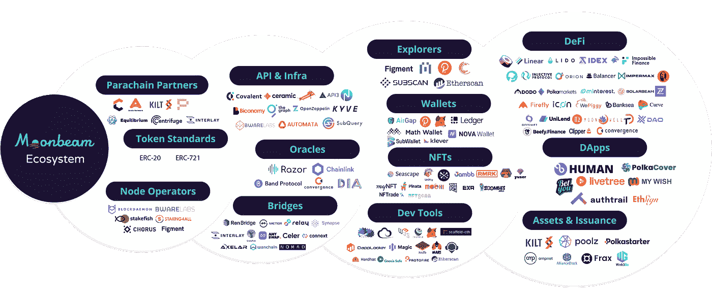
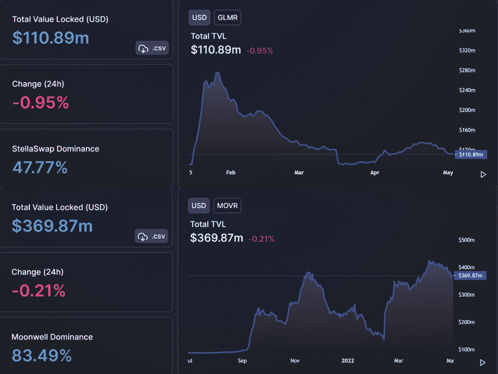

# 波尔卡多副链系列:月光

> 原文：<https://medium.com/coinmonks/polkadot-parachain-series-moonbeam-562c5bb9ecb1?source=collection_archive---------18----------------------->

moonbeam.foundation

# 介绍

欢迎来到 Polkadot Parachain 系列。Parachains 是定制的、特定于项目的区块链，自 2021 年 11 月首次拍卖以来，它们就被集成到了 Polkadot 生态系统中。在波尔卡多特中继链上举行了副链拍卖，以确定哪个区块链将连接到副链插槽。

在这个系列中，我们将从月光开始谈论主要的波尔卡多副链。

# 月光

*图片来源:coinlive.me*

月光是一条波尔卡多副链，提供以太坊和波尔卡多区块链之间的跨链兼容性。

它本质上是一个智能合约框架，允许开发人员在网络之间迁移分散式应用程序(dApps ),而无需重写代码或重新加载基础架构。

# 背景

由软件企业家 Derek Yoo 创建，他曾是 Fuze 的联合创始人兼首席技术官，Fuze 是一个全球统一的通信即服务云平台，在 2022 年扩展到 700 名员工，并通过 2k 客户创造了 2 亿美元的销售额。

2019 年，德里克在看到区块链世界正在向多链专业化和互操作性转变后，推出了月光网络背后的公司 PureStake，这将他吸引到了波尔卡多特生态系统。

Moonbeam 在获得 Web3 基金会的资助后于 2020 年 1 月成立，并于 2020 年 9 月首次在测试网上发布。

在月光用户集体承诺了大约 10 亿美元的点令牌后，月光副链于 2022 年 1 月在波尔卡多特投入使用。

# 月光视觉

*图片来源:moonbeam.network*

Moonbeam 设想了一个多连锁店的未来，在这些网络上有许多连锁店和许多用户和资产。Moonbeam 的智能合约平台为开发去中心化应用程序提供了一个以太坊兼容的环境。

**挑战** —现有智能合约平台旨在为单一特定链上的用户和资产提供服务。

**解决方案** —提供跨链智能合约功能，允许开发人员将现有工作负载转移到 Moonbeam，并将其应用扩展到其他链上的新用户和资产。

# 月光有什么特别之处？

由于 Moonbeam 在 Substrate 上提供了一个类似以太坊的环境，开发人员将能够以最低的费用轻松地重新部署他们现有的智能合同，同时还可以受益于所有 Polkadot parachains 都构建在其上的现代 Substrate 网络，以及 Polkadot 中继链的共享安全性和与 Polkadot 连接的其他链的集成。

*图片来源:moonbeam.network*

## 现有以太坊项目

Moonbeam 将能够向以下人员提供以太坊上遇到成本和可扩展性问题的项目:

*   以最低要求将他们现有的一些工作负载从以太坊第 1 层移走。
*   实现一个混合方法，其中 Dapps 同时在以太坊和月光上运行。
*   将他们的触角伸向波尔卡多特网络和其他与之相连的副链。

## 波尔卡多特项目

需要智能合约功能的生态系统项目可以使用 Moonbeam 来:

*   增加他们现有的副链和副线程。
*   添加主 Polkadot 中继链上需要但不包含的新功能。
*   利用成熟和广泛的以太坊开发工具链。

## 新 DApps 的开发者

想要尝试在 Polkadot 上构建的个人和团队可以使用 Moonbeam:

*   利用 Polkadot parachains 的专门功能，同时联系其他链上的用户和资产。
*   通过使用 Moonbeam 作为轻量级集成层，在将网络服务呈现给最终用户之前聚合这些服务，从而从 Polkadot parachains 中组合功能。

## 月亮河

*图片来源:moonbeam.network*

Moonriver 是 Moonbeam 测试网络的名称。像 Moonbeam 一样，Moonriver 提供了完全的 EVM 兼容性，并在很大程度上作为开发人员在 Moonbeam 上部署之前测试其 dApps 和智能合约代码的测试环境。Moonriver 拥有自己的实用令牌 MOVR，并在波尔卡多特的金丝雀网络 Kusama 上运行。

# 月光 vs 竞争

Moonbeam 与任何为以太坊项目提供类似支持的区块链直接竞争。那么是什么让 Moonbeam 脱颖而出呢？

## **共享安全模式**

开发人员可以将项目迁移到 Polkadot，并且比竞争对手区块链具有更高的安全性，同时仍然可以与 Polkadot 中继链上的其他 parachains 通信。Polkadot 的“共享安全”概念是它如此吸引开发人员的原因，因为它允许他们快速启动项目，而不必在开发验证方法上投入大量时间和金钱。

## **编码语言**

除了其核心语言的可靠性，Moonbeam 还支持任何 EVM 字节码语言，允许开发人员从 Substrate 中获得更多。这使得它在吸引各种背景的开发者方面具有竞争优势。

## **最佳以太坊兼容性(EVM)**

Moonbeam 创始人 Derek Yoo 表示，“据我们所知，没有其他项目能够接近这种与以太坊兼容的水平”。有了 Moonbeam，项目可以使用单一代码库和技术实现来追求 EVM 目标的多链部署策略，这使其比竞争对手更具优势。这是因为，对于任何区块链来说，与 EVM 兼容并允许轻松访问以太坊及其所有流动性是至关重要的，因为以太坊是 cypto 空间中的第二大生态系统。

# 月光/月光总值锁定

*图片来源:defillama.com(03 . 05 . 2022)*

数十个 DeFi 项目选择在 Moonbeam 智能合同平台上部署，作为一种在 Polkadot 生态系统中接触用户和资产的简单方法。

根据 Defillama.com 的数据，Moonbeam 在 TVL 的投资超过 1.1 亿美元，有 21 个有效协议，而 Moonriver，Moonbeam 的测试网络，在 TVL 的投资不到 3.7 亿美元，有 43 个有效协议。这是特别值得注意的，因为月光是 2022 年 1 月在波尔卡多特上线的。

SushiSwap、Lido、Synapse、Beefy Finance、Autofarm 和 Curve Finance 是 Moonbeam/Moonriver 上一些著名的协议。虽然应该注意的是，这些协议并没有反映每个网络上的大多数 TVL，这是不理想的，但也许需要更多的时间。

Moonriver 的全职月度开发人员也有显著的年度增长，从 12 月 20 日到 12 月 21 日排名前 10。

*资料来源:电力资本开发商报告(2021)*

# 弱点

链条的强度取决于它最薄弱的一环。最终，月光的成功将取决于波尔卡多特的成功。Polkadot 在一个拥挤的可互操作、智能合同风险证明区块链领域竞争，如 Cosmos、Avalanche 和不久的以太坊 2.0。哪一个或哪些项目会被市场采纳，还有待观察。

波尔卡多特也有很多东西需要证明，因为它仍然是一项正在进行中的工作，许多副链仍有待完全推出。

由于我们已经有一段时间没有介绍 Polkadot 了，所以让我们来看看网络的现状。

# 波尔卡多状态

首先，Polkadot 开发人员的活动仍然是 crypto 中最高的。根据 Electric Capital 的开发者分析，Polkadot 在以太坊之外的开发活动最多，如下所示:

*图片来源:电力资本开发商报告(2021)*

## **副链状态**

第一批副链于 2021 年 12 月推出，截至 2022 年第一季度，13 个副链已赢得 1.278 亿点的副链插槽(占总供应量的 11%)。

此外，计划在 2023 年 2 月之前再举行 28 场副链拍卖，使拍卖总数增加到 41 场，获胜的副链将持续到 2024 年 12 月。

然而，副链引发的兴奋已经消退，尽管用户仍然参与生态系统，但在 2022 年及以后恢复势头将更加困难。

## **点地址的数量**

在 2022 年第一季度，持有 Polkadot 原生点币的地址总数显著增加，表明对加密货币的浓厚兴趣。

*图片来源:Messari.io*

## **交叉共识消息格式(XCM)**

Polkadot 开发了 Corss-Consensus 消息格式，这是一种通用格式，不仅用于副链之间的通信，还用于不同智能契约、桥和基板托盘之间的通信。

# 将来的

Moonbeam 是第一批在 Polkadot 生态系统上上线的副链之一，因此，它在希望从跨链互操作性中受益的开发人员中获得了一些吸引力。Moonbeam 路线图强调新集成和协作的持续部署，以及网络互操作性的发展——特别是在其跨共识消息格式方面。

Moonbeam 已经为在不久的将来实施借贷应用程序、NFT、DeFi 项目、游戏项目和奖金计划制定了目标。

*免责声明:本文包含的信息仅用于教育目的，并不构成 Wheatstones 的任何形式的建议或推荐，用户在做出(或避免做出)任何投资决定时也不打算依赖这些信息。*

> 加入 Coinmonks [电报频道](https://t.me/coincodecap)和 [Youtube 频道](https://www.youtube.com/c/coinmonks/videos)了解加密交易和投资

# 另外，阅读

*   [WazirX vs coin dcx vs bit bns](/coinmonks/wazirx-vs-coindcx-vs-bitbns-149f4f19a2f1)|[block fi vs coin loan vs Nexo](/coinmonks/blockfi-vs-coinloan-vs-nexo-cb624635230d)
*   [比斯勒评论](https://coincodecap.com/bitsler-review)|[WazirX vs coin switch vs coin dcx](https://coincodecap.com/wazirx-vs-coinswitch-vs-coindcx)
*   [7 大副本交易平台](https://coincodecap.com/copy-trading-platforms) | [BuyCoins 点评](https://coincodecap.com/buycoins-review)
*   XT.COM 评论[币安评论](https://coincodecap.com/profittradingapp-for-binance) |
*   [SmithBot 评论](https://coincodecap.com/smithbot-review) | [4 款最佳免费开源交易机器人](https://coincodecap.com/free-open-source-trading-bots)